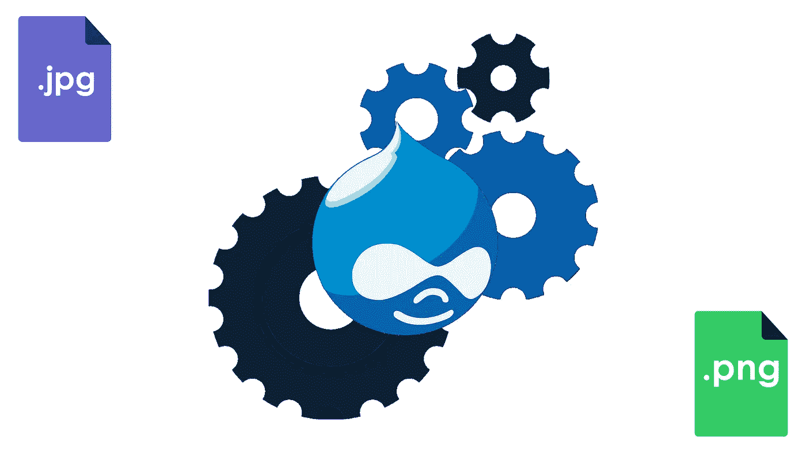
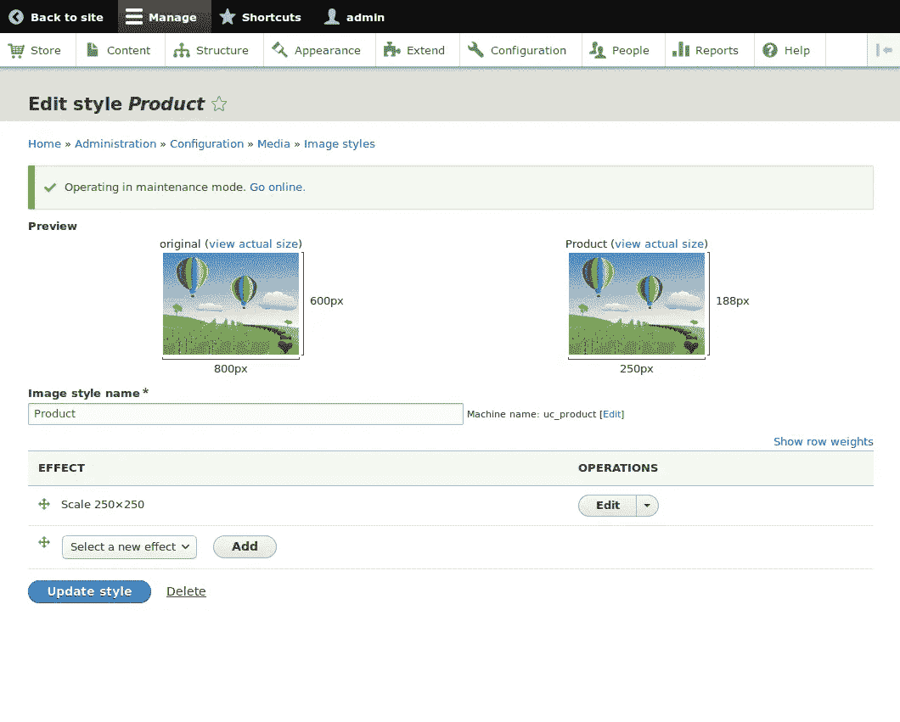
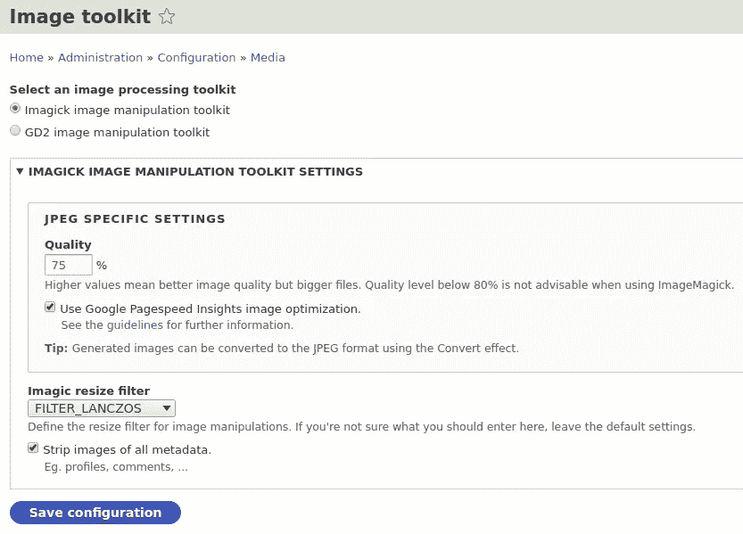
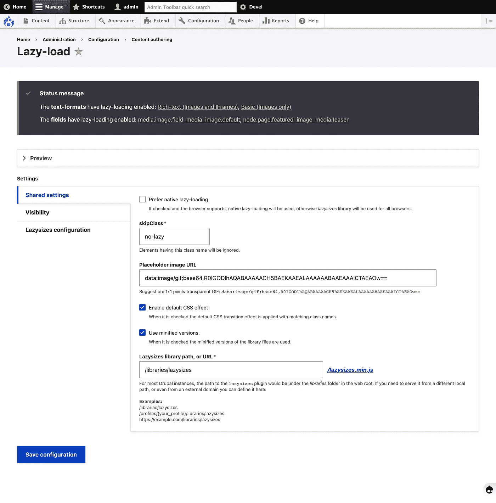

# 使用多幅图像优化大型 Drupal 站点的页面呈现

> 原文：<https://medium.com/globant/optimize-the-page-render-of-a-large-scale-drupal-site-with-several-images-8fb8f810b7bd?source=collection_archive---------0----------------------->

图片可以让网站看起来很漂亮，或者在某些情况下破坏用户体验，尤其是当涉及到大量图片的时候。

Drupal CMS 有几个工具，加上加载前的优化，将提高图像的质量和大小比例，而不会影响用户体验的变量。

下面是在有很多图像的 Drupal 站点上管理图像压缩的最常见的方法，并且不会影响图像的质量。

# 使用 PNG 优化器来减小图像大小

假设我们在你的 Drupal 网站上有很多 PNG 图片。减小图像文件大小的最简单的方法是使用 TinyPNG 或类似的工具来压缩它们。

使用上面提到的工具，您可以预期减少大约 60%(保持图像质量无损)。

# 使用 JPEG 压缩器在服务器端压缩您的图像

使用压缩器来减少你的 JPG 和 JPEG 文件的图像大小，我们将使它们在我们的 Drupal 站点上加载得更快。以下是一些非常有用的工具来优化 JPG 和 JPEG 图像。

*   TinyJPG
*   压缩 JPEG
*   立即压缩
*   JPEGOptim

在这种图像格式的情况下，我们可以说不同的 JPG 文件意味着不同的设置，所以强烈建议您“玩”变量，直到您在大小和质量之间取得平衡。

# 使用 Drupal 图像样式

图像样式是我们从 Drupal 获得的现成的最好的工具之一。有了这个工具，我们可以更好地控制网站上图像的大小、长宽比和其他特征。

设置不同大小的多种图像样式，放置在页面的不同区域，Drupal 将接受所有这些设置，并控制图像在我们网站上的存储和显示方式。

如何使用图像样式:

*   转到“内容类型设置”部分的“管理显示”。
*   点按图像栏旁边的齿轮图标以打开“设置”标签并选取图片样式。
*   在那里，您可以选择一个先前配置的图片样式，或者…通过从下拉菜单中选择“设置图片样式”选项来创建一个新的图片样式。

**Source:** [Drupal.org](https://www.drupal.org/docs/8/modules/ubercart/howtos/how-to-change-the-size-of-product-images)

# 使用 Drupal 图像工具包来调整它们的质量

这是在 Drupal 中调整图像大小的最佳方式，也是最简单的工具之一:

*   进入映像工具包(进入管理/配置/媒体)。
*   选取允许您压缩图像的设置(“JPEG 质量”栏)。
*   摆弄这个工具，直到你在尺寸和质量之间达到完美的平衡。
*   保存新配置。

请注意，这个工具会将新的设置应用到您的所有图像，我们没有办法逐个调整每个图像的质量。

给初学者的一个好建议，在设置图像质量时，将配置限制在 60%到 80%之间。

Source: [Drupal.org](https://www.drupal.org/project/imagick)

# 使用响应式图像模块来调整图像的大小

使用响应图像意味着加载根据断点专门为用户屏幕调整大小的图像。这种做法使得网站在移动设备上加载速度更快，因为图像大小针对移动设备进行了优化。这与使用 CSS 缩小大图像时的流体图像不同。

以下是如何在 Drupal 网站上设置响应图像:

*   转到扩展并启用该模块(因为，即使它是核心模块，默认情况下也不会启用)。
*   转到您的编辑器(如果是您正在使用的自定义主题)。
*   在主题目录(/themes/custom/yourthemename)中创建一个名为 yourthemename.breakpoints.yml 的文件。

最后，让我们将我们在 yourthemename.breakpoints.yml 中配置的每个断点与一个图像样式配对，我们只需创建它的响应图像样式。

# 使用 ImageMagick 模块缩小图像尺寸

使用 ImageMagick 或 GraphicsMagick 作为 Drupal 中图像 API 的图像工具包。这种集成基于通过 shell 访问调用 convert binary 来处理映像。

Imagick 模块是一个替代的工具包模块，它使用 Imagick PHP 扩展。

要安装这个模块，只需转到根目录并运行 composer require 命令来获得 drupal/imagemagick。

以下是如何使用它来缩小图像大小:

*   启用模块。
*   在 ImageMagick 图像工具包中将图像质量设置为 100%。
*   在某些情况下，你已经将图片尺寸缩小了 20-40%。

# 延迟加载您的图像

使用 Lazy Loader，这是一个强烈推荐的用于图像优化的 Drupal 模块。

Lazy Load 是一个简单的 Drupal 模块，它让我们能够延迟加载图像和 iframes。

Source: [Drupal.org](https://www.drupal.org/project/lazy)

# 摘要

Drupal 有许多工具，有些是现成的，有些是我们必须安装和/或激活的。也许这里最大的挑战是正确识别列表中的最佳工具，以加快我们的图像密集型 Drupal 网站的速度。