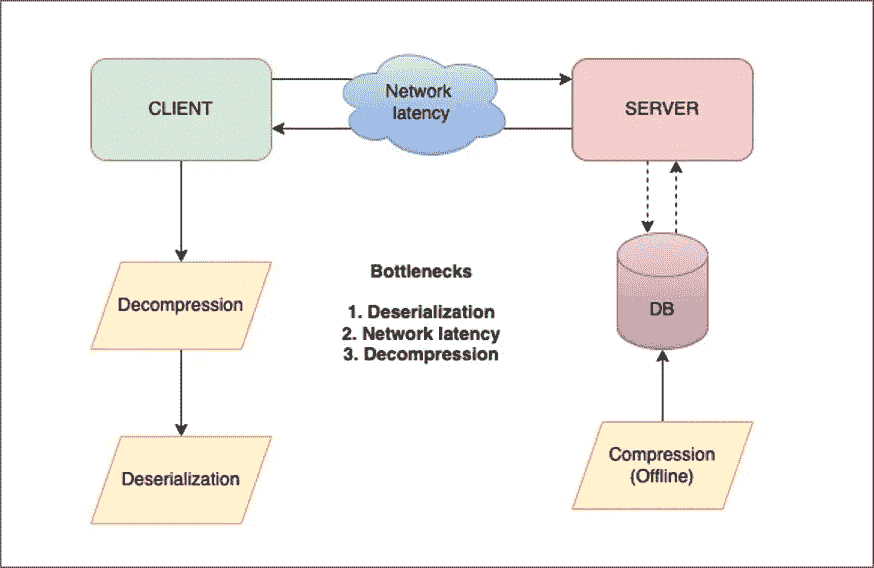
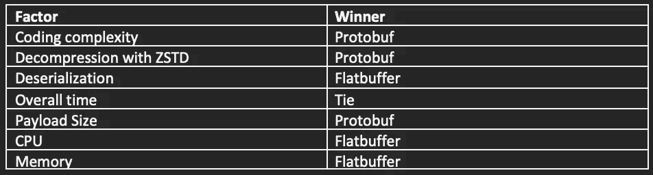
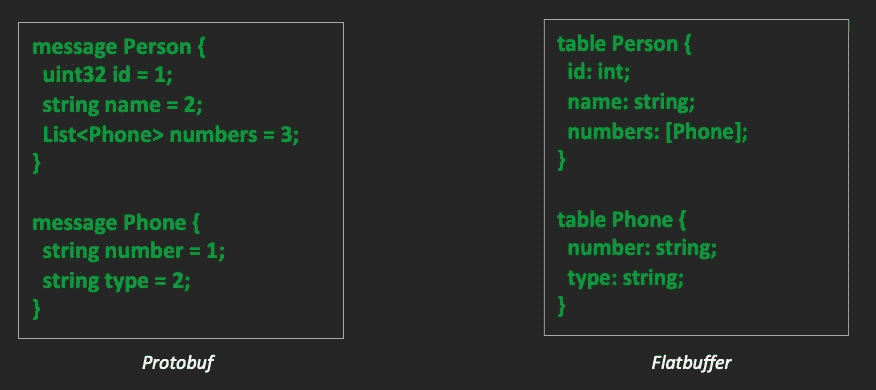
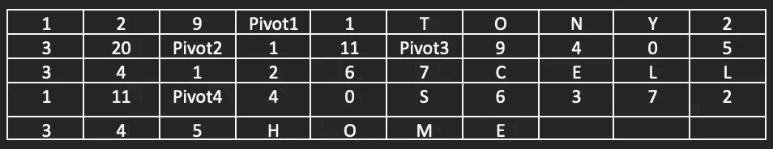
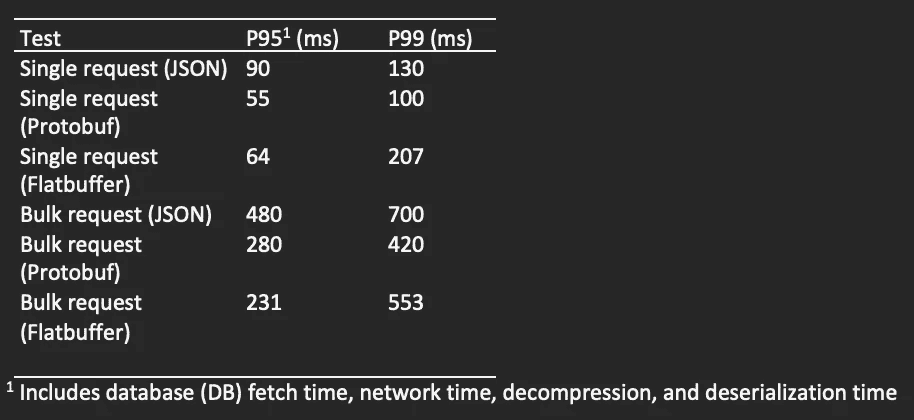
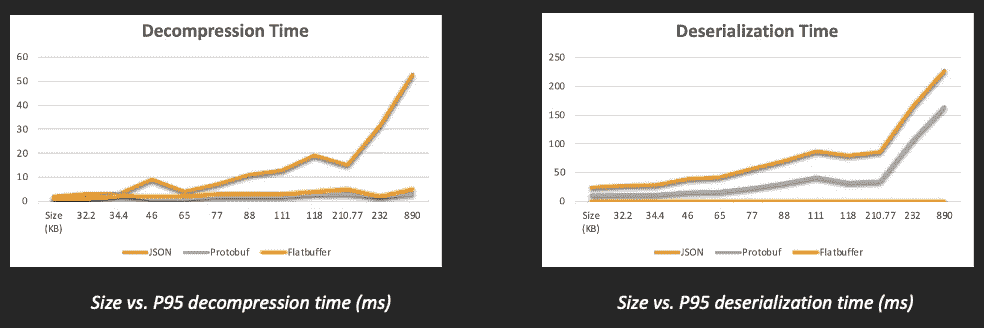

# 利用 ZSTD 压缩和协议缓冲区优化 API 性能

> 原文：<https://medium.com/walmartglobaltech/optimizing-api-performance-with-zstd-compression-and-protocol-buffers-571ad30f4893?source=collection_archive---------3----------------------->

Photo credit: [geralt](https://pixabay.com/photos/binary-binary-code-binary-system-2910663/)

为大型有效负载构建高性能 REST APIs 绝非易事。随着公司越来越关注以最少的资源使用实现更快的服务级别协议(SLA ),在过去几十年中开发了几种新的数据压缩和序列化算法。

在沃尔玛的 Rollups 团队中，我们从各种来源收集数据，并为沃尔玛的搜索和商品页面提供巨大的 JSON 负载。对于有时几兆字节(MB)大的有效负载，有效的串行化机制对于减少网络往返时间是至关重要的。

# **上卷系统概述**

*   Rollups 是一个 Kafka 消费应用程序，它监听各种 Kafka 主题，并聚合关于沃尔玛销售的商品的不同信息。
*   项目负载离线聚合为一个大的 JSON 字符串，并使用 ZSTD 算法进行压缩。压缩后的字节存储在 Cassandra 数据库中。
*   当客户在 Walmart.com 上执行搜索时，会实时调用搜索后端服务，该服务会通过一个编排器从汇总读取服务中获取压缩的字节。
*   orchestrator(我们的客户机)使用 Rollups 库在本地解压缩和反序列化有效负载。

来自搜索后端的请求是批量项目请求，可能导致总负载大小高达 3 MB。反序列化这些大的有效负载会造成巨大的瓶颈，从而导致大量项目请求的延迟增加。本地 Rollups 库使用 Jackson 的 fasterxml mapper 来反序列化有效负载。尽管我们通过 Jackson 加力模块和一些定制的 Jackson 属性实现了 5%的改进，但我们需要一种方法来减少整体延迟，以满足服务调用的 SLA。JSON 不是一个可行的选择，所以我们开始探索替代的序列化格式。

*Architecture and bottlenecks*

本文评估了三种流行的序列化格式的优缺点:JSON、协议缓冲区(Protobuf)和 Flatbuffers。我们运行了几个基准测试，并根据代码复杂性、易维护性、语义、解压缩时间、反序列化时间、网络时间和 CPU 以及内存使用情况对三种格式进行了比较。

下表显示了基于不同因素的获胜算法。这些结果特定于我们的模式定义，不能推广到其他用例。

# **模式**

让我们比较一下 Protobuf 和 Flatbuffers 的模式定义。

*Protobuf vs. Flatbuffer Schema*

在 Protobuf 模式中，每个属性都有一个数据类型和字段编号。支持大多数标准数据类型，包括地图、列表和时间戳。有一些很棒的在线工具可以生成原型模式，这将加速开发。虽然这些工具不能实现完美的转换，但是它们提供了一个很好的基线。

Protobuf 还提供了一些特殊的类型，比如 oneof、Any 和 wrappers。需要注意的是，所有未设置的字段都被赋予了默认值。在客户端需要区分空值和默认值的情况下，这可能会导致问题。可以考虑使用包装器类型(wrappers.proto)来解决这个问题。

Flatbuffer 模式也由一组包含在“表”中的属性组成。与 Protobuf 不同，它没有字段编号。因此，需要保留模式中属性的顺序。新字段应该总是添加在末尾。该模式还支持大多数标准数据类型。Flatbuffers 允许不占用任何线路空间的可选类型，如果没有设置，也没有默认值。

# **序列化**

Protobuf 使用“protoc”编译器为给定的模式生成代码，然后这些代码可以用来构建 protobuf 对象。Varint 编码用于数据类型、字段编号和分隔字段长度。使用 varint 编码时，较小的整数在线路上占用较少的空间。例如，数字“11”在 varint 编码中会占用一个字节，但在 JSON 字符串中会占用两个字节。为模式中的属性确定正确的数据类型非常重要。较大的整数使用固定长度编码可能会更好。对于字符串，使用标准的 UTF-8 编码。如果模式结构简单并且主要包含字符串，JSON 可能比 Protobuf 性能更好。

Flatbuffers 展平整个有效负载对象，以便每个属性都存储在相对于缓冲区开始的特定偏移位置。Flatbuffer 对象有三个部分:vtable、pivot 和数据块。考虑上面的平面缓冲器的模式图。

在我们的示例中，有效负载是“Person”的一个实例该实例将有一个轴心点。在轴心点的左侧，存储了一个偏移列表。这被称为“虚拟表”“Person”的 vtable 有三个偏移值，表中的三个属性各有一个。它们将以与模式文件中定义的字段相同的顺序存储。在轴心点的右侧，将存储实际值。如果属性值是另一个复杂对象类型，则子对象的轴心点将存储在该偏移位置。例如，Person 的 vtable 的第一个位置的偏移量“1”表示第一个字段值存储在轴心点右侧的一个位置。

下表是序列化 Flatbuffer 在内存中的抽象表示。可以把表想象成一个一维结构，每一行都是前一行的延续。

## **使用 Protobuf/Flatbuffers 时，我们还需要 ZSTD 压缩吗？**

Protobuf 通过 varint 编码实现了良好的压缩比。在大多数情况下，可能没有必要增加额外的压缩层。然而，为了达到与压缩的 JSON 有效负载大小相等的有效负载大小，我们对 Protobuf 对象应用了 ZSTD 压缩。

有趣的是，ZSTD 在 Flatbuffer 对象上工作得并不好。这可能是因为序列化对象中的偏移量很大，很难压缩。压缩后的 Flatbuffer 比压缩后的 JSON 大 63%。在我们运行基准测试之前，我们希望反序列化时间的节省能够弥补增加的大小。

# **基准测试结果**

一个包含 20 个产品的样本集用于对生产中的所有三种数据格式进行负载测试。沃尔玛的 Omniperf 平台被用来进行大规模测试。测试持续了 10 分钟，每种格式总共收到了 41，000 个请求。

这些结果表明，随着有效负载大小的增加，flatbuf 的性能略好于 Protobuf。然而，只有一小部分沃尔玛客户流量包含超过几 MB 的大量请求。因此，对于一般用例来说，Protobuf 似乎稍有优势。

更有趣的是检查每种格式的解压缩和反序列化时间。对于较小的负载(最大为 230 KB)，Protobuf 在反序列化时间上提供了高达 56%的改进，然后性能逐渐开始下降，如上图所示。然而，对于大负载用例，它仍然比 JSON 好 32%。另一方面，Flatbuffer 对象不需要进行任何反序列化。它们只需要一个小小的解包步骤来确保有效载荷准备好进行遍历。在大多数情况下，这需要不到 1 毫秒的时间。

就解压缩时间而言，Protobuf 和 Flatbuffers 都比 JSON 有了很大的改进。

Flatbuffers 比 Protobuf 使用更少的 CPU 和内存。由于其零拷贝序列化格式，这是意料之中的。对于对 CPU 和内存敏感的应用程序，Flatbuffers 可能是更好的选择。

# **相关工作**

Protobuf 在与 REST 一起使用 HTTP 1 时提供了很大的好处，但它更广泛地与 Google Remote Procedure Call (gRPC)一起被采用，后者使用带有头压缩和传输控制协议(TCP)连接重用的 HTTP 2。我们计划在不久的将来用 gRPC 和 Protobuf 进行一些测试。

# **结论**

Flatbuffers 和 Protobuf 在整个 P95 处理时间上产生了相似的结果，所以我们的决定完全基于编码的复杂性和维护的方便性。

Flatbuffers 要求在代码中显式创建偏移量。这很难维护，而且很容易出错。Protobuf 具有与普通旧 Java 对象(POJOs)相同的 getter/setter 语义，从长远来看，似乎是一个更安全、更容易使用的选项。它还拥有更好的社区支持和可以无缝插入的开源库。因此，采用 ZSTD 压缩的 Protobuf 成为了我们的最终选择。