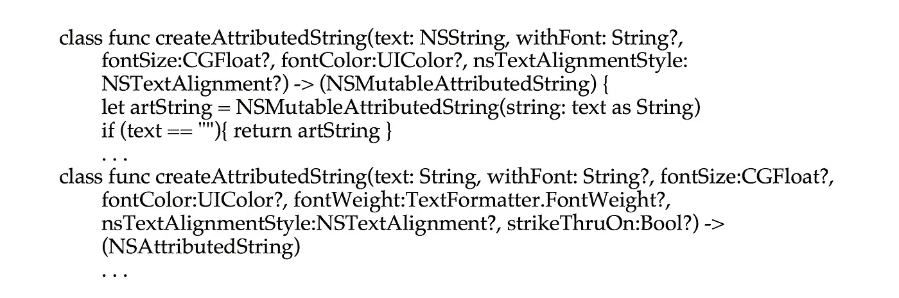
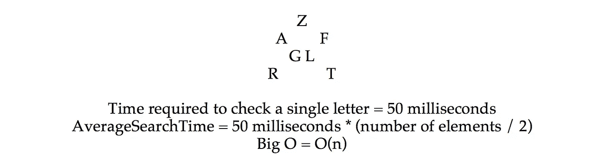
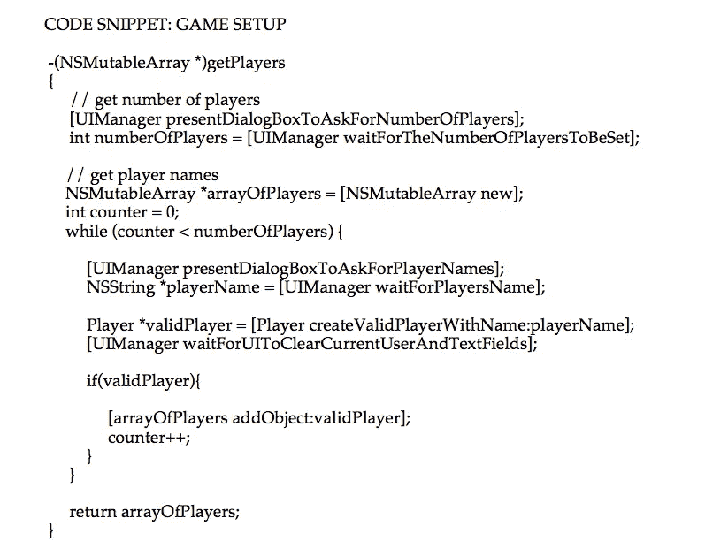

# 为人类绩效优化代码

> 原文：<https://medium.com/capital-one-tech/optimizing-code-for-human-performance-fb3a6e5b79b8?source=collection_archive---------2----------------------->

当我们从认知科学和界面设计的角度来看待代码时，我们会发现代码的编写方式和人类处理信息的方式之间经常存在脱节。从这个角度来看，程序员是最终用户——处理能力有限——它改变了我们查看和编写代码的方式。

> *我们如何为软件工程师创造一个直观的体验，帮助增加吞吐量和减少错误？*

编程语言，在很大程度上，不仅仅是为了计算机；它们也是为使用它们的人准备的。毕竟，如果我们为计算机编写代码，我们只会用 1 和 0 来交流。代码帮助我们组织思想，清晰地表达思想，并与我们的编译器和其他人分享。

认知科学告诉我们，很大比例的编码错误是由[高认知负荷、](https://en.wikipedia.org/wiki/Cognitive_load)糟糕的组织和无效的沟通造成的。此外，很明显程序员通常是这些编码错误的来源。在软件开发中，我们可以优化计算速度、灵活性和重用，或者程序稳定性；然而，很少有人强调优化人的表现。通过更加重视这一要素，就有可能在易用性、实现速度、代码重用和总体缺陷减少方面取得显著收益。

*When you look at this image, the bizarre effect is caused by top-down processing. Top-down processing is based on expectation, whereas “bottom-up processing” is based on incoming sensory inputs.*

# 工程心理学——人类大脑的大 O

> 当火箭或宇宙飞船即将与另一个物体相撞时，一个响亮的警报声就会响起，告知飞船上的船员他们即将死亡。至少，这是我们从看电影中学到的。但事实上，美国宇航局的研究人员解释说，巨大的噪音很可能导致灾难和死亡。巨大的噪音会产生惊吓反应，这可能会导致大脑在处理信息之前有三秒钟的延迟。相比之下，柔和舒缓的声音会提醒飞行员和船员船只即将坠毁，从而给他们时间做出反应。认知科学家罗伯特·库珀博士

科学家们已经对大脑如何工作以及如何优化人类表现有了更多的了解。在 *NASA 艾姆斯中心，*工程心理学领域的科学家探索人类大脑的能力和局限性。为什么？因为当你撞毁一艘价值数十亿美元的宇宙飞船时感觉糟透了。

在工程心理学(认知科学的一个分支)中，我们首先假设大脑是一台计算机。当我们从这个角度看一个程序员时，这与看一台处理能力和 RAM 有限的计算机没有什么不同。人类的大脑由不同的处理单元组成，我们看到了多任务、多线程和记忆转换；以及用户输入、网络调用、嵌套回调和并发/同步问题。

作为程序员，我们理解这些系统有多复杂和容易出错；且数据输入必须是系统能够处理和理解格式。因此，我们可能会问，“*如果人脑是一台计算机，那么我们如何优化这台计算机的可靠性、程序稳定性或性能？我们如何最大化吞吐量和最小化错误？*

举例来说，当人类大脑没有足够的资源来执行一项任务时，就像试图在 iPhone I 上上网一样。也就是说，认知负荷高的任务可能会使有限的系统资源负担过重，导致处理或存储错误。高认知负荷任务的一个例子是在你的头脑中增加你的杂货账单。将两个数字相加很容易，但将 50 个杂货项目相加就没什么意思了。

在计算机科学中，我们定期测量计算机执行一个计算过程需要多长时间，使用一种称为 [*【大 o】*](https://brilliant.org/wiki/big-o-notation/)的数学符号，这似乎是一个自然的下一步，询问人脑执行一项任务需要多长时间，以及它给系统资源带来了多大的压力——“认知负荷”我喜欢称这个*为人脑的【大 O】*。

为了用外行人的话来说明这一点，我们来看以下两种方法。扫描第一个方法找到第一行代码需要多长时间？需要多长时间来识别我们两种方法之间的差异？

根据经验，用户被期望处理、记忆或知道的越多，认知负荷就越大，吞吐量就越低，出错的概率就越大。

认知科学家进行了大量研究，考察“文本格式和位置”与“目标获取时间”之间的相关性，从视觉采样和信号检测到认知处理策略，无所不包。举例来说，如果我们在其他字母中搜索一个字母，大脑将使用[线性搜索进程](https://en.wikipedia.org/wiki/Linear_search)，逐个检查字母，直到找到正确的一个。

对于一个计算机程序员来说，这种分析看起来非常熟悉(它与通过一组未排序的元素进行基本搜索是一样的)。这样，我们看到了认知科学家如何能够像程序员分析软件性能一样分析认知性能。

我们对大脑处理信息的方式有很多了解。这在空中交通控制系统、驾驶舱显示器和战斗机平视显示器的设计中得到了很好的应用。因此，我们可能会问，*“如果我们从认知的角度来处理编码，它会如何改变我们编写代码的方式，我们的代码会有多大的不同？”*

# **现代编程挑战遭遇古代大脑进程**

> 一个代码挑战:开始时是一个任何孩子都可以解释的简单过程，后来变成了一个令人困惑的程序，有多个入口点、复杂的状态逻辑、没有明确定义的事件序列、嵌套的块和委托调用。也就是说，随着程序规模和复杂性的增长，跟踪谁在做什么以及接下来会发生什么变得非常具有挑战性。这让学生的“工作记忆”超载了。人类的认知能力有限。*——我在一家手机制造商(iOS 训练营)工作时的观察*

许多软件应用程序缺乏清晰的组织和逻辑，这表明代码编写方式和人类处理信息的方式之间存在脱节。这不仅仅是沟通不畅的问题。现代编程语言用循环代替了 goto 命令，面向对象编程用速度换取了组织，使软件工程师能够构建规模和复杂性令人震惊的程序。然而，移动开发的现代趋势——包括异步调用和用户驱动的体验——已经破坏了现代结构化语言的大部分组织和控制流程。特别是，我们可以注意到:

用户输入启动各种序列，给我们一个状态和事件的蜘蛛网，其中的总体逻辑必须被推断出来。

**简单的线性流程(例如，向应用程序添加通知)被分解为一系列复杂的不连贯的委托调用，因为我们等待不同事件的发生。**

**代码通常被分解成对象和块，这些对象和块不是紧密耦合的，而是维护着一个逻辑依赖网络，这使得它们难以理解和使用。**

**嵌套块调用，常见于网络调用或动画中，很难读懂；他们无视适当的范围界定；并且违反了单一责任原则(将其应用于方法，以及类)。每个方法都应该有一个单独的职责，并且应该在方法名中清楚地说明。**

事实上，如果我们让一位英语教授——书面交流方面的专家——给一个 iOS 项目打分，他们很可能会说:*“请重写。缺少总结和结论。很难理解。缺少逻辑和转换。不标准的英语用法。需要适当的段落。没有明确的组织。”*因此，提出了许多关于设计模式、应用程序的基本逻辑结构和设计编程语言的有趣问题。

我曾经写了一个多玩家骰子游戏，作为一个带有等待命令的运行循环，目的是为了说明如何简单明了地陈述编程逻辑。

相比之下，当我还是老师的时候，给学生布置这种代码挑战，他们的代码往往很难理解或者完全看不懂。问题的核心似乎是异步的概念；我们需要等待一些东西——无论是网络呼叫还是按钮按压——才能继续。这可能会对结构良好的代码造成严重破坏。

我想提出的问题是，

**“*我们在这里看到的是对计算机网络和用户驱动体验需求的必要适应，还是仅仅是糟糕的代码？”***

***“这仅仅是一个全行业文档和通信标准不佳的问题吗？”***

至少，包含解释逻辑组织的基本工件是很重要的。文档，仅仅是一个快速的解释、照片或草图，应该拖放到项目中，而不是放在没有人会看到的地方。这就是敏捷开发的全部内容。

从长远来看，可能有必要以新的方式构建和组织我们的代码。这是自然进化过程的一部分。举例来说，面向对象编程用计算机性能换取了可用性，而 Ruby 用类型安全换取了更直观的界面。

# **付诸实践**

> 在美国宇航局进行的一项研究中，八名机组人员模拟飞入洛杉矶国际机场，他们的飞行仪器读数直接投射到他们面前的挡风玻璃上。在一次试验中，他们突然遇到一架停在跑道上的飞机，这种情况需要复飞。只有两名飞行员注意到了飞机并进行复飞，而六名飞行员可能会与飞机相撞。“他们在平视显示器上转移注意力，而不是看窗外，”乔丹说。“这些都是非常重要的问题。”-资助寻找人的因素心理学:凯文·乔丹教授获得 7300 万美元的美国宇航局研究经费

在我之前作为俄罗斯和中国的数学和哲学老师的职业生涯中，我学到了很多关于吞吐量和误差的知识。您如何最大化吞吐量？你如何最小化错误？你如何通过有效的交流、组织、排序和节奏来管理认知负荷，以便即使是挣扎中的学生也能掌握微积分？

当我看到一段软件代码时，我会问自己，“我以前的学生中有多少人第一次阅读时就能理解这段代码？”有多少人有问题？有多少人会对如何正确实现一个类或方法感到困惑？

减少认知负荷的一个策略是把事情分成更小的部分。作为一个经验法则，如果你不得不“非常努力地”理解一段复杂的代码，那么我们应该问问是否有一种方法可以降低复杂性。例如，嵌套的 for 循环可以重写为“for 循环”，它调用包含第二个循环的 helper 方法。

另一个减少认知负荷的策略是通过使用清晰、明确的方法和变量名，遵循公认的英语语法规则。当事情被清楚而简单地陈述时，它们很容易被记住和遵循。

写好的、自我记录的代码很像写大学论文，它从基础开始。*每种方法都是一个段落。每个方法名都是一个主题句。使用恰当的词语，而不是俚语。将冗长的完成块或嵌套代码分解成它们自己的方法——也就是说，使用分段和空格来将想法分解成小块并强调要点。确保底层逻辑结构清晰。不要忘了添加注释，为读者提供足够的上下文，以准确理解它做什么、不做什么、做什么以及如何使用它。”代码是关于交流的，它是关于记住谁是我们的观众。*

类似地，我们可以将设计模式视为促进人类使用和消费的组织结构。在软件开发中，我们使用设计模式来管理复杂性，并促进灵活性和重用。(OO，MVC，委托，工厂，固体设计原则等。)但是管理复杂性通常只是减少认知负荷的另一种说法。我们希望提高灵活性并保持代码干燥，因为我们可能希望有一天进行修订。然而，我们不应该试图消除认知负荷，因为许多任务需要复杂性。相反，我们应该寻求避免可能导致错误的不必要的复杂性，并使用设计模式来构建大脑可以轻松使用和理解的直观界面。

# 建造火箭船

关于如何优化人类性能，我们可以学到很多东西，但也许我们应该从尝试编写漂亮的代码开始，或者至少是良好的、自我记录的代码。在其编码标准中，NASA 的喷气推进实验室解释说:

> 更简单的控制流转化为更强的人工和基于工具的分析能力，并且通常会提高代码的清晰度。任务关键型代码不应该仅仅是有争议的，而是非常正确的。…编写的代码应该易于被任何有能力的开发人员理解，而不需要花费大量的精力来重构原始开发人员的思维过程和假设。—C 编程语言的 JPL 机构编码标准

虽然我们不是在建造火箭船，但工程心理学是一个值得研究的课题，它为我们提供了如何优化人类表现的重要见解。当我们根据用户体验和认知来评估代码时，它开始改变我们编写代码的方式。“如果你有 100 个用户，你会发现多少错误？从工时的角度来看，成本是多少？”通过有效的组织、减少认知负荷以及数据和组织结构的清晰交流，我们可以最大化吞吐量和最小化错误，提高易用性、实现速度和代码重用。

***米奇洛·克莱恩(Mychilo Cline)是 CapitalOne 的 iOS 开发人员，拥有人机交互/技术和社会专业的研究生学位，专注于:人的因素。研究方法、人际互动模式和最终用户需求。在线社区的社会工程。采用新技术的人类学和历史模式。***

*欲了解更多关于 Capital One 的 API、开源、社区活动和开发人员文化的信息，请访问我们的一站式开发人员门户网站 DevExchange。*[*https://developer.capitalone.com/*](https://developer.capitalone.com/)