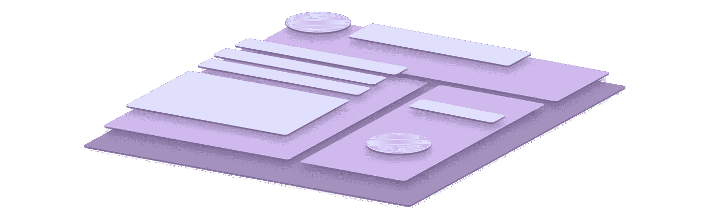

# 优化 Ember 模板

> 原文：<https://medium.com/square-corner-blog/optimizing-ember-templates-c479d26fe58e?source=collection_archive---------1----------------------->

模板占你 Ember 应用的 60%。现在怎么办？

> 注意，我们已经行动了！如果您想继续了解 Square 的最新技术内容，请访问我们在 https://developer.squareup.com/blog[的新家](https://developer.squareup.com/blog)

*更新:自从这篇文章首次发表以来，Ember 的基本性能已经提高了很多！Ember 2.10 附带了一个新的渲染引擎，使得一些优化变得没有必要。如果你使用的是 2.9 或更低版本的旧应用，请继续阅读！*

当源代码通过编译器或传输器时，很容易在一段代码的感知重量和它在产品中的实际大小之间产生脱节。

对于 Ember 模板来说尤其如此，微小的变化会对生成的 JavaScript 数量产生深远的影响。

> “每个字节都很重要。”
> —每一个前端 Web 开发者
> (穷尽了其他优化 app 启动的方法之后)

# 条件块是昂贵的

考虑一个呈现两个段落的组件模板，第二个段落是使用一个 *#if* 助手有条件地呈现的:

该组件生成的代码总大小为 3.8 KiB，大得惊人！所有的代码都是从哪里来的？

每个模板在构建时都被转换成一个 JavaScript 模块。每个模块都包含创建 DOM 并填充其子模块和值所需的逻辑、代码和数据(示例如下)。

这里令人惊讶的是条件 IF 块的编译方式。它变成了一个完整的子模板，几乎和父模板一样大，拥有自己的元数据和渲染功能(以红色显示)。

Generated JavaScript for Template with Conditional IF

{{#if}}助手非常容易使用，从精神上来说，它是一个针对条件情况的轻量级解决方案。然而，在幕后，每个条件块实际上都由相同的基础结构表示为一个全新的模板。

相反，如果我们使用一个类名有条件地隐藏段落元素，它将删除一半生成的代码，并节省总应用程序大小的 1.2 KiB！

这似乎是一种有争议的优化模板的方法，但它阐明了我们将继续探索的一般概念:*小的改变可以节省大量代码，有时是以牺牲可维护性
和可读性为代价的。*

Using a dynamic class removes an entire template child

# 避免重复使用 IF/Else 循环

一个包含一系列 If/Else 语句的更复杂的模板展示了生成的代码如何变得更大。*每个条件块*都被转换成一个子模板，其大小与上例中的红色文本相同。因此，虽然这看起来像一个模板，但实际上是八个模板。

我们可以使用#each 循环重构这个组件，并将 *instrumentList* 数组的创建移到 javascript 中:

即使考虑到构建**工具列表所需的额外 JavaScript，**新的实现也节省了 12 KiB 的代码。

# 计算属性

另一种避免模板中条件块的技术是将工作转移到计算属性中。在下面的例子中，通过计算 JavaScript 中显示的值，您节省了超过 50%的组件大小。

# 模板中的 SVG

当在模板中使用时，SVG 的大小也会增加。这个 SVG 文件在一个圆内呈现一个复选标记；源代码是 298 字节，但是编译成 JavaScript 的 [2.2 KiB！](https://gist.github.com/terrilldent/06d074e20e0b4492bc695661a7698ac7)

*   记得在把 SVG 添加到你的模板之前，通过一个像 [SVGO](https://github.com/svg/svgo) 这样的迷你程序来运行它。
*   手动检查结果以清除任何其他未使用的属性。
*   您可以安全地省略内联 SVG 上的 *xmlns* 和 *version* 属性。

更好的办法是，尝试将 SVG 移动到一个外部文件中，并将其作为背景图像或一个标签的源进行引用。这将节省整个模板的成本，如果很少使用，这是一个明智的选择。有时你甚至可以使用 CSS 创建[相同的图像！](http://a.singlediv.com/)

# 使用组件的隐式标签

每个 Ember 组件都有一个隐式包装标签，可用于样式和布局。即使它没有在模板中定义，您也可以使用组件的 JavaScript 文件自定义该标记。

在上面的循环示例中，我们可以通过修改组件来优化包装标签
**<section class = ' instruments-container '>**:

模板中只有一个顶级元素的任何模板都是使用隐式组件标签的候选。这种技术还有助于减少 DOM 中的节点数量。

# 扩展组件而不是包装

当向现有组件添加新功能时，很容易将基本组件包装在新模板中，并传递所有属性。这带来了创建新模板文件的副作用，通常可以通过扩展现有组件来完全避免:

Extending an Existing Ember Component

# 更进一步

理解 Ember 模板编译器有助于使这些技术更加直观。更深入的一个快速方法是以多种方式实现同一个模板，并比较结果。您可以使用 diff 工具来查看最终输出的比较结果，以及哪种方法最适合您的场景。模板快乐！