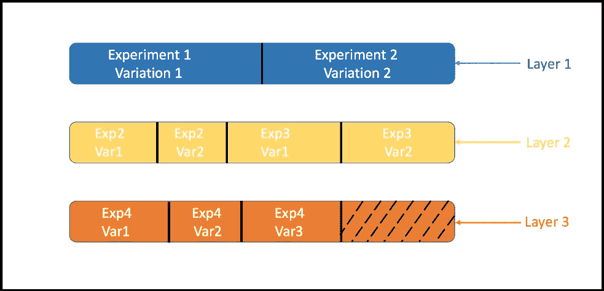
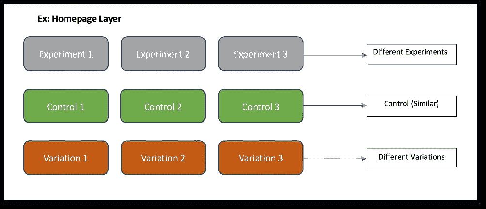
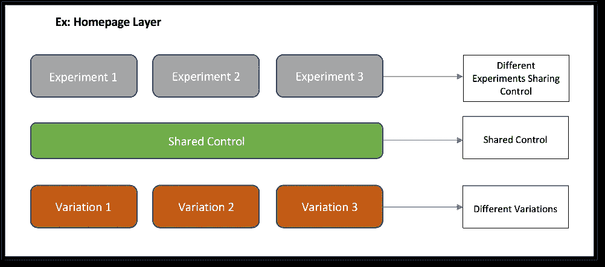
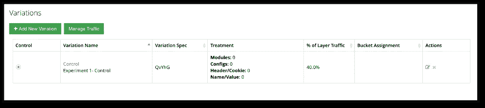
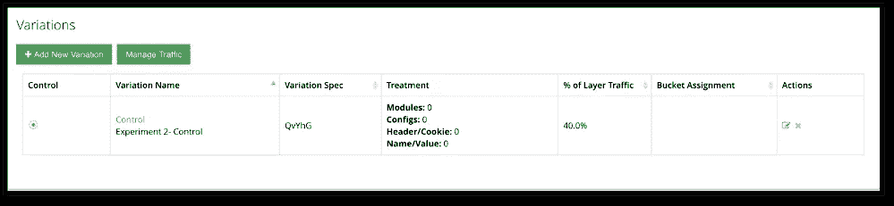
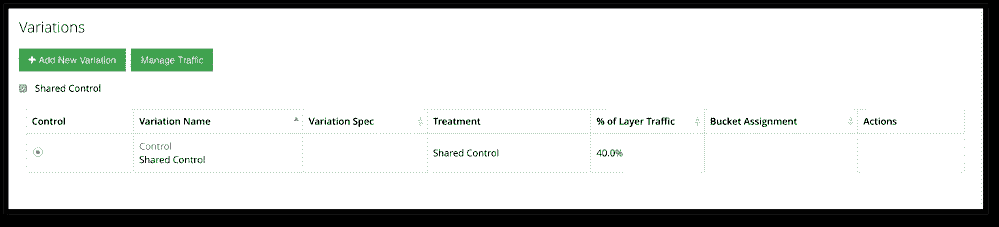

# 利用共享控制优化实验资源

> 原文：<https://medium.com/walmartglobaltech/optimizing-experimentation-resources-with-shared-control-6a2677e6e513?source=collection_archive---------1----------------------->

# 介绍

我们在生活的不同部分看到了共享资源的好处。在我谈论共享控制之前，我想从一个类比开始。让我们举一个例子，说明沃尔玛“提货”服务是如何使用共享资源的。

沃尔玛提货:用户在 Walmart.com 网上订购，并选择商店提货。一辆卡车(共享资源)将多个用户在 Walmart.com 下的多个订单的物品从仓库运送到商店。用户在商店拿起他/她的物品。因此，卡车是一种共享资源，用于将多个用户的物品运送到商店。

在实验中，我们可以使用相同的共享资源的概念来提高流量的使用效率。共享控制顾名思义，是指在多个实验中共享一个控件作为共享资源。

如果您是初次接触 A/B 测试，并且不熟悉控制等术语，请继续阅读下一部分。

# 理解基础知识

在我们深入讨论共享控制的原因、内容和方式之前，让我们了解一些基本概念。

## 什么是控制？

控件是指您的网站/应用程序的实时版本。控件是比较所有网站/应用程序测试结果的基础。

## 什么是变异？

该网站的替代体验被称为变体。

## 什么是治疗？

为给您改变后的网站体验而做出的改变被称为治疗。

## 什么是作业？

A/B 测试的工作方式是，一些客户被分配到网站/应用的 Live 版本( **Control** ),一些被分配到带有处理的版本( **Variation** )。

分配只是意味着某个客户被随机分配去看控制或变异治疗。

## 什么是层？

Expo 是我们在沃尔玛实验室开发和使用的 A/B 测试平台，它允许客户被分配到多个实验中。但我们想确保客户不会被分配到修改相同内容的实验中。这可能会破坏客户体验。为了避免这种冲突，博览会组织这些实验的方式是，修改相似内容的实验被分组在一起。因此，一个用户在每组中只分配到一个实验，这样他/她的体验就不会受到影响。这些组被称为图层。

每个层都有固定的容量，因此根据每个实验占用的空间百分比，一个层中只能存在有限的一组实验。

Figure 1: Layers with Experiments containing Variations

# 如何、为什么&什么？

让我们从中断的地方继续我们的共享控制故事。

## 这一切是如何开始的？

在采用沃尔玛的 A/B Testing tool Expo 初期，实验的数量开始逐日增加，我们开始面临一层空间不足以运行多个实验的问题。这个问题的直接解决办法是创建多个相同类型的层。但当时我们没有管理或创建这些层的 UI，创建每一层的过程都是通过对 Expo 后端服务的 api 调用。请求开始流入越来越多的层。必须对这种情况采取一些措施。

## 没有共享控制权的实验？

假设一个用户创建了多个实验，所有这些实验都会影响主页。现在，Expo 用户根据实验类型选择图层。因此，由于实验正在影响主页，因此 Expo 用户通常可能会为所有这些实验选择主页层。当 Expo 用户设置一个实验时，他/她通常会创建一个 Control(默认体验)&可能是该控件的一个或几个变体。所有这些加在一起，主页层最终会有多个控件和多个变体。

现在，当客户访问主页时，他们可以被分配到“控制”或主页层上实验的变体中的一个。看下面的例子，考虑一组客户可以被分配到实验 1 的控制或变体 1。有些人可能会被分配到“控制”或“实验 2 的变体 2”等等。这些控制和变化中的每一个都在层上占据一定百分比的空间。这是在共享控制之前将流量分配给层中的实验的唯一方法。

Figure 2: Assignment Before Shared Control

## 我们为什么要共享控制权？

在尝试为我们的每层容量不足问题找到解决方案时，我们意识到目前浪费了大量空间。

我们确定，被分配到实验 1 的控制 1 的一组客户与被分配到实验 2 的控制 2 的一组客户具有相同的体验。这就产生了冗余或未智能利用客户流量的问题。这意味着，对于同一层上的所有实验控件，Control 体验完全相同，但每个控件仍然有自己的一组不同的客户流量。因此在层上占据更多空间。

## 我们从共享控制中获得了什么？

我们通过共享控制获得的最重要的东西是流量优化。层上的空间被分配给每个实验的控制的业务占用，所述业务彼此相似。此流量空间通过共享控制进行了优化。

现在，下一个问题是我们如何优化每一层上的流量空间的使用？

我们意识到，在同一层上运行的所有实验都可以共享相同的控制，并让相同的一组客户流量体验该控制。

这意味着，我们可以用 3 个变量运行 1 个对照，而不是用 3 个对照和 3 个变量运行 3 个实验(假设每个实验只有一个变量)。

Figure 3: Shared Control

为了更好地理解这一点，让我们以一些数字为例。下图显示了彼此相同的两个不同实验的对照，即实验 1 对照和实验 2 对照。其中每个都分配有 40%的流量。这总计占该层流量的 80%。

Figure 4: Two Controls Combined Customer Traffic (80%)

而不是在两个实验中都有两个不同的对照。每个实验可以共享相同的控制，从而节省该层上占用的流量。因此，现在不是 40 + 40 = 80%，我们只是共享了 40%的流量。

Figure 5: Shared Control (40% Traffic)

## 世博共享控制

如前所述，层是 Expo 完成的一组实验，以避免在执行 A/B 测试时可能破坏客户体验的任何冲突。

共享控制通过更有效地利用可用的站点流量，允许更多的实验同时进行。它通过允许单个层中的多个实验使用共享的控制变量作为它们的控制变量来实现，而不是每个实验创建自己的控制变量&每个实验都有自己的流量分配。关于共享控制变异，另一件要注意的事情是，由于它是一个控制，因此它没有治疗方法。它充当其层的“默认体验”。

Expo 中的共享控制是在层级别配置的。一定百分比的层流量可以被保留用于共享控制。每个实验都需要在配置时分配一个层。所有实验都是在 Expo 中的层上运行的。

# 结论

当我们开始使用 Expo 时，运行的实验数量并不多，因此最初，我们从未面临层容量耗尽的问题。但是，随着在一个图层上运行的实验数量随着工具的使用和新用户的增加而增加，图层容量的问题开始显现出来。因此，如果我们打算在同一层上运行更多的实验，而它没有能力，那么我们什么也做不了。唯一的方法是等待当前运行的实验结束，然后当空间空闲时，我们可以添加更多的实验来运行。

正如沃尔玛使用卡车作为共享资源，为多人从仓库到商店运送物品，以节省时间和金钱。我们使用相同的概念，通过共享控制和节省空间来帮助在单个层上同时运行更多的实验。总的来说，共享控制是优化层空间的主要因素，也允许更多的实验同时进行。