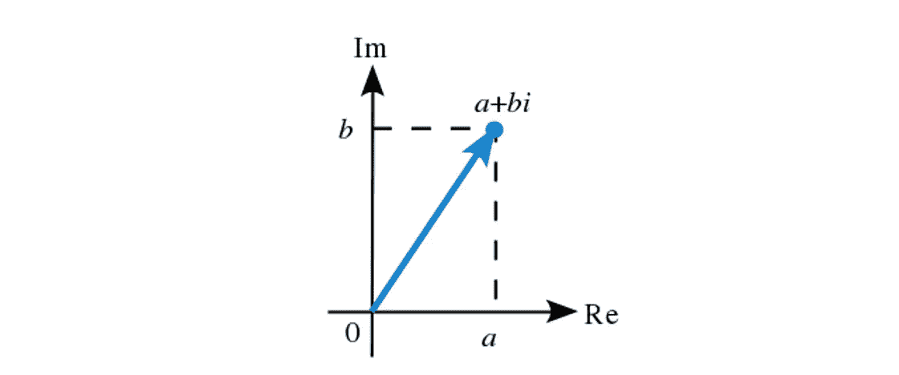
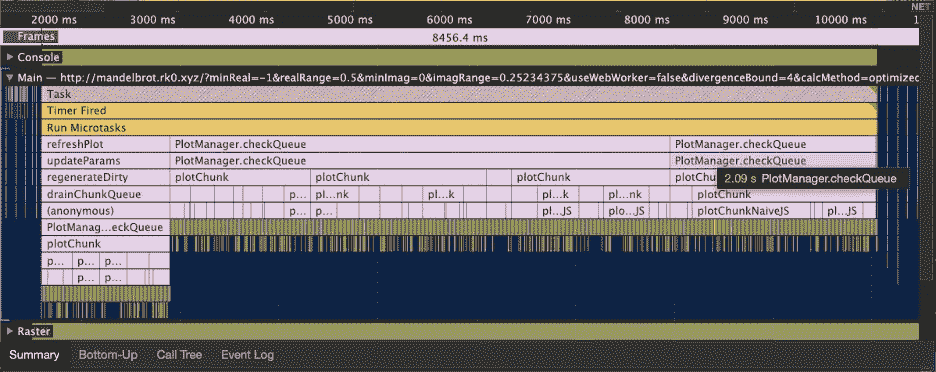
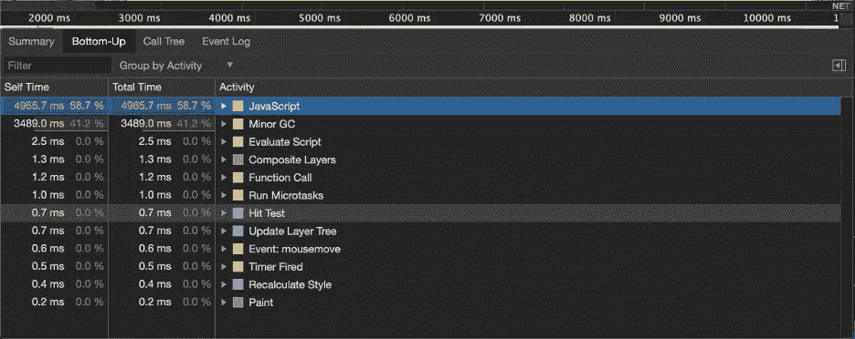
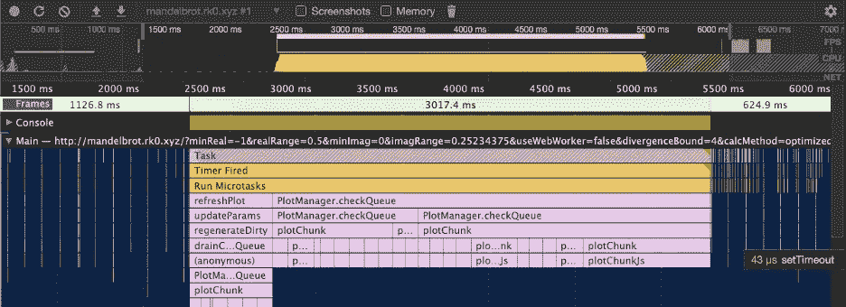
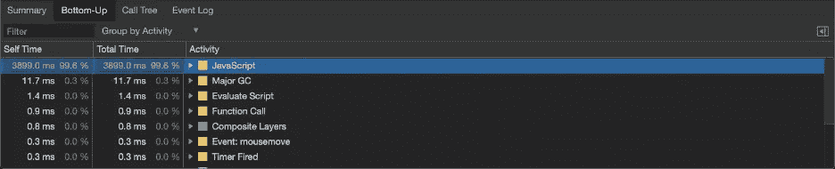

# 优化 Web 上的图形性能

> 原文：<https://medium.com/capital-one-tech/optimizing-graphing-performance-on-the-web-660c88753a01?source=collection_archive---------3----------------------->

## 我个人对终极 Mandelbrot 集查看器的追求

对我来说，作为一名工程师，我需要尝试新事物。当有一个难题要解决或者有一种新的方式来表达一个想法时，编程是有趣的。当我试图学习一种新工具时，我通常会去寻找一个我可以用它来解决的问题。不用说，当我试图为一个不熟悉的工具找一个项目时(而不是相反)，我经常以构建一些唯一积极的描述是“创造性”的东西而告终。不过，其他时候，我有一个我想做一段时间的项目，和一项我一直想学习的技术，它们意外地合作得很好。希望这是其中的一个故事。

当我决定构建一个 Mandelbrot 集合查看器时，并不是因为我觉得这个世界需要在已经存在的许多实现之上再多一个实现。相反，这是因为我有一个 Rust/WebAssembly/Web Worker 形状的钉，我想用它来工作，并且感觉 Mandelbrot 集是将它锤入的正确形状的孔。对我来说幸运的是，Mandelbrot 集合实际上非常适合，通过我的项目，我学到了很多关于这些新技术和 web 性能的知识。

# TL；博士；医生

如果你想跳到最后的结果，这里是查看器:[https://mandelbrot.rk0.xyz/](https://mandelbrot.rk0.xyz/)，这里是相关的 GitHub 回购:【https://github.com/RyanKadri/mandelbrot-viewer】T2。

# 什么是曼德勃罗集合？

*声明:我不是数学家。要更深入地了解曼德勃罗集，请查看***。**

*Mandelbrot 集是一个数学定义的结构，它基于一个非常简单的公式。*

**

*可以绘制出无限复杂的形状，如下所示:*

**

**“Mandelbrot set” (https://en.wikipedia.org/wiki/File:Mandel_zoom_00_mandelbrot_set.jpg) by Wolfgang Beyer (https://commons.wikimedia.org/wiki/User:Wolfgangbeyer) is licensed under (CC BY-SA 3.0) (https://creativecommons.org/licenses/by-sa/3.0/deed.en)”**

*如果你逐步放大黑色区域的边界，你会发现一个无限深的有趣拓扑特征的世界。带着探索的想法，我想建立一个基于网络的工具，受谷歌地图的启发，让用户在图中移动，放大或缩小，并玩一些算法参数，看看它们如何影响渲染。像谷歌地图，我希望用户能够点击和拖动平移，或滚动缩放。我建议使用上方的[查看器来尝试一下。](http://mandelbrot.rk0.xyz/)*

# *Mandelbrot 集合是如何工作的？*

*对于 Mandelbrot 图中的所有复杂性，它由这个简单的函数定义:*

**

*以及以下两个细节:*

1.  *该函数迭代应用于图形中的每个像素，像素颜色由结果决定。*
2.  *该函数是用复数而不是普通实数来计算的。图像中的每个像素对应于复平面中的一个点。*

*功能和这两个细节是上图中视觉复杂性的主要来源。如果你认为需要一些额外的“信息”来计算一个有如此多视觉细节的形状，你并不孤单。如此简单的规则可以产生如此有趣的结构，这一事实是研究[混沌理论](https://en.wikipedia.org/wiki/Chaos_theory)的早期灵感之一。*

# *复数*

**下面一节是对复数的概述。如果您已经熟悉这个主题，请随意跳到下一部分。**

*复数是具有一个[实部](https://en.wikipedia.org/wiki/Real_number)和一个[虚部](https://en.wikipedia.org/wiki/Imaginary_number)的数字。*

*   ***实数**是日常生活中的正常数字。它们包括从负无穷大到正无穷大的一切，以及介于两者之间的所有分数/小数/无理数。*
*   ***虚数**有点不一样。他们允许你回答问题*“负数的平方根是多少？”如果不清楚为什么这个问题的答案不是一个实数，试着想一个数，当它与自身相乘时是-4。虚数的基本“单位”是 I，即-1 的平方根。其他虚数表示为 I 的倍数。**

*a 是一个实数和一个虚数的和。*

**

*从图形的角度来看，复数可以被看作是空间中的一个点。实数有一条“数字线”，而复数有一个*数字平面*。复数可以表示为复平面中的点(a，b)。横轴表示实部的大小，纵轴表示虚部的大小。*

**

*复数可以加、减、乘，但是比普通的实数需要更多的思考。要将复数相加，请分别将实数部分和虚数部分相加。要乘以复数，使用[箔片法](https://en.wikipedia.org/wiki/FOIL_method)计算新的实数和复数部分。*

*最后，复数可以有绝对值。从图形上看，这是复平面上直线的长度，可以使用 2D 矢量长度的标准公式来计算:*

**

# *计算 Mandelbrot 集*

*要绘制 Mandelbrot 集，您需要遍历绘图空间中的每个像素并计算其颜色。绘图空间代表复平面中的一个矩形，绘图中的每个像素代表一个单独的复数。要决定像素的颜色，您可以使用上面的函数，为 z 插入 0，为 c 插入像素的坐标，将结果作为复数值进行评估。再次进行计算，用之前的结果替换 z，将 c 作为原始像素的坐标。像素的颜色由 z 的绝对值在您无限重复此过程时增长的速度决定。例如，如果 c = 1，您将计算以下部分序列:*

**

*在这种情况下，z 快速增长，并且将得到代表快速增长的颜色。用 c = -1 做同样的计算，得到一个序列，其中 z 增长缓慢，并被赋予对比色。*

*对于我们的查看者来说，不是迭代到无穷大，我们可能会迭代序列最多 500 次，如果绝对值大于 2，我们可以猜测输入增长很快，并且是蓝色的。缓慢增长(z 永远不会大于 2)将与黑色相关联。*

*从这个算法转换成代码后的样子来看，有几个重要的要点:*

1.  *复数乘法需要 4 次乘法和 3 次加法。对应于发散数的像素将花费我们函数的大约 500 次迭代。*
2.  *一个 640x640 的图有大约 409k 个像素。对于一些绘图区域，大多数坐标不会发散，需要全部 500 次迭代来确认。发散(并且发散很快)的像素计算起来要便宜得多。*
3.  *因此，Mandelbrot 集合的一些渲染可能需要数亿甚至数十亿次的算术计算。*
4.  *大多数现代处理器在单个执行线程/内核中每秒最多运行约 30 亿条指令。因此，绘制 Mandelbrot 集可能是一个计算挑战。*

# *一个单纯(幼稚？)Mandelbrot 集合实现*

*为了开始这个项目，我决定同步绘制 Mandelbrot 集的静态图像，而不考虑性能。像一个优秀的程序员一样，我将复数建模为一个对象，其中一个字段用于实部，另一个字段用于虚部。对于复数算术，我编写了接收复数并返回新复数的纯函数。我使用绘制 Mandelbrot 集，因为我希望能够直接绘制像素。我最终没有引入任何复杂算术或图形的依赖项，因为我的用例易于实现，并且我希望完全控制性能的调优。*

*这是我最初的 Mandelbrot set 实现的一个简略示例。如果你想看到完整的绘图逻辑，请查看我上面的页面:*

*这省略了一些绘图逻辑，但抓住了计算 Mandelbrot 集的主要思想。最后的 drawPixel 函数调用获取迭代次数，并使用它来决定最终的像素颜色。还要注意，当复数的绝对值太大时，迭代 Mandelbrot 函数会短路。*

*那么，这种绘制曼德勃罗集合的初步尝试效果如何呢？上面的代码在功能上是正确的，但是需要相当长的计算时间。如果我使用这种方法在我的 1080x1920 显示器和 MacBook Pro 上绘制 Mandelbrot 集，在页面加载完成后，大约需要 7.5 秒来渲染。计时会根据您的具体硬件而有所不同，但它至少告诉我，我需要注意性能。请记住，在这个简单的实现中，所有这些计算都是同步完成的。7 秒钟的同步等待总是让人感觉很慢。*

# *改进简单的方法*

*那么我们如何改进缓慢的天真方法呢？开发人员工具是解决 web 性能问题的好地方。下面是计算 Mandelbrot 集合时浏览器所做工作的火焰图截图。*

**如果您想进行性能故障排除，请尝试使用实时 Mandelbrot 查看器，选择“Naive JS ”,然后取消选中“计算工作线程”。最后，打开开发工具，在 Performance 选项卡中开始记录一个会话，然后点击 redraw。这应该给出一个很好的性能指标，因为它完全依赖于已经下载的客户端代码。**

**

*作为一个健全的检查，这是一个很好的迹象，主要的渲染时间花在我写的函数(相对于浏览器渲染)。接下来我们要弄清楚的是浏览器大部分时间花在哪里。为此，我可以在同一个性能选项卡中查看“自下而上”视图:*

**

*这种“自下而上”的观点很不寻常。对于一个 7 秒的计算，浏览器花费了超过 3 秒的时间进行垃圾收集(截图中的次要垃圾收集)。现代浏览器中的垃圾收集非常有效，通常不会花这么长时间。尽管对上面天真的实现思考得更久一点，这个结果还是很有意义的。计算 Mandelbrot 集涉及大量的复数运算。通过尝试遵循函数式编程实践，并使每个复数成为一个新对象，我陷入了一个巨大的性能陷阱。每一个复杂的数学运算都会产生一个新的对象，最终需要被垃圾回收。在正常的应用程序中，对象分配既便宜又快速，但是因为我创建了(多达)数亿个对象，所以它可能会增加。*

*那么，我如何减少对象分配，从而减少垃圾收集呢？一个选择是在我的数学运算中放弃不变性的想法。例如，我的数学运算可以修改我传入的一个对象。不过，感觉有点草率。我应该修改哪个操作数？当我重构代码时，这种选择安全吗？此外，有一个叫做“加法”的数学运算，并让它修改其中一个数字，感觉是错误的。另一个操作可能是使用有点奇特的 JS 内存管理技术，比如[对象池](https://www.html5rocks.com/en/tutorials/speed/static-mem-pools)。对于一个相当简单的项目来说，这似乎有些矫枉过正，并且需要额外的依赖和/或重构我的代码。*

*我决定采用的优化方法不是最干净的，但我觉得它是简单性和可读性的最佳折衷。我选择将复数对象分解成基本部分，并将它们作为两个独立的参数传递。如果我想减少对象分配，我可以完全避免对象！*

*下面是一个没有对象时我的代码的例子:*

*Mandelbrot set 算法非常简单，使用单独的原语不会对代码的可读性造成太大的损害。然而，直接使用原语对性能有很大的影响。这是使用这个优化 JavaScript 的开发人员工具的另一个视图:*

**

*火焰图底部的所有黄色装饰都消失了，从底部向上的视图显示根本没有时间花在垃圾收集上！*

**

*对于使用内存管理语言的开发人员来说，在长时间运行的阻塞任务中不进行垃圾收集可能会令人惊讶，但在这种情况下这是有意义的。我没有创建任何 JavaScript 对象，所以不需要收集任何东西。更确切地说，我的所有原始变量都直接存储在堆栈中，并在给定的堆栈帧完成时移除。*

**最后一句话不一定 100%正确，但在当前版本的 Chrome 浏览器中似乎是正确的。JavaScript 是一种内存管理语言，语言规范实际上并没有说明 JavaScript 如何布置内存。一个足够先进的解释器/编译器实际上可以自由地分析我的代码，并决定在堆栈上分配我的原始复杂对象类型。目前，浏览器似乎没有做到这一点，但如果它们足够聪明地做到这一点，我希望我的 Mandelbrot 集的“幼稚”实现会变得更接近我的“优化”版本。现在，我们可以说我的优化 JavaScript 通过在堆栈上分配来节省垃圾收集。**

# *更奇特的解决方案:WebAssembly*

*因为整个项目一开始是作为学习性能优化的一种方式，所以我不想停止编写优化的 JavaScript。我在网上听到了一种新语言的低语。一个可以纠正 JavaScript 许多错误的方法。一个将向所有其他在 JavaScript 严酷统治下屈服的语言开放网络的平台。那种语言就是 WebAssembly。*

*WebAssembly 很像 JVM 的字节码[。它不是你通常会手写的东西，但它可以是许多不同语言的编译目标。像字节码或汇编语言一样，WebAssembly 更接近于在您的计算机上执行的实际机器代码。它可以访问线性内存块，不使用垃圾收集，并且几乎没有高级编程语言功能。](https://en.wikipedia.org/wiki/Java_bytecode)*

*另一方面，像 JavaScript 一样，浏览器中的 WebAssembly 不提供对底层操作系统的访问，并且可以被标准浏览器沙箱绑定。此外，与 C 中生成的机器码不同，WebAssembly 保证了安全，避免了某些内存漏洞，如缓冲区溢出和控制流劫持。*

*基于这些特征，我猜测 WebAssembly 可能非常适合我的 Mandelbrot viewer 项目。我一直在寻找一种真正有效的方法来进行数学计算，我读过的几乎所有编程语言的比较都表明，编译型、静态类型的语言往往比解释型语言更快(想想 Java 和 Python)。同样，数据结构和编程构造更接近计算机的真实内存和 CPU 架构的语言往往比那些结构更抽象的语言更快(想想 C 与 Haskell)。现代 JavaScript 适合于编译语言和解释语言之间的一个奇怪的中间空间(查看 [JIT 编译器](https://hacks.mozilla.org/2017/02/a-crash-course-in-just-in-time-jit-compilers/)了解更多信息)，并且它肯定有一些更高层次的数据结构复杂性，包括闭包和原型。也许 WebAssembly 可以做得更好。*

*为了创建一个 WebAssembly 版本的 Mandelbrot viewer，我必须选择一种可以编译成 WebAssembly 的语言。幸运的是，铁锈完全符合要求。深入探究 Rust 到底是什么或者为什么它如此棒，还需要一些博客文章，但是从高层次上来说，Rust 是静态类型的，低层次到足以编写高性能代码，最有趣的是，它提供了没有垃圾收集器的内存管理。此外，通过一个名为 [wasm-bindgen](https://github.com/rustwasm/wasm-bindgen) 的工具，你可以用自动生成的包装器将 Rust 编译成 WebAssembly，以帮助从 TypeScript 中调用它。为了“公平”地比较 WebAssembly 和 JavaScript，我大多只是将我的 TypeScript 代码直接移植到等价的 Rust。这看起来是这样的:*

**免责声明:我对 Rust 很陌生，这是一个有意的 1-1 端口。请温柔点。**

*当我把我的 Mandelbrot 算法移植到 Rust 之后，我用 wasm-bindgen 把它编译成 WebAssembly，用 Webpack 把它和我的 JavaScript 捆绑在一起。这是关键时刻。我再次通过性能工具运行我的 Mandelbrot 计算，发现…不多。WebAssembly 的运行速度和我在 Firefox 中优化的 JavaScript 差不多，实际上在 Chrome1 中运行速度慢了 10%。这是非常令人惊讶的！我只是在语言之间切换了一次上下文，并没有做任何不必要的内存复制。我还在页面完全加载后多次运行了 WebAssembly 代码，因此应该不会有任何与网络/启动相关的问题。不确定发生了什么，我深入研究了性能工具。自下而上的视图向我展示了与优化后的 JavaScript 基本相同的配置文件。几乎没有垃圾收集。在我点击 redraw 按钮开始绘图过程后，几乎所有的计算时间都花在了运行代码的实际任务上。*

**

*那么，为什么我编译的、低级的、静态类型的代码会比解释的、高级的、动态类型的 JavaScript 代码差呢？*

**1 在 Safari 中，WebAssembly 的运行速度比 JavaScript 快 4 到 5 倍，但 JavaScript 比 Chrome 和 Firefox 慢 4 到 5 倍，所以最高速度的结果是相似的。**

# *JavaScript 万岁*

*在查看我的 WebAssembly 代码的 performance 选项卡时，我意识到 Rust 生成的 WebAssembly 并不慢。相反，JavaScript 真的很快。回到我之前的观点，称 JavaScript 为解释型语言并不完全准确。在现代浏览器中，当快速启动时间很重要时，JavaScript 被解释。当性能至关重要时，浏览器会透明地将 JavaScript 编译成高度优化的机器码。此外，虽然 JavaScript 是一种动态类型语言，但我的优化代码本质上是高度静态的。我没有创建任何带有附加属性的 Franken 对象，也没有依赖于深度原型树。我优化过的代码做了计算机自诞生以来就被优化过的事情。它用原始简单的参数运行数学函数。类似我写的代码可能是浏览器优化编译器中第一批优化的。*

*JavaScript 是一种有点独特的编程语言，因为它是浏览器直接支持的唯一客户端语言，所以自动获得了巨大的市场份额。因为网络无处不在，所以对尽可能积极优化 JavaScript 有着巨大的需求。一些最流行的 JavaScript 运行时拥有大型专家工程师团队，他们多年来一直在优化这种语言。*

*这并不是说 WebAssembly 赶不上 JavaScript。WebAssembly 是一项相当新的技术，还没有机会以同样的方式进行大量优化。它还有一些真正能让它在 JavaScript 上占据优势的特性。我避免的一些 JavaScript 特性(例如，动态改变对象形状)可能会出现在 JavaScript 代码库中的任何地方，并且可能会损害编译器的优化能力。JavaScript 引擎也有许多性能“去优化”,异常的代码结构会阻止优化编译器产生高效的代码。像 Rust 这样严格得多的语言通常可以在第一时间阻止这些情况出现。*

*Rust 还有一些额外的性能优势，这些优势也与我的 Mandelbrot 绘图算法相关。因为 Rust 是静态类型的，并且对内存布局有更多的控制，所以它已经可以利用 V8 等现代 JavaScript 引擎所没有的一些优化。例如，我应该能够将我的“幼稚的”JavaScript 方法移植到 Rust，并让它像我的原始数学 Rust 一样高效地运行(尽管不幸的是没有优化的 JavaScript 快)。如果我在 Rust 中定义了一个“复杂”类型，我就有了语言级别的保证，即对象对于数字的实部只有一个浮点字段，对于虚部只有一个浮点字段。有了两个简单的字段，Rust 就可以把我的复数直接放到堆栈上，就像 JavaScript 处理原语一样。这意味着在 Rust，我可以有我的蛋糕，也吃它。我可以编写使用对象的干净代码，并且不会因为垃圾收集而损失性能。在像我的 Mandelbrot set grapher 这样的简单项目中，这可能不是什么大事。在具有更复杂逻辑的项目中，能够编写干净的代码而仍然避免垃圾收集可能是一个巨大的胜利。*

# *外卖食品*

*在这个项目的过程中，我有机会打破一些干净编码的标准规则。我没有将相关数据分组到一个对象中，而是将其表示为原语，并在单独的变量中传递它们。我没有编写单一责任的助手函数来进行计算，而是内联地进行计算。我还在工具箱中引入了一种新的编程语言和编译目标，试图从浏览器中获得尽可能多的单线程性能。对于大多数“普通”的 web 应用程序来说，这种性能上的跳跃并不是真正必要的。过早的优化是许多问题的根源，应用程序通常会因为 I/O 而不是计算而变慢。然而，网络不断承担更多的责任，在浏览器中运行更多计算密集型应用程序变得可能。3D 游戏、客户端图像处理和其他通常为本地应用程序保留的任务似乎正在浏览器中获得立足点。这就是计算性能调优再次变得重要的地方。*

*优化的 JavaScript 在快速计算方面有很大潜力，但它的新合作伙伴 WebAssembly 可能会为一系列全新的移植应用程序打开大门，这些应用程序是用 Rust 和其他以前只有本地语言编写的。尽管 WebAssembly 目前可能不会给我们带来比高度优化的 JavaScript 更大的收益，但随着时间的推移，它只会变得更快。更重要的是，对于一大类复杂的程序，像 Rust 这样的静态类型、注重性能的语言将迫使开发人员编写代码，自然地移植到高性能的 WebAssembly。这种开发方式可能会在未来几年为许多新的浏览器功能打开大门。看到我们将要建造的东西是令人兴奋的。*

**披露声明:2021 资本一。观点是作者个人的观点。除非本帖中另有说明，否则 Capital One 不隶属于所提及的任何公司，也不被这些公司认可。使用或展示的所有商标和其他知识产权是其各自所有者的财产。**

**最初发表于*[T5【https://www.capitalone.com】](https://www.capitalone.com/tech/software-engineering/optimizing-graphing-performance-on-the-web-mandelbrot-project/)*。**