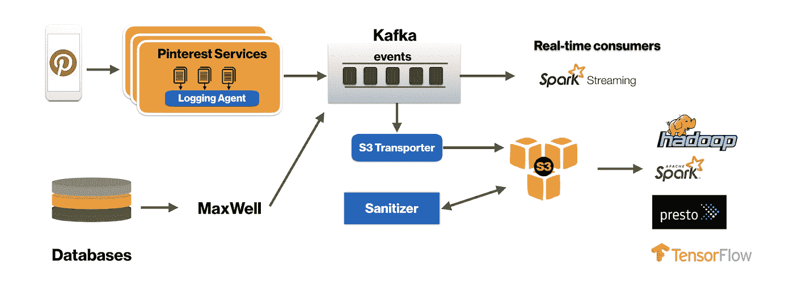
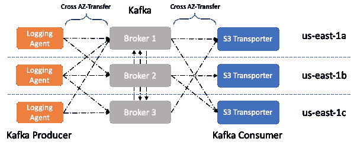
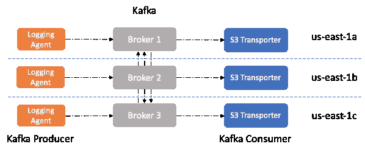

# 为云优化 Kafka

> 原文：<https://medium.com/pinterest-engineering/optimizing-kafka-for-the-cloud-4e936643fde0?source=collection_archive---------0----------------------->

由 Ambud Sharma |测井团队软件工程师

# **外卖**

*   开发位置感知系统和平衡算法有助于大幅降低成本
*   使 Kafka 生产者和消费者机架感知有助于有效地路由流量
*   数据驱动的工程决策对于持续改进系统至关重要

在云中运行时的一个基本原则是确保应用程序不会中断。实现这一点的常见方法是将应用程序的部署分布在多个故障域中。在公共云环境中，可用性区域(AZ)可以作为故障域。我们可以使用多个 az 为应用程序提供容错。

像 HDFS 这样的分布式系统传统上是机架感知的，通过将副本分布在数据中心内的多个机架上来提高容错能力。然而，在云环境中运行时，使用 AZs 作为机架信息是一种常见的做法。这使得数据拷贝可以跨多个 az 分布，从而在一个 az 出现故障时提供容错能力。**虽然跨 AZs 复制数据提供了容错能力，但这确实会增加 AZ 传输成本。**

在 Pinterest，我们广泛使用 Kafka 作为可扩展的容错分布式消息总线，为几项关键服务提供支持，如[用户操作计数](/@Pinterest_Engineering/building-a-real-time-user-action-counting-system-for-ads-88a60d9c9a)和变更数据捕获(CDC)。由于我们有 [Kafka](https://kafka.apache.org/) 以非常大的[规模运行](/pinterest-engineering/how-pinterest-runs-kafka-at-scale-ff9c6f735be)，我们需要注意 AZ 传输成本并尽可能高效地运行，因此我们专注于减少跨 AZ 传输的数据量。

当 Kafka 集群具有分布在多个 AZ 上的代理时，会导致三种类型的跨 AZ 网络流量:

1.  代理间复制流量
2.  来自不同 az 的生产者的流量
3.  来自不同 az 的消费者的流量

在上述流量类型中，我们需要 1 来实现容错。然而，2 和 3 是引起额外成本的不希望的副作用，在理论上可以消除。

# **设计**

有两种潜在的方法可以解决这个问题。

*方法 1*

我们可以让我们的生产者和消费者只为其领导者共享相同 AZ 的分区写/读数据，以使它们更具成本效益。

*方法 2*

或者，我们可以部署 AZ 特定的 Kafka 集群，但为了实现这一点，任何其他实时消费者都需要让他们的业务逻辑 AZ 知道。

为了简单起见，我们选择了方法 1，因为它最大限度地减少了代码和堆栈的变化。生产者/消费者 AZ 感知可以通过查找我们试图读/写的分区的领导者代理的机架信息，并改变生产者的分区逻辑和消费者的分配来实现。

在 Kafka 中，经纪人的[机架信息](https://kafka.apache.org/11/javadoc/org/apache/kafka/common/Node.html#rack--)是与 Kafka 客户端(消费者和生产者)共享的[分区信息](https://kafka.apache.org/11/javadoc/org/apache/kafka/common/PartitionInfo.html)元数据对象的一部分。因此，我们在 Kafka 集群中部署了机架感知，每个代理将它所在的 AZ 发布为节点机架信息。

我们从 Kafka、伐木代理和 S3 运输公司的最大生产商和消费者应用程序开始了这项计划。

# **制作人 AZ 知名度**

我们的日志代理负责从日志文件中读取数据，并用微型批处理将它们发送给 Kafka。该代理还允许用户配置如何跨主题的分区对日志进行分区。

我们的日志代理的一个关键设计是能够在调用 Kafka 的 [producer.send()](https://kafka.apache.org/10/javadoc/org/apache/kafka/clients/producer/KafkaProducer.html#send-org.apache.kafka.clients.producer.ProducerRecord-) 之前对数据进行预分区。这允许我们添加更高级的路由。为了让它能够感知 AZ，我们为日志代理添加了使用 EC2 元数据 API 查找运行它的节点的 AZ 信息的能力。接下来，我们增强了我们的分区器，以利用 Kafka 的生产者元数据中的机架信息，从而将写入限制为仅写入领导者与日志记录代理在同一 AZ 的分区。(此更改仅适用于不使用基于键的分区的主题，因为在 AZ 感知更改后无法保证排序，因为分区会切换 AZ。)

# **消费者 AZ 认知度**

S3 传输器负责从 Kafka 读取日志，并将其保存到 S3 进行进一步处理。我们尝试了类似于《S3 运输者》的制作。

我们的 S3 传送器不使用卡夫卡消费者分配。相反，它使用自己的分区分配系统。这使我们能够在节点重启或临时网络隔离的情况下保持局部性，从而减少给定批处理需要重放的数据量。

我们让每个 S3 运输工人查找并向 Zookeeper 发布其 AZ 信息，这有助于 S3 运输工人根据他们的机架(AZ)将 Kafka 分区分配给工人。如果我们无法查找一个分区的(机架)AZ 信息，我们会降级到在所有可用的工作者之间进行分配。

# **结果**

我们将 AZ aware S3 运输机投入生产，为伐木节省了超过 25%的 AZ 运输成本。我们目前正在慢慢推出 AZ 感知日志代理，以进一步降低我们的 AZ 转移成本。

我们还在努力将这种设计扩展到标准的 Kafka 生产商和消费者，以帮助我们将我们的节省扩展到其他应用，一旦实施，可能包括 [KIP-392](https://cwiki.apache.org/confluence/display/KAFKA/KIP-392%3A+Allow+consumers+to+fetch+from+closest+replica) 。

***鸣谢*** *:非常感谢、蔡亨利、、平、、易茵、齐一年和帮助 Pinterest 改进日志记录。此外，感谢卡利姆·莫卧儿帮助我们完成这项工作。*