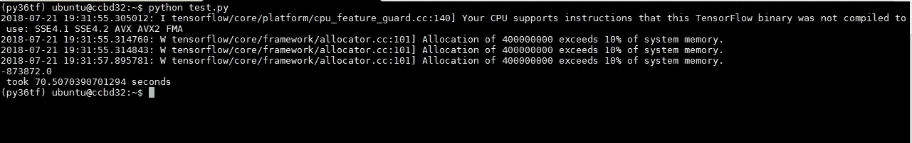
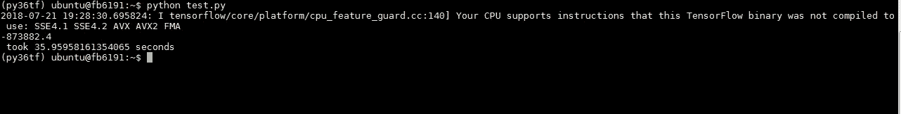
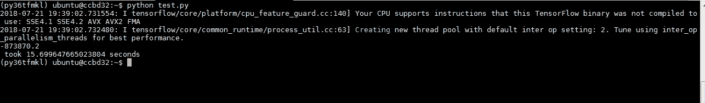
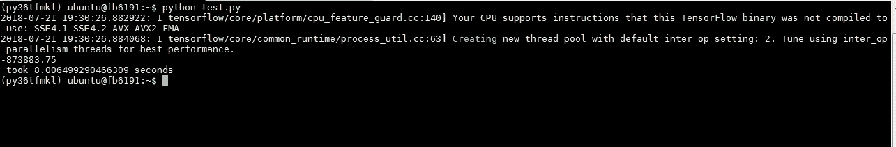
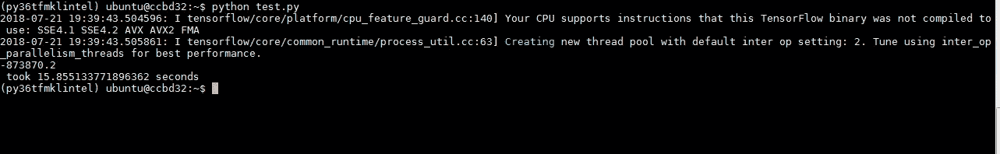
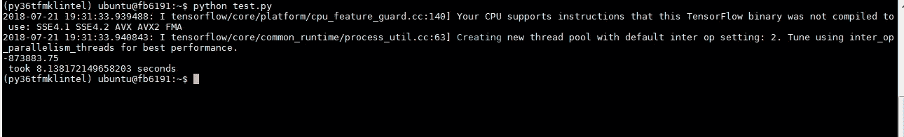

# 为 CPU 优化 TensorFlow

> 原文：<https://medium.com/oracledevs/optimizing-tensorflow-for-cpu-d78308cf8fc8?source=collection_archive---------0----------------------->

几天前，我参加了一个巴西开发者大会。在许多讲座中，有一个关于英特尔架构的讲座非常有趣。

英特尔正在努力通过不同的硬件和软件优化为人工智能项目提供更多性能，如下图所示。英特尔拥有一个针对 CPU 进行了许多优化的 TensorFlow 发行版。


在这篇文章中，我将展示使用不同的 TensorFlow 和 Python 发行版以及 Oracle Cloud 进行测试的结果。

对于此测试，我使用了来自 Oracle Cloud 的 2 个计算实例:

*   实例 1 = 1 个 OCPU + 7，5GB 内存
*   实例 2 = 2 个 OCPUs + 30GB 内存


在这两个计算实例中，我创建了 3 个不同的 Anaconda 环境:

```
conda create -n py36tf tensorflow python=3.6
```

*   Python + TensorFlow-mkl(具有英特尔 MKL DNN 公司的 TensorFlow)

```
conda create -n py36tfmkl tensorflow-mkl python=3.6
```

*   Python(英特尔)+ TensorFlow-mkl(具有英特尔 MKL DNN 的 TensorFlow)

```
conda create -n py36tfmklintel tensorflow-mkl python=3.6 -c intel
```

为了评估 TensorFlow 的性能，我使用了以下 python 脚本:

```
import tensorflow as tf
import time

tf.set_random_seed(42)
A = tf.random_normal([10000,10000])
B = tf.random_normal([10000,10000])

def check():
    start_time = time.time()
    with tf.Session() as sess:
        print(sess.run(tf.reduce_sum(tf.matmul(A,B))))
    print("It took {} seconds".format(time.time() - start_time))

check()
```

结果如下:

在实例 1 中，花费了 70.50 秒。



在实例 2 中，花费了 35.95 秒。



*   Python + TensorFlow-mkl(具有英特尔 MKL DNN 公司的 TensorFlow)

在实例 1 中，花费了 15.69 秒。



在实例 2 中，花费了 8.00 秒。



*   Python(英特尔)+ TensorFlow-mkl(具有英特尔 MKL DNN 的 TensorFlow)

在实例 1 中，花费了 15.85 秒。



在实例 2 中，花费了 8.13 秒。



这两个计算实例中的最佳和最坏情况之间的差异为 450%！

Python + TensorFlow-mkl(具有英特尔 MKL DNN 公司的 TensorFlow)是最好的工具，而 Python + TensorFlow 是最差的工具。

这些结果证明，您可以使用 CPU 来训练和执行机器学习和深度学习项目。你所要做的就是使用正确的工具。

玩得开心！

*原载于 2018 年 7 月 22 日*[](http://waslleysouza.com.br/en/2018/07/optimizing-tensorflow-for-cpu/)**。**