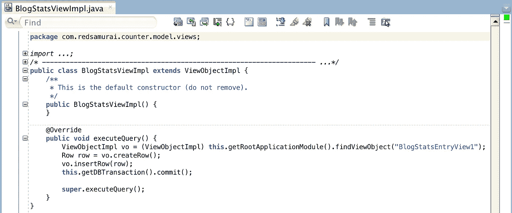

# Oracle ADF BC REST —性能检查和调优

> 原文：<https://medium.com/oracledevs/oracle-adf-bc-rest-performance-review-and-tuning-c3acadecd477?source=collection_archive---------5----------------------->

我想检查 ADF BC REST 的伸缩性和执行速度。因此，我实现了示例 ADF BC REST 应用程序，并对其执行了 JMeter 压力负载测试。您可以在我的 [GitHub](https://github.com/abaranovskis-redsamurai/blogvisitcounter) 存储库中访问应用程序和 JMeter 脚本的源代码。该应用程序被称为博客访客计数应用程序是有原因的——我使用同一个应用程序来计算博客访客。这意味着每次您访问博客页面时，ADF BC REST 服务都会在后台触发，并记录带有时间戳的计数器值(无个人数据)。

应用程序结构很简单— ADF BC REST 实现:

当访问 REST 服务(执行 GET 请求)时，它会在后台创建并提交新行(这就是我喜欢 ADF BC REST 的原因——您在后端拥有强大的功能和灵活性),然后返回记录的总行数:

新行被赋予来自数据库序列的计数器值以及时间戳。这两个值都是用 Groovy 计算的。ADF BC REST 的另一个好处是，除了用 Java 编写逻辑之外——可以用 Groovy 编写脚本——这使得代码更简单:

就这样— ADF BC REST 服务准备好运行了。你可能想知道，我是如何从博客页面访问它的。ADF BC REST 服务和其他 REST 一样，可以通过 HTTP 请求调用。在这个特殊的例子中，我在客户端通过 JavaScript 中的 Ajax 调用来调用 GET 操作。该脚本上传到 blogger HTML:

**表演**

我使用 JMeter 来执行性能测试。在下面的例子中，REST GET 请求在无限循环中被 100 个并发线程调用。这会产生恒定的负载，并允许测量 ADF BC REST 应用程序在这种负载下的性能:

ADF BC REST 的伸缩性很好，在 100 个并发线程中，它请求处理的时间只有 0.1-0.2 秒。如果我们将其与 ADF UI 请求处理时间进行比较，它会快 10 倍左右。这是意料之中的，因为在 ADF BC REST 请求期间不使用 JSF 和 ADF Faces UI 类。100 个线程的性能测试统计信息，请参阅平均记录时间(毫秒):

**调谐**

1.引用的池大小和应用模块池 ADF BC REST 执行请求是无状态模式，REST 自然是无状态的。我想检查一下，这对应用程序模块调优参数意味着什么。据我观察，更改引用的池大小值不会影响应用程序的性能，它对 0 或任何其他值都同样有效。引用的池大小参数对于 ADF BC REST 运行时不重要:

应用程序在负载下运行良好，没有记录钝化/激活，即使引用的池大小设置为零。

然而，我发现保持启用应用程序模块池仍然很重要。如果你关闭它，钝化将开始出现，这将消耗处理能力，是非常不可取的。因此，保持启用应用程序模块池= ON。

2.释放时断开应用模块

将 Disconnect Application Module onrelease 设置为 on 非常重要(了解更多信息— [ADF BC Tuning with Do 连接池和 TXN 断开级别](http://andrejusb.blogspot.lt/2011/10/adf-bc-tuning-with-do-connection.html))。这将确保始终有接近零 DB 的连接保持打开:

否则，如果我们保持释放时断开应用模块= OFF:

数据库连接不会立即释放:

这总结了与 ADF BC REST 调优相关的要点。

*原载于 2018 年 5 月 27 日*[*【andrejusb.blogspot.com*](https://andrejusb.blogspot.lt/2018/05/oracle-adf-bc-rest-performance-review.html)*。*