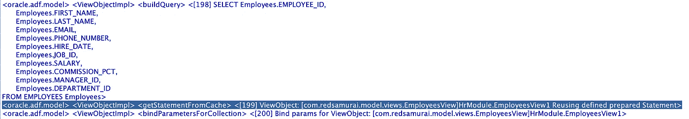
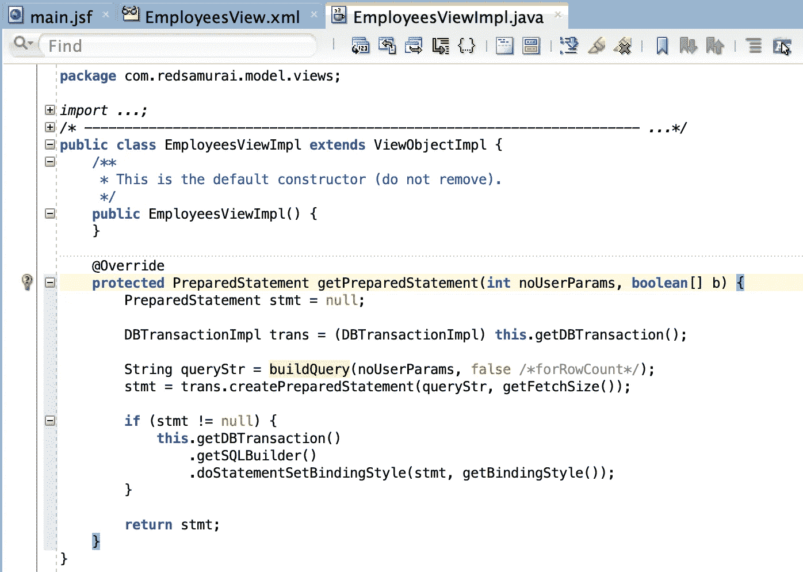
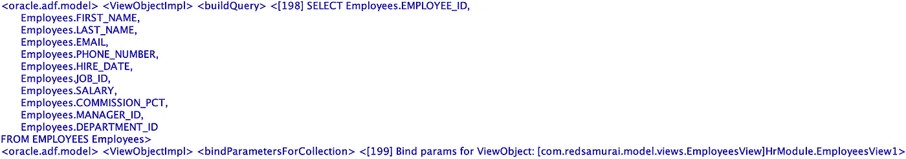

# Oracle ADF BC 重用语句高速缓存中的 SQL

> 原文：<https://medium.com/oracledevs/oracle-adf-bc-reusing-sql-from-statement-cache-1a23b557e49e?source=collection_archive---------0----------------------->

默认情况下，Oracle ADF BC 会尝试重用语句高速缓存中准备好的 SQL 查询。当 ADF BC 在关闭数据库池的情况下运行(jbo.doconnectionpooling=false)时，它以这种方式工作。通常，我们会将 ADF 应用程序调优为在数据库池打开的情况下运行(jbo.doconnectionpooling=true)，这允许在请求完成时将未使用的数据库连接释放回池中(在这种情况下，无论如何都不会使用语句缓存)。如果在同一请求中多次重新执行视图对象，在这种情况下，它也会使用语句缓存。

但是，在某些情况下，对于特定的视图对象，您可能希望关闭语句高速缓存的使用。这可能有多种原因——例如，在它试图对从语句缓存中获得的语句执行 SQL 后，您得到了 *Closed Statement* 错误。通常你可以使用语句缓存，但是正如我所说的——有一些特殊的情况。

我们很幸运，因为有一种方法可以覆盖语句缓存的使用行为。这可以在特定视图对象的视图对象实现类中完成，也可以在通用类中完成。

执行视图对象后，检查日志。如果这不是第一次执行，您将看到日志消息“重用已定义的预准备语句”。这意味着将从语句缓存中重用 SQL:

若要控制此行为，请重写 getPreparedStatement 方法:

我们在这个方法中创建新的预处理语句，而不是重用缓存中的语句。

因此，每次执行视图对象时，都不会使用语句缓存:

从 [GitHub](https://github.com/abaranovskis-redsamurai/PreparedStatementApp) repo 下载示例应用程序。

*原载于 2019 年 1 月 19 日*[*andrejusb.blogspot.com*](https://andrejusb.blogspot.com/2019/01/oracle-adf-bc-reusing-sql-from.html)*。*