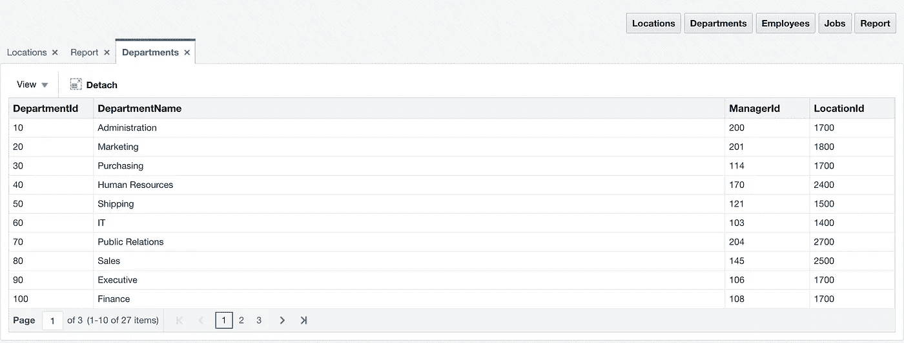
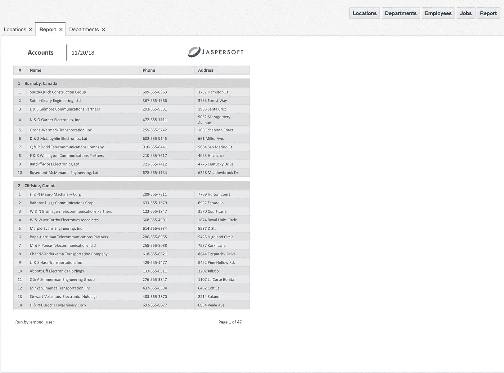
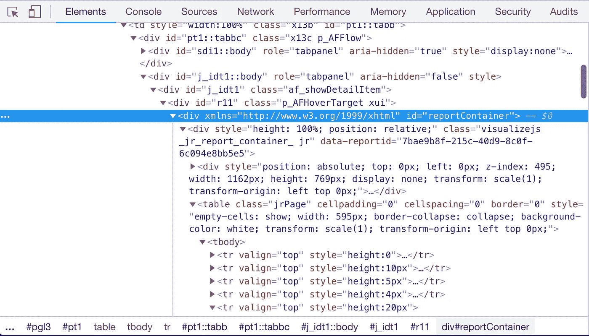
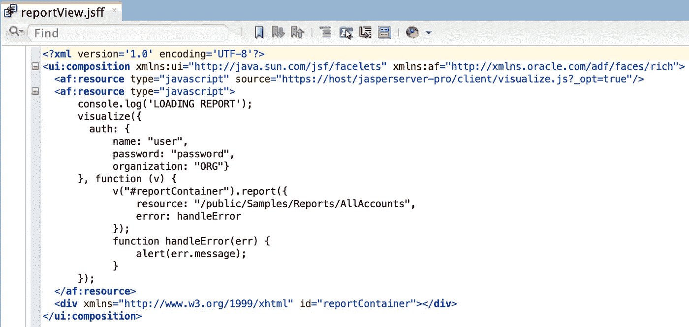

# Oracle ADF+Jasper visualize . js = Awesome

> 原文：<https://medium.com/oracledevs/oracle-adf-jasper-visualize-js-awesome-4ee0e83f6c40?source=collection_archive---------1----------------------->

这个星期，我一直致力于将 Jasper Visualize.js 集成到 Oracle ADF 应用程序 JSF 页面片段中。我必须说集成是成功的，在 Visualize.js 的帮助下，Jasper report 在 Oracle ADF 屏幕中呈现得非常好。Visualize.js 的伟大之处在于，它通过客户端 HTML/JS 在 ADF 页面中呈现报告，没有 iFrame。报告 HTML 结构包含在 ADF 生成的 HTML 中，这允许使用 CSS 来控制报告大小并使其具有响应性。

为了证明集成，我使用了具有多个区域的 ADF 应用程序— [ADF 多任务流绑定和 Tab 键顺序](http://andrejusb.blogspot.com/2017/04/adf-multi-task-flow-binding-and-tab.html)。每个区域都加载了 ADF 面选项卡:

其中一个选项卡显示带有 Jasper 报告的区域，用 Visualize.js 呈现:

检查客户端生成的代码。您应该在 ADF 生成的 HTML 结构中看到 Visualize.js 中的 HTML:

在 Oracle ADF 中用 Visualize.js 渲染 Jasper 报表很简单。将 JS 资源引用添加到 Visualize.js 库中，定义要呈现报告的 DIV。添加 Visualize.js 函数，从特定路径呈现报表等。：

样本代码可以在我的 [GitHub](https://github.com/abaranovskis-redsamurai/MultiTaskFlowAppADFJasper) repo 上找到。

*原载于 2018 年 11 月 25 日*[*andrejusb.blogspot.com*](https://andrejusb.blogspot.com/2018/11/oracle-adf-jasper-visualizejs-awesome.html)*。*