# Oracle 分析云—产生日期值的数据流和可视化时间相关数据的时间线

> 原文：<https://medium.com/oracledevs/oracle-analytics-cloud-data-flow-to-produce-a-date-value-and-timeline-to-visualize-the-time-3e089ea03f4d?source=collection_archive---------0----------------------->

在关于 Oracle Analytics Cloud 的两篇早期文章中，我介绍了 Oracle OpenWorld 2018 会议目录数据集([Oracle Analytics Cloud 的第一步—收集、探索、争论、可视化](https://technology.amis.nl/2019/01/24/first-steps-with-oracle-analytics-cloud-gather-explore-wrangle-visualize/)和[在 Oracle Analytics Cloud 中创建数据流，通过地理编码丰富地图数据的可视化](https://technology.amis.nl/2019/01/26/creating-a-data-flow-in-oracle-analytics-cloud-to-enriching-with-geo-encoding-to-map-visualization-of-data/))。一套超过 2000 个会议记录，描述甲骨文全球大会 2013 和 CodeOne 2018 上的演示。每节课都有一个标题，一个持续时间，与一个或多个曲目相关联，有一定的级别，在特定的房间进行，并安排在特定的日期和时间。在之前的文章中，我已经可视化了其中的一些特性，比如在旧金山市中心的地图上可视化的会议的地理分布。

在本文中，我将研究这个数据集的一些日期和时间方面。我想找出一天中以及一周中最繁忙的时间——根据并发会话的数量。我想了解 CodeOne 的晚间会议，并希望随着本周的展开提供一份活动时间表。

# 用会话日期和时间戳丰富数据集

要显示时间线，记录需要时间戳。然而，他们没有。这些会话有一个日列，值为星期一、星期二等。我们知道甲骨文全球大会 2018 从 10 月 21 日(周日)持续到 10 月 25 日(周四)。

因此，我们知道如何将*日*转换为*真实会话日期*。

至少有三种方法可以获得可视化的新值:

*   在“可视化”选项卡上添加计算

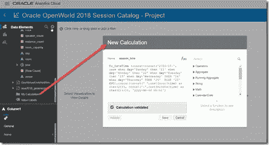

*   在数据集的数据准备选项卡中添加步骤(和新列)

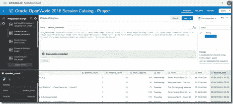

*   在数据流中添加一个步骤，并在目标数据集中创建一个新列

对我来说，最后一个选项似乎是最健壮的——我对其他两个方法有一些例外——所以我将应用这一个。

打开数据流 GeoVenueEnrichSessions——这也为所有会话添加了地点和地理坐标。添加步骤添加列。

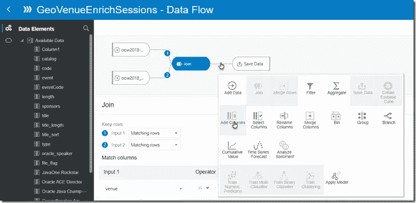

配置这个步骤:新列名为 *session_date* ，它将包含会话的日期。该值由字符串组成，随后使用 To_DateTime 函数将其转换为实际日期属性:

to _ DateTime(concat(concat(' 2018–10-'，case when day = ' Sunday ' THEN ' 21 ' when day = '周一' then '22' when day= '周二' then '23' when day= '周三' THEN '24' when day= '周四' THEN '25' ELSE '25' END)，concat(concat(')，cast(hour(time) as char(2))，concat(:'，cast(minute(time) as char(2))))，'

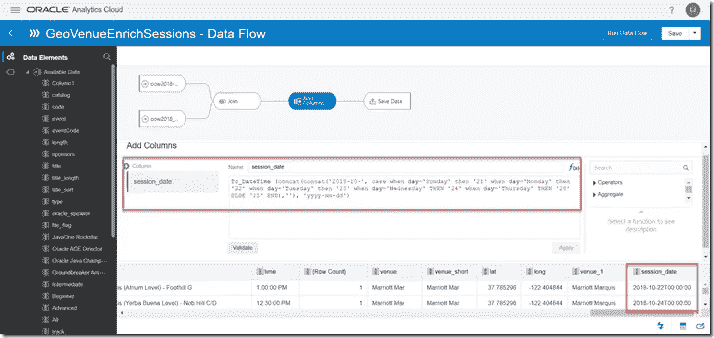

按保存并运行数据流。这将把 session_date 列添加到数据集中，并计算每个会话的值。

# 显示一周内每个事件每天的会议次数的时间线

使用全新的 session_date 数据元素，我现在可以创建一个时间线。Session_date 是时间线的类别元素。将 Event 和 Row_Count 添加到图片中。现在我可以很容易地说出 10 月 24 日有多少场 CodeOne 会议:116 场会议。

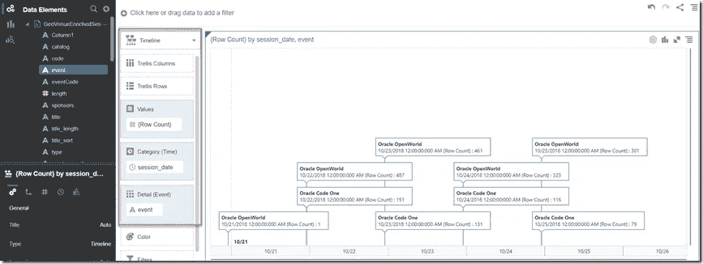

# 全天会话

使用数据集中时间数据元素的小时部分，我可以很容易地知道一天中会话的开始时间。高峰期是上午 11 点至下午 1 点，晚上也有不少时段:

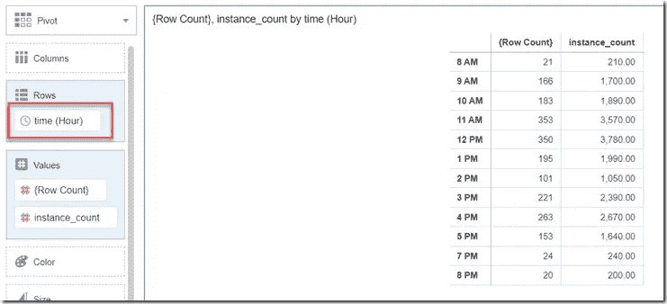

我在处理会话时间数据元素的分钟部分时遇到了问题。我决定坚持使用小时组件，而不是试图解决这个问题。我想给每个会话添加一个 session_time 属性，指示会话开始的小时[槽]。

在这种情况下，我将通过简单地添加一个计算，在 visualization 选项卡中添加 *session_time* 。我用过的表达方式:

timestampad(SQL _ TSI _ hour，(hour(time))，session_date)

(这采用了 session _ date——它的时间部分是日期的午夜——并向该时间戳添加与时间属性的小时部分的值一样多的小时

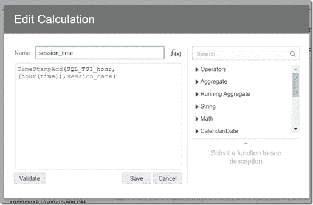

使用 session_time 时间戳，我可以创建一个时间线，显示每天每小时有多少个会话在该小时启动:

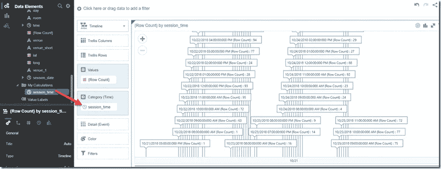

# 带过滤的时间线

这里，我在时间线上添加了一个会话类型过滤器。这导致了一个简单的洞察力，在什么时候发生一丘之貉和点燃会议:在晚上。周一和周二。我对这个发现有一种特殊的感觉:我在周一晚上和周二晚上都做了报告。有一次，有两个观众(是的，是两个)——其中一个大部分时间都在睡觉…

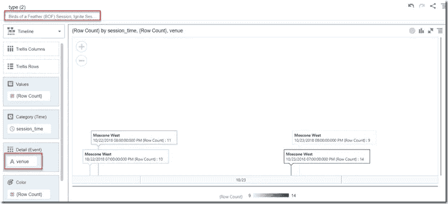

# 全天和一周的会议次数热图

这张热图显示了我的目标—单元格的蓝色越深，会话数越高:

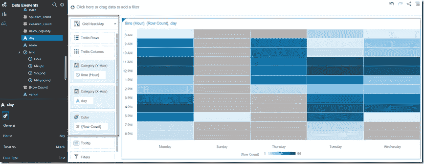

一周中最忙的时间是:

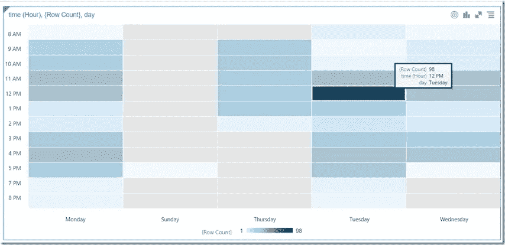

星期二，中午 12 点——在这一个小时的时间段里开始了 98 场会议。还有午餐。

# 一天中的部分时间—上午、下午、晚上

在数据流中，使用下面的 case 表达式创建一个名为 session_day_part 的新列，该表达式将行分成三组:*上午、下午和晚上*。

> *格当小时(时间)< 12 然后‘上午’当小时(时间)> 17 然后‘晚上’否则‘下午’结束*

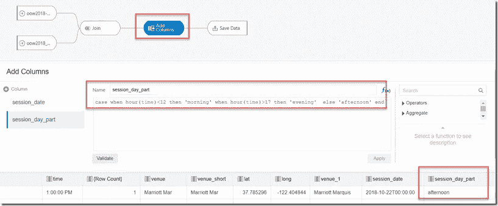

按“保存并运行数据流”以修改数据流并创建新列。

两种快速可视化方法——显示上午、下午和晚上的会议次数:

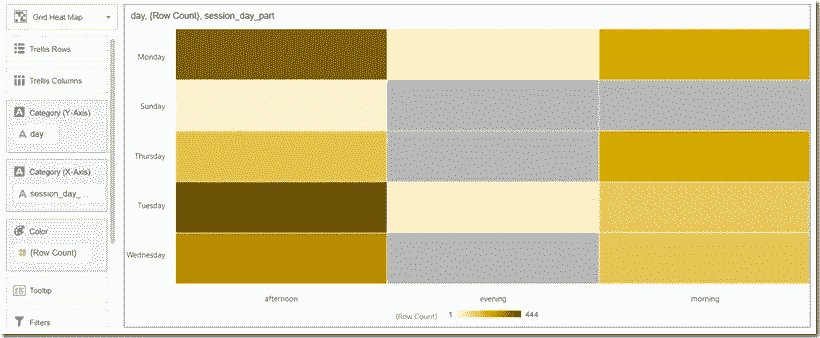

和

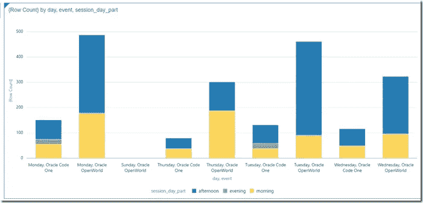

显然下午最忙，星期一是最忙的一天。

*原载于 2019 年 1 月 29 日*[*technology . amis . nl*](https://technology.amis.nl/2019/01/29/oracle-analytics-cloud-data-flow-to-produce-a-date-value-and-timeline-to-visualize-the-time-related-data/)*。*