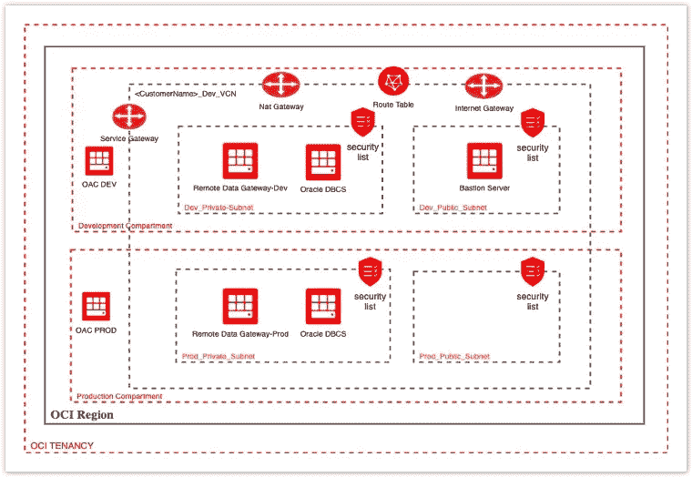
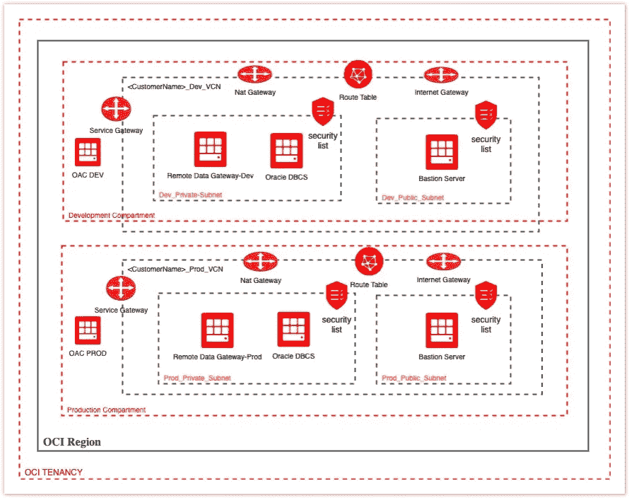

# Oracle 分析云迁移— OCI 自动化部署流程

> 原文：<https://medium.com/oracledevs/oracle-analytics-cloud-migration-oci-automated-deployment-process-3b949b8b5673?source=collection_archive---------4----------------------->

目前没有任何自动化工具用于 OAC 部署，这意味着为了设置两个 OAC 实例，在两个实例上都需要手动步骤。例如，如果我们需要在两个 OAC 实例上设置远程数据网关，那么需要为每个实例执行以下手动任务。

1.  为 OAC 提供所有要求的尺寸和形状参数。
2.  从 Oracle OAC 网站下载远程数据网关(RDG)安装程序
3.  RDG Linux 计算机的 FTP RDG 设置。
4.  在 RDG Linux 计算机上安装显示器或创建响应文件来安装远程数据网关
5.  执行 RDG 设置并安装远程数据网关。

但是，有一个解决方案可以自动执行这些步骤，并使用基于 Terraform 的自动部署流程在 OCI 的 OAC 和 RDG 部署，这将在 OCI 部署多个 OAC-RDG 环境，而无需执行上述手动步骤，并且您可以使用此工具在将来创建和删除更多 OAC 环境。这不仅可以通过部署 Terraform 脚本来处理手动步骤，还可以根据需要一致地部署额外的 OAC 实例。

自动部署脚本将执行以下任务

1.  OCI 网络资源为多个环境设置，目前此部署过程可以配置两个 OAC 环境，无需任何调整，让我们使用非生产和生产作为整个博客的环境名称。
2.  部署流程可以根据执行过程中提供的输入，使用单个 VCN 或专用 VCN 创建两个环境。
3.  将使用给定的配置预配 Oracle 数据库。
4.  将使用提供的配置来预配 OAC 实例。
5.  预安装的远程数据网关计算实例将从自定义映像进行配置。
6.  将设置堡垒主机来访问私有子网资源，例如 DBCS、RDG 计算。
7.  将配置所有路由规则和安全列表，以便环境可以用于迁移。

***支持 OAC 架构***

这个部署过程可以创建单个 VCN 架构或多个 VCN 架构。

单一 VCN 建筑

*用例* —客户希望在同一个 VCN 下设置所有环境，例如非生产环境和生产环境，因此希望在 OCI 和他的数据中心之间设置一个 VPN。

*特性*

1.  生产和非生产这两个部分在逻辑上将非生产和生产环境分开。
2.  网络组件将在网络隔离专区中提供。
3.  两种环境使用一个 VCN(因此需要一个 VPN)。
4.  通用网关，例如适用于两种环境的互联网网关、服务网关和 Nat 网关。
5.  针对非生产和生产环境的两组公共和私有子网。
6.  DBCS 和 RDG 计算机将安装在专用子网中。
7.  将在公共子网中设置一台堡垒主机来访问这两种环境。
8.  OAC 将配备公共端点。

多重 VCN 架构

*使用案例* —客户希望在两个不同的虚拟专用网络下设置所有环境，例如非生产环境和生产环境，因此希望在 OCI 和他的数据中心之间为非生产环境和生产环境提供单独的 VPN。

*特色*

1.  生产和非生产这两个部分在逻辑上将非生产和生产环境分开。
2.  网络组件将在网络隔离专区中提供。
3.  两种环境使用不同的虚拟专用网(因此需要单独的虚拟专用网)。
4.  用于两种环境的独立网关，例如互联网网关、服务网关和 Nat 网关。
5.  一组公共和私有子网，用于非生产 VCN 中的非生产环境。
6.  生产 VCN 中生产环境的一组公共和私有子网。
7.  DBCS 和 RDG 计算机将安装在专用子网中。
8.  对于每个环境，将在各自的公共子网中设置两台独立的堡垒主机。
9.  OAC 将配备公共端点。

*单个 VCN 建筑 VS 多个 VCN 建筑*

***部署流程构件***

*   Variable.tf — Terraform 变量文件包含所有变量定义。
*   Config.tf — Terraform 配置文件包含所有变量值，变量分为不同的类别，例如 VCN、子网、DBCS 等。并且不言自明。
*   Non product main . TF—用于非生产环境的 Terraform 资源文件，该文件将设置所有网络资源(包括 VCN)并供应所有 PaaS 组件(数据库、OAC、RDG、堡垒)。
*   ProdMain.tf — Terraform 资源文件生产环境，将设置所有网络资源并供应所有 PaaS 组件(数据库、OAC、RDG、堡垒)。它可以根据用户在配置文件中提供的输入设置新的 VCN 或现有的非生产 VCN。

***如何使用此部署流程***

先决条件 Terraform 应安装在您计划执行此流程的计算机上。

部署非生产环境

1.  在您的机器上创建一个安装 Terraform 的目录。
2.  复制目录中的 Variable.tf、Config.tf 和 NonProdMain.tf 文件，如果不想在同一次运行中部署生产环境，请不要复制 ProdMain.tf。
3.  在 Config.tf 中为提供程序、VCN、子网和传递组件提供所有值，您可以将以下这些参数设置为 Null，这是生产环境所必需的。

> vcn_prod_cidr= " "
> 
> subnet_prod_pub_cidr= " "
> 
> subnet_prod_pvt_cidr= " "

4.将 Resource_suffix_dev 设置为“dev”、“Test”，因为这将用于所有资源名称，例如 Dev_Public_Subnet。

5.执行“terraform plan -var-file='config。

6.执行" terra form apply-var-file = ' config . TF vars ' "

输出:将为非生产环境部署所有网络资源 VCN、互联网网关、服务网关、Nat 网关、子网、路由表、安全列表和所有 PaaS 组件 DBCS、OAC、RDG 主机和 Bastion 主机。

部署生产环境

1.  将 ProdMain.tf 复制到为非生产环境创建的同一目录中。
2.  按照以下说明设置 Config.tf 中的值。

a.例如，如果您想为生产环境创建单独的 VCN，请设置 VCN 生产 CIDR 和 VCN 生产 DNS 的值

vcn_prod_cidr= "192.168.5.0/24 "

subnet _ prod _ pub _ CIDR = " 192 . 168 . 5 . 0/25 "

子网 _ 生产 _pvt_cidr= "192.168.5.128/25 "

vcn_prod_dns_prefix="abcprod "

b.如果要使用为非生产环境创建的相同 VCN，请将 VCN 生产 CIDR 和 VCN 生产 DNS 的值设置为空白(在这种情况下，生产环境的新子网将在相同的 VCN 下创建)

vcn_prod_cidr= " "

vcn_prod_dns_prefix= " "

c.为生产 Paas 组件设置这些参数的值。

#DBCS

数据库 _ 形状 _ 生产= "虚拟机。标准 2.2 英寸

数据库存储产品= "1024 "

#OAC

oac_capacity_value_prod= 2

#RDG

rdg_compute_shape_prod = "VM。标准 2.2 英寸

3.执行“terraform plan -var-file='config。

4.执行" terra form apply-var-file = ' config . TF vars ' "

输出:将为生产环境部署所有网络资源 VCN、互联网网关、服务网关、Nat 网关(如果选择单独的 VCN)、子网、路由表、安全列表和所有 PaaS 组件 DBCS、OAC、RDG 主机和 Bastion 主机。

***部署脚本***

您可以从这个 GitHub 存储库中下载部署过程工件。

【https://github.com/amittyagi27/MYBLOGS.git 

***远程数据网关自定义图像***

" ocid 1 . image . oc1 . IAD . aaaaaaaaaxmiypt 6 gkxvgxc 52 c 7 pbv 3 at 2 yyco j2o QL 42 ucwk 2d 4 ozuxzkqsq "

***OAC 远程数据网关文档***

有关 OAC 远程数据网关的更多详细信息，您可以通过以下链接查看 Oracle 文档。

[***https://docs . Oracle . com/en/cloud/PAAs/analytics-cloud/acsds/connect-premise-data-sources . html # GUID-7d 4a 2 a9 f-1E6A-4f 93-81d 3-00a 272398 d5c***](https://docs.oracle.com/en/cloud/paas/analytics-cloud/acsds/connect-premise-data-sources.html#GUID-7D4A2A9F-1E6A-4F93-81D3-00A272398D5C)