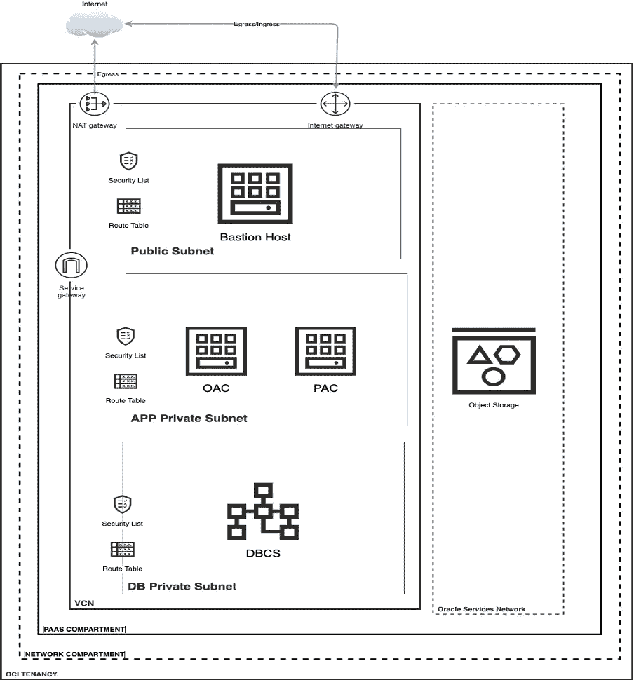

# 具有私有访问通道的 Oracle 分析云— OCI 自动化部署流程

> 原文：<https://medium.com/oracledevs/oracle-analytics-cloud-with-private-access-channel-oci-automated-deployment-process-de7434e02d00?source=collection_archive---------4----------------------->

racle 最近发布了带有私人访问频道(PAC)的 OAC。PAC 用于连接 OAC 和私有数据源，例如托管在私有网络(如 OCI 私有子网、内部企业网络和其他云)中的数据库。

目前，没有任何自动化工具可用于在 OCI 部署 OAC，这意味着要设置 OAC 实例，需要手动步骤。但是，有一个解决方案可以自动执行这些步骤，并使用基于 Terraform 的自动部署流程在 OAC(私有)和 OCI 部署 PAC，您可以使用此工具在将来创建和删除越来越多的 OAC 环境。这不仅可以通过部署 Terraform 脚本来处理手动步骤，还可以根据需要一致地部署额外的 OAC 实例。

自动部署工具将执行以下任务。

1.OAC PE(专用端点)环境的 OCI 网络资源设置。

2.部署过程将创建一个 VCN、一个用于堡垒主机的公共子网和两个用于数据库和 OAC 的单独的私有子网。

3.将使用给定的配置预配 Oracle 数据库。

4.具有专用访问通道的 OAC 实例将被提供所提供的配置。

5.PAC 出口 IP 将在数据库专用子网的安全列表中配置。

6.将设置堡垒主机来访问 DBCS 和 OAC 等地的专用子网资源。

7.将配置所有路由规则和安全列表，以便环境可以用于迁移。

O**交流架构 **

OAC(Private Endpoint) Architecture in OCI

F特性

1.PaaS 和网络的两个独立部分将在逻辑上分离 PaaS 资源和网络资源。

2.一个 VCN 在配置文件中提供了 CIDR。

3.所有必需的网关，例如互联网网关、服务网关和 Nat 网关。

4.一个公共子网用于 Bastion 主机(以及其他具有公共端点的 PaaS 资源)。

5.一个专用子网用于数据源，如 DBCS。

6.OAC 等应用程序的一个专用子网。

7.一台 Bastion 主机将设置在公共子网中，以访问 DB 私有子网和 App 私有子网中的资源，例如本例中的 DBCS 和 OAC。

8.将为 OAC 配置专用端点。

D***e deploy 工件***

Variable . TF-terra form 变量文件包含所有变量定义。

Config.tf — Terraform 配置文件包含所有变量值，变量分为不同的类别，例如 VCN、子网、DBCS 等。并且不言自明。

deployment . TF—OIC 环境的 Terraform 资源文件，该文件将设置所有网络资源(包括 VCN)并供应所有 PaaS 组件(数据库、OAC、RDG、堡垒)。

H**如何使用这个部署流程 **

先决条件 Terraform 应安装在您计划执行此流程的计算机上。

*部署 OAC 环境*

1.在您的机器上创建一个安装 Terraform 的目录。

2.复制目录中的 Variable.tf、Config.tf 和 Deployment.tf 文件。

3.在 Config.tf 中为提供商、VCN、子网和 PaaS 提供所有值。

4.将 Resource_suffix_dev 设置为“dev”、“Test”，因为这将用于所有资源名称，例如 Dev_Public_Subnet。

5.执行“terra form plan-var-file = config . TF vars”

6.执行“terra form apply-var-file = config . TF vars”

输出:将为非生产环境部署所有网络资源 VCN、互联网网关、服务网关、Nat 网关、子网、路由表、安全列表和所有 PaaS 组件 DBCS、OAC、PAC 和 Bastion 主机。

DT10*部署脚本*

您可以从这个 GitHub 存储库中下载部署过程工件。

(config.sh 中提到的值只是示例)

[https://github.com/amittyagi27/OAC-PAC.git](https://github.com/amittyagi27/OAC-PAC.git)