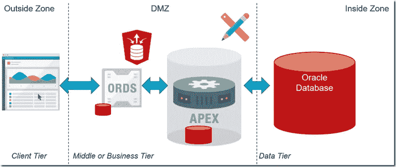
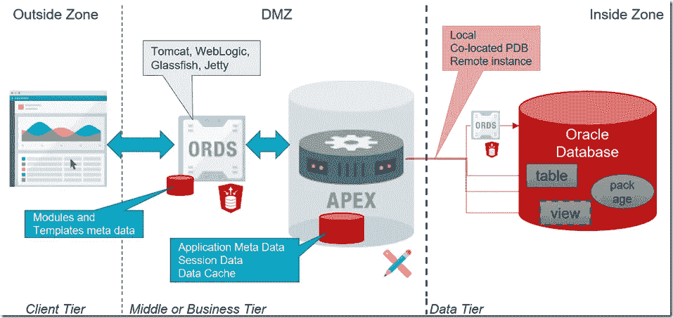
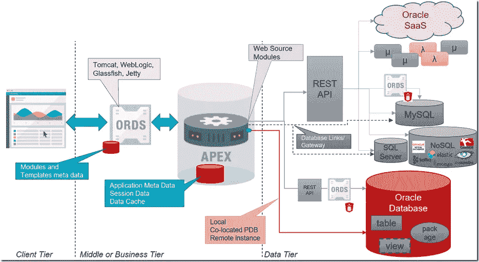
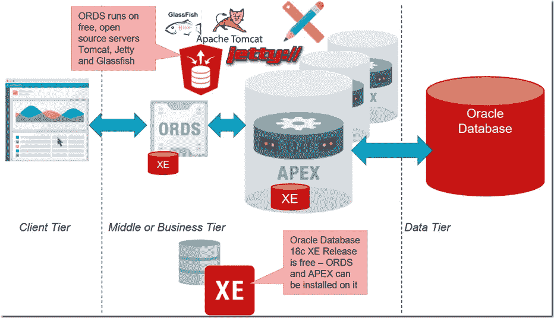

# Oracle APEX:低代码和低成本的应用程序中间层

> 原文：<https://medium.com/oracledevs/oracle-apex-the-low-code-and-low-cost-application-middle-tier-f37d80b1e7bf?source=collection_archive---------0----------------------->

Oracle APEX 是一个低代码应用程序开发框架。它可以免费使用，可以作为现有 Oracle 数据库许可证的一部分，也可以在免费的 Oracle Database 18c XE 产品中运行。Oracle APEX 应用程序应被视为三层应用程序，由客户端层(浏览器)、中间层(APEX 应用程序引擎)和数据层(各种系统和数据存储之上的后端数据库和 REST APIs)组成。

最常见的 APEX 应用程序方法的多层架构的可视化方法如下:

最终用户在浏览器中使用该应用程序。从该浏览器向 ORDS (Oracle REST 数据服务)侦听器发出 HTTP 请求，该侦听器运行在 DMZ 中的 web 服务器上。对 APEX 应用程序引擎的请求被传递给组成该引擎的 PL/SQL 程序包。APEX 应用程序引擎在 Oracle 数据库中运行，该数据库很可能是轻量级的免费 Oracle Database Express 版。

每当为了处理请求而必须检索数据时，或者当用户操作导致数据被操作时，APEX 中间层就会联系后端系统。这通常是 Oracle 数据库，但也不一定是。

下图让 Oracle 数据库的角色更加清晰。实现 APEX 应用程序引擎和 Oracle 数据库(包含在 APEX 应用程序中显示和操作的业务数据)之间的(逻辑)分离非常重要。在大多数 APEX 应用程序中，Oracle 数据库会出现在三个位置。在所有三种情况下，它都可以是同一个 Oracle 数据库实例，但不一定必须是。

ORDS 是一个 REST 服务器，它有自己的元数据来定义“模块”和“模板”。ORDS 的元数据可以存储在任何 Oracle 数据库中(在 ORDS 模式中)，因此它可以是为 APEX 服务的本地数据库或另一个数据库。ORDS 可能能够在没有数据库存储库的情况下工作，只使用 XML 文件进行高度优化的运行时，无需查找元数据(这是当前不支持的功能，尽管该功能在 Oracle 内部使用，例如在 SQL Developer Web 中，但它在路线图中)。

APEX 应用程序引擎有其本地数据库，即 Oracle 数据库实例，其中包含描述应用程序本身的元数据(页面、字段、导航、验证逻辑等)。它还保存相关的会话数据:APEX 是一个无状态引擎；用户会话状态部分保存在客户端，部分保存在 APEX 数据库中。注意:这个会话状态非常小，通常只有几 KB。APEX 数据库还可用作数据缓存，以保留从远程源检索的数据的本地、可快速访问的只读副本。

APEX 应用程序可以访问其自身运行的本地数据库中的业务数据，也可以访问位于同一容器数据库中的 PDB(在共享多租户实例中，您可以使用数据库链接语法——使用 schema . object name @ PDB _ LINK——当 APEX 的 PDB 和业务数据位于同一个根目录时，Oracle 数据库可以透明地重写以数据库链接语法表示的查询，以使用有效的本地 SQL)。它还可以通过数据库链接或通过 ORDS 实例访问另一个 Oracle 数据库中的业务数据，该实例公开了对另一个数据库实例中的包和表的 HTTP 访问。

Oracle 软件开发副总裁 Mike Hichwa 负责 APEX 的其他产品，他对我有很多见解，我在这里解释了其中一些观点:

> *“现在可以通过数据库链接语法从不同 PDB 的 APEX 访问 PDB 中的数据(两个 pdb 位于同一 CDB)。读取访问被优化，但是更新执行分布式事务。PDB 内部的通道正在得到改善和优化。您可能或者将能够使用简化的语法(例如，不使用数据库链接)以及无需两阶段提交/分布式事务的更新。可以使用数据库链接和网关(用于非 Oracle 数据库)，但不推荐用于有大量最终用户的应用程序(因此我个人喜欢用于 ETL 的数据库链接/网关，但不喜欢用于一般 web 应用程序)"*

认为 APEX 只适合基于 Oracle 数据库的低代码应用程序开发*的想法不再正确。通过数据库链接和网关，APEX 长期以来一直能够针对不同数据库中的业务数据运行。借助 Oracle 数据库调用 Web 服务的能力(SOAP 和 REST，例如使用 UTL HTTP 包),在外部数据源上创建 APEX 应用程序也是很有可能的——尽管有点麻烦。随着最近的 APEX 特性 Web Source Module 的出现，它在很大程度上变成了一个声明性的——低代码！—通过远程 REST API 检索或操作数据的操作。*

有了 Web 源模块，任何 REST API 都成为 APEX 应用程序的可行数据源。针对几乎任何后端的低代码应用程序开发成为现实。下图对此进行了描述。在这里，您可以看到 APEX 应用程序如何显示并潜在地创建和更新来自各种类型的数据库(通过 REST APIs 或异构网关)、微服务和无服务器功能以及来自 Oracle SaaS 应用程序的数据。

注意:ORDS 预计将在 2019 年的某个时候支持 MySQL。这将通过生成的 REST API 实现 MySQL 中表的快速、声明性公开。ORDS 还在其 2019 年 roadap 上支持 TimesTen 内存数据库。对于其他数据库——SQL 或 NoSQL——必须开发 REST API。为此，有几种工具和框架可用，当然，现在实现 REST APIs 非常简单。

# APEX 不仅是一个低代码应用程序中间层，它还是一个低成本应用程序中间层

低代码开发是有吸引力的，因为在技术技能和知识上相对低的投资就可以实现高生产率和高质量(健壮性)。可以实现快速上市。如果低代码框架的开箱即用功能可以满足功能需求，那么所有这些都适用。

低代码开发的成本当然也取决于所需的工具和运行时基础设施的成本。有了 APEX，这个成本极低。开发和运行 APEX 应用程序所需的组件是 Oracle 数据库上的 ORDS 和 APEX。ORDS 可以免费使用，并且可以在 Apache Tomcat、Jetty 或 Glassfish 等免费的 web 服务器上运行(注意:[文档](https://docs.oracle.com/en/database/oracle/oracle-rest-data-services/18.3/aelig/installing-REST-data-services.html#GUID-5F7A8DB0-B0D2-48FF-A99B-7ABCA7DFF9DA)确实声明“在未来的版本中将不再支持 GlassFish 服务器”)。用于运行 APEX 的数据库可以是 Oracle Database 18c XE，也是免费的！

而且，如前所述，业务数据可以保存在各种数据存储中——从 Oracle 数据库(任何版本，包括免费的 XE)到 MySQL 或其他开源数据库，无论是 SQL/ACID 还是 NoSQL/BASE。

# APEX —不仅仅是低代码

术语“低级代码”(与公民开发者相关联)是一个标语，可能不太适合仔细检查。软件开发的本质不是编码——就像写程序代码一样。它更多的是关于捕获与功能需求相关的逻辑——以一种结构化的方式，使机器能够执行逻辑。在我的书里，你如何指导机器——用低级代码还是高级代码不相关。低代码框架有助于加速制定机器指令的过程——并通过在其中提供一个用可重用结构和可视化表示创建的框架来提高指令的质量。

低代码平台面临的挑战之一是，用于描述应用程序行为的抽象高级语言可能没有足够的表现力来捕捉业务需求中陈述的所有细微差别。可能需要一个较低层次的编程模型来捕捉细微差别和微妙之处。正如负责 APEX 的甲骨文软件开发总监 Joel Kallman 所说:

> *“APEX 具有从无代码到低代码再到高控制优雅过渡的重要能力。许多客户可以生活在 APEX 的“黑盒子”中，不需要编码。但是每个人都需要定制，而你定制的方式就是用代码。借助 APEX，您可以使用非常少量的代码(我们称之为代码片段)来定制您的应用程序。它可以是 PL/SQL 的片段，也可以是 CSS、HTML 或 JavaScript 的片段。大多数低代码框架突然从无代码转向高控制(或“高代码”)环境，没有中间地带。一旦你进入高级代码，你就失去了除了最专业的开发人员之外的所有人。有了 APEX，这是一个非常优雅和无缝的过渡。对于那些要求高控制(高代码)的人，你仍然可以利用预编译的 PL/SQL 包或 JavaScript 库或完全定制的 HTML 模板&主题。”*

*原载于 2018 年 11 月 1 日*[*technology . amis . nl*](https://technology.amis.nl/2018/11/01/oracle-apex-the-low-code-and-low-cost-application-middle-tier/)*。*