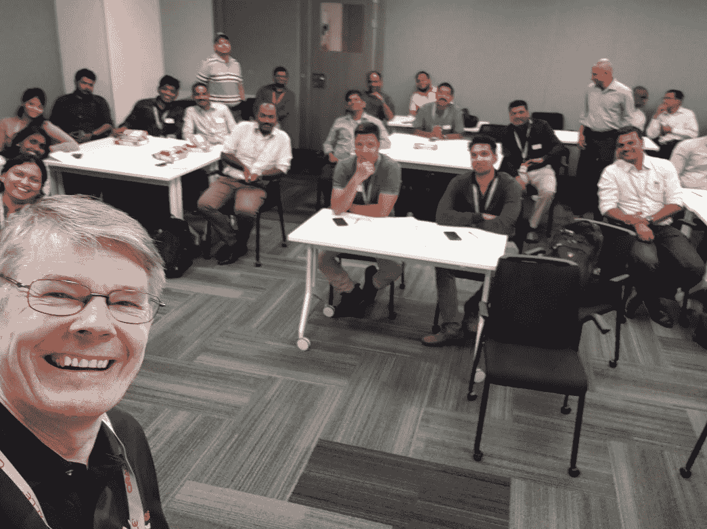
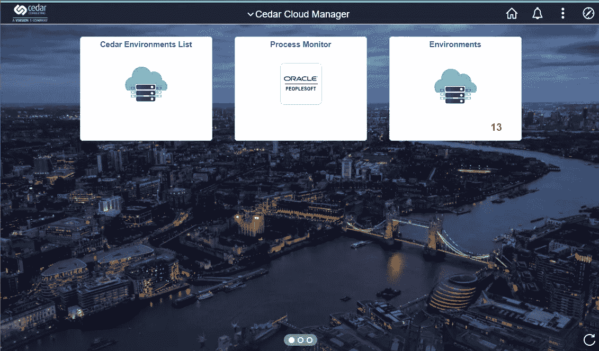
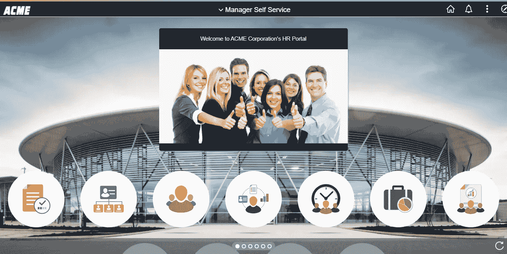
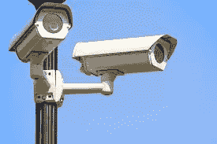
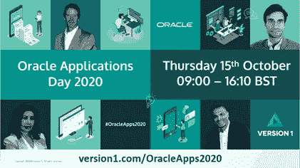

# 2020 年 Oracle 应用日和社区的价值

> 原文：<https://medium.com/version-1/oracle-apps-day-2020-and-the-value-of-community-832a0e6abe47?source=collection_archive---------2----------------------->

Photo by [Ben White](https://unsplash.com/@benwhitephotography?utm_source=medium&utm_medium=referral) on [Unsplash](https://unsplash.com?utm_source=medium&utm_medium=referral)

我认为在这个充满挑战的时代，世界正在学习新的东西。疫情冠状病毒的创伤让我们展现出了最好的一面。在英国，我们支持并赞扬了我们出色的医疗服务人员，我们正在了解不从大街上购物对我们的经济、就业和社会造成的损害，我们正在与我们的邻居建立更牢固的关系，对于一些人来说，我们第一次见到了我们的邻居。为什么我们学到了这么多？我认为这是因为我们都有一些共同点。

我们都在某种程度上受到疫情效应的影响。在艰难时期，与他人分享会带来支持、鼓励、力量和集体智慧。我们已经了解了人际交往的价值——为什么？因为根据封锁条例它不在。对一些人来说，在家工作很好；对其他人来说，它带来了孤立和孤独。 ***这个世界需要知道自己需要别人的人。***

PS Admins at the Oracle PeopleSoft SIG (Bangalore)— Feb 2020

***结识志趣相投的人是我自三月以来在一级防范禁闭的工作中最怀念的事情之一。我错过了与同事、客户，当然还有家人和朋友的会面。今年到目前为止，我已经飞往美国参加年度 PeopleSoft 合作伙伴峰会，前往印度参加 [AIOUG Yatra 会议](https://www.aioug.org/ogyatra)，飞往浦那与我们出色的 Cedar 咨询团队共度时光，并在年度 OpenWorld 大会上与 PeopleSoft 社区会面。我还准备在一年一度的 [**版本 1 Oracle 应用日**](https://www.version1.com/virtual-event-erp-oracle-applications-day-2020/) 与许多 PeopleSoft 用户见面。它可能是在伦敦的某个豪华场所，有豪华的小吃和大量的空间来聊天，分享和了解最新的甲骨文新闻，并谈论增值的仁科创新。***

但是，至少就目前而言，我们将不得不应对虚拟活动，我们的 **Oracle 应用日 2020** 也将是虚拟的。但是，如果您抽出时间参加这次活动，我希望您不仅能学到一些新东西，还能有机会受到 ***的启发和鼓励，利用 PeopleSoft*** 和 Oracle 技术做更多事情，为您的组织创造更多价值。

在这个受欢迎的年度活动之前，让我分享 3 件事:

1。 *事件贴图*相当牛逼。这是我们的一个 Cedar 内部 PeopleSoft 系统的屏幕截图，一些简单的事件映射使品牌添加对它的外观产生了巨大的影响

PeopleSoft Cloud Manager with some simple branding

流畅的主页只是组件。换句话说，它们实际上与 PeopleSoft 的其他页面没什么不同。你知道吗，你看到的那组瓷砖只是页面上的一个格子。如果这是一个网格，那么我们可以用 PeopleCode 来操作它。此外，借助事件映射和自定义主题宏集，我们可以做更多事情。

Fluid tiles on a Fluid Homepage

看看这个。这些仍然是瓷砖。只是风格略有不同。想看更多吗？参加我们下午的会议，主题是**PeopleSoft 品牌创新:为什么用户界面很重要。**

2。自去年甲骨文全球大会以来，我们听到了很多关于 Kibana 的消息。你会听到更多关于 Kibana 能为你的组织创造的价值。你想得到基巴纳来学习和实验吗？您可以使用云管理器。想知道云管家如何入门？与我一起参加**云管理器自动化入门。**

3。安全性一直是我们关注的重中之重。在疫情，数百万人突然不得不离开他们通常的办公地点在家工作。IT 部门不得不快速提高远程工作能力，引入新的 VPN、防火墙、板载新启动器，同时仍然保持企业应用程序和数据的安全。一个好的系统安全方法是多层方法。([点击此处阅读更多内容](https://www.appsian.com/blog/protecting-erp-data-from-application-vulnerabilities/)来自我们值得信赖的合作伙伴之一、PeopleSoft 安全专家 [Appsian](https://www.appsian.com/) )

Who’s watching your PeopleSoft system?

这种安全方法的一个层面是您的 PeopleSoft 应用程序本身，我将与您分享一些帮助保持 PeopleSoft 数据安全的顶级技巧，以及 Appsian 对系统监控的一些见解。

# **2020 年甲骨文应用日**

所有 PeopleSoft 客户都可以[注册参加这项免费活动。](https://www.version1.com/virtual-event-erp-oracle-applications-day-2020/)我们举办 PeopleSoft 应用日已经超过 10 年了，一直很受欢迎。这一次，因为它是虚拟的，你的组织中的任何人都可以参加。 ***希望在那里见到你！***

[https://www.version1.com/virtual-event-erp-oracle-applications-day-2020/](https://www.version1.com/virtual-event-erp-oracle-applications-day-2020/)