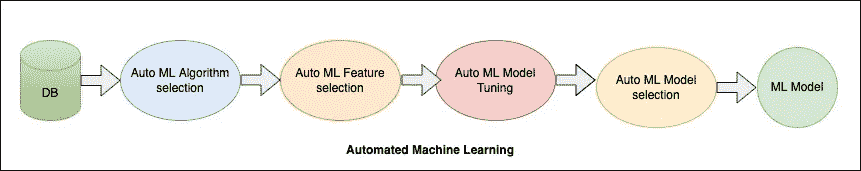
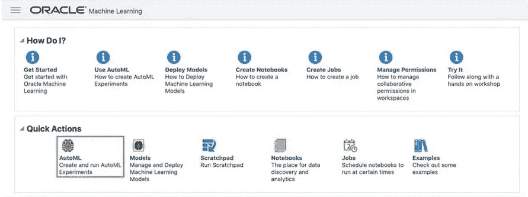
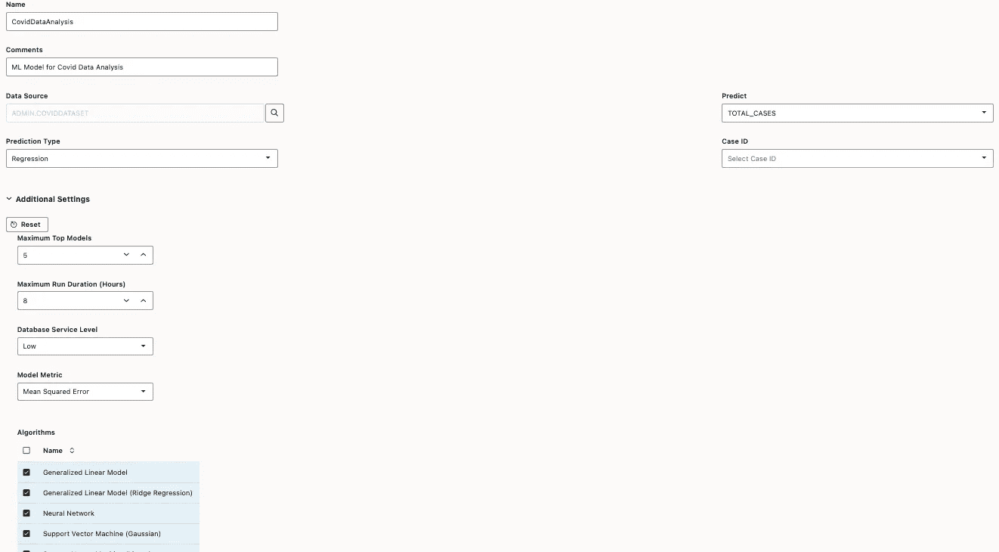
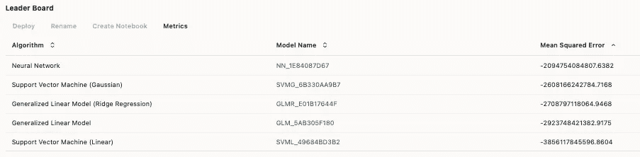
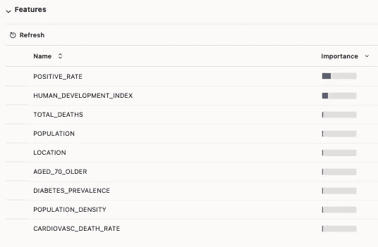

# Oracle 自动机器学习(Auto ML):使用内置的数据科学专业知识来构建和使用有效的机器学习模型

> 原文：<https://medium.com/oracledevs/oracle-automated-machine-learning-auto-ml-use-built-in-data-science-expertise-to-build-and-use-85280288de82?source=collection_archive---------1----------------------->

机器学习是分析的高级版本，因为它帮助组织检查客户行为的趋势，并提供业务运营趋势以帮助决策。实现机器学习需要 ML 工具和技术方面的专业知识。

Oracle Auto ML(自动化机器学习)是 Oracle Machine Learning 的一个关键特性，可帮助非专业数据科学家构建和使用高效的数据模型。Auto ML 由各种预构建的类组成，这些类有助于识别最佳的机器学习算法、适当的特征集和模型超参数。Auto ML 仅支持分类和回归算法。



Oracle Auto ML

# 自动 ML 算法选择

用于算法选择的类是 oml.automl.AlgorithmSelection。此类根据提供的数据集对受支持的 oml 算法集中的算法进行排序。

使用 automl。AlgorithmSelection，根据目标输出和相应的得分度量(例如 r2、f1_macro 等)将挖掘函数作为“分类”或“回归”传递。请参考本[文档](https://docs.oracle.com/en/database/oracle/machine-learning/oml4py/1/mlpug/automated-machine-learning1.html#GUID-9F514C2B-1772-4073-807F-3E829D5D558C)了解二进制分类、多分类和回归的支持指标。

“select”方法返回排名靠前的算法及其预测排名的排序列表。

请参考此示例以获得有关类 automl.AlgorithmSelection 的更多详细信息。

```
#Import libraries
 import oml
 from oml import automl
 from sklearn import linear_model
 import pandas as pd
 import os
```

```
#Connect to Database
 oml.connect(user=’oml_user1', password=’password’, host=’localhost’, port=1521, service_name=’orclpdb', automl=True)
 print(oml.isconnected())
```

```
# Pull data in python object from dB table
 coviddataset=oml.sync(table=’COVIDDATASET’)
 coviddataset=coviddataset.drop(‘ISO_CODE’,)
 coviddataset
```

```
# Split Data in train and test
 train, test = coviddataset.split(ratio=(0.8, 0.2), hash_cols=’REPORTEDDATE’,seed=32)
 x_train, y_train = train.drop(‘TOTAL_CASES’), train[‘TOTAL_CASES’]
 x_test, y_test=test.drop(‘TOTAL_CASES’), test[‘TOTAL_CASES’]
```

```
#AUTOMATED ALGORITHM SELECTION
```

```
# Create an automated algorithm selection object with r2 as the score_metric argument.
 algo= automl.AlgorithmSelection(mining_function=’regression’,
 score_metric=’r2', parallel=4)
```

```
# Run algorithm selection to get the top k predicted algorithms and their ranking without tuning.
 algo_ranking=algo.select(x_train,y_train,k=3)
```

```
# Show the selected and tuned model.
 [(m, “{:.2f}”.format(s)) for m,s in algo_ranking]
```

```
OutPut: [(‘nn’, ‘0.93’), (‘glm_ridge’, ‘0.91’), (‘glm’, ‘0.91’)
```

# 自动 ML 特征选择

用于要素选择的类是 oml.automl.FeatureSelection。该类自动为数据集和模型选择最相关的要素。

要使用 oml.automl.FeatureSelection，请指定挖掘函数“分类”或“回归”,并为 r2、f1_macro 等指标评分。请参考本[文档](https://docs.oracle.com/en/database/oracle/machine-learning/oml4py/1/mlpug/automated-machine-learning1.html#GUID-9F514C2B-1772-4073-807F-3E829D5D558C)检查所有得分指标

使用 reduce 函数并传递数据集和 Oracle 机器学习算法来获取数据集的相关要素子集。

请参考这个例子(继续上面的代码)来获得关于类 oml.automl.FeatureSelection 的更多细节。

```
# AUTOMATED FEATURE SELECTION
```

```
# Calculate model performance before feature selection.
 model = oml.glm(mining_function=’regression’).fit(x_train, y_train)
 score=(model.score(x_test, y_test))
 score
```

```
Output: 0.932823
```

```
# Let’s try Automl feature selection with score_metric coefficient of determination(r2).
 fs = automl.FeatureSelection(mining_function=’regression’, score_metric=’r2', parallel=4)
```

```
# Find the reduced feature subset on the train data set.
 fsubset = fs.reduce(‘glm’, x_train, y_train)
```

```
“{} features reduced to {}”.format(len(x_train.columns),len(fsubset))
```

```
Output: ’27 features reduced to 6'
```

```
# Use the subset to select the features and create a model on the new reduced data set.
 x_train_new = x_train[:,fsubset]
 x_test_new = x_test[:,fsubset]
 model = oml.glm(mining_function=’regression’).fit(x_train_new, y_train)
```

```
score=model.score(x_test_new, y_test)
 “{:.2} with {:.1f}x feature reduction”.format((score), len(x_train.columns)/len(x_train_new.columns))
```

```
Output: ‘0.92 with 4.5x feature reduction’
```

# 自动 ML 模型调整

用于模型调整的类是 oml.automl.ModelTuning。该类调整算法和定型数据集的超参数。

要使用 oml.automl.ModelTuning，请指定数据集和算法，作为输出，您将获得调整后的模型和相应的超参数。

您也可以通过提供定制的超参数搜索空间和评分指标，但更多详情请参考本[文档](https://docs.oracle.com/en/database/oracle/machine-learning/oml4py/1/mlpug/automated-machine-learning1.html#GUID-0F5153CC-39E5-4189-9615-09D8F39D7FBF)。

请参考这个例子(继续上面的代码)来获得关于 oml.automl.ModelTuning 类的更多细节。

```
## MODEL TUNING
```

```
# Start automated model tuning run with a general linear regression.
 at = automl.ModelTuning(mining_function=’regression’, parallel=4)
 results = at.tune(‘glm’, x_train, y_train)
```

```
# Show the tuned model details.
 tuned_model = results[‘best_model’]
 tuned_model
```

```
Output: Algorithm Name: Generalized Linear Model
 Mining Function: REGRESSION
 Target: TOTAL_CASES
 Settings:
 setting name setting value
 0 ALGO_NAME ALGO_GENERALIZED_LINEAR_MODEL
 1 GLMS_CONF_LEVEL .95
 2 GLMS_FTR_GENERATION GLMS_FTR_GENERATION_DISABLE
 3 GLMS_FTR_SELECTION GLMS_FTR_SELECTION_DISABLE
 4 GLMS_NUM_ITERATIONS 30
 5 GLMS_RIDGE_REGRESSION GLMS_RIDGE_REG_DISABLE
 6 GLMS_SOLVER GLMS_SOLVER_CHOL
 7 ODMS_DETAILS ODMS_DISABLE
 8 ODMS_MISSING_VALUE_TREATMENT ODMS_MISSING_VALUE_AUTO
 9 ODMS_SAMPLING ODMS_SAMPLING_DISABLE
 10 PREP_AUTO ON
```

```
# Show the best tuned model train score and the corresponding hyperparameters.
 print(results[‘all_evals’][0])
 score, params = results[‘all_evals’][0]
 “{:.2}”.format(score), [“{}:{}”.format(k, params[k]) for k in sorted(params)]
```

```
Output: (0.92, {‘GLMS_NUM_ITERATIONS’: 30, ‘GLMS_SOLVER’: ‘GLMS_SOLVER_CHOL’})
```

```
# Use the tuned model to get the score on the test set.
 “{:.2}”.format(tuned_model.score(x_test, y_test))
```

```
Output: 0.94
```

# 自动 ML 模型选择

用于模型选择的类是 oml.automl.ModelSelection。该类根据给定的分数度量自动选择 Oracle 机器学习算法，然后调整该算法。

要使用 ml.automl.ModelSelection，只需传递数据集和要优化的算法数量。

使用 select 方法从所有分析的模型中获得最佳模型。

请参考此示例以获得有关 oml.automl.ModelSelection 类的更多详细信息。

```
# MODEL SELECTION
```

```
# Create an automated model selection object with r2 as the score metric.
 modelsel = automl.ModelSelection(mining_function=’regression’, score_metric=’r2', parallel=4)
```

```
# Run model selection to get the top (k=1) predicted algorithm (defaults to the tuned model).
 selectmodel = modelsel.select(x_train, y_train, k=1)
```

```
# Show the selected and tuned model.
 selectmodel
```

```
Output: Algorithm Name: Neural Network
 Mining Function: REGRESSION
 Target: TOTAL_CASES
 Settings:
 setting name setting value 
 0 ALGO_NAME ALGO_NEURAL_NETWORK
 1 LBFGS_GRADIENT_TOLERANCE .000000001 
 2 LBFGS_HISTORY_DEPTH 20 
 3 LBFGS_SCALE_HESSIAN LBFGS_SCALE_HESSIAN_ENABLE 
 4 NNET_ACTIVATIONS ‘NNET_ACTIVATIONS_LOG_SIG’,’NNET_ACTIVATIONS_L… 
 5 NNET_HIDDEN_LAYERS 2
 6 NNET_ITERATIONS 100
 7 NNET_NODES_PER_LAYER 50,50
 8 NNET_REGULARIZER NNET_REGULARIZER_NONE 
 9 NNET_TOLERANCE .000001 
 10 ODMS_DETAILS ODMS_DISABLE 
 11 ODMS_MISSING_VALUE_TREATMENT ODMS_MISSING_VALUE_AUTO 
 12 ODMS_RANDOM_SEED 0 
 13 ODMS_SAMPLING ODMS_SAMPLING_DISABLE 
 14 PREP_AUTO ON
```

```
# Score on the selected and tuned model.
 “{:.2}”.format(selectmodel[0].score(x_test, y_test))
```

```
Output: 0.94
```

# Oracle 云上的自动 ML(OCI)

Oracle 云客户可以使用 Oracle 机器学习 AutoML 图形用户界面。它是 Oracle 自治数据库上的一个 OML 组件。它为数据科学家提供了一个无代码的基于浏览器的接口，他们可以使用这个接口进行 ML 建模和模型的自动部署。在用户界面中，您将拥有所需的所有输入，例如数据源、类型“回归”或“分类”，然后您选择算法进行比较并开始作业。当这项工作完成时，您将在自治数据仓库中获得一组经过训练的模型。您可以在 Auto ML leader board 上看到算法、功能重要性等的排名。



Auto ML on OCI



Auto ML User Interface



Auto ML Leader Board



Leader Board — Features Importance

请阅读[这篇博客](https://blogs.oracle.com/ai-and-datascience/post/automl-oci-quickly-easily-deploy-reliable-machine-learning-models-oci)了解更多关于 OCI 自动 ML 用户界面的细节。

# 证明文件

[甲骨文机器学习文档](https://docs.oracle.com/en/database/oracle/machine-learning/)

如果你对甲骨文开发人员在他们的自然环境中发生的事情感到好奇，请加入我们的公共休闲频道！