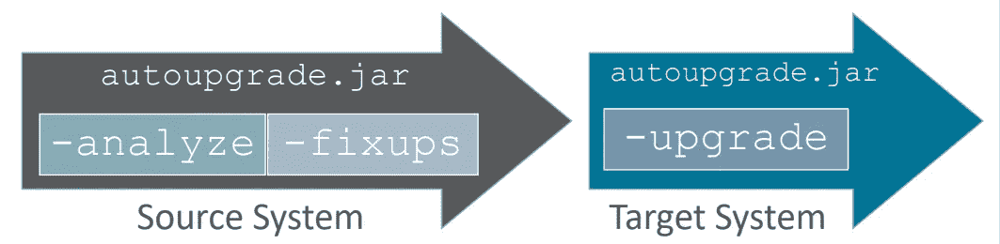

# Oracle 自动升级 ala Docker 方式

> 原文：<https://medium.com/oracledevs/oracle-automatic-upgrade-ala-docker-way-4af9e43d602d?source=collection_archive---------4----------------------->

有一篇来自[迈克·迪特里希](https://mikedietrichde.com/)的[帖子](https://mikedietrichde.com/2019/04/29/the-new-autoupgrade-utility-in-oracle-19c/?fbclid=IwAR1j9t-1ytdIfiks63_xlfauBvX0QX-MxH5pxounx9IorRRwbb2b634ToGo)和[幻灯片](https://mikedietrichde.com/slides/#OOW18)，讲述如何使用[自动升级工具](https://support.oracle.com/epmos/faces/DocumentDisplay?id=2485457.1)为您的 Oracle RDBMS 进行自动升级。

但是如果你的 RDBMS 运行在 Docker 或者 Docker Swarm 上会怎么样呢？嗯很容易。让我看看:

假设我们有一个 Swarm 或 Docker 组合堆栈，如下所示:

```
version: '3.6'
services:
  db:
    image: oracle/database:12.2.0.1-ee
    hostname: ols
    volumes:
      - /home/data/db/12cR2.test:/opt/oracle/oradata 
      - /run/shm:/dev/shm
    ports:
      - 1521:1521
    environment:
      - ORACLE_SID=TEST
      - ORACLE_PDB=PDB1
```

正在工作的 ***12cR2*** RDBMS 数据库要迁移到 19.3，首先由于自动升级要求我们需要一个在归档日志模式下工作的 RDBMS，请将其更改为执行:

```
SQL> alter system set ***db_recovery_file_dest_size=30g*** scope=both;System altered.SQL> shutdown immediate;
Database closed.
Database dismounted.
ORACLE instance shut down.
SQL> startup mount;
ORACLE instance started.Total System Global Area 1610612736 bytes
Fixed Size      8793304 bytes
Variable Size    520094504 bytes
Database Buffers  1073741824 bytes
Redo Buffers      7983104 bytes
Database mounted.
SQL> ***alter database archivelog***;Database altered.SQL> ***alter database open***;Database altered.
```

要升级到 19c，我们将采用两步迁移选项，首先运行分析-修复，最后升级，如图所示



auto-upgrade steps

为此，我们将使用一个 [migrate.sh](https://gist.githubusercontent.com/marcelo-ochoa/1c0299bc3151b70695f1eb548e879575/raw/d5019a7ea3b994c89cef71807421688fe90285b5/migrate.sh) bash 脚本

migrate.sh bash script

该脚本旨在使用 RDBMS 映像提供的启动功能运行，这些映像是使用 Oracle 官方构建[脚本](https://github.com/oracle/docker-images/tree/master/OracleDatabase/SingleInstance)创建的。

为了执行上述脚本，我们将更改 Docker 堆栈定义，添加新的挂载文件:

> .....
> 卷:
> -/home/data/db/12cr 2 . test:/opt/Oracle/oradata
> -/home/Oracle/auto upgrade . jar:/opt/Oracle/scripts/startup/auto upgrade . jar
> -/home/Oracle/migrate . conf:/opt/Oracle/scripts/startup/migrate . conf
> -/home/Oracle/migrate . sh:/opt/Oracle/scripts/startup/migrate . sh
> -/run/shm:/dev/shm

***auto upgrade . jar***从我的 Oracle support [链接](https://support.oracle.com/epmos/main/downloadattachmentprocessor?parent=DOCUMENT&sourceId=2485457.1&attachid=2485457.1:AUTOUPGRADE&clickstream=yes)下载。将上述挂载选项添加到***docker-compose-migrate . yml***文件中，需要关机-启动，让我们试试:

```
oracle@localhost:~/sample-stacks$ docker service scale migrate_db=0
oracle@localhost:~/sample-stacks$ docker stack deploy -c docker-compose-migrate.yml migrate
```

***migrate.conf*** 文件只有定义源版本和目标版本的选项，在我们的例子中是:

```
global.autoupg_log_dir=/tmp/jobmgr
upg1.dbname=TEST
upg1.source_home=/opt/oracle/product/12.2.0.1/dbhome_1
upg1.target_home=/opt/oracle/product/19c/dbhome_1
upg1.sid=TEST
upg1.start_time=now
upg1.pdbs=*
upg1.log_dir=/tmp
upg1.upgrade_node=localhost
upg1.run_utlrp=yes
upg1.timezone_upg=yes
upg1.target_version=19.3
```

当修改了堆栈的数据库启动时，它将记录以下输出:

```
migrate_db.1.3pfwfxwkgo66@localhost    | /opt/oracle/runUserScripts.sh: running /opt/oracle/scripts/startup/migrate.sh
migrate_db.1.3pfwfxwkgo66@localhost    | Executing /opt/oracle/scripts/startup
migrate_db.1.3pfwfxwkgo66@localhost    | Autoupgrade tool launched with default options
migrate_db.1.3pfwfxwkgo66@localhost    | +--------------------------------+
migrate_db.1.3pfwfxwkgo66@localhost    | | Starting AutoUpgrade execution |
migrate_db.1.3pfwfxwkgo66@localhost    | +--------------------------------+
migrate_db.1.3pfwfxwkgo66@localhost    | 1 databases will be analyzed
migrate_db.1.3pfwfxwkgo66@localhost    | Job 100 completed
migrate_db.1.3pfwfxwkgo66@localhost    | ------------------- Final Summary --------------------
migrate_db.1.3pfwfxwkgo66@localhost    | Number of databases            [ 1 ]
migrate_db.1.3pfwfxwkgo66@localhost    | 
migrate_db.1.3pfwfxwkgo66@localhost    | Jobs finished successfully     [1]
migrate_db.1.3pfwfxwkgo66@localhost    | Jobs failed                    [0]
migrate_db.1.3pfwfxwkgo66@localhost    | Jobs pending                   [0]
migrate_db.1.3pfwfxwkgo66@localhost    | ------------- JOBS FINISHED SUCCESSFULLY -------------
migrate_db.1.3pfwfxwkgo66@localhost    | Job 100 FOR TEST
migrate_db.1.3pfwfxwkgo66@localhost    | 
migrate_db.1.3pfwfxwkgo66@localhost    | Autoupgrade tool launched with default options
migrate_db.1.3pfwfxwkgo66@localhost    | +--------------------------------+
migrate_db.1.3pfwfxwkgo66@localhost    | | Starting AutoUpgrade execution |
migrate_db.1.3pfwfxwkgo66@localhost    | +--------------------------------+
migrate_db.1.3pfwfxwkgo66@localhost    | 1 databases will be processed
migrate_db.1.3pfwfxwkgo66@localhost    | 
migrate_db.1.3pfwfxwkgo66@localhost    | -------------------------------------------------
migrate_db.1.3pfwfxwkgo66@localhost    | Errors in database [TEST]
migrate_db.1.3pfwfxwkgo66@localhost    | Stage     [PRECHECKS]
migrate_db.1.3pfwfxwkgo66@localhost    | Operation [STOPPED]
migrate_db.1.3pfwfxwkgo66@localhost    | Status    [ERROR]
migrate_db.1.3pfwfxwkgo66@localhost    | Info    [
migrate_db.1.3pfwfxwkgo66@localhost    | Error: 
migrate_db.1.3pfwfxwkgo66@localhost    | [Unexpected Exception Error]
migrate_db.1.3pfwfxwkgo66@localhost    | Cause: 
migrate_db.1.3pfwfxwkgo66@localhost    | For further details, see the log file located at /tmp/TEST/101/autoupgrade_20190504_user.log]
migrate_db.1.3pfwfxwkgo66@localhost    | 
migrate_db.1.3pfwfxwkgo66@localhost    | -------------------------------------------------
migrate_db.1.3pfwfxwkgo66@localhost    | Logs: [/tmp/TEST/101/autoupgrade_20190504_user.log]
migrate_db.1.3pfwfxwkgo66@localhost    | Job 101 completed
migrate_db.1.3pfwfxwkgo66@localhost    | ------------------- Final Summary --------------------
migrate_db.1.3pfwfxwkgo66@localhost    | Number of databases            [ 1 ]
```

在我的测试中，失败的作业(101)表明没有足够的快速恢复区，但是有了上面定义的 30Gb，迁移过程将正常结束。

现在，数据库已检查完毕，并准备好迁移到 19.3 版本，让我们用新的 docker 映像版本更改我们的 docker-compose 文件，并使用升级工具启动，更改如下所示:

```
version: '3.6'
services:
  db:
    image: ***oracle/database:19.3.0-ee***
    ***command***: /opt/oracle/scripts/startup/migrate.sh ***upgrade***
    hostname: ols
    volumes:
...
```

请注意，我们将 Oracle Docker 映像更改为 19.3，并使用命令 upgrade 将默认启动脚本替换为 migrate.sh，再次需要关机启动:

```
oracle@localhost:~/sample-stacks$ docker service scale migrate_db=0
oracle@localhost:~/sample-stacks$ docker stack deploy -c docker-compose-migrate.yml migrate
```

RDBMS 启动时将按原样显示升级过程:

```
migrate_db.1.tdkei09htk99@localhost    | SQL*Plus: Release 19.0.0.0.0 - Production on Sat May 4 13:56:16 2019
migrate_db.1.tdkei09htk99@localhost    | Version 19.3.0.0.0
....
migrate_db.1.tdkei09htk99@localhost    | Autoupgrade tool launched with default options
migrate_db.1.tdkei09htk99@localhost    | +--------------------------------+
migrate_db.1.tdkei09htk99@localhost    | | Starting AutoUpgrade execution |
migrate_db.1.tdkei09htk99@localhost    | +--------------------------------+
migrate_db.1.tdkei09htk99@localhost    | 1 databases will be processed
....
migrate_db.1.tdkei09htk99@localhost    | Job 100 completed
migrate_db.1.tdkei09htk99@localhost    | ------------------- Final Summary --------------------
migrate_db.1.tdkei09htk99@localhost    | Number of databases            [ 1 ]
migrate_db.1.tdkei09htk99@localhost    | 
migrate_db.1.tdkei09htk99@localhost    | Jobs finished successfully     [1]
migrate_db.1.tdkei09htk99@localhost    | Jobs failed                    [0]
migrate_db.1.tdkei09htk99@localhost    | Jobs pending                   [0]
migrate_db.1.tdkei09htk99@localhost    | ------------- JOBS FINISHED SUCCESSFULLY -------------
migrate_db.1.tdkei09htk99@localhost    | Job 100 FOR TEST
migrate_db.1.tdkei09htk99@localhost    | 
migrate_db.1.tdkei09htk99@localhost    | Remember to update /etc/oratab file with new ORACLE_HOME!!!...
```

最后一条消息告诉我们，驻留在持久性存储中的/etc/oratab 文件需要用新的 Oracle 主目录进行更新，现在是 19c 二进制版本:

```
root@localhost:/home/data/db/12cR2.test# cat dbconfig/TEST/oratab 
#
TEST:***/opt/oracle/product/19c/dbhome_1***:N
```

以上更改确保了 ***checkStatus.sh*** 脚本在下次启动时将正常工作，最后通过删除 docker compose 命令选项和升级文件将我的数据库升级到 19c:

```
version: '3.6'
services:
  db:
    image: ***oracle/database:19.3.0-ee***
    hostname: ols
    volumes:
      - /home/data/db/12cR2.test:/opt/oracle/oradata 
      - /run/shm:/dev/shm
    ports:
      - 1521:1521
    environment:
      - ORACLE_SID=TEST
      - ORACLE_PDB=PDB1
```

根据上述 docker-compose.yml 定义，需要一个最终关机启动数据库:

```
oracle@localhost:~/sample-stacks$ docker service scale migrate_db=0
oracle@localhost:~/sample-stacks$ docker stack deploy -c docker-compose-migrate.yml migrate
```

日志输出将显示我们的 19.3 数据库已准备就绪:

```
migrate_db.1.r9yhv9labpah@localhost    | Version ***19.3.0.0.0***
migrate_db.1.r9yhv9labpah@localhost    | The Oracle base remains unchanged with value /opt/oracle
migrate_db.1.r9yhv9labpah@localhost    | #########################
migrate_db.1.r9yhv9labpah@localhost    | DATABASE IS READY TO USE!
migrate_db.1.r9yhv9labpah@localhost    | #########################
....
migrate_db.1.r9yhv9labpah@localhost    | ===========================================================
migrate_db.1.r9yhv9labpah@localhost    | Dumping current patch information
migrate_db.1.r9yhv9labpah@localhost    | ===========================================================
migrate_db.1.r9yhv9labpah@localhost    | ***Patch Id: 29517242***
migrate_db.1.r9yhv9labpah@localhost    | Patch Description: Database Release Update : 19.3.0.0.190416 (29517242)
migrate_db.1.r9yhv9labpah@localhost    | Patch Apply Time: 2019-04-18T07:21:17Z
....
migrate_db.1.r9yhv9labpah@localhost    | ***Patch Id: 29585399***
migrate_db.1.r9yhv9labpah@localhost    | Patch Description: OCW RELEASE UPDATE 19.3.0.0.0 (29585399)
migrate_db.1.r9yhv9labpah@localhost    | Patch Apply Time: 2019-04-18T07:21:33Z
```

升级您的 RDBMs 是一件愉快的事情。