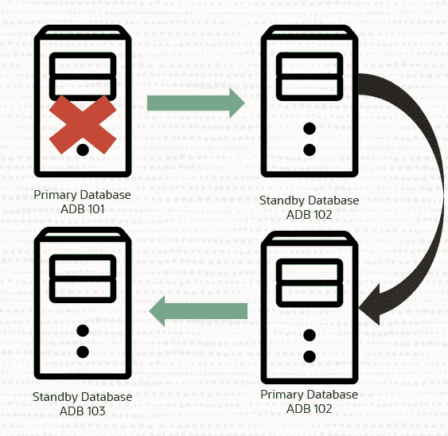
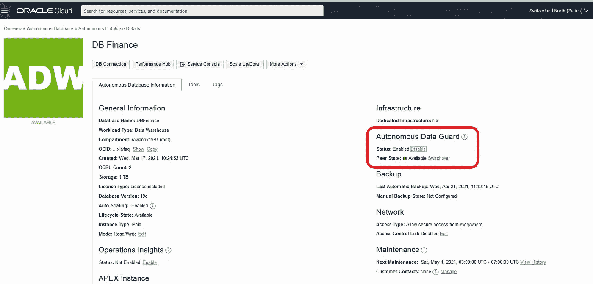
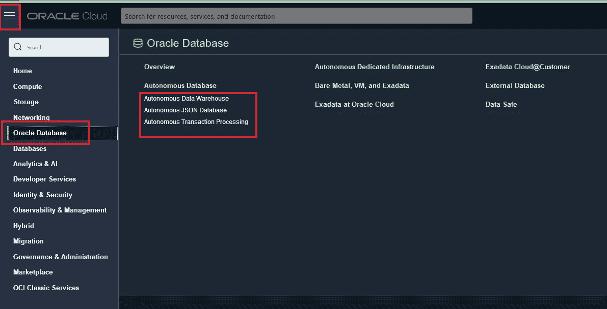
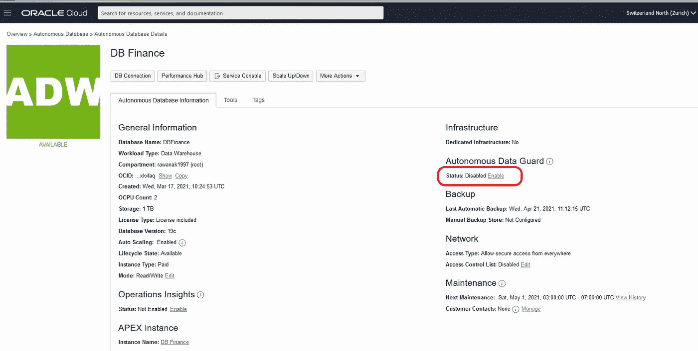
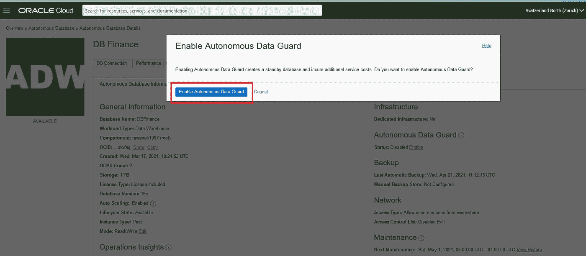
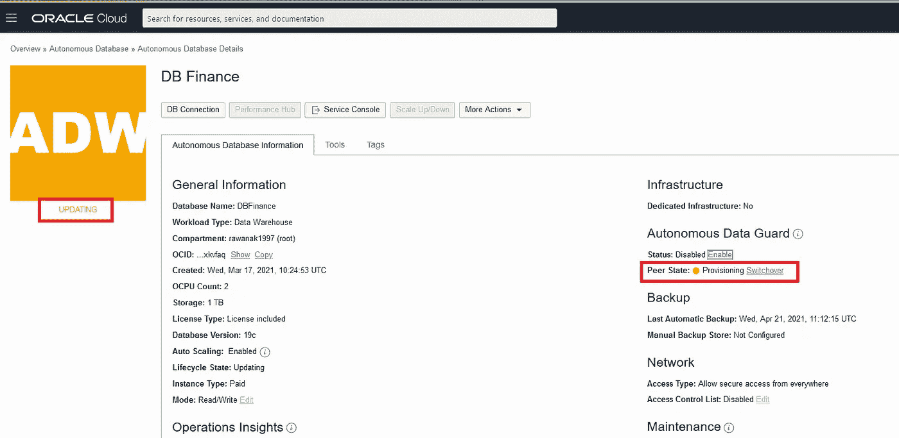
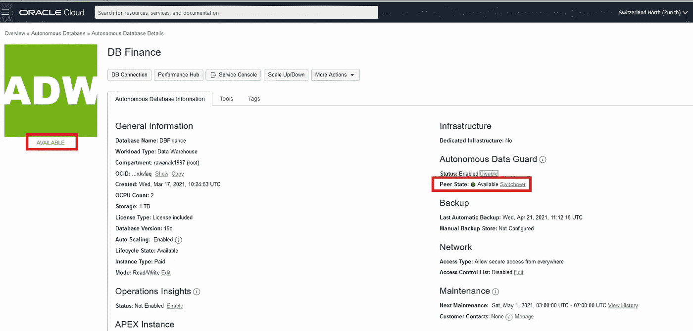
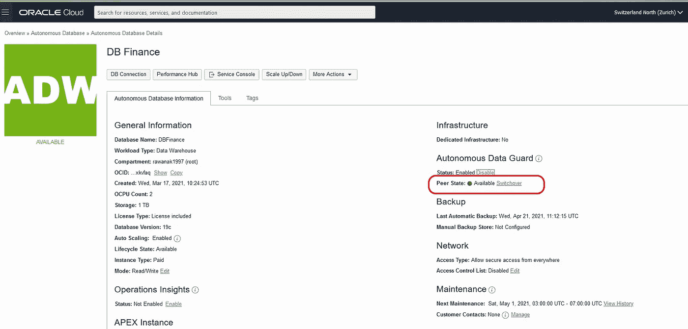
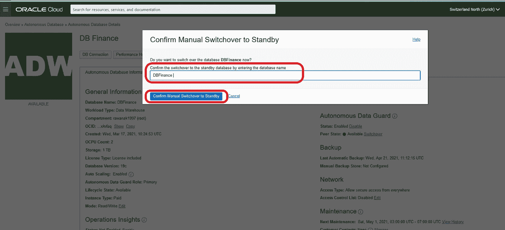

# Oracle Autonomous Data Guard 为您提供支持

> 原文：<https://medium.com/oracledevs/oracle-autonomous-data-guard-got-your-back-b75df88f4c67?source=collection_archive---------0----------------------->

随着虚拟运营的增加，服务可用性已成为一个至关重要的因素。在运营的实施主要依赖于数据的情况下，如银行转账、预订等，立即冗余是必不可少的

这里有**自主数据保护**来拯救，它将停机时间降至最低，使用包含主数据库上保存的所有数据的相同备用数据库，在停机情况下保持运营。

[https://twitter.com/redbullracing/media](https://twitter.com/redbullracing/media)

# 它是如何工作的？

**Autonomous Data Guard** 包括几项关键技术，监控主数据库，帮助系统自动恢复尽可能多的数据，并将任何潜在的数据丢失降至最低。在主数据库中断的情况下，它会自动转换到备用数据库，并将中断降至最低。一旦故障转移过程完成， **Autonomous Data Guard** 会自动创建一个新的备用数据库来监控最新的主数据库。

**自主数据保护**

当您启用 **Autonomous Data Guard** 时，系统会创建一个具有持续更新功能的备用数据库，以保存在主数据库上实施的任何更改。为了获得最高级别的保护和最大可用性，在有多个 AD 的区域中，备用数据库可以位于与主数据库不同的可用性域中。但是，您无权访问备用数据库，但是 ADG 将在备用数据库上执行对主数据库采取的任何操作。

表示服务可用性的**自治数据保护**的**状态**显示在自治数据库主页上，可以是:

*   **启用**
*   **禁用。**

而**对等状态**字段显示备用数据库的状态，可以是:

*   **拨备**
*   **可用**
*   **角色变化正在进行中。**

当**自治数据保护**启用且正在创建备用数据库时，或者在故障转移完成且正在重新创建新的备用数据库后，或者在主数据库上执行备份操作恢复时，会显示**配置**状态。

大多数情况下，当**自主数据保护**启用且未执行切换或故障转移时，对等状态将为**可用，**否则，它将显示**角色变化进行中**状态。

# 我们如何启用**自主数据保护**？

首先，您需要在您的 Oracle 云上提供一个可用的**自治数据库**。

**如果您还没有甲骨文云帐户，现在就免费创建一个吧！**

> 请记住，Oracle Cloud 不会向您收取任何费用，除非您明确要求按需付费升级。没问题。
> 
> [甲骨文云免费注册](https://www.oracle.com/uk/cloud/free/?source=:so:li:or:awr:ocorp:::RC_WWSA210510P00062:RA_Autonomous_Medium&SC=:so:li:or:awr:ocorp:::RC_WWSA210510P00062:RA_Autonomous_Medium&pcode=WWSA210510P00062)

根据您的工作负载，您可以使用带有以下功能的**自主数据保护**:

*   **自主数据仓库**
*   **自主 JSON 数据库**
*   **自主交易处理**

> Autonomous Data Guard 不适用于始终空闲的自治数据库。

## **第一步:**

登录您的 Oracle Cloud 帐户，点击左上角的 hamburger 菜单，选择 **Oracle Database，**并选择您想要启用自治数据保护的自治数据库。

## 第二步:

在“自治数据库”页面上，从“显示名称”列下的链接中选择您的数据库。

在详细信息页面上，在自主数据保护下，单击状态字段中的**启用**:

会出现一个弹出窗口，点击**启用** **自主数据守护**如下:

自治数据库生命周期状态更改为**更新**，在详细信息页面上，自治数据保护下的对等状态字段显示**供应**。

一段时间后，生命周期状态显示**可用**，备用数据库也将显示**可用**。

**就是这样！**

**自主数据保护**已启用**，**在发生故障时，它会自动转换到备用数据库，数据库在故障转移后可用于应用程序的最长 2 分钟恢复时间目标(RTO)和 0 分钟恢复点目标(RPO)可保证没有数据丢失。

## 手动切换

如果您想测试故障转移过程，或者如果自动故障转移不成功(这种情况很少发生)，您还可以选择随时使用 API 启动手动故障转移。当您启动切换操作时， **Autonomous Data Guard** 会故障切换到备用数据库，最多需要 2 分钟来实现恢复时间目标(r to ),并且从故障主数据库中可能会丢失 5 分钟来实现恢复点目标(RPO)。

*   要触发手动故障切换，请进入**详细信息**页面，在**自治数据保护**下的**对等状态**字段中，点击**切换:**

这将显示**确认手动切换到备用数据库**对话框，输入**自治数据库名称**以确认您要进行故障转移，单击**确认手动故障转移到备用数据库:**

当故障转移完成时，**自治数据保护**将被启用，并创建一个新的备用数据库。

> 如果为您的服务实例启用了 Autonomous Data Guard，那么云服务的额外价格将是您在创建或显式扩展服务时指定的 OCPU 数量。

# 总结

**Autonomous Data guard** 能够最大限度地提高数据库可用性，全天候完成自主运营实施，消除任何维护干预，帮助您以高效的方式提供服务。

关于如何配置和管理**自主数据卫士**服务的更多细节，你可以在这里查看用户指南 [**！**](https://docs.oracle.com/en/cloud/paas/autonomous-database/atpfg/configure-and-manage-audg1.html#GUID-A8BF0150-620D-47B5-BD7D-6403DA32C6EA)