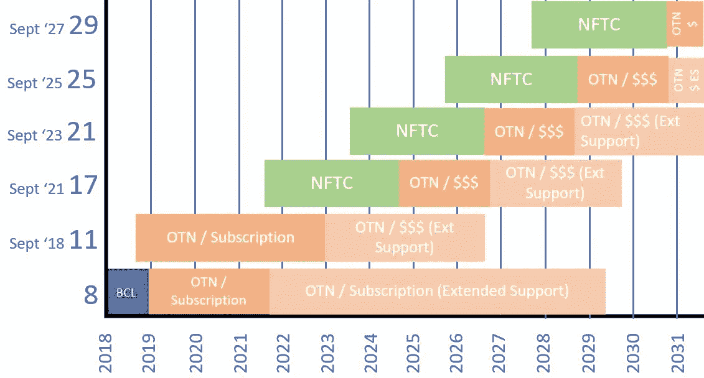
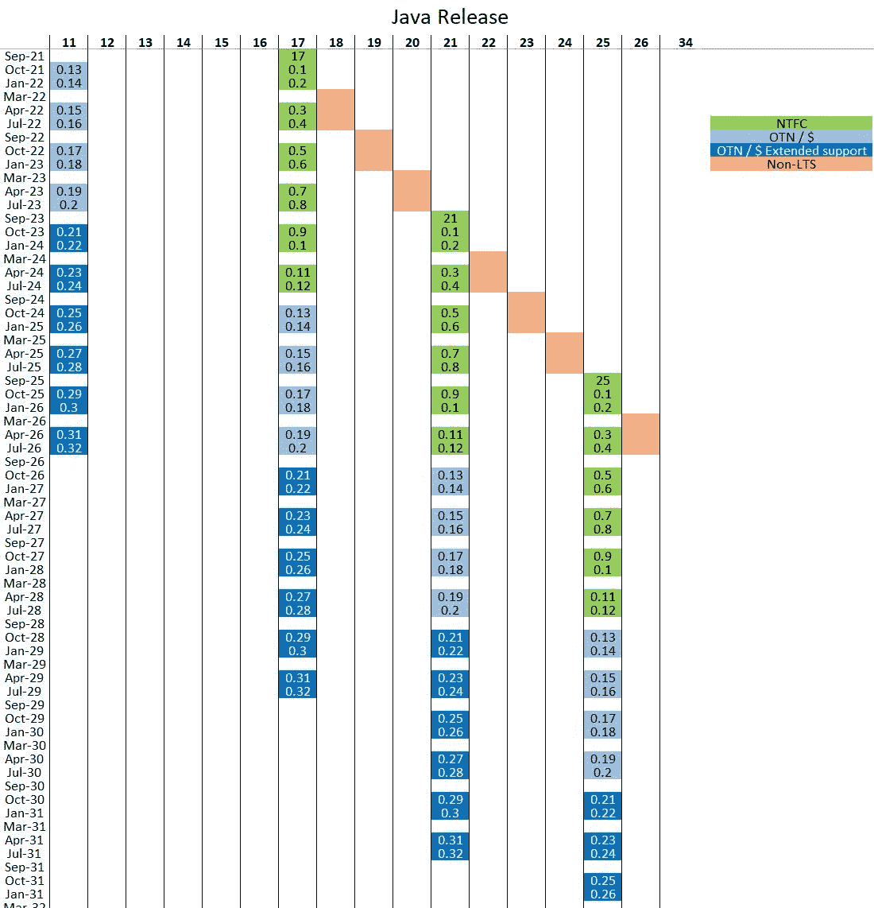
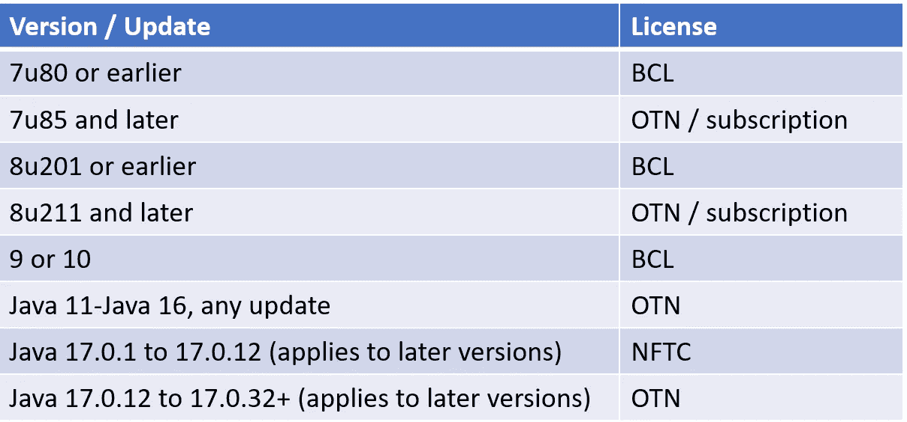

# 甲骨文改变 Java 许可:再一次！

> 原文：<https://medium.com/version-1/oracle-changes-java-licensing-again-abc56e6ec686?source=collection_archive---------3----------------------->

今天，Oracle [按照惯例发布了 Java 17](https://www.oracle.com/news/announcement/oracle-releases-java-17-2021-09-14/) 。通常，这只会让 Java 开发人员等感兴趣，对于我们这些对许可感兴趣的人来说，肯定没有什么令人兴奋的事情——毕竟，我们从 2017 年起就知道远离二进制代码许可(BCL)协议。然而，这一次有两个变化是每个人都应该知道的:

1.  释放长期支持的“节奏”(LTS；基本上，稳定且适合生产)的 Java 版本正从每 3 年一次变为每 2 年一次(这里的)。
2.  甲骨文根据一项新的“免费许可协议”(此处[为](https://blogs.oracle.com/java/post/free-java-license))推出了 Oracle Java 17。

最初，这些似乎彼此没有联系，然而正如我们将会看到的，它们是有联系的。

# TL；速度三角形定位法(dead reckoning)

如果你不想读整篇文章，下面是简短的版本:

> *当您使用 Oracle Java 17 (LTS 发布版)时，您将无需支付订阅费用(适用于任何* *【普通】用法),直到自发布之日起 3 年后您需要更新。超过这一点，您将需要使用 OTN /订阅许可证。早期版本不受影响。*
> 
> *如果您使用商业功能，您仍然需要订阅。*

# LTS·凯登斯

在 LTS 版本之间采用两年的步调([此处为](https://blogs.oracle.com/java/post/moving-the-jdk-to-a-two-year-lts-cadence))允许组织允许流通并减少 LTS 版本之间的增量跳跃(在 LTS 版本之间可以进行更少的功能/变化)，以及知道有更多的常规稳定支持版本可以采用。这非常符合我们在组织中看到的情况:没有人希望在非 LTS 版本上运行生产工作负载，但 LTS 版本之间的“跳跃”太大了。

显而易见，这无助于大多数组织，他们仍然有遗留的 Java 7/8 环境，很少或没有采用 Java 11 和更高版本:这些组织有一个“足够大”的任务来保持 Java 8 补丁(如果他们甚至尝试！).

请注意，这个 2 年的节奏已经*向 Java 社区提出*，所以还没有 100%确定，但是很有可能。

# 免费条款和条件许可证

好消息是:Java 17 已经在免费条款和条件许可下发布了(NTFC，此处)。这与 OTN Java 许可证([此处为](https://www.oracle.com/uk/downloads/licenses/javase-license1.html))的根本区别在于，该许可证不仅允许“*开发、测试、原型制作和演示您的应用程序，并运行程序供您个人使用或* ***内部商业运作*** ”:即您可以在生产中使用它，根据协议**用于商业用途，而无需支付**。再说一遍，您不需要为任何标准使用购买 Java 17(已发布)的订阅。用甲骨文的话说:

*“Java 17 LTS 是 Java SE 平台的最新长期支持版本。JDK 17 的二进制文件是***在生产中免费使用，并且免费重新发布，在* [*甲骨文的免费条款和条件许可下*](https://java.com/freeuselicense)*

> *****如果您想使用任何商业功能(etc 高级管理控制台、MSI 安装程序)，您仍必须购买 Java 17 的订阅服务*****

**那有什么条件呢？Oracle 是否已经认定 OTN Java 许可和订阅存在问题？不(它仍然存在):相反，我认为免费吸引企业采用 LTS 版本的 Oracle Java(而不是另一个提供商)对于 Oracle Java 作为产品和收入流的寿命来说是一件好事，同时减少了 Oracle 提供支持的开销。正如我们将看到的，NTFC 有它的限制:不是所有的企业都能够满足这些要求，而且仍然必须付费。**

> ***使用 Oracle Java 17(或任何 LTS)超过 3 年的客户需要付费订阅才能继续接收更新。***

*   **它于今天(2021 年 9 月 14 日)发布**
*   **在下一个 LTS Oracle Java 21 于 2023 年 9 月发布后的一年内，将免费提供该软件。**
*   **在 2024 年 9 月(Java 21+1 年发布)之后，Oracle Java 17 将在用于 Oracle Java 8 u211 和 Oracle Java 11 及更高版本的 OTN /订阅基础下提供。**
*   **Oracle Java 21 和所有后续的 LTS 版本将重复这一循环。**

**甲骨文对此的表述略有不同，并声明他们将在下一个**LTS 版本(即版本 21 的发布)后的一年内提供免费更新:在您付费之前，您有一年的时间从一个 LTS 升级到下一个。****

**听起来有点复杂，所以这里有一个简化的图表。我已经删除了所有非 LTS 发布的版本以及季度安全补丁。绿色条显示免费许可证的有效期，深橙色显示需要支付订阅/使用 OTN Java 许可证的费用，浅橙色显示同样的情况，但在扩展支持下(将收取费用并可能需要升级)。**

****

*   **Java 17.0.0 到 Java 17.0.12 将在 NFTC 下**
*   **Java 17.0.13 到 Java 17.0.32(或更高版本)将属于 OTN /订阅范围**

**让我们来看一个 Oracle Java 17 的具体例子:**

*   **它于今天(2021 年 9 月 14 日)发布**
*   **在下一个 LTS Oracle Java 21 于 2023 年 9 月发布后的一年内，将免费提供该软件。**
*   **在 2024 年 9 月(Java 21+1 年发布)之后，Oracle Java 17 将在用于 Oracle Java 8 u211 和 Oracle Java 11 及更高版本的 OTN /订阅基础下提供。**
*   **Oracle Java 21 和所有后续的 LTS 版本将重复这一循环**

# **我需要注意哪些版本？！**

**如果您花了一些时间研究 Oracle Java 许可，您可能会想“好吧，但是这对于版本号意味着什么？”。在任何企业中都有大量的版本/更新信息要过滤，比如“Java 8 u251”、“Java SE 1.4.2 Update 18”、“Oracle Java Runtime Environment，10.0.1”，确定新的过滤器肯定会很复杂？幸运的是没有:实际上，由于 Java 9 提供了更清晰的版本信息，您将会在“. 13”和“. 32”(含)版本之间寻找任何内容，因此对于 Java 17:**

**请注意，从技术上讲，“. 0”以及后续版本号可能会发生变化；然而，自从 9.0.0 发布以来，这种情况还没有发生过。**

**进一步解释:LTS 预计将存在 8 年，最初发布后是每个季度的补丁，即总共 32 个补丁。如果使用 NFTC 每 2 年发布一次 LTS，有 1 年的重叠时间，则 5 年中的 3 年(3 年的季度补丁)会将版本 12 作为最后一个覆盖的版本。**

**下图显示了许可证申请的发布时间表和“类别”。省略了完整的版本信息，但作为示例，17 列下的“0.19”将是 Java 17.0.19，我们可以看到此版本将需要 OTN /订阅覆盖。**

****

# **许可证覆盖范围**

**退一步来看所有版本和更新，哪些许可证可用于涵盖每一个版本和更新？下表对此进行了总结:**

****

**请注意，上表简化了许可证类型的适用性，可能不适用于您的使用，例如，如果您的 Java 8 具有早于 update 201 的商业功能，或者 BCL 不适合您的使用(例如，嵌入式或用于分发)。此外，值得提醒自己的是，一些 Java 7 版本需要订阅(根据我们的经验，很多人忘记了这一点)，以及确保您了解 VMware 政策以及它如何影响您的许可证要求。**

# **摘要**

**这里有很多东西需要理解，但我认为 Oracle 正试图这样做，以增加稳定的 Oracle Java 的长期采用:我不认为引入 OTN 许可和订阅模式有任何“遗憾”,这不是走回头路。相反，在免费许可上投入更多时间可能有助于客户继续使用 Oracle Java，并减少 Oracle 可能必须提供长期支持的整体遗留资产(Java 8 于 2014 年首次发布，将在 2030 年之前提供延长支持，不提供支持升级！).**

**现实情况是，大多数客户远远没有全部采用 Oracle Java 11，而是依赖于遗留的 Java 版本，尤其是 Java 8。也许 OTN /订阅模式旨在鼓励人们从 8 版本“向前移动”到更高的支持版本:也许 NFTC 许可下的 LTS 版本是甲骨文希望客户瞄准的目标。现实将是一个缓慢/笨拙的移动，要么尝试将 Oracle Java 淘汰到另一个 Java 实现，要么继续为那些仍然使用 Java 8 并需要安全补丁的客户带来痛苦。**

> **许多客户在未来几年内都不会受到这一变化的影响:为了摆脱 Java 8 的困境，大量的迁移/升级工作还在前面，再加上持续的许可混乱。 ***这一变化不会突然影响甲骨文的 Java 订阅收入*** *，也就是说不会马上给你省钱。***

**现在，继续“像以前一样”，关注你的 Java 资产，OTN /订阅应用的技术诀窍，并被计算在内，确保你不会匆忙进行无限制的订阅。请注意，随着你的遗产(希望如此)的发展，可能会有一些变化。**

# **关于版本 1**

**我们独立且经验丰富的 SAM 和许可顾问为全球客户提供专业知识，确保客户从其资产中获得最大价值。**

**[版本 1](http://www.version1.com/) 的规模意味着我们可以帮助您从内部部署到 XaaS 的软件战略的所有方面？有经验丰富的云架构师和经济学家在您身边，我们可以提供迁移到云的一站式服务。**

**版本 1 证明了它可以给我们客户的业务带来真正的改变。Version 1 成立于 1996 年，总部位于爱尔兰的都柏林，它所提供的 IT 服务和解决方案赢得了客户的信任，推动了客户的成功。我们 1，300 人的强大团队与我们的技术合作伙伴密切合作，提供独立的建议，帮助我们的客户驾驭快速变化的 IT 世界。我们的客户包括全球顶级银行、金融服务、公用事业(包括石油和天然气、泛欧能源公司和主要国内水务公司)和商业领域的许多富时上市公司，以及地方和中央政府的公共部门组织。我们最大的优势是在实现客户成功、授权员工和强大组织的努力中保持平衡，并以对我们价值观的承诺为基础。我们相信这是版本 1 与众不同的地方，更重要的是，我们的客户也认同这一点。**

****关于作者** Paul Bullen 是 Oracle Licensing here in Version 1 的首席顾问。**

****

***最初发表于***。****