# Oracle 云始终免费自治数据仓库—起步步骤

> 原文：<https://medium.com/oracledevs/oracle-cloud-always-free-autonomous-data-warehouse-steps-to-get-going-4ed6d28f3d24?source=collection_archive---------0----------------------->

上个月，甲骨文宣布了其在甲骨文云基础设施(OCI)上的云免费层。该免费层提供多种服务(计算、存储、网络、监控和通知、无服务器功能和自治数据库。可以在这个“永久免费层”中调配和利用两个自治数据库实例，每个实例最多有 20 GB 的数据。]全部功能。在本文中，我将告诉您我对这个免费层的第一次体验，更具体地说，是对自治数据仓库服务的体验。TL；DR:不到 15 分钟，我就有了新的 Oracle 云帐户，其中运行着一个永远免费的自治数据仓库实例。

步骤非常简单:

1.  创建您的新 Oracle 云帐户(注意:我无法将始终免费的实例添加到我现有的 Oracle 云帐户)
2.  创建所需服务的“始终免费”实例(注意:新云帐户提供的 300 美元一个月试用还允许您创建 30 天后到期的非免费级合格实例；好好保重！)
3.  开始利用你的新免费实例——不只是 30 天，而是“永远”

# 1.创建 Oracle 云帐户

要创建新的 Oracle 云帐户，您可以前往[https://www.oracle.com/cloud/free/](https://www.oracle.com/cloud/free/)，点击免费开始:

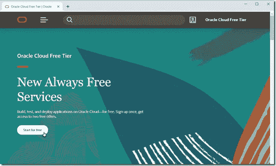

您将进入注册页面，在该页面上，您必须提供电子邮件地址(之前未使用该地址创建 Oracle 云帐户)和有效的信用卡详细信息。当然，这并不意味着免费层将向您收费。

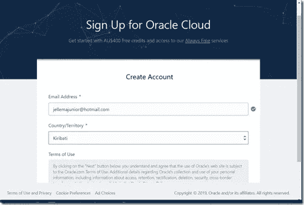

创建帐户后，您将收到一封电子邮件，邀请您登录您的帐户，更改您的临时密码，然后开始。

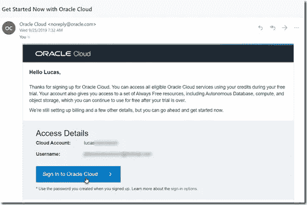

# 2.创建所需的始终免费服务的实例

所呈现的 OCI 仪表板包含针对新的免费等级中的一些总是免费的服务的许多快速动作。我点击 ***创建一个数据仓库*** 。

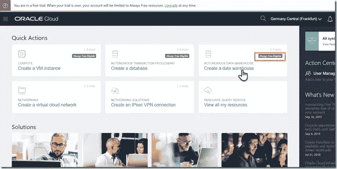

首先提供数据库的名称，并选择自治数据库服务的类型:数据仓库或事务处理。

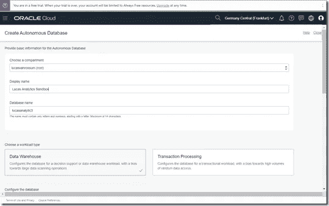

接下来配置数据库。这里有一些需要密切注意的事情。确保开关*总是自由的*被切换到上的**。我试了三次才把它做好(尽管窃笑)。此设置打开后，CPU 核心数和存储大小将自动设置(一个 CPU 核心和 20 GB 数据存储)。提供管理员帐户的密码。然后点击创建自治数据库。当数据库实例被提供时，可以休息一会儿。**

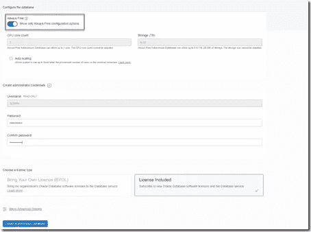

在进行资源调配时，将显示下一个概述:

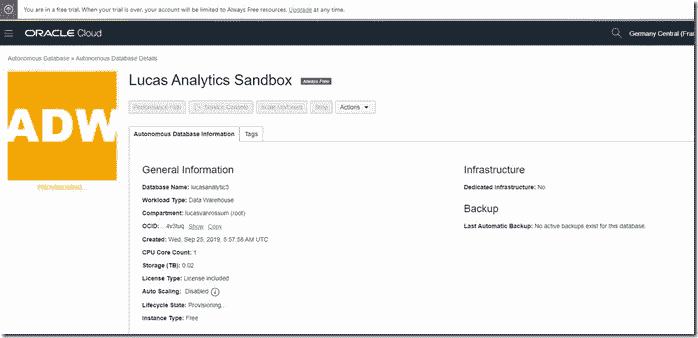

自治数据库概述显示了我当前的情况——两个意外创建的非自由实例都消耗了 300 美元的试用帐户，尽管我几乎一创建它们就终止了它们:

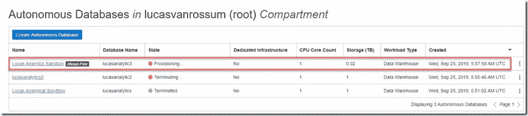

几分钟后，配置完成。我有一个 AWD 实例，它永远属于我，无需支付任何费用。至少拉里在甲骨文全球大会 2019 的主题演讲中是这么说的。

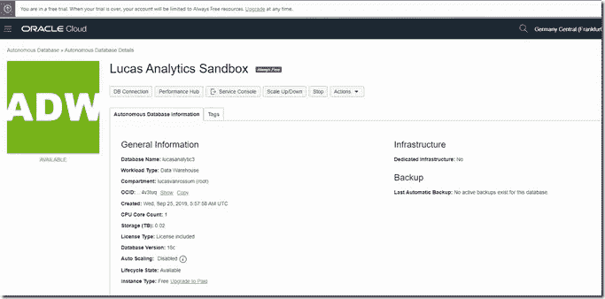

注意:每天都会为 ADW 实例创建自动备份；可以手动请求恢复备份。

# 3.开始利用总是免费的自治数据仓库实例

现在，我可以开始使用基于浏览器的工具来管理和利用数据库实例，或者我可以从其他实例或桌面工具获得数据库的连接详细信息。

此处的*数据库连接*选项卡带有【访问】连接详细信息

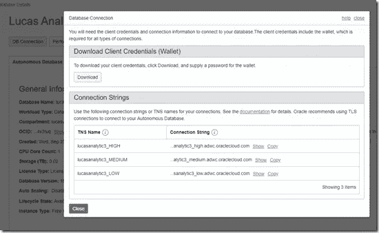

*性能中心*提供了各种性能指标的概述。

服务控制台打开一个新窗口，其中有几个选项— *概述*:

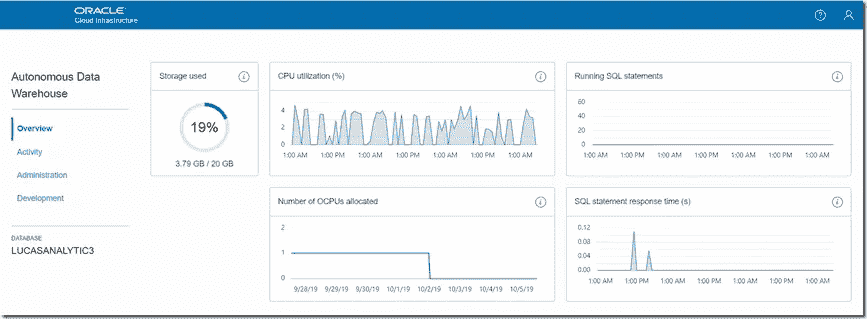

*管理*

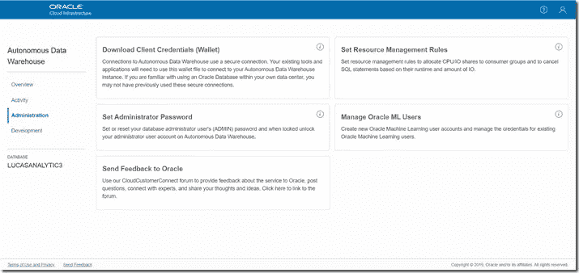

*开发*

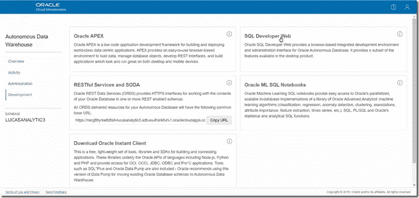

从开发页面，可以访问几个工具来在 ADW 实例上工作。其中包括 APEX、ORDS 和 SODA 以及甲骨文机器学习 SQL 笔记本(类似于 Jupyter 笔记本)。这是 SQL Developer Web 界面，也是基于浏览器的，它允许管理数据库对象、创建表、查询数据

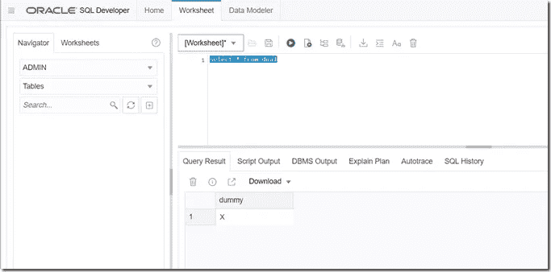

类似地，APEX 也是可用的，这是另一个用于管理数据库实例中的用户和数据库对象以及开发低代码应用程序的 web UI，但也有一些重叠:

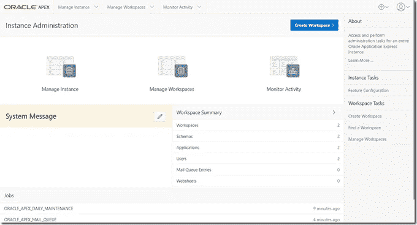

APEX 还提供了将数据快速加载到新数据库实例的最简单方法。通过 APEX 工作空间，可以创建表格，例如通过导入 CSV 文件:

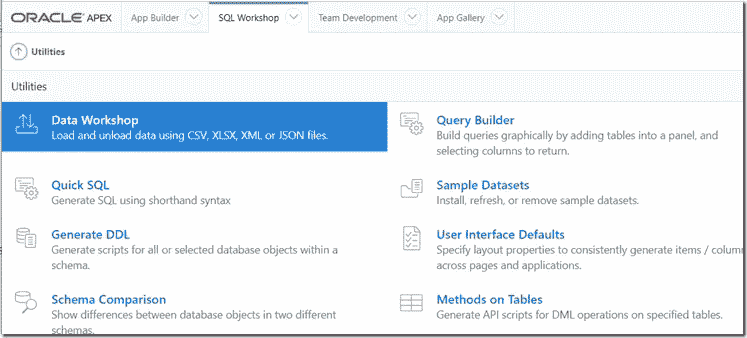

*原载于 2019 年 10 月 6 日*[*https://technology . amis . nl*](https://technology.amis.nl/2019/10/06/oracle-cloud-always-free-autonomous-data-warehouse-steps-to-get-going/)*。*