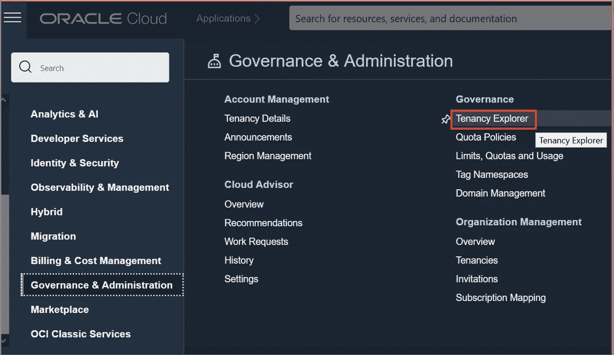
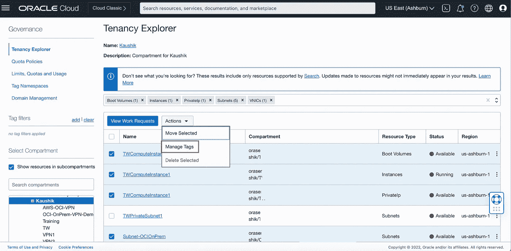
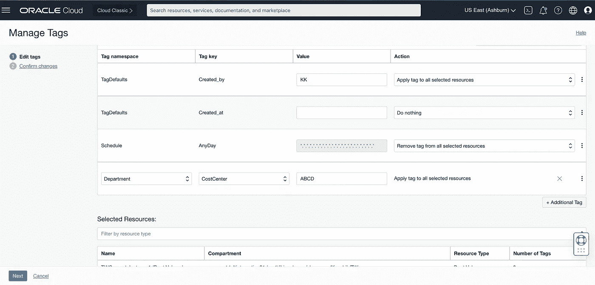
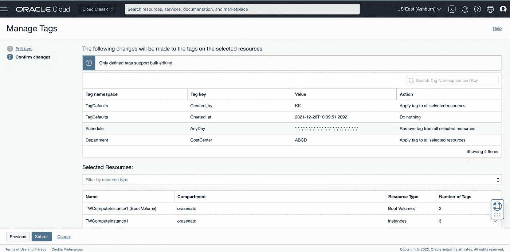

# 甲骨文云(OCI) —批量标记云资源

> 原文：<https://medium.com/oracledevs/oracle-cloud-oci-bulk-tagging-cloud-resources-fdd448fdccbc?source=collection_archive---------0----------------------->

标签是一个有价值的工具。当您使用云资源时，您通常更喜欢让您的资源保持“标记”为什么？

通过标记，您可以将云资源与额外的数据相关联，以便您可以描述资源的使用方式以及使用它们的原因。通过标签，您可以将自己的云资源与项目、部门或客户相关联。

您可能已经为您的部门做了几个项目，并且您已经用 Dept-Id 标记了您的几个云资源。现在，在您的业务线重组后，您的部门 Id 发生了变化。您必须为您的数百个云资源更改 Dept-Id 标记。

导航到每个云资源并更改标签需要花费大量的时间和精力。

在 Oracle Cloud Infrastructure (OCI)中，只需点击几下鼠标，您就可以对多个云资源(不同类型)的一个或多个标签进行批量添加和更新。轻松点。

**第一步:**

以租赁管理员的身份登录 OCI，点击汉堡菜单(左上角)

在治理和管理下打开租赁浏览器

**第二步:**

选择您的隔离专区以查看您的云资源。

选择要标记的云资源，然后单击操作->管理标记。

**第三步:**

在编辑标签屏幕中，对于选定的云资源，添加新标签或更新现有标签，然后转到下一个屏幕

**第四步:**

检查您的标签更改，然后提交更改。

这样，只需几次点击，您就可以在 Oracle 云基础设施(OCI)中批量添加/更新标签。

你喜欢标签吗？让我们知道在 [DevRel 公共松弛](https://bit.ly/devrel_slack)！