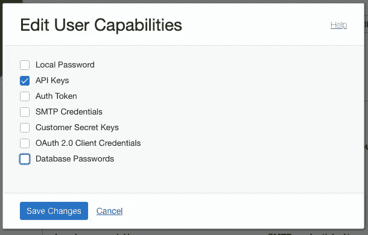

# Oracle 云(OCI)如何:创建非交互式用户

> 原文：<https://medium.com/oracledevs/oracle-cloud-oci-create-a-non-interactive-user-5686b3ef544?source=collection_archive---------2----------------------->


在任何企业组织中，安全/身份管理管理员不向用户提供管理权限。

一种流行的解决方案是创建一个非交互式用户，并提供运行命令所需的权限，因此这个非交互式用户拥有最高权限，可以在任何网络中执行任何命令。devops /自动化开发工程师使用它来以特权帐户运行命令。

第一步:登录 OCI，点击左上角的汉堡菜单。

第 2 步:导航至“身份与安全”→点击身份下的“用户”


第三步:点击“创建用户”并填写如下详细信息:


步骤 4:单击“创建用户”并更改功能:


Click on “Edit User Capabilities” option



# 创建非交互式用户的 Terraform 脚本。

*下面一个地形脚本创建了一个非交互式用户:*

**用户名:*devo PS _ account***

```
# A user is createdresource "oci_identity_user" "devops_user" {#Requiredcompartment_id = "tenancy_ocid.xxxxxxxxxxxxxxxxxxx"description = "devops account used to authenticate."name = "devops_account"}# settings for the non-interactive userresource "oci_identity_user_capabilities_management" "devops_user_capabilities_management" {#Requireduser_id = oci_identity_user.devops_user.id#Optionalcan_use_api_keys             = "true"can_use_auth_tokens          = "false"can_use_console_password     = "false"can_use_customer_secret_keys = "false"can_use_smtp_credentials     = "false"}# variable to load the information about the created userdata "oci_identity_users" "devops_user_data" {compartment_id = oci_identity_user.devops_user.compartment_idfilter {name   = "name"values = ["devops_account"]}}
```

想讨论一下吗？加入我们的[开发者公共休闲活动！](https://bit.ly/devrel_slack)