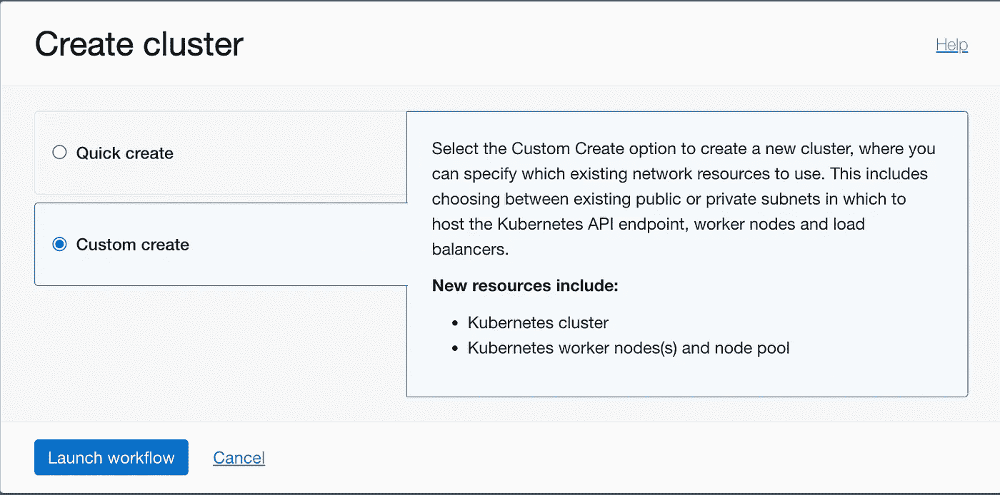

# Oracle 云(OCI)—Kubernetes 集群的网络配置

> 原文：<https://medium.com/oracledevs/oracle-cloud-oci-network-configuration-for-kubernetes-cluster-251965ee0f23?source=collection_archive---------1----------------------->

当您在 OCI 上创建 Kubernetes 集群时，您可以选择使用“快速创建”工作流来自动创建 Kubernetes 集群/节点以及所需的网络资源。

然而，在许多情况下，Kubernetes 集群的创建者没有创建网络资源所需的权限，因为网络资源通常由网络管理员管理。在这种情况下，Kubernetes 集群需要在创建 Kubernetes 集群时利用现有的网络资源，方法是使用“自定义创建”工作流。

在开始创建 Kubernetes 集群之前，确保按照 Kubernetes 集群的要求准确配置 VCN/子网的路由表和安全列表非常重要。

以下链接给出了定制创建不同类型的 Kubernetes 集群所需的网络配置示例。

*   [具有法兰绒 CNI 插件、公共 Kubernetes API 端点、私有工作节点和公共负载平衡器的集群](https://docs.oracle.com/en-us/iaas/Content/ContEng/Concepts/contengnetworkconfigexample.htm#example-flannel-cni-publick8sapi_privateworkers_publiclb)
*   [带有法兰绒 CNI 插件、私有 Kubernetes API 端点、私有工人节点和公共负载平衡器的集群](https://docs.oracle.com/en-us/iaas/Content/ContEng/Concepts/contengnetworkconfigexample.htm#example-flannel-cni-privatek8sapi_privateworkers_publiclb)
*   [具有 OCI CNI 插件、公共 Kubernetes API 端点、私有工作节点和公共负载平衡器的集群](https://docs.oracle.com/en-us/iaas/Content/ContEng/Concepts/contengnetworkconfigexample.htm#example-oci-cni-publick8sapi_privateworkers_publiclb)
*   [具有 OCI CNI 插件、私有 Kubernetes API 端点、私有工作节点和公共负载平衡器的集群](https://docs.oracle.com/en-us/iaas/Content/ContEng/Concepts/contengnetworkconfigexample.htm#example-oci-cni-privatek8sapi_privateworkers_publiclb)

只有在您准确配置了网络资源之后，您才可以使用“自定义创建”工作流来创建 Kubernetes 集群(按照 [Oracle 文档](https://docs.oracle.com/en-us/iaas/Content/ContEng/Tasks/contengcreatingclusterusingoke_topic-Using_the_Console_to_create_a_Custom_Cluster_with_Explicitly_Defined_Settings.htm)中详述的步骤)。

想谈谈吗？加入我们的[公共 Slack 频道](https://bit.ly/devrel_slack)与其他 Oracle 开发人员讨论！