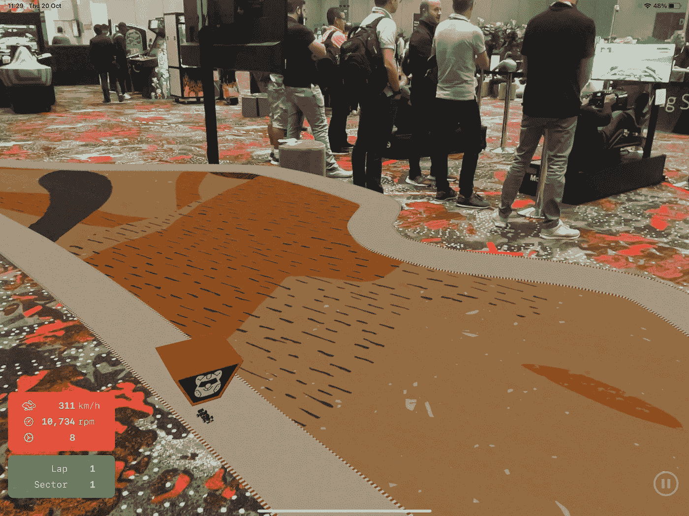
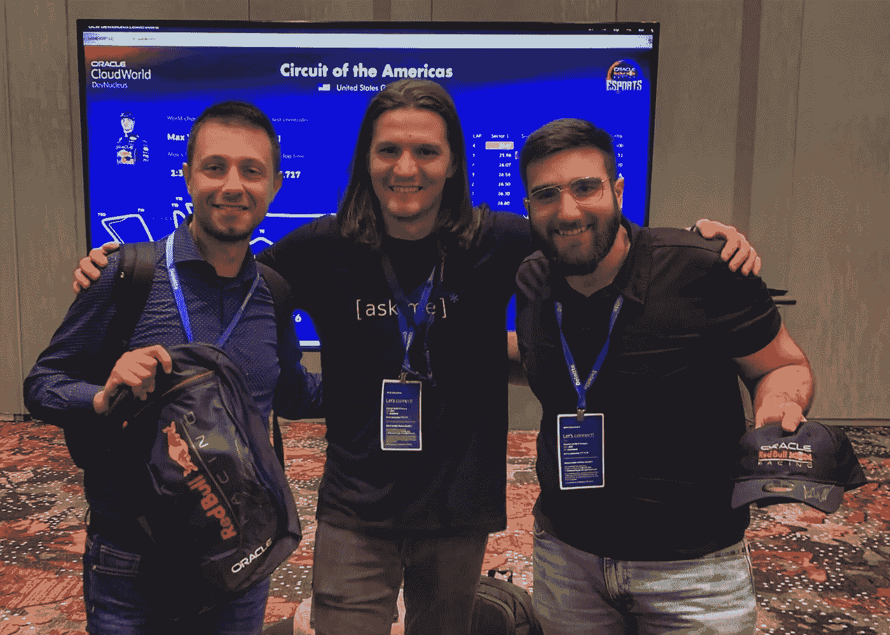
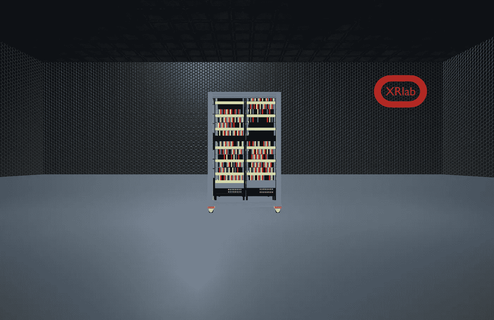
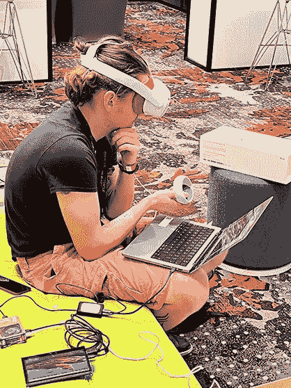
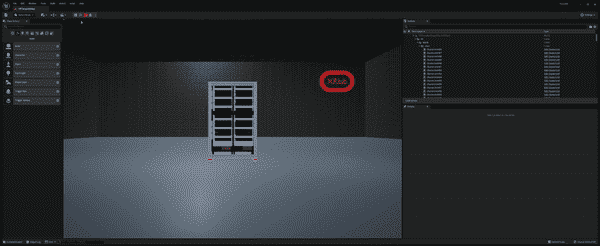
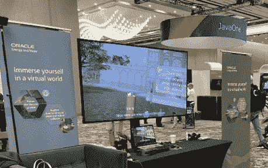

# Oracle CloudWorld 2022 综述 DevNucleus 中的沉浸式技术

> 原文：<https://medium.com/oracledevs/oracle-cloudworld-2022-roundup-immersive-tech-in-the-devnucleus-e63ef58e2f48?source=collection_archive---------0----------------------->

在这篇博客中，我将讨论我们在 Oracle CloudWorld 2022 上展示的沉浸式技术和其他很酷的东西。

在甲骨文，我是一名身临其境的技术倡导者。这意味着我专注于将 3D 用例带入生活。几周前，我有幸在内华达州拉斯维加斯的甲骨文 CloudWorld 年会上展示了这些技能。

让我带你参观一下我们在 DevNucleus 开发中心的几个用例。

# AR 回放

大会上的主要演示之一是我们的公式 Pi 展示。这是一种有趣的方式，可以吸引观众，同时在后台谈论支持 it 的 Oracle 云基础架构技术。主要目标是在 F1 赛车游戏上运行一个锦标赛。规则很简单:参与者必须在德克萨斯州奥斯汀的赛道上进行所谓的“热圈”挑战。如果他们保持在赛道上，他们的圈数会被计算在内，最终最快的圈数会赢得奖励。

为了让事情变得有趣，两届 F1 世界冠军马克斯·维斯塔潘坐上了车手的位置，并在美洲赛道上创下了最快圈速。甲骨文 CloudWorld 的所有与会者都有机会在位于 DevNucleus 的甲骨文红牛赛车模拟器上尝试打破 Max 的[最快圈速](https://developer.oracle.com/en/redbull-live-laps/max)。

我与我的好朋友波格丹一世·法尔卡合作，他帮助我们构建了一个 iOS Replay AR 应用程序的原型，该应用程序使用游戏中的 x，y，z 坐标，我们将这些坐标存储在 [Oracle 自治数据仓库](https://docs.oracle.com/en/cloud/paas/autonomous-data-warehouse-cloud/)中，并在增强现实(AR)中绘制它们。我们有许多很酷的 3D JSON 数据点，这个 iOS 应用程序从数据库视图中读取数据，我们通过 API Gateway 从我们的 Live Laps 应用程序中公开这些数据，该应用程序使用 [Oracle APEX](https://developer.oracle.com/technologies/low-code.html) (低代码平台)构建。

AR Replay

这个项目是一个重大的全球性努力，来自世界各地的人们(大声喊出来[斯图尔特](/@Coggs)和[詹森·洛维](https://www.linkedin.com/in/lowe-jason/))编写代码，设计，测试，是的……玩了很多 F1 游戏，但很快会有更多。

以下是 beatMaxV 挑战赛的一些统计数据:

*   3 个模拟器
*   2 个排行榜
*   76 次会议
*   241 名独特的赛车手
*   32 小时以上的比赛时间

#beatMaxV winners

# 数字孪生

这个演示完全是关于**创造** **一个实物资产的**数字**复制品**。在这种情况下，这是甲骨文公司的克里斯·本森提出的**世界上最大的树莓 Pi 集群**(据我们所知)项目。点击查看[更多信息。](/oracledevs/the-raspberry-pi-super-computer-in-devnucleus-at-cloud-world-2022-2d24208d1712)

使用我创建的映射，我们能够使用各种 3D 设备 ID，并将它们与真实集群中的物理 Pi MAC 地址相链接。最后，每个 3D 网格响应来自 API 的数据，并基于特定的 **RAG** ( **R** ed，**A**number， **G** reen)状态以编程方式更改网格的颜色，该状态是基于 CPU 利用率动态计算的。

对于 3D 工作流，我们遵循以下模式:

Fusion 360 中内置的 3D 模型(我们使用标准。fbx，但将需要重做。usdz 在某个时候)->在 Blender 中为虚幻引擎导出并优化(包括节点映射和一些为 VR 缩小它的元素)->使用蓝图在虚幻引擎中修改。我们使用 [VaRest 插件](https://www.unrealengine.com/marketplace/en-US/product/varest-plugin)在虚幻引擎中消耗数据。

Digital Twin of **The World’s Largest Raspberry Pi Cluster** (that we know of)

我们不得不调试一些 Pi，因为它们没有连接，但总的来说，我们设法以接近实时的方式获得了相当多的 pinging 数据。

调试对我来说很有挑战性，因为我必须在实时测试之前编译应用程序。这是因为我们只能在现场连接物理模型。

对我来说，这个项目远远没有完成，但我期待着建立它，并与你分享我的学习！

回过头来看，我应该使用 web sockets(我将在另一篇博客中解释为什么),而不是走 REST 这条路。然而，我太专注于休息路径了，以至于我没有时间了。这肯定会和像素流一起出现在我的“待办事项”列表中。

# 叙事

隐藏的珍宝之一是我的一个同事迈克·巴拉德整理的一个故事。这是一个关于我们如何使用虚拟现实(VR)讲故事来教育我们的社会的迷人故事。

对我来说，这是一个旗舰用例，显示了沉浸式技术将如何改变我们与教育故事互动和消费的潜力。

沉浸式讲故事是虚拟现实如何用于更大利益的一个特殊例子！它的主要目标是教导参与者如何为环境做出更好的决定。这是我们边做边学的一个非常有力的例子！我相信 VR 在帮助我们边做边学方面会非常成功。

# 敬请期待

这只是一个预览，我们正在整理内容，教你如何自己制作。

如果您对此有任何疑问或任何其他与甲骨文开发者相关的问题，请前往甲骨文面向开发者的公共 [Slack 频道](https://bit.ly/odevrel_slack)。