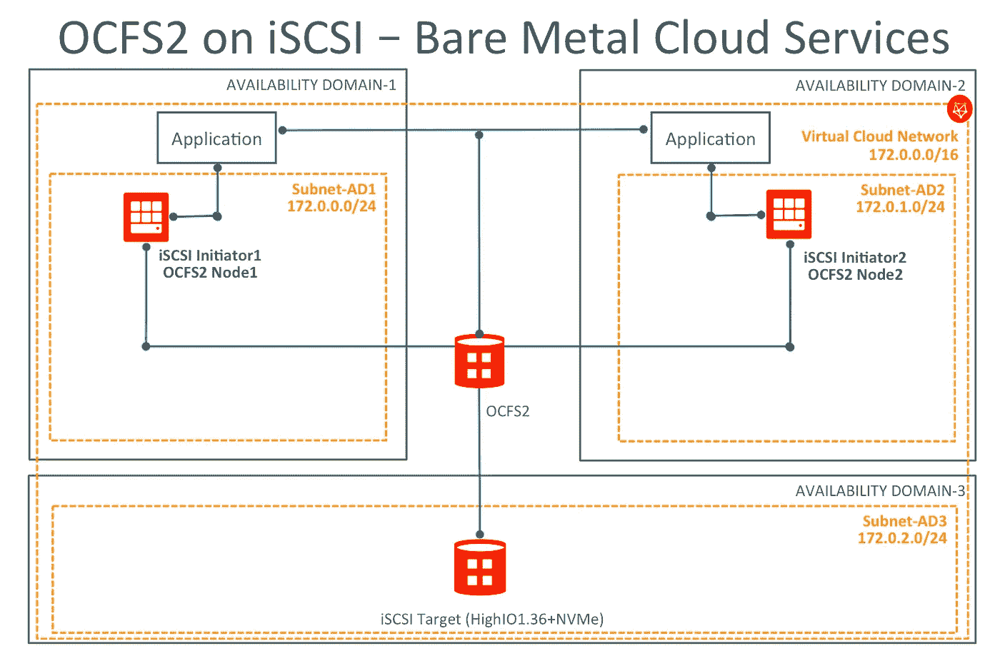
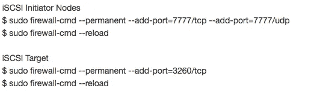
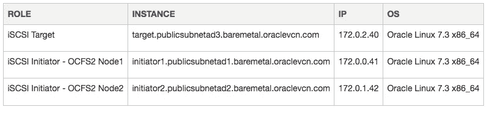
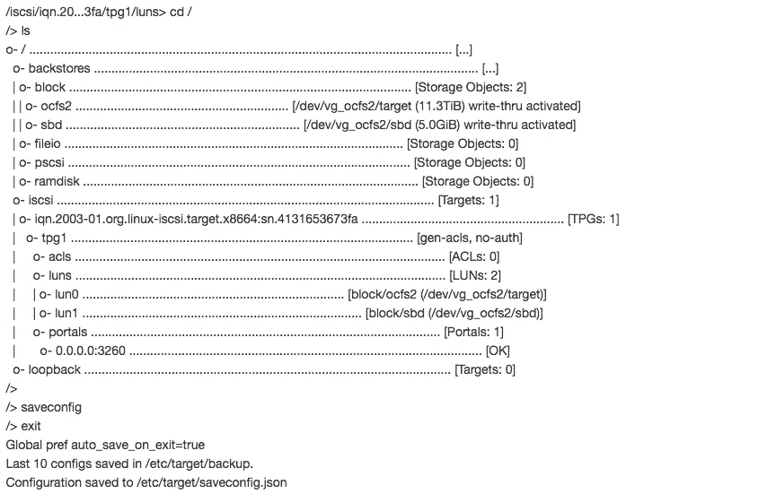
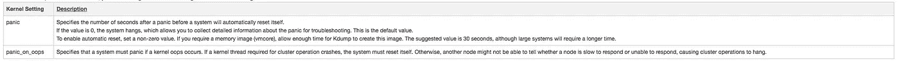
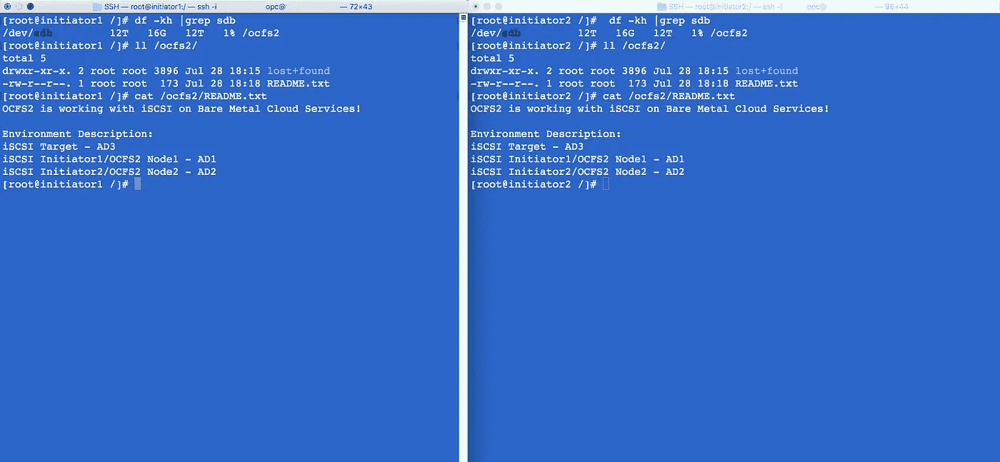

# 在 Oracle 云基础架构上使用 iSCSI 的 Oracle 集群文件系统

> 原文：<https://medium.com/oracledevs/oracle-cluster-file-system-with-iscsi-on-bare-metal-cloud-services-8da5bfcdc6f9?source=collection_archive---------0----------------------->

本教程介绍了使用 iSCSI 作为底层存储在 Oracle 裸机服务上部署 Oracle 集群文件系统(OCFS2)的步骤。

至于 Oracle 云基础设施(OCI)上的配置选项，建议将您的资源分布在您的裸机租赁可用性域(AD)上，以实现容错。

这里是一个 OCFS2 架构的例子，将用于本教程的 OCI

# 什么是 iSCSI？

如[公开文档](http://linux-iscsi.org/wiki/ISCSI)中所述，iSCSI 是一种基于互联网协议(IP)的存储网络标准，用于连接数据存储设施。通过在 IP 网络上传送 SCSI 命令，iSCSI 被用来促进内部网的数据传输和管理远距离存储。iSCSI 可用于通过局域网(LAN)、广域网(wan)或互联网传输数据，并可实现与位置无关的数据存储和检索。

iSCSI 允许客户端(称为启动器)向远程服务器上的 SCSI 存储设备(LinuxIOs)发送 SCSI 命令(CDB)。它是一种流行的 SAN 协议，允许组织将存储整合到数据中心存储阵列中，同时为主机(如数据库和 web 服务器)提供本地连接磁盘的假象。与需要特殊用途电缆的传统光纤通道不同，iSCSI 可以使用现有的网络基础设施长距离运行。

# OCFS2 是什么？

Oracle 集群文件系统版本 2 (OCFS2)是一个通用、高性能、高可用性的共享磁盘文件系统，旨在用于集群。也可以在独立的非集群系统上挂载 OCFS2 卷，如[公共文档中所述。](https://docs.oracle.com/cd/E52668_01/E54669/html/ol7-about-ocfs2.html)

几乎所有的应用程序都可以使用 OCFS2，因为它提供了本地文件系统语义。支持集群的应用程序可以使用来自多个集群节点的缓存一致的并行 I/O 来平衡集群中的活动，或者可以使用可用的文件系统功能进行故障切换，并在一个节点出现故障时在另一个节点上运行。

OCFS2 具有大量特性，这些特性使其适合在企业级计算环境中部署:

*   支持有序和回写数据日志，在电源故障或系统崩溃时提供文件系统一致性。
*   块大小范围从 512 字节到 4 KB，文件系统簇大小范围从 4 KB 到 1 MB(都以 2 的幂为增量)。支持的最大卷大小为 16 TB，相当于 4 KB 的群集大小。对于 1 MB 的集群大小，理论上可以达到 4 PB 的卷大小，尽管这一限制尚未经过测试。
*   基于扩展区的分配，用于高效存储非常大的文件。
*   对稀疏文件、内联数据、未写入范围、打孔、引用链接和分配预留的优化分配支持，可实现高性能和高效存储。
*   对目录进行索引，即使目录包含数百万个对象，也能有效地访问该目录。
*   用于检测损坏的信息节点和目录的元数据校验和。
*   扩展属性，允许将无限数量的名称:值对附加到文件系统对象，如常规文件、目录和符号链接。
*   除了传统的文件访问权限模型之外，对 POSIX ACLs 和 SELinux 的高级安全支持。
*   支持用户和组配额。
*   支持混合了 32 位和 64 位、小端(x86、x86_64、ia64)和大端(ppc64)体系结构的异构节点群集。
*   一个易于配置的内核集群堆栈(O2CB ),带有一个分布式锁管理器(DLM ),用于管理集群节点的并发访问。
*   支持缓冲、直接、异步、拼接和存储器映射 I/O。
*   使用与 ext3 文件系统相似参数的工具集。

# 入门指南

首先，本教程需要至少三个 Oracle 裸机实例；一个实例将作为 iSCSI 目标服务器，其余两个实例将用作 iSCSI 启动器服务器，也用作 OCFS2 群集的节点，本地装载点指向 OCFS2 卷。

下面是该体系结构所需的配置步骤摘要:

1.  您需要配置 iSCSI 目标和启动器裸机实例
2.  下一步将是设置 OCFS2/O2CB 集群节点
3.  要完成安装，您需要创建 OCFS2 文件系统和挂载点

您还需要在 BMCS 仪表板上打开端口 7777 和 3260。您需要编辑 VCN 安全列表，并打开裸机内部网络(非公共网络)的所有端口。

以下是网络 172.0.0.0/16 的示例

> 来源:172.0.0.0/16
> IP 协议:所有协议
> 允许:所有端口的所有流量

或者只打开内部网络所需的 7777 和 3260 端口。以下是端口 7777 的一个示例:

> 来源:172.0.0.0/16
> IP 协议:TCP
> 源端口范围:所有
> 目的端口范围:7777
> 允许:端口的 TCP 流量:7777

请确保 DNS 正常工作，并且您的裸机实例可以跨 ADs 正常通信。下面是一个基于这种设置的/etc/resolv.conf 的快速示例

> $ cat/etc/resolv . conf
> ；由/usr/sbin/dhclient-script 生成
> 搜索 baremetal.oraclevcn.com publicsubnetad3.baremetal.oraclevcn.com publicsubnetad1.baremetal.oraclevcn.com publicsubnetad1.baremetal.oraclevcn.com
> 名称服务器 169.254.169.254

正如您在上面看到的，所有的 ADs DNS 条目都可以在 resolv.conf 文件中找到。

Oracle Linux 防火墙也需要在本地裸机实例中进行更新。

# 环境

# 存储配置

您将配置一个裸机 HighIO1.36，以便能够将 NVMe 磁盘用作 iSCSI 目标，但您也可以将虚拟机形状与连接的数据块存储磁盘一起使用。哪种方式都可以。

对于本教程，假设您已经提供了一个 HighIO1.36 实例，您应该能够将所有 4 个 NVMe 磁盘合并到一个 LVM 逻辑卷(~12Tb)中，或者如果您愿意，也可以单独使用它们。

# LVM 逻辑卷

高 IO1.36 裸机形状有 4 个 NVMe 磁盘(~12TB)，因此下面是创建将用作 iSCSI 目标的单个逻辑卷的过程

> $ sudo PV create/dev/nvme 0 n1/dev/nvme 1 n1/dev/nvme 2 n1/dev/nvme 3 n1
> $ sudo vgcreate VG _ ocfs 2/dev/nvme 0 n1/dev/nvme 1 n1/dev/nvme 2 n1/dev/nvme 3 n1
> $ sudo LV create-L 11500g-n target VG _ ocfs 2

# iSCSI 目标

现在，您可以选择创建带身份验证或不带身份验证的 iSCSI 目标。在本教程中，我们不会使用 CHAP 身份验证，但在下面的参考会话中，您会发现有关如何在必要时配置它的更多详细信息。

# 配置没有 CHAP 身份验证的 iSCSI 目标

在服务器上安装 targetcli 软件包。

> $ sudo yum 安装目标 cli -y

安装软件包后，输入以下命令以获得 iSCSI CLI 的交互式提示符。

> $ sudo targetcli
> 警告:无法加载首选项文件/root/。target CLI/prefs . bin .
> target CLI shell 版本 2.1.fb41
> 版权 2011–2013，由 Datera，Inc .和其他公司所有。如需有关命令的帮助，请键入“help”。
> >

现在使用现有的逻辑卷(/dev/vg_ocfs2/target)作为存储对象“ocfs2”的块类型后备存储。

> /> CD backstores/block
> /backstores/block>create name = ocfs 2 dev =/dev/VG _ ocfs 2/target

使用/dev/vg_ocfs2/target 创建了块存储对象 ocfs2。

创建一个目标

> /back stores/block > CD/iscsi
> /iscsi>创建 iqn . 2003–01 . org . Linux-iscsi . target . x 8664:sn . 4131653673 fa
> 创建目标 iqn . 2003–01 . org . Linux-iscsi . target . x 8664:sn . 4131653673 fa .
> 创建 TPG 1 .
> Global pref auto _ add _ default _ portal = true
> 创建了默认门户监听所有 IP(0 . 0 . 0 . 0)，端口 3260。
> /iscsi >

默认情况下，身份验证是启用的，禁用它

> /iscsi/iqn.20…3fa/tpg1/acls >创建 iqn . 2003–01 . org . Linux-iscsi . target . x 8664:sn . 4131653673 fa
> 为 iqn . 2003–01 . org . Linux-iscsi . target . x 8664:sn . 4131653673 fa
> /iscsi/iqn . 20…3fa/TPG 1
> /iscsi/iqn . 20…653673 fa/TP G1>设置属性 generate_node_acls=1
> 参数 generate_node_acls 现在为‘1’。

在目标下创建一个 LUN，该 LUN 应该使用前面提到的名为“ocfs2”的后备存储对象

> /iscsi/iqn . 20…653673 fa/TPG 1 > CD/iscsi/iqn . 2003–01 . org . Linux-iscsi . target . x 8664:sn . 4131653673 fa/TPG 1/LUN
> /iscsi/iqn . 20…3fa/TPG 1/LUN>pwd
> /iscsi/iqn . 2003–01 . org . Linux-iscsi . target。

验证目标服务器配置。

启用并重新启动目标服务。

> $ sudo systemctl 启用 target.service
> $ sudo system CTL 启动 target . service

# iSCSI 启动器

# 配置不带 CHAP 身份验证的启动器

现在是时候配置您的裸机 iSCSI Initiator1 和 Initiator2 节点，以使用此目标作为存储。以下步骤需要在两个 iSCSI 启动器节点上完成。默认情况下，Iscsi-initiator-utils 软件包应安装在 Oracle Linux 裸机映像中，但请使用以下命令仔细检查。

> $ sudo yum 安装 iscsi-initiator-utils -y

使用下面的命令发现目标。

> $ sudo iscsiadm-m discovery-t ST-p 172.0.2.40
> 172 . 0 . 2 . 40:3260，1 iqn . 2003–01 . org . Linux-iscsi . target . x 8664:sn . 43673 fa

编辑下面的文件并添加 iscsi 启动器名称

> $ sudo VI/etc/iscsi/initiator name . iscsi
> initiator name = iqn . 2003–01 . org . Linux-iscsi . target . x 8664:sn . 41353673 fa

重新启动并启用发起程序服务。

> $ sudo systemctl 启用 iscsid.service
> $ sudo system CTL 重新启动 iscsid . service

登录到发现的目标。

> $ sudo iscsi ADM-m node-T iqn . 2003–01 . org . Linux-iscsi . target . x 8664:sn . 4131653673 fa-p 172.0.2.40-l
> 
> 登录[iface: default，target:iqn . 2003–01 . org . Linux-iscsi . target . x 8664:sn . 4131653673 fa，portal: 172.0.2.40，3260](多个)
> 
> 登录【iface: default，target:iqn . 2003–01 . org . Linux-iscsi . target . x 8664:sn . 4131653673 fa，portal: 172.0.2.40，3260】成功。

两个 iSCSI 启动器裸机实例现在都应该能够看到新磁盘

> $ sudo fdisk-l | grep sdb
> Disk/dev/sdb:12455.4 GB，12455405158400 字节，24326963200 个扇区

# OCFS2

# 为集群堆栈创建配置文件

安装所需的 OCFS2 软件包

> $ sudo yum install ocfs 2-tools-devel ocfs 2-tools-y

现在，使用 o2cb 命令或文本编辑器创建配置文件。让我们使用下面的命令来创建一个集群定义。

> $ sudo o2cb add-cluster bmcsocfs2

如果配置文件/etc/ocfs2/cluster.conf 不存在，该命令将创建它。

对于每个节点，使用以下命令定义节点。

> $ sudo o2cb 添加节点 bmcsocfs2 启动器 1—IP 172.0.0.41
> $ sudo o2cb 添加节点 bmcsocfs2 启动器 2—IP 172.0.1.42

注意:节点的名称必须与/etc/sysconfig/network 中配置的系统主机名的值相同。IP 地址是节点将在集群中用于私有通信的地址。

您需要将集群配置文件/etc/ocfs2/cluster.conf 复制到集群中的每个节点。

在重新启动集群堆栈之前，对集群配置文件所做的任何更改都不会生效。

以下/etc/ocfs2/cluster.conf 配置文件定义了一个名为 bmcsocfs2 的双节点集群，该集群具有本地心跳，这是本教程中使用的配置。

> $ sudo cat/etc/ocfs 2/cluster . conf
> cluster:
> heart beat _ mode = local
> node _ count = 2
> name = bmcsocfs 2
> node:
> number = 0
> cluster = bmcsocfs 2
> IP _ port = 7777
> IP _ address = 172.0.0.41
> name = initiator 1
> node:
> number = 1
> cluster = bmcsocfs 2
> IP _ port

# 配置集群堆栈

在群集的每个节点上运行以下命令:

> $ sudo /sbin/o2cb.init 配置

配置 O2CB 驱动程序。

这将配置 O2CB 驱动程序的启动属性。

以下问题将确定驱动程序是否已加载

靴子。当前值将显示在括号(“[]”)中。打

<enter>不输入答案将保持当前值。Ctrl-C</enter>

将中止。

启动时加载 O2CB 驱动程序(y/n) [y]:

集群堆栈支持 O2CB [o2cb]:

引导时启动的群集(输入“none”清除)[ocfs2]: bmcsocfs2

指定心跳停止阈值(> =7) [31]:

指定网络空闲超时，单位为毫秒(> =5000) [30000]:

指定网络保持活动延迟，单位为毫秒(> =1000) [2000]:

指定网络重新连接延迟，单位为毫秒(> =2000) [2000]:

正在写入 O2CB 配置:正常

正在检查调试…

设置集群堆栈“o2cb”:正常

正在注册 O2CB 群集“bmcsocfs2”:正常

设置 O2CB 集群超时:正常

正在启动群集“bmcsocfs2”的全局心跳:正常

上述选项的解释可在 OCFS2 [公共文档](https://docs.oracle.com/cd/E52668_01/E54669/html/ol7-config-stack-ocfs2.html)中找到。

要验证集群堆栈的设置，请输入/sbin/o2cb.init status 命令:

$ sudo /sbin/o2cb.init 状态

“configfs”的驱动程序:已加载

文件系统“configfs”:已挂载

堆栈粘合驱动程序:已加载

堆栈插件“o2cb”:已加载

“ocfs2_dlmfs”的驱动程序:已加载

文件系统“ocfs2_dlmfs”:已挂载

检查 O2CB 集群“bmcsocfs2”:联机

心跳停止阈值:31

网络空闲超时:30000

网络保持活动延迟:2000

网络重新连接延迟:2000

心跳模式:本地

检查 O2CB 心跳:活动

调试文件系统，位于/sys/kernel/debug: mounted

在本例中，集群处于在线状态，并且使用本地心跳模式。如果没有配置卷，O2CB 心跳将显示为非活动而非活动。配置 o2cb 和 ocfs2 服务，以便它们在启用网络后的引导时启动。

> $ sudo system CTL enable o2cb
> $ sudo system CTL enable ocfs 2

这些设置允许节点在系统启动时自动挂载 OCFS2 卷。

# 为集群操作配置内核

为了正确运行群集，您必须配置下表中显示的内核设置:

在每个节点上，输入以下命令来设置 panic 和 panic_on_oops 的建议值:

> $ sudo sysctl kernel . panic = 30
> $ sudo sysctl kernel . panic _ on _ oops = 1

要使更改在重新引导后保持不变，请将以下条目添加到/etc/sysctl.conf 文件中:

> #为集群操作定义 panic 和 panic _ on _ oops
> kernel . panic = 30
> kernel . panic _ on _ oops = 1

# 启动和停止集群堆栈

下表显示了可用于在集群堆栈上执行各种操作的命令。

**命令描述**/sbin/o2cb . init status 检查集群栈的状态。/sbin/o2cb . init online 启动集群堆栈。/sbin/o2cb . init offline 停止集群堆栈。/sbin/o2cb.init 卸载卸载集群堆栈。

# 创建 OCFS2 卷

您可以使用 mkfs.ocfs2 命令在设备上创建 ocfs2 卷。如果要标记卷并通过指定标签来挂载它，设备必须对应于一个分区。不能通过指定标签来装载未分区的磁盘设备。

> $ sudo mkfs . ocfs 2-L " ocfs 2 "/dev/sdb
> 
> mkfs.ocfs2 1.8.6
> 
> 集群堆栈:经典 o2cb
> 
> 标签:ocfs2
> 
> 功能:稀疏扩展-slotmap 备份-超级未写入内联-数据严格-日志-超级 xattr 索引-目录引用计数不连续-bg
> 
> 块大小:4096 (12 位)
> 
> 簇大小:4096 (12 位)
> 
> 卷大小:12455405158400 (3040870400 簇)(3040870400 块)
> 
> 聚类组:94274(尾部覆盖 512 个聚类，其余覆盖 32256 个聚类)
> 
> 区分配器大小:780140544 (186 组)
> 
> 日志大小:268435456
> 
> 节点插槽:16 个
> 
> 创建位图:完成
> 
> 初始化超级块:完成
> 
> 写入系统文件:完成
> 
> 编写超级块:完成
> 
> 正在写入备份超级块:6 个块
> 
> 格式化日记帐:完成
> 
> 增长范围分配器:完成
> 
> 格式化插槽映射:完成
> 
> 格式化配额文件:完成
> 
> 写入丢失+找到:完成
> 
> mkfs.ocfs2 成功

# 装载 OCFS2 卷

如下例所示，如果希望系统在启动网络后的引导时装入 OCFS2 卷，并在网络停止前卸载文件系统，请在/etc/fstab 中指定 _netdev 和 nofail 选项。

> $ sudo mkdir/ocfs 2
> $ sudo VI/etc/fstab
> 
> #包含下面一行以在重启后挂载 ocfs 2
> /dev/sdb/ocfs 2 ocfs 2 _ net dev，默认为 0 0

现在，您可以运行“使用 mount.ocfs2 手动挂载 ocfs2 设备”或“mount -a”。

在裸机实例上使用 iSCSI 的 OCFS2 设置已完成。现在，您应该在 Initiator1 和 Initiator2 Oracle Linux 7.3 节点上的/ocfs2 上挂载了一个集群文件系统，如下所示。

