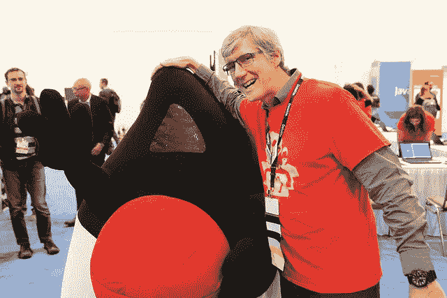

# Oracle 代码回来了—更大更好！

> 原文：<https://medium.com/oracledevs/oracle-code-is-back-bigger-and-better-b0058bae8d39?source=collection_archive---------0----------------------->

2018 年对开发者来说又是伟大的一年！Oracle 令人惊叹的全球开发者大会系列 Oracle Code 又回来了，而且更大更好！

2017 年，甲骨文举办了第一系列甲骨文代码开发者大会。在全球 20 多个城市，该系列吸引了来自世界各地的 10，000 多名开发人员，为他们提供了学习新技能、与同龄人交流以及带回家一些美好回忆的机会。继取得巨大成功之后，甲骨文公司将于 2 月下旬在洛杉矶开始在全球举办另外 14 场活动。关于 Oracle Code，出席会议和在会议上发言都是完全免费的，这表明 Oracle 信守了对开发人员社区的承诺。在四大洲，你将听到业界最热门的一切:区块链、容器、微服务、API 设计、机器学习、人工智能、移动、聊天机器人、数据库、低代码开发、流行的编程语言、CI/CD、DevOps 等等，这些都将在甲骨文代码的中心。

在为期一天的活动中，可容纳 500 人，开发人员可以分享他们的经验，参与动手实验室，与主题专家交流，最重要的是，可以在甲骨文代码休息室享受乐趣。

# 物联网云酿造啤酒

有几分钟时间尝试一下当地微型啤酒厂的物联网云酿造啤酒吗？使用来自互联设备的数据快速扩展制造流程和物流运营。brew 背后的技术:物联网生产监控、物联网资产监控、大数据、活动中心、Oracle JET。

# 3D Builder 游乐场

使用 3D 打印机创建自己的雕塑和家具，并帮助完成使用 Java constructive geometry library 创建的家具。使用的 Oracle 技术是运行 Visual IDE 的应用容器云和运行 JSCG 库的 Java SE。

# Oracle Zip 实验室挑战

想要一些吹嘘的权利，同时赢得奖品？注册参加 15 分钟的 Oracle 云内容实验室，在排行榜上看到您的名字，成为 Oracle Zip 实验室挑战赛的获胜者。

# 物联网研讨会

在物联网研讨会上与其他与会者互动和交流想法。获得自己的 Wi-Fi 微控制器，连接 Oracle 物联网云服务。Oracle 开发人员社区正在与 AppsLab 和 Oracle 应用云用户体验新兴技术团队合作举办这些研讨会。

# 机器人用云聊天机器人统治

让机器人 NAO 打太极，或者问“谁酿造了啤酒”？那么 NAO 是如何做到这一点的呢？它使用 Oracle Mobile Cloud Service 上的智能 Bot API 来理解您的命令，并通过与您对话来做出回应。

# 开发现场

Oracle Code 的工作人员也想到了那些没有那么幸运亲自参加 Oracle Code 的人:Dev Live 是在 Oracle Code 进行的现场采访，这些采访在全球范围内在线播放，以便每个人都可以观看开发人员和社区成员分享他们的经验。

# 立即注册！

**立即注册**参加在 https://developer.oracle.com/code[举办的甲骨文代码活动](https://developer.oracle.com/code?source=WWMK170725P00097:em:ip:ie:pt:RC_WWMK171031P00005:GVblog2)

**有没有自己做过的有趣的事，想和全世界分享？**在[https://developer.oracle.com/code/cfp](https://developer.oracle.com/code/cfp?source=WWMK170725P00097:em:ip:ie:pt:RC_WWMK171031P00005:GVblog2)提交征文方案

下次再见，甲骨文代码！