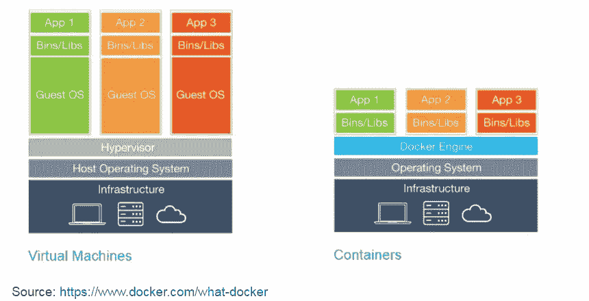
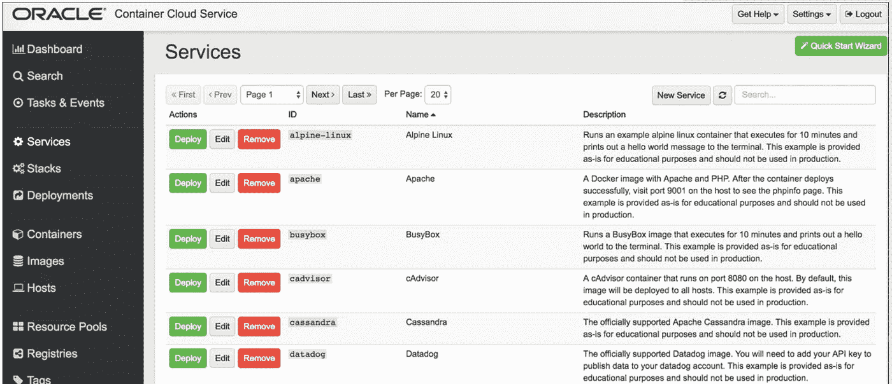
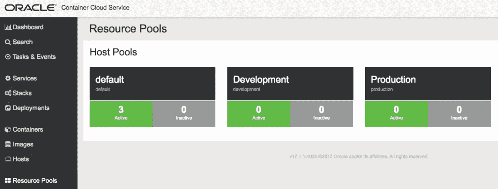

# Oracle 容器云服务简介

> 原文：<https://medium.com/oracledevs/oracle-container-cloud-service-introduction-308eda525022?source=collection_archive---------4----------------------->

甲骨文终于在去年推出了甲骨文容器云服务。Oracle Container Cloud Service 基于 Oracle 收购 StackEngine 后的团队开发的技术，是一种集成到 Oracle 云中的云原生且兼容 Docker 的容器即服务(CaaS)解决方案。它是企业就绪型的，具有在 Oracle 云上组合、部署、编排、调度和操作基于 Docker 容器的应用程序的全面工具。OCCS 专为开发、开发/测试、开发运维以及容器原生用例而设计，通过 webhooks 和 REST API 支持自我修复调度、内置服务发现以及 CI/CD 集成。以下是其竞争对手-

–AWS 或 Azure 的 Docker

—亚马逊弹性容器服务

—谷歌容器引擎

— Azure 容器服务

-中间层的 DC/OS

–Red Hat 的 OpenShift

在构建和部署应用程序时，Oracle Container Cloud Service 为开发和运营团队提供了简单、安全的 Docker 容器化优势。OCCS 是 Oracle 云环境中的最新成员。这是一种 PaaS 服务，解决了在生产中运行 Docker 的额外需求。

**管理人员和工作人员服务**要开始使用 Oracle Container Cloud Service，首先要定义一个 OCCS 服务，它代表一组用于 OCCS 的主机。服务总是由一个管理节点和一个或多个工作节点组成。

管理节点将容器部署到工作节点。工作节点托管容器或容器堆栈。一个服务的工作节点集可以进一步细分为构建资源组的池。

每个已配置的 OCCS 服务都有自己的管理员用户和密码。要设置 OCCS 服务，您需要定义其服务名，并创建一个新的 SSH 密钥或指定一个现有的密钥。使用这个 SSH 密钥，您可以从命令行连接到服务。

**甲骨文容器云服务:**

–提供易于使用的界面来管理 Docker 环境

–提供可通过一次点击部署的容器化服务和应用堆栈的现成示例

–使开发人员能够轻松连接到他们的私有 Docker 注册中心(这样他们就可以“自带容器”)

–使开发人员能够专注于构建容器化的应用映像和持续集成/持续交付(CI/CD)管道，而不是学习复杂的编排技术

你可以从 Oracle.com 申请 30 天的试用账户。要了解如何使用试用帐户，请观看下面的视频。

容器云服务使用 docker。让我们了解一下 Docker，

Docker 在过去的三年里取得了巨大的成功。从 2014 年一项几乎不为人知且颇具技术性的开源技术，它已经发展成为一个标准化的运行时环境，现已得到许多 Oracle 企业产品的官方支持。

**基础知识**
Docker 的核心概念是图像和容器。Docker 映像包含运行软件所需的一切:代码、运行时(例如 JVM)、驱动程序、工具、脚本、库、部署等等。

Docker 容器是 Docker 映像的运行实例。然而，与使用类型 1 或类型 2 管理程序的传统虚拟化不同，Docker 容器运行在主机操作系统的内核上。在 Docker 映像中，没有独立的操作系统，

Oracle Container Service 建立在 Oracle 收购 StackEngine 的基础上。你可以在容器服务上运行 docker。OCCS 提供几种预定义的 OCCS 集装箱服务。OCCS 容器服务定义了 Docker 服务以及运行 Docker 映像及其部署指令所需的配置设置。Oracle Container Cloud Service(OCCS)附带了一些流行的服务示例，如 apache、nginx、jenkins、logstash、mariadb 等。

加上默认的部署指令。服务既不是容器，也不是运行在容器中的映像。它是一个高级配置对象，您可以使用 Oracle Container Cloud Service 来创建、部署和管理它。将服务想象成一个容器“模板”，或者一组部署一个运行中的容器所遵循的指令。

**Stack** — Stack 是以协调的方式将一组服务作为 Docker 容器运行并作为单个实体管理的所有必要配置，加上默认的部署指令。可以把它想象成多容器应用程序。堆栈本身既不是容器，也不是在容器中运行的映像，而是可以使用 Oracle Container Cloud Service 创建、部署和管理的高级配置对象。例如，一个堆栈可能是一个或多个 WildFly 容器和一个 Couchbase 容器。同样，数据库或应用程序节点的集群可以构建为一个堆栈。

**部署** —部署由一个服务或堆栈组成，其中 Docker 容器根据您定义的一组编排规则进行管理、部署和扩展。单个部署可以导致在资源池中的一个或多个主机上创建一个或多个 Docker 容器。

**资源池** —资源池是一种组织主机并将它们组合成独立的计算资源组的方式。通过在多台主机上高效部署服务和堆栈，资源池使您能够更有效地管理 Docker 环境。三个资源池是现成定义的。

**栈**
OCCS 不仅定义和部署单一服务。您还可以将服务链接在一起，并作为一个堆栈启动它们。OCCS 控制台已经提供了几个预定义的堆栈示例，比如带有数据库的 WordPress 或者带有主服务器和从服务器的 Redis 集群。

栈由列出所包含的服务的 YAML 文件定义。您可以为堆栈中的每个服务定义环境变量。

请给 OCCS 一个机会。甲骨文云学习快乐。

*最初发表于***。**