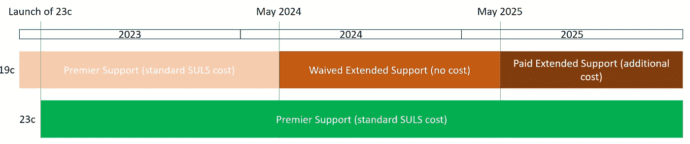

# Oracle 数据库 19c 免除扩展支持费用

> 原文：<https://medium.com/version-1/oracle-database-19c-extended-support-cost-waived-f3db891e6900?source=collection_archive---------6----------------------->

Photo by [Bram Van Oost](https://unsplash.com/@ort?utm_source=unsplash&utm_medium=referral&utm_content=creditCopyText) on [Unsplash](https://unsplash.com/s/photos/windows-laptop?utm_source=unsplash&utm_medium=referral&utm_content=creditCopyText)

最近，我们有几个关于 Oracle 数据库 19c 支持的问题；19c 是 Oracle 当前的 Oracle 数据库长期支持(LTS)版本，但是，它目前仅处于高级支持状态，直到 2024 年 4 月，没有*当前*的替代 LTS 版本可供迁移。

预计 23c 将很快宣布(CloudWorld 是下周……)作为下一个 LTS 版本，可能在 2023 年初正式发布。

从下面的时间表可以看出，23c 发布和 19c 进入扩展支持之间的时间大约是 1 年；23c 稳定下来并被采用的时间不多了。

因此，Oracle 最近宣布，从 2024 年 5 月到 2025 年 4 月，延长支持将免除 1 年的延长支持费用；这对客户来说是个好消息！值得注意的是扩展支持的局限性，应该使用扩展支持来鼓励尽快迁移到 23c。

值得注意的是，虽然我们正在缓慢但肯定地看到 19c 的庄园，但在大型庄园中仍有大量 11g 和 12c 在使用。这些版本的支持选项是不存在的/有限的，并经常提出“如果这些版本不再受支持，我们为什么要支付支持费用？”。

与以往一样，了解您的支持立场和合规状态是有好处的，如果您需要帮助查看这些或任何其他许可建议，请联系我们。

更多信息请点击[这里](https://www.oracle.com/us/assets/057419.pdf)

**关于作者:** Paul Bullen 是首席甲骨文许可顾问和第一版[的实践主管。](https://www.version1.com/)