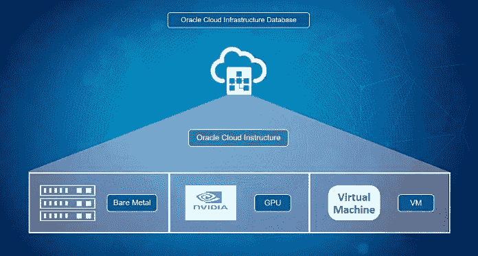
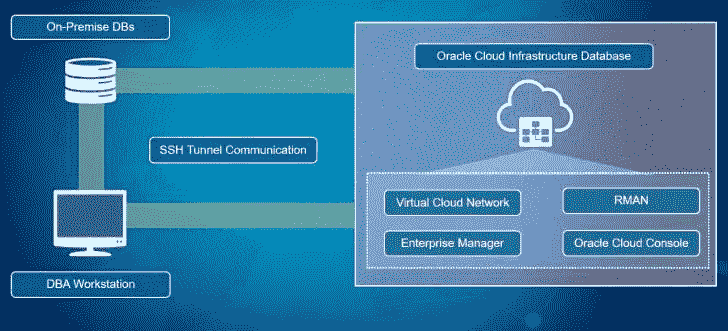
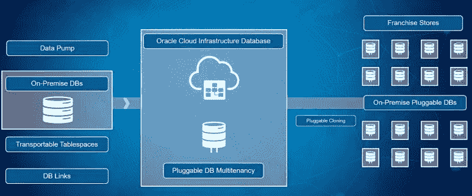
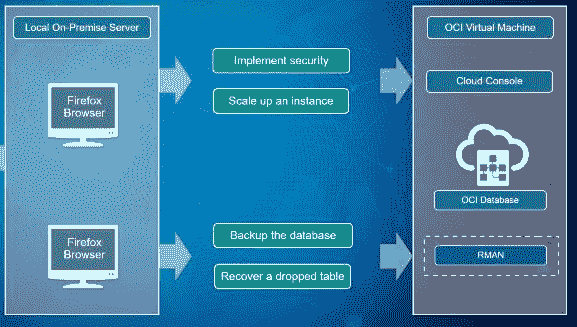

# Oracle 数据库云服务研讨会

> 原文：<https://medium.com/oracledevs/oracle-database-cloud-service-workshop-d474be4159a5?source=collection_archive---------0----------------------->

如今，许多公司都在努力满足本地和分布式数据库混合的复杂需求。DBA 被劳动密集型的功能压得喘不过气来，例如创建升级和保护一个由不同数据库组成的错综复杂的网络。在这个分步指导的研讨会中，您可以了解如何将本地数据库迁移到运行在 OCI (Oracle 云基础架构)之上的 Oracle 数据库云服务。通过遵循下面链接的说明，您可以从头开始，最终学习如何在云中部署和管理数据库。

# 研讨会概述

Oracle 云基础架构计算虚拟机服务器为数据库云服务提供了理想的平台，为所有工作负载提供了最高的性能和灵活性。

在本研讨会中，您将学习的第一件事是如何为您的混合数据库环境建立一个安全的网络。您将使用图形云控制台创建一个虚拟云网络和一个 ssh 隧道。利用这个安全网络，您将创建一个新的 DBCS 实例，然后使用 Enterprise Manager 访问数据库。

接下来，您将探索一些将数据从内部迁移到云的常见使用案例。解决这一数据移动挑战有多种选择。您将使用 SQL Developer 和命令行工具来克隆一个可插拔数据库，并将其从本地数据库(您的虚拟机)移动到您的云数据库。您还将使用标准的 Oracle 数据泵工具从本地数据库导出一个模式，然后将该数据以新的模式导入到您的云数据库中。您将探索的最后一个选项使用 RMAN 将表空间移动到云中。

虽然 Oracle 云极大地简化了 DBA 的任务，但是 DBA 仍然需要在 DBCS 实例的开发和维护中发挥作用。您将学习完成的一些任务包括实施安全性、按需扩展、备份和恢复。

最后，您将使用 Oracle 命令行界面(CLI)来检索关于各种云服务的配置和状态的信息，而无需使用云控制台。

# 立即开始您的免费试用和指导教程！

如果您还没有包含 300 美元云信用的免费试用帐户，[请点击此处注册一个](https://myservices.us.oraclecloud.com/mycloud/signup?language=en&sourceType=:ex:of:::RC_NAMK180711P00050:DBCS_OCI_HOL&SC=:ex:of:::RC_NAMK180711P00050:DBCS_OCI_HOL&pcode=NAMK180711P00050)

使用此链接访问教程的视频概述，以及将引导您完成本次研讨会的分步实验指南:【go.oracle.com/dbcs_oci