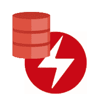

# 面向 Kubernetes 的 Oracle 数据库操作员—第 2 课

> 原文：<https://medium.com/oracledevs/oracle-database-operator-for-kubernetes-take-2-e0227ca7b7c3?source=collection_archive---------0----------------------->

OraOperator

[Oracle Database Operator for Kubernetes](https://github.com/oracle/oracle-database-operator)(# ora Operator)的介绍版( [v0.1.0](/oracledevs/making-oracle-database-kubernetes-native-401233c02780) )让您可以管理单实例数据库、分片数据库和共享基础设施上的自治数据库(ADB-S)的生命周期。

在这个功能丰富的 v0.2.0 版本中，#OraOperator 将其应用范围扩展到了更多的数据库配置，并增强了现有的功能。希望你能理解为什么在 v0.1.0 之后，我们花了一段时间才把它推出来。但是不要只相信我的话——你自己去看看吧。

# #OraOperator v0.2.0 有什么？

而操作符本身部署在 Kubernetes 集群上(参见“OraOperator 在哪里运行？ *"* )，其运营范围跨越部署在 Kubernetes 集群内部和外部的数据库。

以下是您将在 v0.2.0 版本中发现的内容。

## In-k8s 集群数据库

这些运行在容器中的数据库(比如 Docker)部署在 Kubernetes 集群中。

*单实例数据库(SIDB)*

此版本为 SIDB 控制器带来了新的增强功能，例如支持预构建的 XE 以实现更快的配置。功能列表包括供应、克隆、补丁(就地/非就地)、更新数据库初始化参数、更新数据库配置(闪回、归档)、Oracle Enterprise Manager(EM)Express(一个基本的可观察性控制台)、Oracle REST 数据服务(ORDS)以支持基于 REST 的 SQL、PDB 管理、SQL Developer Web 和 Application Express (Apex)。在 [SIDB 控制器文档](https://github.com/oracle/oracle-database-operator/tree/main/docs/sidb)中获取更多详细信息。

*分片数据库*

操作员可以提供分片拓扑，添加新的分片，以及删除现有的分片。在[分片数据库控制器文档](https://github.com/oracle/oracle-database-operator/tree/main/docs/sharding)中获得更多详细信息。

## 非 k8s 集群数据库

这些数据库要么运行在 Oracle 云中，要么在本地运行。

*自治数据库&容器*

自治数据库运行在 Oracle 云基础设施(OCI)中，位于 Kubernetes 集群之外。

*   ADB-S:代表共享基础设施上的自治数据库。换句话说，多个租户共享同一个基础设施，但是每个租户部署自己的数据库。在此版本中，操作员可以提供、绑定、启动、停止、终止(软/硬)和扩展(上/下)ADB 它还可以执行手动或按需备份以及手动恢复。
    注意:自治数据库已经执行自动备份和恢复。
*   ADB-D:代表专用基础设施上的自治数据库；租户独占使用基础设施。对 ADB-D 的支持是此版本中的一项新功能。操作员可以供应、绑定、启动、停止、终止(软/硬)和扩展(上/下)ADB。此外，作为此版本的新增功能，它还可以执行手动备份和手动恢复。
*   自治容器数据库(ACD):这是插入自治数据库的数据库基础设施。在此版本中，对 ACD 的支持是新增的。操作员可以提供、绑定、重启和终止(软/硬)自动呼叫分配器。

在 [ADB 文件](https://github.com/oracle/oracle-database-operator/tree/main/docs/adb)和 [ACD 文件](https://github.com/oracle/oracle-database-operator/tree/main/docs/acd)中获得更多详细信息。

*数据库云服务(DBCS)*

DBCS 由虚拟机上的单节点 DB 系统和双节点 Oracle RAC 系统组成；这是 OCI 联合管理数据库的一部分(即由 Oracle 和客户管理)。对数据库云服务的支持是本版本中的新增功能。操作员可以供应、绑定、扩大/缩小、活动探测 DBCS，还可以执行手动备份。在 [DBCS 控制器文档](https://github.com/oracle/oracle-database-operator/tree/main/docs/dbcs)中获得更多细节。

*内部数据库*

应许多客户的要求，本地多租户数据库生命周期的自动化是 IT 现代化不可或缺的一部分。借助#OraOperator，多租户数据库(CDB/pdb)可以集成到 DevOps CI/CD 中。在此版本中，操作员可以绑定到现有的 CDB，创建 PDB，插入 PDB，拔出 PDB，删除 PDB，克隆 PDB，以及打开/关闭 PDB。在[内部控制器文档](https://github.com/oracle/oracle-database-operator/tree/main/docs/onpremdb)中获取更多详细信息。

# OraOperator 运行在哪里？

#OraOperator 运行在几乎所有的 Kubernetes 平台上，无论是云中还是内部部署。它已经在以下 Kubernetes 平台上完美地安装和测试。

*   [适用于 Kubernetes 的 Oracle 容器引擎(OKE)](https://www.oracle.com/cloud-native/container-engine-kubernetes/) 使用 Kubernetes 1.17 或更高版本
*   [Oracle Linux Cloud Native Environment(OLCNE)](https://docs.oracle.com/en/operating-systems/olcne/)1.3 或更高版本
*   版本 1.21.0 或更高版本的 Minikube
*   [Azure Kubernetes 服务](https://azure.microsoft.com/en-us/services/kubernetes-service/)
*   [亚马逊弹力 Kubernetes 服务](https://aws.amazon.com/eks/)
*   [红帽 OKD](https://www.okd.io/)
*   [Red Hat OpenShift](https://www.redhat.com/en/technologies/cloud-computing/openshift/) (我们已经从合作伙伴那里听说了)
*   定制 K8s 平台(我们听说过)

这些平台之间的主要区别在于集群内数据库的持久卷配置。如果您测试过上面列出的任何 k8s 平台或其他平台，请分享您的安装经验(#oraoperator)。

# 期待…

在即将发布的版本中，#OraOperator 将进入生产状态，增加对更多数据库部署的支持，并提供额外的服务，如 OLM 安装、open telemetry-based unified observability(traces，logs metrics)和 Grafana 仪表板，等等。

**@kmensah** 和 **#OraOperator** 用于通知、提问和讨论。

感谢阅读。

注意:如果您在 DevOps 普遍使用 k8s 和 swoon，我们知道您会喜欢 Oracle 云基础架构的免费层帐户。[立即注册免费 Tier 账户！](https://signup.cloud.oracle.com/?language=en&sourceType=:ex:tb:::::Medium_oracleDBoperatorForK8sTake2&SC=:ex:tb:::::Medium_oracleDBoperatorForK8sTake2&pcode=)

# 加入对话！

如果你对 Oracle 开发人员在他们的自然环境中发生的事情感到好奇，就来参加我们的公共休闲频道吧！我们不介意成为你的鱼缸🐠