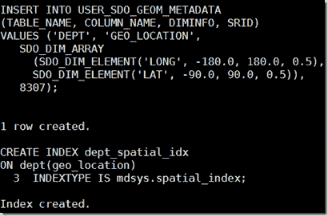
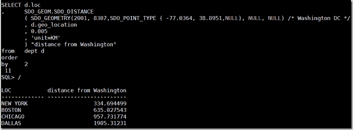
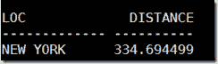
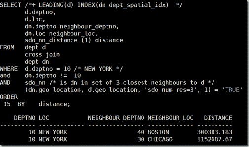
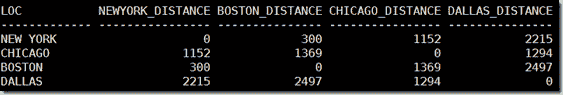

# 使用 Oracle 数据库上的定位器和图形及空间数据处理地理位置数据

> 原文：<https://medium.com/oracledevs/oracle-database-standard-geo-location-support-using-locator-included-in-every-edition-1b4288922803?source=collection_archive---------2----------------------->


许多数据库都支持地理数据中的位置，以及确定距离和最近位置(在一定范围内)。Oracle 数据库具有[图形和]空间选项—支持甚至最高级和最奇特的位置相关数据查询形式(包括多维形状和可能的相对论效应)；该选项是在企业版的基础上提供的，需要额外的费用。可能不太为人所知的是定位器功能，它是每个版本的 Oracle 数据库的一部分，包括 XE 和 se，(不需要任何额外的费用)，并具有大多数数据库都有的地理支持。在这篇文章中，我将非常简要地介绍这个定位器功能的用途。

有关定位器的详细文档，请参见: [Oracle Database 12c 文档—定位器](https://docs.oracle.com/database/121/SPATL/sdo_locator.htm#SPATL340)(以及针对 Oracle Database 11g 的[http://docs . Oracle . com/CD/e 11882 _ 01/app dev . 112/e 11830/SDO _ Locator . htm # spatl 340](http://docs.oracle.com/cd/E11882_01/appdev.112/e11830/sdo_locator.htm#SPATL340))。

我将假设 DEPT 和 EMP 的遗留数据模型(下载用于创建 SCOTT 的数据库模式对象的 DDL 脚本: [scott_build.sql](https://github.com/lucasjellema/sig-nosql-mongodb/blob/master/hr-queries/scott_build.sql) )。

# 1.为地理空间数据准备表格

—添加部门的地理空间数据(经度、纬度)

```
alter table dept add (geo_location SDO_GEOMETRY)
```

SDO_GEOMETRY 是一种对象类型，它描述并支持任何类型的几何。SDO_GTYPE 值的示例包括二维点的 2001。SRID 值 8307 与广泛使用的 WGS84 经度/纬度坐标系相关联。

# 2.向表中的记录添加地理信息

现在已经添加了一个列来保存 SDO_GEOMETRY 对象，我们可以开始将位置数据加载到表中。

```
update dept 
set geo_location = SDO_GEOMETRY(2001, 8307,SDO_POINT_TYPE (-96.8005, 32.7801,NULL), NULL, NULL) 
where loc = 'DALLAS' update dept set geo_location = SDO_GEOMETRY(2001, 8307,SDO_POINT_TYPE (-73.935242, 40.730610,NULL), NULL, NULL) 
where loc = 'NEW YORK' update dept set geo_location = SDO_GEOMETRY(2001, 8307,SDO_POINT_TYPE ( -71.0598, 42.3584,NULL), NULL, NULL) 
where loc = 'BOSTON' update dept set geo_location = SDO_GEOMETRY(2001, 8307,SDO_POINT_TYPE (-87.6298, 41.8781,NULL), NULL, NULL) 
where loc = 'CHICAGO'
```

# 3.在用户 _ SDO _ GEOM _ 元数据中准备元数据

对于每个空间列(SDO_GEOMETRY 类型)，必须在 USER _ SDO _ GEOM _ 元数据视图中插入适当的行，以反映数据所在区域的维度信息。您必须在创建空间索引之前完成此操作

```
-- The USER_SDO_GEOM_METADATA view has the following definition:
-- ( TABLE_NAME VARCHAR2(32), 
-- COLUMN_NAME VARCHAR2(32), 
-- DIMINFO SDO_DIM_ARRAY, 
-- SRID NUMBER --); -- insert dimensional information for the spatial column 
-- the dimensional range is the entire Earth, and the coordinate system is the widely used WGS84 (longitude/latitude) system (spatial reference ID = 8307 INSERT INTO USER_SDO_GEOM_METADATA 
(TABLE_NAME, COLUMN_NAME, DIMINFO, SRID) 
VALUES ('DEPT', 'GEO_LOCATION', SDO_DIM_ARRAY (SDO_DIM_ELEMENT('LONG', -180.0, 180.0, 0.5), SDO_DIM_ELEMENT('LAT', -90.0, 90.0, 0.5)), 8307);
```

# 4.创建地理空间索引

在保存 SO_GEOMETRY 对象的列 geo_location 上创建索引:

```
CREATE INDEX dept_spatial_idx 
ON dept(geo_location) INDEXTYPE IS mdsys.spatial_index;
```



# 5.从基于位置的条件开始查询

列出所有部门，按离华盛顿 DC 的距离排序

```
SELECT d.loc 
, SDO_GEOM.SDO_DISTANCE ( SDO_GEOMETRY(2001, 8307,SDO_POINT_TYPE ( -77.0364, 38.8951,NULL), NULL, NULL) /* Washington DC */ , d.geo_location , 0.005 , 'unit=KM' ) "distance from Washington" 
from dept d 
order by 2
```



我们查找距离华盛顿 500 公里以内的所有部门，并以公里为单位获取每个部门的距离:

```
with d as 
( SELECT d.loc 
, SDO_GEOM.SDO_DISTANCE ( SDO_GEOMETRY(2001, 8307,SDO_POINT_TYPE ( -77.0364, 38.8951,NULL), NULL, NULL) , d.geo_location , 0.005 , 'unit=KM' ) distance 
from dept d 
order by 2 
) 
select d.* 
from   d 
where  d.distance < 500
```



找出两个离纽约最近的邻近部门:

```
SELECT /*+ LEADING(d) INDEX(dn dept_spatial_idx) */ d.deptno
, d.loc
, dn.deptno neighbour_deptno
, dn.loc neighbour_loc
, sdo_nn_distance (1) distance 
FROM   dept d 
       cross join 
       dept dn 
WHERE d.deptno = 10 /* NEW YORK */ 
and   dn.deptno != 10 
AND   sdo_nn /* is dn in set of 3 closest neighbours to d */ (dn.geo_location, d.geo_location, 'sdo_num_res=3', 1) = 'TRUE' 
ORDER BY distance;
```

(注意:第一行中的提示在 Oracle Database 12c 上是不需要的，但在 11g 上是需要的—参见[论坛线程](https://community.oracle.com/thread/3696687))下面是使用 [SDO_NN 操作符](https://docs.oracle.com/database/121/SPATL/sdo_nn-examples.htm#SPATL1282)的例子。



距离矩阵，使用枢轴:

```
with distances as 
( SELECT /*+ LEADING(d) INDEX(dn dept_spatial_idx) */ d.deptno
, d.loc
, dn.deptno neighbour_deptno
, dn.loc neighbour_loc
, trunc(sdo_nn_distance (1)) distance 
FROM dept d 
     cross join 
     dept dn 
WHERE sdo_nn /* is dn in set of 3 closest neighbours to d */ (dn.geo_location, d.geo_location, 'sdo_num_res=3 unit=km', 1) = 'TRUE' 
) 
SELECT * 
FROM   (SELECT loc, neighbour_loc, distance distance FROM distances)    
       PIVOT ( max(distance) AS distance 
               FOR (neighbour_loc) IN 
               ( 'NEW YORK' AS NEWYORK, 'BOSTON' AS BOSTON
               , 'CHICAGO' AS CHICAGO, 'DALLAS' as DALLAS)
              );
```



[距离](https://technology.amis.nl/tag/distance/) [地理数据](https://technology.amis.nl/tag/geodata/) [gps](https://technology.amis.nl/tag/gps/) [定位器](https://technology.amis.nl/tag/locator/) [oracle 数据库](https://technology.amis.nl/tag/oracle-database/) [枢轴](https://technology.amis.nl/tag/pivot/) [空间](https://technology.amis.nl/tag/spatial/) [sql](https://technology.amis.nl/tag/sql/)

*原载于 2017 年 5 月 17 日*[*technology . amis . nl*](https://technology.amis.nl/2017/05/17/oracle-database-standard-geo-location-support-using-locator-included-in-every-edition/)*。*