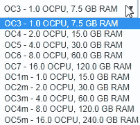
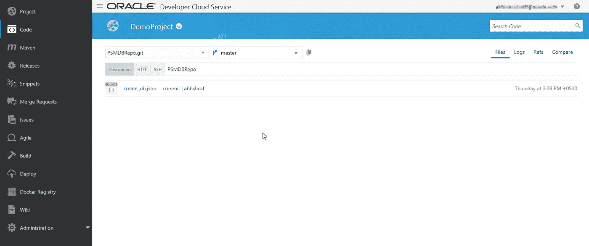
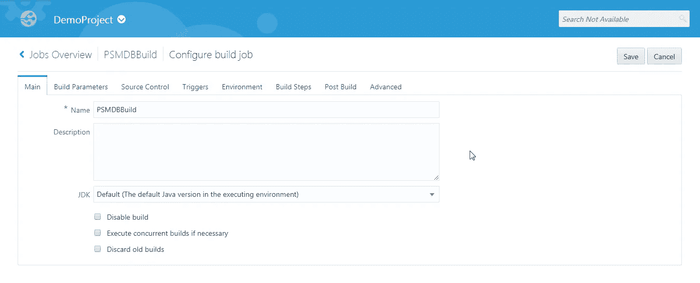
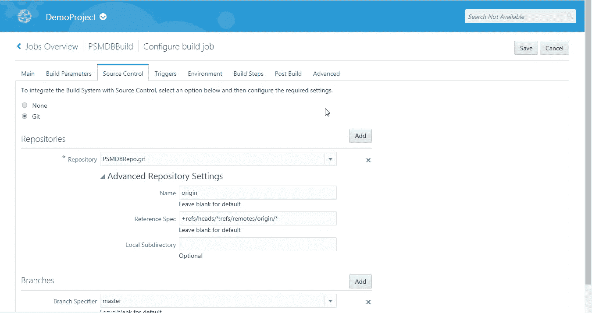
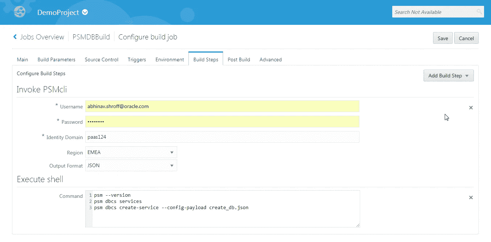
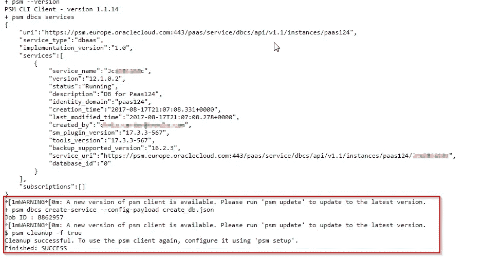
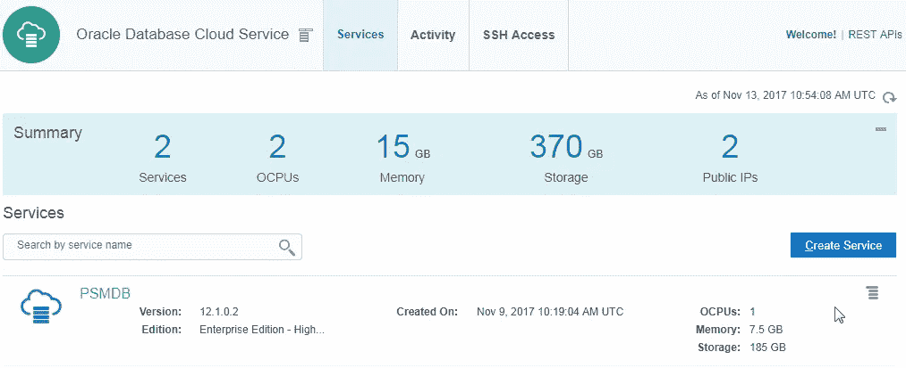

# Oracle 开发人员云可实现数据库云开发的自动化

> 原文：<https://medium.com/oracledevs/oracle-developer-cloud-to-automate-database-cloud-development-762cafbe7342?source=collection_archive---------3----------------------->

本博客是使用 Oracle Developer Cloud 实现数据库云服务自动化系列博客中的第一篇。在这篇博客中，我们将重点关注在构建步骤中使用开发人员云和 PaaS 服务管理器(又名 PSM CLI)集成来创建和管理数据库云服务。

**关于博客系列**

作为数据库云服务开发和部署自动化的一部分，启动 PaaS 服务并为数据库相关开发做准备，这将是数据库 DevOps 活动的一部分。这个博客系列将包括管理 DBCS 生命周期的自动化、自动化 APEX 应用程序工作区管理和构建 APEX 应用程序。

**什么是 PSM CLI？**

Oracle PaaS Service Manager (PSM)提供了一个命令行界面(CLI ),您可以使用它来管理 Oracle 公共云中各种服务的生命周期。CLI 是 PaaS REST APIs 上的一个瘦包装器，它调用这些 API 来支持常见的 PaaS 功能；例如，为 Oracle Java Cloud Service、Oracle Database Cloud Service 实例和 Oracle MySQL Cloud Service 创建和管理实例，或者使用 Oracle Application Container Cloud Service 创建和管理应用程序。CLI 还支持 Oracle Cloud Stack Manager，这是一个 PaaS 工具，可以自动配置和删除云环境。

**为什么我们的数据库需要 PSM CLI？**

数据是每个应用程序开发的重要部分，数据库也是如此。因此，当我们谈论 DevOps 时，它还包括数据库 PaaS 服务实例的创建和配置，这是 DevOps 的一个重要部分。在我们的 CI & CD 管道中实现开发运维自动化将有助于减少运维工作量，提高应用生命周期管理的效率和效果。

**PSM CLI 作为 CI & CD** 的一部分

借助**Oracle Developer Cloud Service**，用于数据库云服务实例生命周期管理的 PSM CLI 可以集成到 CI、CD 管道中。在这里，您必须创建一个定义数据库云服务实例参数的 JSON 有效负载，然后使用 Developer Cloud 构建作业执行一个 PSM 命令来创建和管理数据库云服务实例。

**先决条件**

1.访问**甲骨文开发者云服务**

2.访问 **Oracle 数据库云服务**

3.访问 **Oracle 存储云服务**

4.安装在开发人员机器上的文本编辑器，用于创建/编辑 JSON 有效负载文件。

**JSON 有效负载:**

创建的 JSON 有效负载必须上传到 Oracle 开发者云服务上的 Git 存储库中。为此，您首先必须创建如下的 JSON 有效负载文件。你可以根据自己的选择命名它。对于这个博客，我将其命名为 create_db.json。

```
{"serviceName": "PSMDB","edition": "EE_HP","level": "PAAS","vmPublicKeyText": "ssh-rsa AAAAB3NzaC1yc2EAAAABJQAAAQEAmiJLlEoUzMUXmSFGZpVaRzuuNKEiXEqo5kY/fyqIHsBKC1nNasoMQ1eoa3mwBWkcE6VBD/0EDIfM8JJgOtpL6ivIduBy/x9Zkq9dOUCu61SGFXZ54wirVTxwj/hfLkqjIloTotvM8W4a1hF5dOs0T5NoD1u03pv4vDGTc8c2PPNDkTVzMSVjHnByipBS9YNJcbN1XE9PxdSeTW0Pz/86f7AumzVqTBa3zg8wDJYB0JoHeV2wqZJ46L7iRtnk02d8rNmqO1PUmxmJr0VDF8TpU/JecvSM6HsTHJDfil1v+cx0h/c/VRbt032gZZM7xPiXftqR2Q+YxRTZD/sTzJubVw== rsa-key-20171106","description": "DB Cloud Service Instance","subscriptionType": "MONTHLY","shape": "oc3","version": "12.1.0.2","trial": "false","parameters": [{"sid": "ORCL","adminPassword": "******","backupDestination": "BOTH","cloudStorageContainer": "Storage-paas124/JcsDBBackup","cloudStorageUser": "abhinav.shroff@oracle.com","cloudStoragePwd": "******","type": "db","totalDataFileStorage": "88.5","usableStorage": "25","failoverDatabase": "no"}]}
```

**JSON 有效载荷-说明**

以下是对上述 JSON 有效负载中每个属性的解释:

1.**服务名称**——我们希望提供的是数据库云服务名称。

2.**版** —这里有三个选项，标准版(SE1)、企业版(ee)、企业版-高性能(EE_HP)、企业版-极限性能(EE_EP)

3.**级**——是“PAAS”，另一个选项是虚拟图像。

4. **vmPublicKeyText** —可以使用 Puttygen 生成，这是一个用于生成 ssh 密钥的开源工具。

5.**描述** —描述正在创建的数据库云服务实例

6.**subscription type**——可以是“MONTHLY”或“hour”。

7.**形状** —它描述了我们想要的数据库云服务的计算基础架构。上面的有效载荷 oc3 中给出的形状描述了 1 个 ocpu 和 7.5 GB 的 Ram。下面是有效载荷中“shape”属性的选项列表。



8.**版本**——该属性描述了我们即将创建的数据库云服务的数据库版本。这里我们有 3 个选择:12.1.0.2、12.2.0.1 和 11.2.0.4

9.**庭审**——如果不是庭审，就以假乱真。

10.**参数**–

**sid** —数据库 sid 名称，本博客为“ORCL”。

**管理密码** —为我们打算创建的云数据库实例定义的管理密码。

**backup testing**—该属性用于定义数据库备份目标，其中

我们有“两种”、“云”和“无”等选项。

**cloudStorageContainer**—需要定义如下的存储容器。存储容器需要存在于您打算使用的 Oracle 存储云服务实例上，否则创建数据库服务的 PSM 命令将无法工作。

储存- <domain name="" for="" the="" storage="" service="">/<storage container="" name=""></storage></domain>

**云存储用户** —访问上述容器的 Oracle 存储云服务用户名。

**云存储密码** —访问上述容器的 Oracle 云存储服务密码。

**式**—“db”，

**总计数据文件存储** —以 GBs 为单位的数据文件存储总计

**usableStorage** —可用存储大小，单位为 GBs

**故障转移数据库** —如果数据库不需要从文件备份中初始化，则该属性的给定值必须为“否”，否则为“是”。如果它是从备份中初始化的，那么需要添加的其他属性就很少了。

这个保存为 create_db.json 文件的 JSON 有效负载被上传到托管在 Oracle Developer Cloud Service 上的 Git 存储库。下面的屏幕截图描述了它。



如果您不熟悉 Git，下面是可以在 Git cli 中使用的 Git 命令。

git 初始化

git 添加<filename></filename>

git commit -m " <comment>"</comment>

git 远程添加原点

git 推送原点<branch name=""></branch>

您可以选择使用同一个存储库来存储其他 PSM 相关的有效负载文件，并将所有有效负载 JSONS 合并到同一个存储库中。同时您仍然可以选择让不同的构建作业访问这个存储库来执行不同的 PSM 命令。

**构建配置**

下面是将执行 PSM 命令的 **PSMDBBuild** 的构建作业配置屏幕截图。

为构建作业选择一个名称。对于这个博客，我将其命名为“PSMDBBuild”。因为这是针对 PSM CLI 的，所以您可以将 JDK 保留为默认值。



选择已上传 JSON 有效负载文件的存储库。



我们将在构建步骤中使用 PSMCli 来配置凭证，以便将 PSMCli 用于我们想要用来创建数据库云服务的云服务域。除了 PSMCli，我们还将使用 execute shell，在这里我们将执行 PSM 命令来创建数据库。



Execute Shell 中的前两个命令仅用于演示，以查看 PSM CLI 版本并列出域中的数据库服务。您可以选择只运行第三个命令，使用 create_db.json 有效负载文件创建数据库服务，我们将该文件上传到在构建作业中配置的 Git 存储库。

下面是开发者云服务中的控制台输出。命令的执行，提交服务创建的作业。需要一些时间才能在数据库云服务控制台中看到创建的服务。



创建服务后，您会在数据库云服务控制台上看到它。



如下文链接所述，还有许多其他 PSM 命令可用于使用 PSM CLI 管理数据库云服务的生命周期。

[https://docs . Oracle . com/en/cloud/PAAs/Java-cloud/PS CLI/dbcs-create-service . html](https://docs.oracle.com/en/cloud/paas/java-cloud/pscli/dbcs-create-service.html)

编码快乐！

* *本文表达的观点是我个人的观点，不一定代表甲骨文的观点