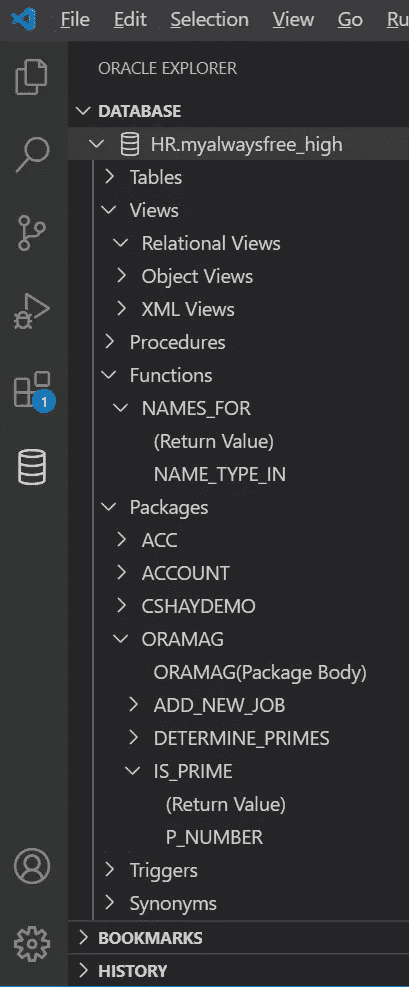
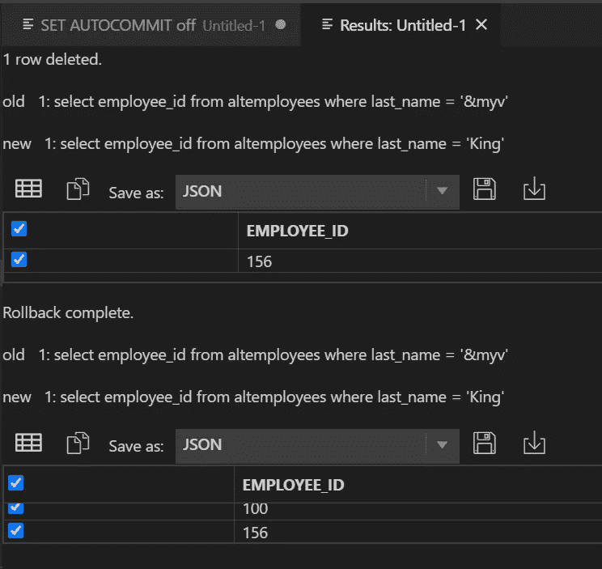

# 面向 VS 代码的 Oracle 开发人员工具

> 原文：<https://medium.com/oracledevs/oracle-developer-tools-for-vs-code-f26d31535925?source=collection_archive---------0----------------------->

## 在 Visual Studio 代码中执行 SQL 和 PL/SQL

我每天都听到这样的话:开发人员喜欢使用 Visual Studio 代码，这是一种运行在 Linux、macOS 和 Windows 上的多平台和开源代码编辑器。Visual Studio 代码市场中有 1100 万用户和近 20，000 个扩展，为 Python、Java、C#、Node.js 以及几乎任何语言和框架提供定制编辑器和语言支持。

一年多前，我们推出了用于 VS Code 的 Oracle Developer Tools 】,这是 Visual Studio 代码的免费扩展，支持为 Oracle 数据库和 Oracle 自治数据库编辑和执行 SQL 和 PL/SQL 以及许多其他功能。我们的扩展经常被开发人员用作他们工作流程的一部分。例如，使用 [Python 扩展](https://marketplace.visualstudio.com/items?itemName=ms-python.python)的 Python 开发人员在编写浏览 Oracle 数据库、查看和更改数据、运行脚本和测试临时 SQL 的代码时，使用 Oracle Developer Tools for VS Code。然后，他们可以使用 Visual Studio Code 的集成源代码控制将 SQL 脚本与 Python 代码一起签入。

我们最近发布了一个更新(版本 19.3.3 ),增加了许多**新功能并改进了现有功能。如果你已经在使用我们的扩展，我希望你能从广泛的社区反馈中看到许多改进。今天，我想借此机会对该产品进行整体介绍，从如何安装开始。**

## 从 Visual Studio 市场获取

Type “Oracle” in the Extensions Marketplace to find and install Oracle Developer Tools for VS Code

安装 Oracle Developer Tools for VS 代码很容易，从开始到结束大约需要 15 秒。只需在 VS 代码中打开扩展市场，并在搜索栏中键入“Oracle”。滚动直到看到*Oracle Developer Tools for VS Code*，点击它，然后按下 install 按钮。几秒钟后，您将收到一条消息，提示您已完成操作。重新启动 Visual Studio 代码，您就可以开始了。

## 连接到 Oracle 自治数据库

单击 VS 代码左侧的大型数据库图标。这将打开 Oracle Explorer 窗格。单击加号打开连接对话框。

Database icon in activity bar and plus sign icon for opening new connections

“连接”对话框有一个连接类型下拉列表，其中有几个选项:

*   **基本:**您提供数据库的主机名、服务名和端口号
*   **TNS 别名:**接受网络配置文件中定义的连接别名
*   **高级:**采用简单连接连接字符串或连接描述符
*   **ODP.NET 连接字符串:**使用与 Oracle 数据提供程序相同的语法。网

对于 Oracle 自治数据库，我们首先[下载客户端凭证](https://docs.cloud.oracle.com/iaas/Content/Database/Tasks/adbconnecting.htm#access)并将它们解压缩到一个目录中。这些凭证将包括我们的钱包文件。然后，在连接对话框中，我们将选择 TNS 别名连接类型，还将提供 wallet 文件位置的路径。

Connection dialog for the “TNS Alias” connection type

在上面的截图中，你会注意到**代理用户名**和**代理密码**字段，如果你使用代理用户，这可以使连接变得容易。还有一个 **Current Schema** 下拉菜单，这样如果您以用户 A 的身份连接，但拥有 schema B 的权限，您可以使用这个下拉菜单将 schema B 设置为工具将使用的默认模式。本文稍后将对此进行详细介绍。

如果要连接到本地数据库，如 Oracle Database Express Edition，可以使用基本连接类型，如下所示:

Connection dialog for the “Basic” connection type

## 使用 Oracle 数据库浏览器浏览您的模式

连接后，您将在 Oracle Explorer 中看到一个表示连接的图标。单击它，您将看到一个显示数据库模式的树控件。

Oracle Explorer lets you browse your database schema

您可以展开树控件来浏览各种模式对象类型。对于每个模式对象，都有菜单来执行操作。例如，如果你点击一个表格，你可以选择菜单项*显示数据*。

Showing the data for a table

这将打开一个包含数据的结果窗口。您也可以将数据保存为 CSV 或 JSON 格式。

存储过程、函数和包具有用于编辑数据库中 PL/SQL 的菜单:

Opening the editor for a stored function

这将打开 Oracle SQL 编辑器，编辑完成后，您可以将更改保存回数据库。(我们将更详细地介绍 SQL 编辑器的一些特性，并展示如何运行 SQL 脚本和执行临时 SQL。)

Editing a stored function and then saving to the database

如果您在编辑时出错，Visual Studio 代码中的“问题”选项卡将显示错误，您可以单击该选项卡转到有错误的代码行。

Click on errors in the Problems tab to go to the line with the error

最后，您可以使用 Run 菜单项测试您的过程或函数。这将打开一个接受输入参数的对话框。这个特定函数的输出是一个 ref cursor，所以我按下 fetch 按钮来获取结果。

Running a stored function, entering the input parameter and fetching the output Ref Cursor

## 浏览其他模式

许多开发人员作为一个用户进行连接，但随后花费大量时间使用其他模式。在上面的第一个连接对话框截图中，我向您展示了**当前模式**下拉列表，您可以在其中设置另一个模式作为默认模式。另一种方法是使用 Oracle Explorer 中的“其他用户”节点进行浏览:

Browsing Other Users schemas

## 使用 Oracle SQL 编辑器执行 SQL 和 PL/SQL

点击 Oracle Explorer 中的连接节点，选择**打开新的 SQL 文件**菜单项**。**这将在 Oracle SQL 编辑器中打开一个空文件，并将其与数据库连接相关联。如果您已经有了想要编辑或运行的脚本，您也可以使用**打开现有的 SQL 文件**菜单项。

Menu items to open a SQL file associated with this connection

新的 SQL 文件被创建，并自动与 Oracle Developer Tools for VS Code extension 以及这个特定的数据库连接相关联。通过查看 Visual Studio 代码底部的状态栏，可以看到这种关联。

Visual Studio Code status bar showing association with the extension (Oracle-SQL and PL/SQL) and the connection (HR.myalwaysfree_high)

Oracle SQL 编辑器打开，您可以开始键入一些 SQL 或 PL/SQL 块。你可能会注意到在你打字的时候，一些有趣的东西会出现在屏幕上。

这些弹出窗口是*自动完成*建议，帮助提醒您模式对象名称和属性，并加快键入速度。例如，如果我想查询 EMPLOYEES 表，并在选择列表中键入“LA ”,它会给出一些选项，包括作为选择列表项的 LAST_NAME。

如果我正在调用一个存储过程或函数，autocomplete 会提供一个包含数据类型的模板供我填写。如果我不想这样，我可以开始输入参数值，它会在我输入时显示参数类型。

Autocompletion of a stored procedure call

Showing the parameter types as I type

如果您键入一个架构名称，然后点(“.”)，编辑器将显示可用的模式对象列表。模式对象后的点将显示适当的子对象。例如，表名后的点将显示表的列。包名后面的点表示包中的过程和函数。这就是所谓的*智能感知。*

Intellisense shows the columns in a table

最后，如果您键入“oracle”，您将会看到一个代码片段列表，例如，如果您需要一个模板来创建 PL/SQL 包，您就可以使用它。当您选择一个代码段时，该代码段将放在您的 SQL 文件中。

Get a list of code snippets by typing “oracle”

一旦你有了一行 SQL 或者一个你想要执行的 PL/SQL 块，你可以右击并选择“执行 SQL”或者“执行全部”。第一个将执行光标所在的 SQL 行或 PL/SQL 块，或者您选择的任何行。“全部执行”将执行文件中的所有内容。如果你和我一样，在使用了几次菜单之后，你可能会开始一直使用快捷键(Ctrl-E 和 Ctrl-R)，

Executing a SQL Script

Script results

## SQL*Plus 命令

您可能已经注意到我在上面的脚本中使用了一些 SQL*Plus 命令(设置自动提交)和 SQL*Plus 替代变量(定义)。SQL*Plus 命令在脚本中提供了有用的功能，例如:

*   连接和断开
*   启用和禁用自动提交
*   运行其他 SQL*Plus 脚本
*   描述数据库对象元数据
*   定义和使用替代变量
*   定义和使用绑定变量
*   将脚本输出保存到文件

Oracle Developer Tools for VS Code 支持 SQL*Plus 命令的子集。如果您尝试运行包含(或其子脚本包含)不支持的命令的脚本，您将收到一条警告，询问您是否要继续。要了解该扩展中 SQL*Plus 命令的更多信息，请访问我们的[页面，将 SQL*Plus 命令与 Oracle Developer Tools for VS Code](https://www.oracle.com/database/technologies/appdev/dotnet/odtvscodesqlplus.html)一起使用。

## SQL 书签和历史记录

如果你像我一样，你有 SQL 语句和脚本，你反复执行一遍又一遍。Oracle Developer Tools for VS Code 有一个很好的特性，可以让您将代码片段或整个脚本保存为 ***SQL 书签*** 。

要保存书签，请在编辑器中选择您希望添加书签的代码，右键单击并选择**书签 SQL。**提供放置书签的文件夹名称，提供书签的名称并点击 return。

Saving a bookmark

您可以在 Oracle Explorer 的“书签”选项卡中查看您的书签。您可以将鼠标悬停在书签上进行预览，也可以使用菜单**运行**、**复制到编辑器**和**在编辑器**中打开。

Copying the “substitution variables” bookmark to the editor

在 Oracle Explorer 的 History 选项卡中(也可以在上面的屏幕截图中看到)，可以找到 Visual Studio 代码会话生存期内的命令历史记录。类似于 SQL 书签的工作方式，您可以悬停以查看 SQL，并使用菜单项**运行**、**复制到编辑器**和**在编辑器**中打开。还有一个菜单项 **Bookmark SQL** ，它会将该项存储为书签。

## 后续步骤

这是对 Oracle Developer Tools for VS Code 中一些关键特性的旋风式浏览。我希望你亲自尝试一下。要了解更多信息，请查看我们的[快速入门](https://www.oracle.com/database/technologies/appdev/dotnet/odtvscodequickstart.html)。您也可以参加我们的[Oracle Developer Tools for VS Code 在线论坛](https://community.oracle.com/tech/developers/categories/oracle-developer-tools-for-vs-code)，并在[Visual Studio market place](https://marketplace.visualstudio.com/items?itemName=Oracle.oracledevtools)查看产品页面。