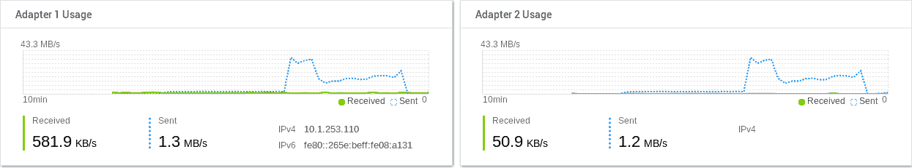
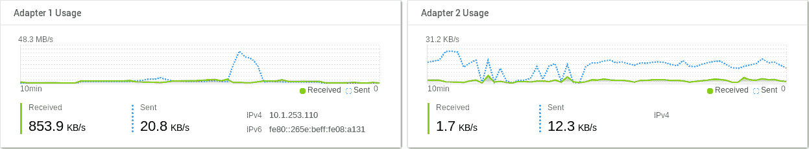

# 使用 Docker 的 Oracle dNFS

> 原文：<https://medium.com/oracledevs/oracle-dnfs-with-docker-8a3e35c0b558?source=collection_archive---------0----------------------->

众所周知，Docker 容器拥有短暂的存储空间，这意味着，一旦你删除了容器，文件系统上的任何更改都将被丢弃。从 *RDBMS* 的角度来看，这意味着存储在您的表中的任何数据都将丢失，为了使用 Docker 上的 Oracle 数据库，您的*数据文件*所在的文件系统必须连接到外部存储。

当使用 Docker Swarm 时，这种外部存储通常放置在 *NFS* 服务器上。Oracle 提供了一个与您的 *NFS* 存储对话的本机客户端，主要提供对数据的直接路径访问，这里有两篇在 [Ron 的博客](https://ronekins.wordpress.com/)上的精彩帖子，介绍了以下信息:

*   [使用 Oracle dNFS 多路径](https://ronekins.wordpress.com/2018/01/02/using-oracle-dnfs-multi-path/)
*   [Oracle dNFS 吞吐量测试](https://ronekins.wordpress.com/2018/01/03/oracle-dnfs-throughput-testing/)

使用 ***dNFS*** 的主要好处是对您的*数据文件的多路径访问*提供了更多的吞吐量和容错访问，下面的图片来自 Ron 的博客，展示了这种架构:


Multi-path access using dNFS Oracle driver

这篇文章展示了如何通过扩展 [18.3.0 EE 映像](https://github.com/oracle/docker-images/tree/master/OracleDatabase/SingleInstance)或[待定](https://github.com/oracle/docker-images/pull/1020) [18.4.0 XE 映像](https://github.com/marcelo-ochoa/docker-images/tree/master/OracleDatabase/SingleInstance/dockerfiles/18.4.0)来使用带有 ***dNFS*** 的 Oracle Docker 映像。首先我们简单的***Docker file . NFS***用于启用官方 Oracle Docker 镜像的 ***dNFS*** 驱动程序，18.3.0 EE:

```
# Pull base image
# ---------------
FROM oracle/database:**18.3.0-ee**# Maintainer
# ----------
MAINTAINER Marcelo ochoa <[marcelo.ochoa@gmail.com](mailto:marcelo.ochoa@gmail.com)>RUN cd $ORACLE_HOME/rdbms/lib && make -f ins_rdbms.mk dnfs_on
```

或 18.4.0 XE:

```
# Pull base image
# ---------------
FROM oracle/database:**18.4.0-xe**# Maintainer
# ----------
MAINTAINER Marcelo ochoa <[marcelo.ochoa@gmail.com](mailto:marcelo.ochoa@gmail.com)>RUN cd $ORACLE_HOME/rdbms/lib && make -f ins_rdbms.mk dnfs_on
```

要构建我们新的 ***dNFS*** 启用映像，只需运行 EE 版本:

```
$ docker build -t "oracle/database:18.3.0-ee-nfs" -f **Dockerfile.nfs** .
```

XE 版本:

```
$ docker build -t "oracle/database:18.4.0-xe-nfs" -f **Dockerfile.nfs** .
```

一旦你准备好了你的 *RDBMS* Docker 镜像，一个如下的 Docker Swarm 栈样本可以用来启动 Oracle 使用 ***dNFS*** 本地驱动:

关于上述 docker-compose 堆栈定义的一些注释:

*   db_data 卷被定义为外部 *NFS* 支持的存储(我的一个 *NAS* IP 是 10.1.253.110，带有 Oracle 推荐的 *NFS* 挂载选项)
*   test_oranfstab_xe 是一个外部配置，包括到我的 NAS 的多路径定义，下面是如何使用命令行创建此配置的示例:

```
$ echo "server: NAS-DTICs
> path: **10.1.253.110**
> path: **10.1.1.241** > nfs_version: nfsv4
> export: **/dbdata/xe-18c**  mount: **/opt/oracle/oradata**
> " | docker config create **test_oranfstab_xe** -
fbpuy0pjjx2t6ssan6almtjn5
$ docker config ls
ID                          NAME                CREATED             UPDATED
fbpuy0pjjx2t6ssan6almtjn5   **test_oranfstab_xe**   17 seconds ago      17 seconds ago
```

请注意，在上面的配置定义中，我们向 NAS 存储(10.1.253.110 和 10.1.1.241)添加了多路径访问，导出和装载参数必须等于 *docker-compose.yml* 定义。部署我们的堆栈，包括:

```
$ docker stack deploy -c docker-compose.yml test
```

将导致 *RDBMS* XE 在几分钟后启动并运行(等待您的 *RDBMS* 创建它们的*数据文件*)，如果您的 *NAS* 不够快并且 Docker *healthcheck* 文件杀死了您的堆栈，请添加此 *healthcheck* 定义以避免[问题](https://github.com/oracle/docker-images/issues/1060):

```
 healthcheck:
      test: exit 0
      interval: 60s
      timeout: 3s
```

最后，为了查看运行中的 ***dNFS*** 多路径，让我们尝试通过连接到根 *CDB* 并以 *sysdba* 身份运行 *SQLPlus* 来运行 IO 校准测试:

```
set long 10000 lines 140 pages 50 timing on echo on
set serveroutput on size 1000000declare
     l_latency   integer;
     l_iops      integer;
     l_mbps      integer;
 begin
    dbms_resource_manager.calibrate_io (
         1, /* # of disks */
         20, /* max latency */
         l_iops, /* I/O Ops/sec */
         l_mbps, /* MBytes/sec */
         l_latency /* actual latency */
     );
     dbms_output.put_line ('I/O Ops/sec = '  || l_iops);
     dbms_output.put_line ('Actual Latency = '  || l_latency);
     dbms_output.put_line('MB/sec = '  || l_mbps);
end;
/
```

在 IO 校准过程中，我们看到 NAS 资源监控类似于:



NAS resource monitoring with multi-path dNFS enabled

这意味着使用了两个网络接口，我们获得了大约 86mb 的吞吐量(请注意，我们有一个 1gb 的互连交换机)。此外，通过查询*v＄iostat _ file*系统视图，我们看到*数据文件*具有:

> ASYNC _ IO:ASYNC _ ON
> 访问方法:DNFS_LIB

如果不使用***Oracle/database:18 . 4 . 0-xe-NFS***Docker 映像，我们将 *docker-compose.yml* 更改为***Oracle/database:18 . 4 . 0-xe***映像，则 IO 校准测试期间的网络利用率为:



NAS resource monitoring without multi-path dNFS enabled

仅使用一个接口来访问我们的数据，导致 IO 能力较慢且没有异步 IO:

> ASYNC _ IO:ASYNC _ OFF
> 访问方法:OS_LIB