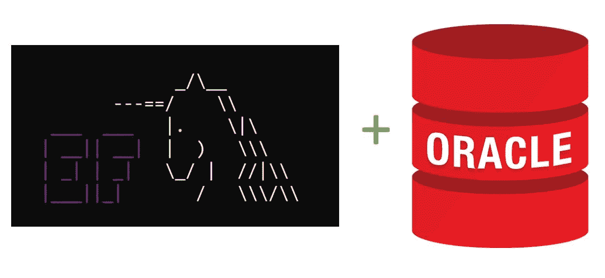

# Oracle EF Core 3.1 生产版

> 原文：<https://medium.com/oracledevs/oracle-ef-core-3-1-production-release-9e470eaf3d03?source=collection_archive---------0----------------------->

我很高兴地宣布，Oracle Entity Framework Core 3.1 生产版现已推出。从 [NuGet Gallery](https://www.nuget.org/packages/Oracle.EntityFrameworkCore/3.19.80) 免费下载。

感谢社区在测试阶段的反馈。您的评论和错误报告有助于提高发布的质量。

你可以在这里找到更新的 ODP.NET 和英孚核心文档[。](https://docs.oracle.com/en/database/oracle/oracle-data-access-components/19.3.2/)

Oracle EF Core 3.1 Beta 2 的功能已经完成。因此，自第二个测试版以来，没有新的特性被添加到产品版本中。

最突出的新特性当然是 EF Core 3.1 支持。

另一个关键的新特性是视图脚手架。开发人员可以搭建关系视图和物化视图。这些视图可以是只读的或可更新的。软件包管理器控制台 Scaffold-DbContext "-Tables "参数允许开发人员指定要搭建哪些视图。如果该参数保留为空(缺省值)，则所有用户表、关系视图和实体化视图都将被搭建。

您可以在我们的 [GitHub Oracle 上找到视图迁移和搭建以及其他 Oracle EF 核心场景的示例代码。NET 示例代码站点](https://github.com/oracle/dotnet-db-samples/tree/master/samples/dotnet-core/ef-core)。

要识别其他模式中的特定表和视图，请使用 SCHEMA.TABLE/VIEW 命令格式:

`Scaffold-DbContext -Tables <Schema>.<Table/View>`

要从 EF Core 2.x 升级到 EF Core 3.1，不需要更改 Oracle EF Core 应用程序代码。只需将现有的 Oracle EF 核心程序集从 NuGet Gallery 更新到新的 3.1 版本，然后运行。

如果你对新的产品发布有反馈，请在[ODP.NET 论坛](https://community.oracle.com/community/groundbreakers/database/developer-tools/windows_and_.net/odp.net)或 [GitHub](https://github.com/oracle/dotnet-db-samples/issues) 上告诉我们。

尽情享受吧！

#efcore