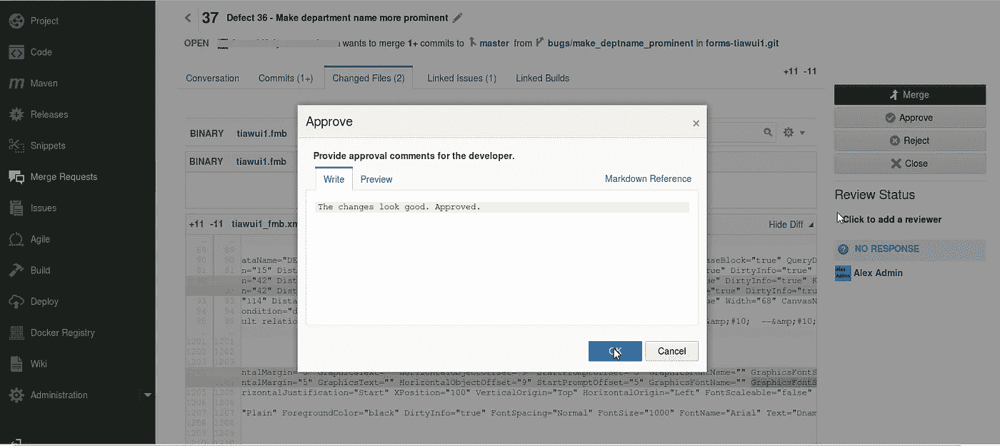
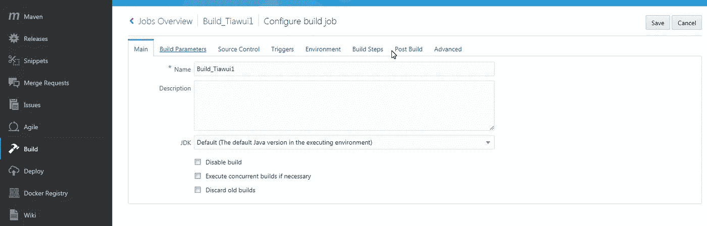

# 使用 Oracle 云的 Oracle 表单开发运维

> 原文：<https://medium.com/oracledevs/oracle-forms-devops-using-developer-cloud-service-4d2d766382b9?source=collection_archive---------0----------------------->

本博客将帮助开发人员了解使用 Oracle 开发人员云服务执行 Oracle Forms devo PS 的方法。它还将有助于了解 Oracle 开发人员云服务的基本功能集，以及这些功能如何映射到 Oracle Forms 的 DevOps 流程。

**Oracle Forms 的开发者云服务特性:**

1.**项目管理:**任务和问题管理、敏捷仪表盘、维基

2.**代码管理:**源代码控制管理，代码审查，代码片段

3.**构建:** Hudson 基于 CI、构建工具、Maven 存储库

4.**发布:**发布计划

**针对 Oracle 表单的 DevOps 方法:**

**步骤 1:** 将二进制和 xml 格式的 Oracle Forms 代码 fmb 文件推送到开发人员云服务上托管的 Git 存储库。xml 格式将用于代码审查，也可用于存储代码片段。为了将 Oracle Forms 代码推送到开发人员云 Git 存储库，我们必须使用 Git CLI。这里的先决条件是 Git CLI 必须安装在开发人员的机器上。下面的屏幕截图显示了 Git 的用法:

**步骤 2:** 开发人员对代码进行修改，并将其推送到他/她自己在 Git 存储库中的分支。然后，开发人员可以针对他/她一直在处理的问题/任务提出合并请求，以将问题代码分支合并到主分支。

**步骤 3:** 合并请求被分配到的人将能够审阅 xml 格式代码，给出审阅意见，并批准或拒绝更改。批准后，代码将与主分支机构合并。

**步骤 4:** 一旦代码被合并，就该配置构建作业了，该作业将执行 shell 脚本来解压缩 maven 存储库中的表单编译器，克隆包含表单代码的 Git 存储库，编译代码，然后将编译后的代码档案推送到 maven 存储库。从中可以下载并在本地或云上安装它。下面的屏幕截图显示了构建作业的配置:

为构建作业选择一个名称。

配置包含需要编译的 Oracle Forms 代码的 Git 存储库。还要选择分支，在本例中是主分支。

通过启用复选框，将构建作业配置为在源代码管理中发生任何更改时触发，如屏幕截图所示。

从添加构建步骤下拉列表中选择执行 shell 构建步骤后，使用该步骤执行 Shell 脚本。

在 Post Build 选项卡中配置需要触发的任何其他构建作业以及需要归档的工件。

**表单代码编译的 shell 脚本:**

从 maven 存储库中解压缩表单编译器。

从 maven 存储库中下载并解压缩任何依赖项。

设置环境以访问数据库进行编译。

使用编译器编译表单。

**坚果壳中表单的 DevOps 方法:**

编码快乐！

本文表达的观点是我个人的观点，不一定代表甲骨文的观点