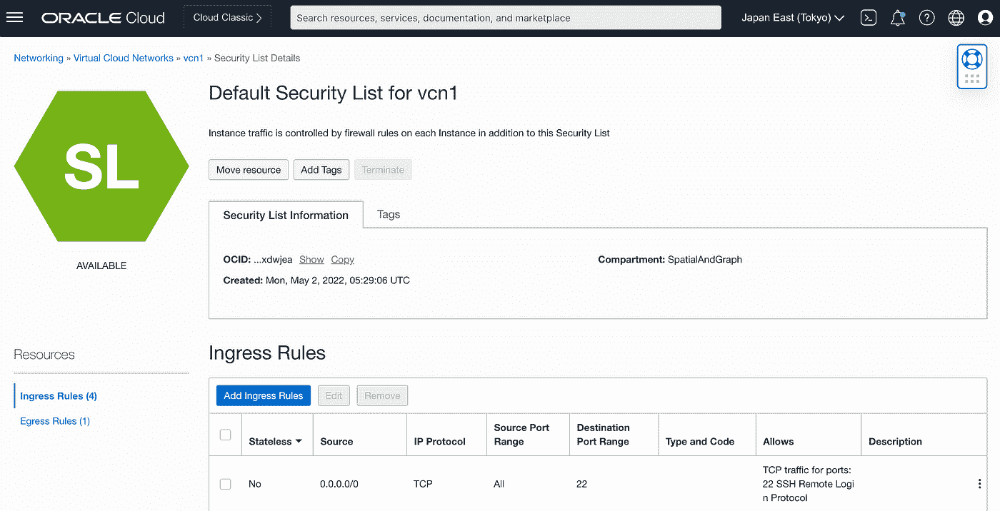
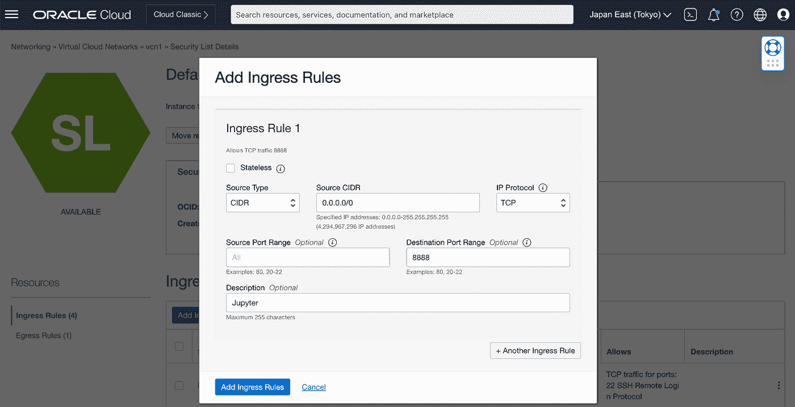
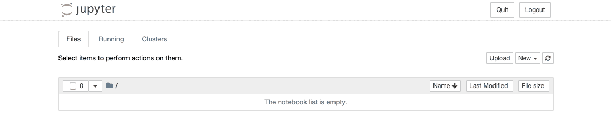
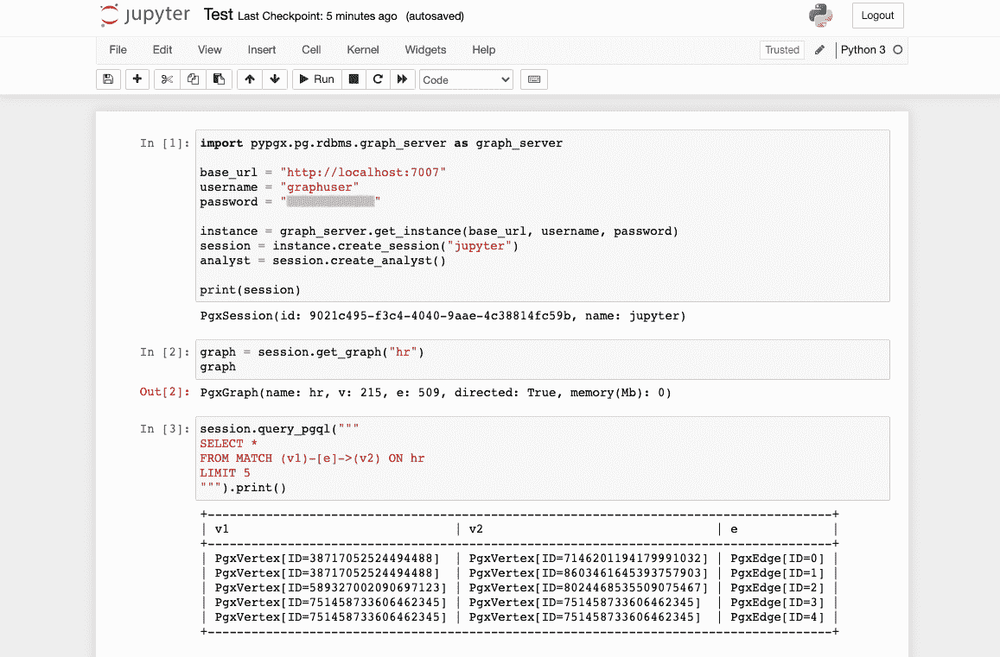

# Python 中的 Oracle Graph(安装 Jupyter)

> 原文：<https://medium.com/oracledevs/oracle-graph-in-python-jupyter-879a15f4ab1?source=collection_archive---------0----------------------->


Oracle Graph 可以通过 Jupyter 笔记本电脑通过 Python 访问，使数据分析师和开发人员能够轻松地将强大的图形分析添加到他们的应用程序中。Jupyter 笔记本是快速开始探索数据、可视化数据和执行图表分析的好方法。而且它们很容易使用，即使你对图表了解不多。

在本文中，我们将展示第一步:如何在安装 Oracle Graph 的云环境中安装 Jupyter。在前面的文章“在云中构建 Oracle Graph”中，我们从市场映像构建了一个 Graph 服务器，因此我们将在同一个计算实例上安装 Jupyter。

**安装 Jupyter**

打开端口 8888，通过 web 浏览器访问 Jupyter。



我们可以临时设置`0.0.0.0/0`来允许来自所有 IP 地址的访问。在生产使用中，限制客户端的 IP 地址以获得更好的安全性。



登录到计算实例。

```
$ ssh <public_ip_address> -l opc -i <secret_key_file>
```

安装 Jupyter。我们将遵循下面的官方指示。

*   [有经验的 Python 用户的替代方法:用 pip 安装 Jupyter](https://docs.jupyter.org/en/latest/install/notebook-classic.html)

```
$ sudo pip3 install --upgrade pip
$ pip3 install jupyter
```

验证`jupyter`命令可用。(如果找不到该命令，请参见下文。)

```
$ jupyter --version
Selected Jupyter core packages...
IPython          : 8.4.0
ipykernel        : 6.15.1
ipywidgets       : 8.0.1
jupyter_client   : 7.3.5
jupyter_core     : 4.11.1
jupyter_server   : not installed
jupyterlab       : not installed
nbclient         : 0.6.7
nbconvert        : 7.0.0
nbformat         : 5.4.0
notebook         : 6.4.12
qtconsole        : 5.3.1
traitlets        : 5.3.0
```

如果找不到该命令，请确保正确设置了 PATH 环境变量。

```
$ vi ~/.bash_profile

# User specific environment and startup programs
PATH=$PATH:$HOME/.local/bin:$HOME/bin
export PATH

$ source ~/.bash_profile
```

生成配置文件。

```
$ jupyter notebook --generate-config
Writing default config to: /home/opc/.jupyter/jupyter_notebook_config.py
```

更改设置以允许来自所有 IP 地址的访问。

```
$ vi /home/opc/.jupyter/jupyter_notebook_config.py

## The IP address the notebook server will listen on.
#c.NotebookApp.ip = 'localhost'
c.NotebookApp.ip = '*'
```

设置登录密码。

```
$ jupyter notebook password
Enter password: 
Verify password: 
[NotebookPasswordApp] Wrote hashed password to /home/opc/.jupyter/jupyter_notebook_config.json
```

将防火墙配置为打开端口 8888。

```
$ sudo firewall-cmd --permanent --zone=public --add-port=8888/tcp
$ sudo firewall-cmd --reload
$ sudo firewall-cmd --list-all
```

为 Jupyter 创建一个根目录，导航到那里，然后启动 Jupyter。

```
$ mkdir ~/jupyter
$ cd ~/jupyter
$ jupyter notebook --no-browser
[W 03:30:05.192 NotebookApp] WARNING: The notebook server is listening on all IP addresses and not using encryption. This is not recommended.
[I 03:30:05.196 NotebookApp] Serving notebooks from local directory: /home/opc/jupyter
[I 03:30:05.196 NotebookApp] Jupyter Notebook 6.4.11 is running at:
[I 03:30:05.197 NotebookApp] http://oraclegraph-instance:8888/
[I 03:30:05.197 NotebookApp] Use Control-C to stop this server and shut down all kernels (twice to skip confirmation).
```

使用网络浏览器访问[http://<public _ IP _ address>:8888/](/)。


输入密码并登录。



Jupyter 现已安装。

**连接到图形服务器**

让我们连接到图形服务器并运行一个 PGQL 查询。



第一个单元创建一个到图形服务器的会话。这里输入的密码是为数据库用户 GRAPHUSER 设置的。Graph Server 将查询数据库，如果该用户成功通过身份验证，将创建一个会话并返回一个会话 ID。

```
import pypgx.pg.rdbms.graph_server as graph_server
from pypgx import setloglevel

setloglevel("ROOT","WARN")

base_url = "https://localhost:7007"
username = "graphuser"
password = "<password>"

instance = graph_server.get_instance(base_url, username, password)
session = instance.create_session("jupyter")
analyst = session.create_analyst()

print(session)
```

```
PgxSession(id: 9021c495-f3c4-4040-9aae-4c38814fc59b, name: jupyter)
```

在 22.4 或以上版本中，建议从`opg4py`导入`graph_server`(而不是第一行)。

```
from opg4py import graph_server
```

得到图`hr`，默认加载，所以响应会显示图的节点数和边数。

```
graph = session.get_graph("hr")
graph
```

```
PgxGraph(name: hr, v: 215, e: 509, directed: True, memory(Mb): 0)
```

这是一个 PGQL 查询，用于获取五条边和两端的顶点。

```
session.query_pgql("""
SELECT *
FROM MATCH (v1)-[e]->(v2) ON hr
LIMIT 5
""").print()
```

使用这个环境，我们将在以后的文章中看到如何可视化查询结果、执行图形算法等等。敬请期待！

请从以下网址了解有关 **Oracle Graph** 的更多信息:

*   [中](/tag/oracle-graph) (=所有带有 Oracle Graph 标签的文章)
*   [堆栈溢出](https://stackoverflow.com/questions/tagged/oracle-graph) (=带 oracle-graph 标签的问题)
*   [Slack AnDOUC](https://join.slack.com/t/andouc/shared_invite/zt-1a2hmiz6f-vLlblcQyv0t9FMraMMP5uQ) (=邀请链接，请访问#graph)
*   [Slack OracleDevRel](https://join.slack.com/t/oracledevrel/shared_invite/zt-uffjmwh3-ksmv2ii9YxSkc6IpbokL1g) (=邀请链接，请访问#oracle-db-graph)