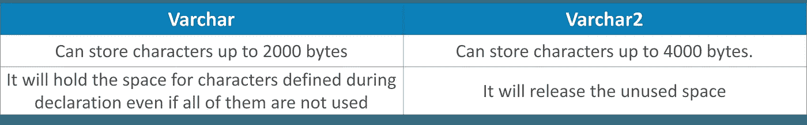
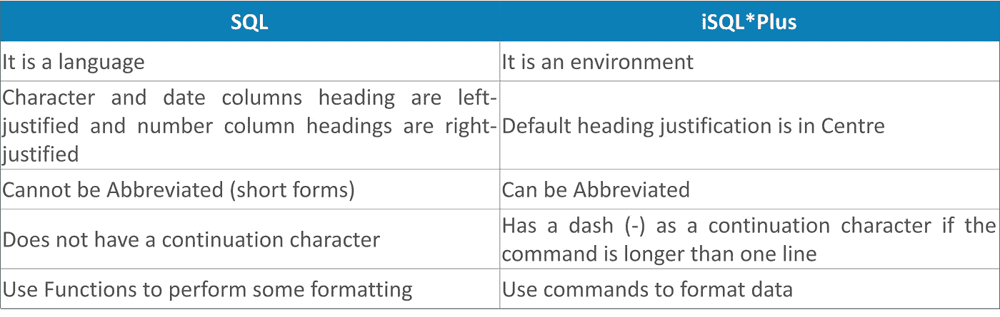
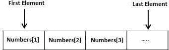
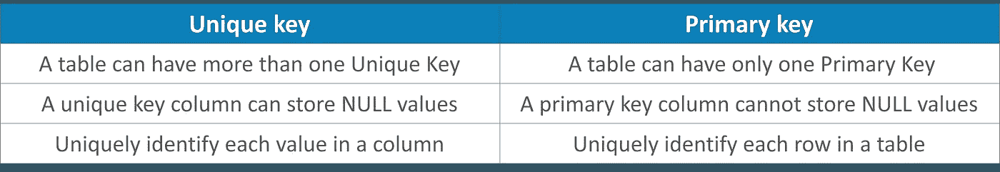
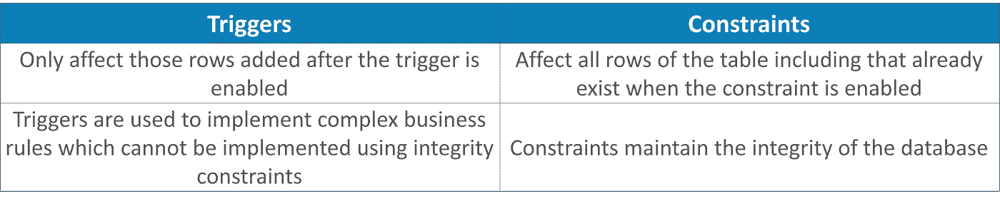
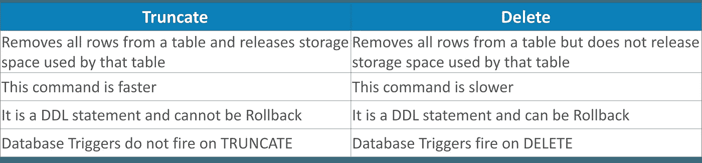

# 你应该掌握的 50 个甲骨文面试问题

> 原文：<https://medium.com/edureka/oracle-interview-and-answers-d1a99534e2d0?source=collection_archive---------0----------------------->

Oracle Interview Questions — Edureka

SQL 知识是必不可少的，因为市场上对 SQL 专业知识 的需求很高，很受重视。Oracle 是一个非常受欢迎的安全数据库，被跨国公司广泛使用。因此，这篇关于甲骨文面试问题的文章将涵盖最常见的面试问题，并帮助您在面试前复习知识。

如果你是一名新生或有经验的人，这是一个合适的平台，可以帮助你开始准备。

让我们先来看看最常见的问题。

*   Oracle 基本面试问题
*   SQL 面试问题
*   PL/SQL 面试问题

那么，让我们开始吧！

# Oracle 基本面试问题

Q1。你如何区分 varchar 和 varchar2
Q2？Oracle 数据库中逻辑数据库结构的组成部分有哪些？
Q3。描述一个 Oracle 表
Q4。解释数据库、表空间和数据文件之间的关系？
Q5。有哪些不同的 Oracle 数据库对象？
Q6。解释一下 Oracle 中的 ANALYZE 命令？
Q7。在编写子查询时使用了哪些类型的连接？
Q8。Oracle
Q9 中的原始数据类型。Oracle 中的聚合函数有什么用？
Q10。解释 Oracle 中的时态数据类型

## **Q1。你如何区分 Varchar & Varchar2？**

Varchar 和 Varchar2 都是 Oracle 数据类型，用于存储可变长度的字符串。为了指出它们之间的主要区别，

## **Q2。Oracle 数据库中逻辑数据库结构的组成部分有哪些？**

Oracle 数据库中逻辑数据库结构的组件包括:

*   **表空间**:数据库主要包含名为*表空间*的逻辑存储单元。这个*表空间*是一组相关的逻辑结构。准确地说，表空间组与逻辑结构相关联。
*   **数据库模式对象:**模式是特定用户拥有的数据库对象的集合。这些对象包括表、索引、视图、存储过程等。在 Oracle 中，用户是帐户，模式是对象。在数据库平台中也可能有一个没有用户指定的模式。

## **Q3。描述一个 Oracle 表**

表是 Oracle 数据库中数据存储的基本单位。表格基本上包含用户在行和列中的所有可访问信息。

要在数据库中创建新表，请使用“CREATE TABLE”语句。首先，您必须命名表并定义它列和每列的数据类型。

创建表 table_name
(
column1 数据类型[ NULL | NOT NULL ]，
column2 数据类型[ NULL | NOT NULL ]，
…
column_n 数据类型[NULL | NOT NULL]
)；

这里，

*   **table_name:** 指定要创建的表格的名称。
*   **列..n:** 它指定了您想要在表格中添加的列数。这里，每个列都必须有一个数据类型，并且应该定义为“NULL”或“NOT NULL”。如果该值为空，则默认为“ *NULL* ”。

## **Q4。解释数据库、表空间和数据文件之间的关系？**

Oracle 数据库拥有一个或多个逻辑存储单元，称为*表空间*。Oracle 数据库中的每个表空间都由一个或多个称为数据文件的文件组成。这些表空间共同存储数据库的全部数据。谈到数据文件，这些是与操作系统确认哪个 Oracle 程序正在运行的物理结构。

## **Q5。有哪些不同的 Oracle 数据库对象？**

这些是 Oracle 数据库对象:

*   **表格:**这是一组以垂直和水平方式组织的元素。
*   **表空间:**它是 Oracle 中的一个逻辑存储单元。
*   **视图:**视图是从一个或多个表派生的虚拟表。
*   **索引:**这是一种处理记录的性能调优方法。
*   **同义词:**是表的名称。

## **Q6。解释一下 Oracle 中的 ANALYZE 命令？**

这个“分析”命令用于对索引、表或簇执行各种功能。以下列表指定了 Oracle 中 ANALYZE 命令的用法:

*   *Analyze* 命令用于识别表或簇的迁移行和链接行。
*   它用于验证对象的结构。
*   这有助于收集用户使用的对象的统计信息，然后存储到数据字典中。
*   它还有助于从数据字典中删除对象使用的统计信息。

## **Q7。在编写子查询时使用了哪些类型的连接？**

*连接*用于比较和组合，这意味着从数据库中的两个或多个表中连接并返回特定的数据行。

在 *SQL* 中有三种类型的连接用于编写子查询。

*   **自联接**:这是一种表与自身联接的联接，尤其是当表有一个引用自己主键的外键时。
*   **外部连接:**外部连接有助于从表中找到并返回匹配的数据和一些不相似的数据。
*   **等价连接:**等价连接是一个连接条件包含一个*相等操作符*的连接。等同联接只返回与指定列具有相同值的行。

## **Q8。Oracle 中的原始数据类型**

Oracle 中的 RAW 数据类型用于存储可变长度的二进制数据或字节字符串值。给定表中 raw 的最大大小为 32767 字节。

对于何时使用 RAW、varchar 和 varchar2，您可能会感到困惑。让我指出它们之间的主要区别。PL/SQL 不识别数据类型，因此，当原始数据传输到不同的系统时，它不能进行任何转换。这种数据类型只能在表中查询或插入。

## **Q9。Oracle 中的聚合函数有什么用？**

Oracle 中的聚合函数是将多行或多条记录的值连接在一起以获得单个值输出的函数。它对一组值执行汇总操作，以提供单个值。您可以在代码中使用几个聚合函数来执行计算。
一些常见的聚合函数有:

*   平均的
*   数数
*   总和

## **Q10。解释 Oracle 中的时态数据类型**

Oracle 主要提供以下时态数据类型:

*   **日期数据类型:**日期的不同格式。
*   **时间戳数据类型:**有不同格式的*时间戳*。
*   **间隔数据类型:**日期和时间之间的间隔。

## **Q11。什么是视图？**

视图是基于一个或多个表或视图的逻辑表。视图也称为用户定义的数据库对象，用于存储 SQL 查询的结果，以后可以引用这些结果。视图不在物理上存储数据，而是作为一个虚拟表存储，因此它可以被称为逻辑表。表示视图的对应表被称为*基表*，它不包含数据。

## **Q12。如何将图片存储到数据库中？**

可以通过使用 Long Raw 数据类型将图片存储到数据库中。此数据类型用于存储长度为 2GB 的二进制数据。但是，该表只能有一个 Long 原始数据类型。

## **Q13。在哪里使用 DECODE 和 CASE 语句？**

这两个语句 Decode 和 Case 的工作方式类似于 if-then-else 语句，它们也是这两个语句的替代语句。这些函数在 Oracle 中用于数据值转换。

**例如:**

*解码功能*

Select OrderNum，
DECODE (Status，' O '，' Ordered '，' P '，' Packed，' S '，' Shipped '，' A '，'到货')
FROM Orders；

*案例功能*

从订单中选择 OrderNum
，Case(当 Status='O' then 'Ordered'
当 Status ='P' then Packed
当 Status = ' S ' then ' Shipped '
else ' Arrived】)end
；

这两个命令将显示订单号及其各自的状态，如下所示:

状态 O=已订购
状态 P=已包装
状态 S=已装运
状态 A=已到达

## **Q14。Oracle 中的*合并*是什么意思，如何合并两个表？**

*Merge* 语句用于合并后续两个表中的数据。它从源表中选择数据，然后根据查询中提供的条件在另一个表中插入/更新数据。它在数据仓库应用程序中也很有用。

## **Q15。对偶表的数据类型是什么？**

Dual 表基本上是 Oracle 数据库中的一列表。该表有一个名为 Dummy 的 Varchar2(1)列，其值为“X”。

# SQL 面试问题

## **Q16。解释一下完整性约束？**

完整性约束实际上是一个声明，它被定义为表列的业务规则。它们用于确保数据库中数据的准确性和一致性。它也可以被称为*一种声明性的方式*来为表的列定义业务规则。有几种类型，即:

*   域完整性
*   参照完整性
*   域完整性

## **Q17。什么是 SQL，并描述 SQL 语句的类型？**

SQL 代表*结构化查询语言*。SQL 用于与服务器通信，以便访问、操作和控制数据。有 5 种不同类型的 SQL 语句可用。它们是:

1.  *选择:*数据检索
2.  *插入、更新、删除、合并*:数据操作语言(DML)
3.  *创建、更改、删除、重命名、截断*:数据定义语言(DDL)
4.  *提交、回滚、保存点:*事务控制语句
5.  *授权、撤销*:数据控制语言(DCL)

## **Q18。简单解释一下什么是文字？举例说明它可以用在哪里？**

*文字*是包含字符、数字或日期的字符串，包含在*选择*列表中，并且不是列名或列别名。

还要注意，日期和字符必须用单引号(')括起来，而数字则不必这样。

例如:Select 姓氏| | ' is a ' | | job _ id As " employee details " from employee；

在这种情况下，“是 a”是字面意思。

## **Q19。如何显示记录的行号？**

为了显示行号及其记录号，您可以这样做:

`Select rownum <fieldnames> from table;`

上述查询将显示给定表中的行号和字段值。该查询将显示给定表中的行号和字段值。

## **Q20。SQL 和 iSQL*Plus 有什么区别？**

## **Q21。什么是 SQL 函数？简要描述不同类型的 SQL 函数？**

SQL 函数是 SQL 的一个非常强大的特性。这些函数可以带参数，但总是返回一些值。有两种不同类型的 SQL 函数可用。它们是:

*   **单行函数:**这些函数对单行进行操作，每行给出一个结果。

***单行函数的类型有:***

1.  性格；角色；字母
2.  数字
3.  日期
4.  转换
5.  一般

*   **多行函数:**这些函数对多组行进行操作，为每组行提供一个结果。

***多行函数的类型:***

1.  平均
2.  数数
3.  最大
4.  部
5.  总和
6.  标准发展
7.  差异

## **Q22。描述 SQL 中使用的不同类型的通用函数？**

通用函数有以下几种类型:

1.  **NVL:** 将空值转换为实际值。NVL (exp1，exp2)。如果 exp1 为空，那么 NVL 函数返回 exp2 的值。
2.  **NVL2:** 如果 exp1 不为空，NVL2 返回 exp2，如果 exp1 为空，nvl2 返回 exp3。参数 exp1 可以具有任何数据类型。NVL2(支出 1、支出 2、支出 3)
3.  **NULLIF:** 比较两个表达式，如果相等则返回 null，如果不相等则返回第一个表达式。NULLIF(支出 1，支出 2)
4.  **COALESCE:** 返回表达式列表中的第一个非空表达式。联合(exp1，exp2… expn)。与 NVL 函数相比，联合函数的优势在于联合函数可以采用多个可选值。
5.  **条件表达式:**在 SQL 语句中使用 IF-THEN-ELSE 逻辑。示例:CASE 表达式和解码函数。

## **Q23。什么是子查询？描述一下它的类型？**

子查询是嵌入在另一个 *SELECT* 语句的子句中的 *SELECT* 语句。子查询可以放在*中，其中有来自*子句的和*。*

***子查询使用指南:***

1.  您应该用括号将子查询括起来。
2.  将这些子查询放在比较条件的右侧。
3.  对单行子查询使用单行运算符。
4.  对多行子查询使用多行运算符。

**子查询类型:**

1.  **单行子查询:**从内部 select 语句只返回一行的查询。单行比较运算符有:=、>、> =、<、< =、<、>
2.  **多行子查询:**这些查询从内部 Select 语句返回多行。您还会发现从内部 select 语句返回多列的多列子查询。*运算符包括:IN、ANY、ALL。*

## **Q24。SQL 查询中双&符号(& &)有什么用？举个例子**

如果想重用变量值而不每次都提示用户，可以使用 *& &* 。

例如:按&column_name;从员工订单中选择员工、姓名和列名

## **Q25。描述 VArray**

*VArray* 基本上是一种 Oracle 数据类型，用于包含多值属性的列，它可以保存一个有界的值数组。所有变量数组都由连续的内存位置组成。最低地址对应于第一个元素，最高地址对应于最后一个元素。

Varray 中的每个元素都有一个与之关联的索引。它有一个可以动态改变的最大值(max_size)。

## **Q26。光标的属性是什么？**

Oracle 中的每个游标都有一组属性，使应用程序能够测试游标的状态。这些属性可用于检查游标是打开还是关闭、找到还是没有找到，以及查找行数。

## **Q27。说出 Oracle 中使用的各种约束**

使用了以下约束条件:

*   ***NULL* :** 表示某一列可以包含空值。
*   ***NOT NULL:*** 是表示某一列不能包含空值。
*   ***检查* :** 验证给定列中值是否满足特定标准。
*   ***默认值* :** 表示该值被赋给一个默认值。

## **Q28。从表中获取数据最快的查询方法是什么？**

从表中获取数据的最快查询方法是使用行 ID。可以使用 RowID 从表中提取一行。

## **Q29。笛卡尔连接和交叉连接的区别？**

这些连接之间没有这种差异。笛卡尔连接和交叉连接是相同的。

*交叉连接*给出两个表的笛卡尔积，即第一个表的行与另一个表相乘，该表称为笛卡尔积。

不带*的交叉连接，其中子句*给出一个*笛卡尔积*。

## **Q30。ON-DELETE-CASCADE 语句是如何工作的？**

使用删除级联上的*可以在从父表中删除相同记录时自动删除子表中的记录。该语句也可以与*外键*一起使用。*

您可以在现有表上的 Delete Cascade 选项上添加此*。*

**语法:**

alter Table Child _ T1 ADD Constraint Child _ Parent _ FK 在 DELETE CASCADE 上引用
Parent_T1(Column1 );

现在让我们进入甲骨文面试问题文章的下一部分。

# Oracle PL/SQL 面试问题

## **Q31。什么是 PL SQL？**

PL/SQL 是 Oracle 中使用的结构化查询语言(SQL)的扩展。它结合了 SQL 的数据操作能力和过程化语言的处理能力，以创建超级强大的 [*SQL 查询*](https://www.edureka.co/blog/sql-basics/) 。PL SQL 是指通过 SQL 指令编译器*做什么*和*如何做*通过其过程化的方式。

## **Q32。列举 PL/SQL 的特点？**

PL/SQL 有很多特点。其中一些值得注意的是:

*   PL/SQL 是一种块结构语言。
*   它可以移植到所有支持 Oracle 的环境中。
*   PL/SQL 与 Oracle 数据字典集成在一起。
*   存储过程有助于更好地共享应用程序。

## **Q33。PL/SQL 中有哪些可用的数据类型？**

PL/SQL 中有两种数据类型。它们是:

*   **标量数据类型**

示例:Char、Varchar、Boolean 等。

*   **复合数据类型**

示例:记录、表格等。

## **Q34。数据库触发器的用途是什么**

*触发器*是一些事件发生时自动执行的程序:

*   实施复杂的安全授权。
*   驱动列值。
*   维护重复的表。
*   实现复杂的业务规则。
*   为日志事件带来透明度。

## **Q35。展示如何在 PL SQL 块中调用函数和过程**

一个*过程*可以有一个 return 语句将控制返回给调用块，但是它不能通过 return 语句返回任何值。不能从 *Select* 语句中直接调用它们，但可以从另一个程序块或通过 EXEC 关键字调用它们。

可以通过以下方式调用该过程:
a)调用<过程名> direc
b)从调用环境
中执行<过程名>c)从其他过程或函数或包中执行<过程名>

可以通过以下方式调用函数
a)从调用环境执行<函数名>。总是使用变量来获取返回值。
b)作为 SQL/PL SQL 表达式的一部分

## **Q36。数据库触发器执行时有哪两个虚拟表可用？**

列被称为 Then.column_name 和 Now.column_name。

*   *插入*相关触发器，Now.column_name 值仅可用。
*   然后删除相关的触发器。只有 column_name 值可用。
*   更新相关触发器，两个表列都可用。

## **Q37。主键和唯一键有什么区别？**

## **Q38。用例子解释%TYPE 和%ROWTYPE 数据类型的用途？**

%ROWTYPE 和%TYPE 是 PL/SQL 中的属性，它们可以继承数据库中定义的表的数据类型。在 Oracle 中使用这些属性的主要目的是提供数据独立性和完整性。还要注意，如果数据库中的任何数据类型发生变化，PL/SQL 代码会自动更新，包括数据类型的变化。

**%TYPE:** 用于声明一个变量，该变量需要与表列具有相同的数据类型。
**%ROWTYPE:** 用于定义一条完整的记录行，其结构类似于表格的结构。

## **Q39。解释触发器和约束的区别？**

触发器与约束在以下方面有很大不同:

## **Q40。PL/SQL 中的异常处理**

当 PL/SQL 中出现错误时，会引发相应的异常。这也意味着，为了处理 PL/SQL 脚本意外终止的意外情况，程序中包含了错误处理代码。在 PL/SQL 中，所有异常处理代码都放在异常部分。

有 3 种例外情况:

*   **预定义异常:**带有预定义名称的常见错误。
*   **未定义的异常:**没有预定义名称的不太常见的错误。
*   **用户定义的异常:**不会导致运行时错误，但会违反业务规则。

# 基于比较的面试问题

## **Q41。COUNT (*)、COUNT(表达式)、COUNT (distinct 表达式)有什么区别？**

**COUNT (*):** 这将返回表中的行数，包括重复的行和列中包含空值的行。
**COUNT (EXP):** 返回由表达式标识的列中非空值的数量。
**COUNT(DISTINCT EXP):**返回由表达式标识的列中的非空值 *unique* 的个数。

## **Q42。“验证”和“反馈”命令的区别？**

验证和反馈命令之间的主要区别是:

*   **验证命令:**您可以使用该命令来确认 SQL 语句中的更改，该语句可以包含使用 Set Verify On/OFF 定义的旧值和新值。
*   **反馈命令**:显示查询返回的记录数。

## **Q43。列出提交、回滚和保存点之间的区别？**

下面列出了它们之间的主要区别:

*   **Commit** :这通过确保所有挂起的数据更改永久化来结束当前事务。
*   **回滚**:通过丢弃或删除所有待定的数据更改来结束当前事务。
*   **保存点**:它将一个事务分成更小的部分。您可以回滚事务，直到找到特定的命名保存点。

## **Q44。SUBSTR 和 INSTR 有什么区别？**

SUBSTR 返回字符串的特定部分，而 INSTR 提供在*字符串*中找到模式的字符位置。SUBSTR 返回字符串，而 INSTR 返回数值。

## **Q45。指出用户表和数据字典的区别？**

**用户表:**这是由用户创建和维护的表的集合。它还包含用户信息。
**数据字典:**这是由 Oracle 服务器创建和维护的表的集合。它包含数据库信息。所有数据字典表归*系统用户*所有。

## **Q46。截断和删除的主要区别？**

## **Q47。指出翻译和替换的区别？**

*Translate* 用于逐字符替换，而 *Replace* 用于用单词替换单个字符。

## **Q48。$ORACLE_BASE 和$ORACLE_HOME 有什么区别？**

*$Oracle_base* 是 Oracle 的主目录或根目录，而 *Oracle_Home* 位于所有 Oracle 产品所在的基本文件夹下。

## **Q49。重做日志文件镜像是怎么理解的？**

*镜像*是拥有重做日志文件副本的过程。这是通过创建一组日志文件来完成的。它确保 LGWR 自动将其写入当前在线重做日志组的所有成员。如果该组出现故障，数据库会自动切换到下一组，这会降低数据库的性能。

## **Q50。Oracle 中热备份和冷备份有什么区别？解释它们的好处**

**热备份(在线备份):**热备份也称为在线备份，因为它是在数据库处于活动状态时进行的。一些站点在制作备份副本时无法关闭数据库，它们是全天候使用的。

**冷备份(脱机备份):**冷备份也称为脱机备份，因为它是在使用 shut down 命令关闭数据库时进行的。如果数据库在不确定的情况下突然关闭，应该用*限制*模式重启，然后用正常选项关闭。对于完整的*冷备份*，必须备份相应的文件，即所有数据文件、所有控制文件、所有在线重做日志文件和 init.ora 文件(您可以手动重新创建)。

我希望这组甲骨文面试问题能帮助你准备面试。万事如意！

至此，我们结束了对 SQL 和 NoSQL 的比较。我希望你们喜欢这篇文章，并理解所有的差异。如果你想查看更多关于人工智能、DevOps、道德黑客等市场最热门技术的文章，那么你可以参考 [Edureka 的官方网站。](https://www.edureka.co/blog/?utm_source=medium&utm_medium=content-link&utm_campaign=top-50-oracle-interview-and-answers)

请留意本系列中的其他文章，它们将解释 SQL 的各个方面。

> *1。*[*SQL 之间的差异& NoSQL 数据库*](/edureka/sql-vs-nosql-db-5d9b69ace6ac)
> 
> *2。*[*SQL For Data Science*](/edureka/sql-for-data-science-a8fe10fe2ef9)
> 
> [*3。前 65 名 SQL 面试问题*](/edureka/sql-interview-questions-162f97f37ac2)

*原载于 www.edureka.co**2019 年 9 月 12 日*