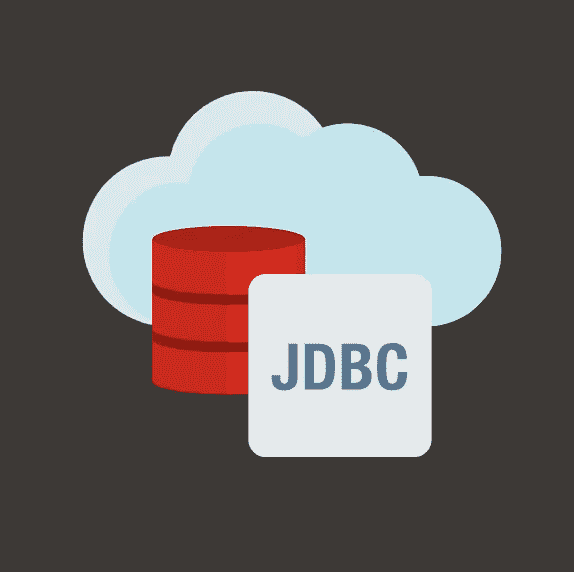

# Maven Central 和 Spring Initializr 上的 Oracle JDBC 19.8.0.0

> 原文：<https://medium.com/oracledevs/oracle-jdbc-19-8-0-0-on-maven-central-and-spring-initializr-4034fe44c940?source=collection_archive---------0----------------------->

# 好事成双

套用一句中国谚语，我们宣布:(I)在 Maven Central 上发布 Oracle JDBC 驱动程序的 19.8.0.0 版本，以及(ii)在 Spring Initializr 上发布 POM 。

## 19.8.0.0 在 Maven 中心

我们遵循与 [19.7.0.0](https://www.oracle.com/database/technologies/maven-central-guide.html) 中相同的结构，包括:预先建立的依赖关系、单个工件(又名 DIY)和梯度依赖关系。

## spring Initializr——风味 POM 的依赖管理

正如我在[之前的博客文章](/oracledevs/your-own-way-oracle-jdbc-drivers-19-7-0-0-on-maven-central-9a7dbb648995)中所描述的，“T6”风味的 POM 是预先建立的依赖关系，它们拉动一组罐子；其中包括 *ojdbcX-production，ojdbcX-debug，ojdbcX-observability，ojdbcX-observability-debug* (其中 X = 8 或 10)。作为对 Spring Boot 追踪者 [23450](https://github.com/spring-projects/spring-boot/issues/23450) 的回应，我们添加了这些口味的 POM。换句话说，这些预先建立的依赖关系现在是我们的 [BOM 文件](https://repo1.maven.org/maven2/com/oracle/database/jdbc/ojdbc-bom/19.8.0.0/ojdbc-bom-19.8.0.0.pom)的一部分，可以由 Spring 项目提取，类似于它们的其他启动器。

# 前方令人兴奋的事情

这篇博客的额外收获是 Oracle R2DBC 驱动程序和 Oracle JDBC 对 GraalVM 本机映像的支持即将推出！

看这个空间 **@kmensah。**