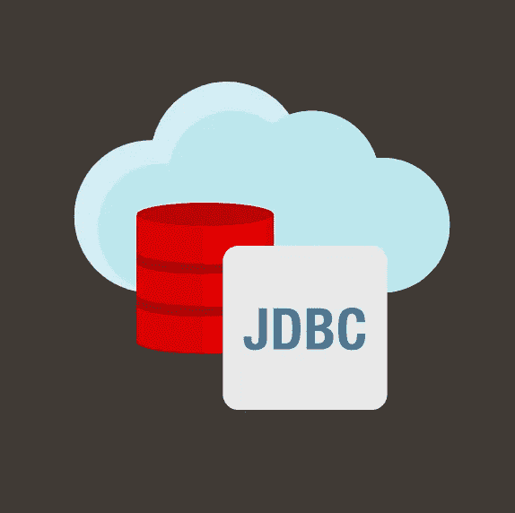

# Maven Central 上的 Oracle JDBC 驱动程序

> 原文：<https://medium.com/oracledevs/oracle-jdbc-drivers-on-maven-central-64fcf724d8b?source=collection_archive---------0----------------------->

# 终于来了！

是的，这是你自找的，虽然有些延迟(迟到总比..)，我们做到了！Maven Central 成为 Oracle JDBC 驱动程序的分销中心。
我们从最新版本 19.3.0.0 开始，但很快会添加以前的版本和受支持的版本。

更新:最新发布和坐标请见[本帖](/oracledevs/your-own-way-oracle-jdbc-drivers-19-7-0-0-on-maven-central-9a7dbb648995)。

## 广口瓶、GAV 等

Oracle JDBC 驱动程序带有配套的 jars 这些是什么，Maven 神器和它们的 id 是什么？

## 震动

*   *ojdbc10 . jar*:JDK 10 编译的 type 4 驱动，JDK11 认证
*   *ojdbc8 . jar*:JDK 8 编译的 type 4 驱动，JDK 10 和 11 认证
*   *ucp.jar* :与 ojdbc8.jar 或 ojdbc10.jar 一起使用的 Java(通用连接池)库
*   orai18n.jar :用于 NLS 或内部化支持的 Java 类
*   *ons.jar* :支持自动注册到服务器端 Oracle Notification Services (ONS)守护进程
*   *simplefan.jar* :支持 Java APIs 订阅快速应用通知(fan)事件；不使用 Oracle Java 连接池(ucp)时需要；需要 ons.jar
*   *osdt_core.jar，osdt_cert.jar，oraclepki.jar* :使用 Oracle Wallets 连接到 Oracle 数据库时需要
*   *xdb.jar 和 xmlparserv2.jar* :支持 XML 数据类型的标准 *java.sql.SQLXML* 接口
*   *ojdbc10dms.jar* :与 ojdbc10.jar 一起使用，支持 Oracle 动态监控服务(dms)工具，并对 java.util.logging 提供有限支持
*   *ojdbc8dms.jar* :与 ojdbc8.jar 一起使用，支持 Oracle 动态监控服务(dms)工具，并对 java.util.logging 提供有限支持
*   *ojdbc10_g.jar* :带有跟踪代码的 ojdbc10.jar(调试模式)
*   *ojdbc8_g.jar* :带有跟踪代码的 ojdbc8.jar(调试模式)
*   *ojdbc10dms_g.jar* :支持调试模式下的 dms 检测，与 ojdbc10_g.jar 一起使用
*   *ojdbc8dms_g.jar* :支持调试模式下的 dms 插装，与 ojdbc8_g.jar 一起使用。

## 组、工件和版本

**组**:*com . Oracle . ojdbc* **版本** : 19.3.0.0

[https://repo1.maven.org/maven2/com/oracle/ojdbc/](https://repo1.maven.org/maven2/com/oracle/ojdbc/)

**工件和依赖关系**
为了避免多次访问 Maven Central，并且因为 JDBC jar 经常与伙伴 jar 一起使用，我们已经为一些工件添加了一些硬的和可选的依赖关系。
这是它们的 id 和依赖关系

*   *ojdbc10* :拉 ojdbc10.jar、ucp.jar、oraclepki.jar、osdt_core.jar、osdt_cert.jar、ons.jar、simplefan.jar 和**可选**、orai18n.jar、xdb.jar 和 xmlparserv2.jar(见本文末尾附近使用这个的 pom 文件示例)。
*   *ojdbc8* :拉 ojdbc8.jar、ucp.jar、oraclepki.jar、osdt_core.jar、osdt_cert.jar、ons.jar、simplefan.jar、**可选**、orai18n.jar、xdb.jar 和 xmlparserv2.jar
*   *ucp* :拉 ucp.jar
*   *orai18n* :拉 orai18n.jar
*   *ons* :拉 ons.jar
*   simplefan:提取 simplefan.jar 和 ons.jar
*   *osdt_core* :拉 osdt_core.jar
*   *osdt_cert* :拉 osdt_cert.jar
*   *oraclepki* :拉取 oraclepki.jar
*   *xdb* :拉 xdb.jar 和 xmlparserv2.jar
*   *xmlparserv2* :拉取 xmlparserv2.jar
*   *dms* :拉 dms.jar
*   *ojdbc10dms* :拉 ojdbc10dms.jar
*   *ojdbc8dms* :拉 ojdbc8dms.jar
*   *ojdbc10_g* :拉 ojdbc10_g.jar、ojdbc10dms.jar、ojdbc10dms_g.jar 和
    dms.jar
*   *ojdbc8_g* :拉 ojdbc8_g.jar、ojdbc8dms.jar、ojdbc8dms_g.jar 和
    dms.jar
*   *ojdbc10dms_g* :拉 ojdbc10dms_g.jar `文件
*   *ojdbc8dms_g* :拉 ojdbc8dms_g.jar

# 例子

这里是一个 pom 文件，用于拉取 *ojdbc10.jar* 及其依赖项。

An example of pom file for downloading ojdbc10.jar & co.

# (用于命令)等待下面发表的消息

当我们在驱动程序和伴随 jar 中引入新的功能时，我们会通过 **@kmensah** 宣布这些