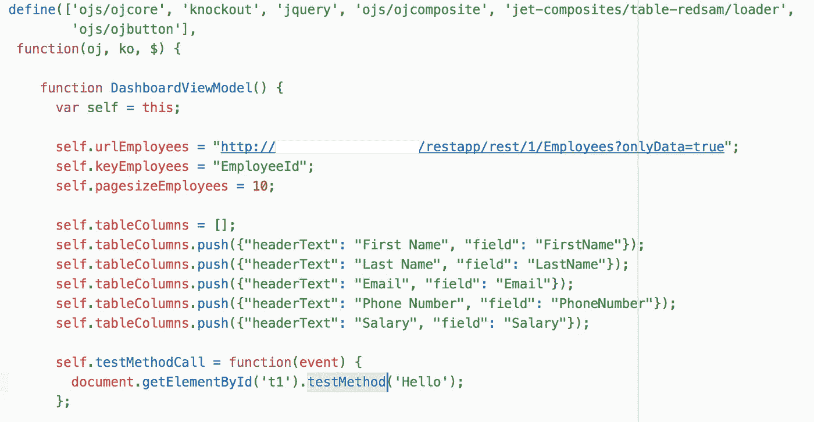

# Oracle JET 复合组件—JET 编码器手册

> 原文：<https://medium.com/oracledevs/oracle-jet-composite-components-manual-for-jet-coder-308f209b0de7?source=collection_archive---------0----------------------->

JET 复合组件 —不仅有助于构建 UI 小部件，还有助于分组和简化 JET 代码。在这篇文章中，我将展示如何将一个 JET 表包装成复合组件，并使用所有必要的特性，比如属性、方法、事件和槽。

示例应用程序代码可在 [GitHub](https://github.com/abaranovskis-redsamurai/jetwebcomponentsandboxapp) 上获得。JET 表被包装成复合组件，它带有用于工具栏按钮的插槽:

将 JET table 这样的组件包装到您自己的组合中有什么好处？仅举几个例子:

1.  代码封装。需要多行 HTML 和 JS 代码的复杂功能驻留在复合组件中
2.  维护和迁移。更容易在单个位置修复 JET 特定的更改
3.  发展更快。当使用包装器复合组件的较短定义时，开发人员需要重复的步骤和编写的代码更少

示例应用程序实现了 *table-redsam* 组件，对于上面你可以看到的表格 UI。下面是组件使用示例，非常简短明了:

特定于给定表格的所有属性都在模块中初始化。开发人员应该提供 REST 端点、键值、分页大小和列结构。其余的发生在复合组件中，对希望实现表的开发人员是隐藏的:

**属性**

我们应该研究一下数组类型属性。这种属性允许将数组传递到组件中。这对于传递要显示的数据数组或帮助组件呈现的元数据数组非常有用。在我们的例子中，我们传递元数据数组，这有助于呈现表列。数组类型属性基于两个属性—标题文本和字段。属性在复合组件 JSON 文件中定义:

从组件内部的变量中检索属性，并将其分配给局部变量:

这是组件内部的表实现，列是从组件属性初始化的:

**插槽**

Slot 定义了一个占位符，使用复合组件的开发人员可以在其中添加额外的元素。插槽在组件 JSON 定义文件中定义:

要定义槽，喷射槽组件应该在复合内部定义。您可以控制显示插槽的布局和位置:

在我们的例子中，我们为表格工具栏按钮使用 slot。这些按钮是在开发人员使用复合时添加的。要将按钮放入槽中，请将按钮放入复合组件标签中，并为按钮分配已定义的槽名。这将允许在槽中呈现按钮:

**方法**

复合组件中定义的方法，可以从外部调用。在下面的例子中，我从工具栏槽按钮调用 JS 函数:

函数通过 ID 获取复合，并调用公开的方法:

方法应该在复合 JSON 定义中定义:

方法在复合 JS 模块内部实现:

**事件**

事件允许实现外部侦听器。基本上，这允许覆盖外部函数中的复合逻辑。事件在复合 JSON 定义中声明:

Composite 标记包含用外部 JS 函数映射的事件属性，当事件在 composite 内部发生时将调用该属性:

模块中的功能代码，它打印当前行选择键:

表是用组合内部的监听程序属性定义的:

composite 内部的侦听器发起事件，该事件将在外部分发并由 composite 标记 on-handle-selection 属性中定义的方法处理:

让我们看看它是如何工作的。*调用方法*按钮调用复合内部的方法:

表行选择首先触发组合内部的监听器，然后它启动事件，外部监听器也被调用:

我认为这几乎列出了 JET 复合组件提供的所有基本功能。希望对你的发展有所帮助。

*原载于 2018 年 2 月 7 日*[*andrejusb.blogspot.com*](https://andrejusb.blogspot.lt/2018/02/oracle-jet-composite-components-manual.html)*。*