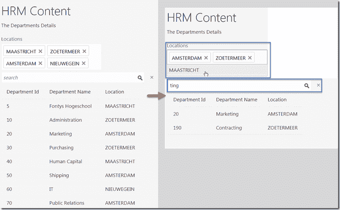
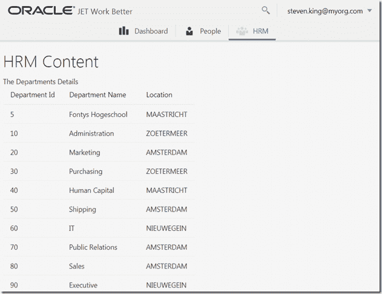
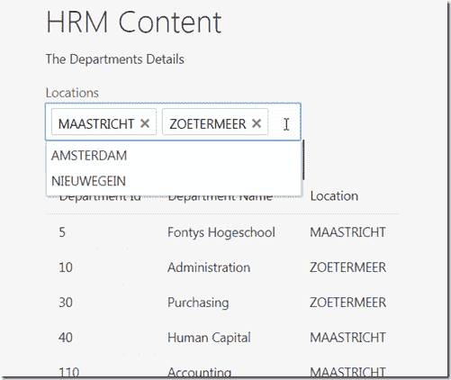
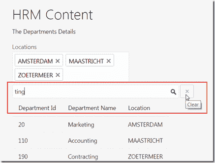
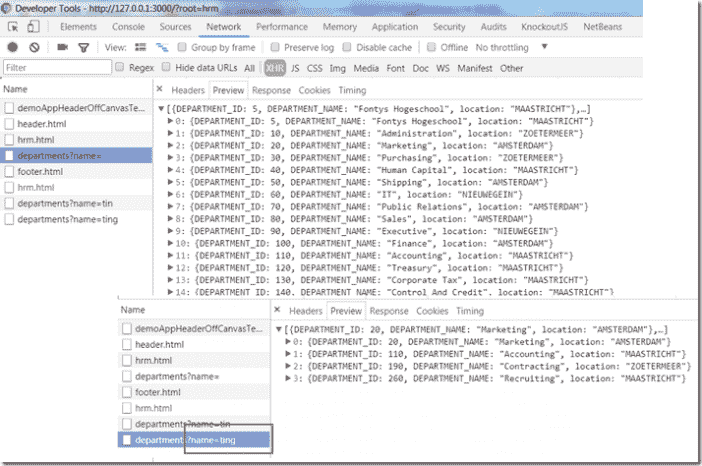

# 在 Oracle JET 上使用多选和搜索字段过滤器过滤表中的行

> 原文：<https://medium.com/oracledevs/oracle-jet-filtering-rows-in-table-with-multiselect-and-search-field-filters-23c411a903ac?source=collection_archive---------0----------------------->



任何 web 应用程序中的一个常见需求:允许用户通过指定相关的过滤器来快速深入到感兴趣的记录。开销图显示了设置过滤器的两种方式:从某一列(这里是位置)中的[有限数量的]现有值中进行选择，以及指定一个搜索字符串，该字符串的值应该出现在过滤后要显示的记录中。

Oracle JET 是一个支持富 web 应用开发的工具包。在 Oracle JET 中，这一过滤特性也是一项常见的需求。在本文中，我简要介绍了如何:

*   创建多选元素，以及如何用表中记录的位置属性中的数据填充它
*   处理多选中的(取消)选择事件，从而过滤表中显示的记录
*   创建搜索字段并截取搜索字段中的更改
*   处理重置搜索字段
*   当搜索字段发生变化时调用 REST API

我并不要求展示实现这一功能的最佳方式。我对 JET 不够熟悉，无法做出这样的断言，而且我在 Oracle 文档、博客文章、教程等中已经看到了太多不同的实现。能够指出一个突出的方法(对于当前的 JET 版本)。然而，作为起点，我在这里演示的实现似乎已经足够好了。

HRM 模块是我添加到 Work Better 演示应用程序中的一个选项卡。它有自己的 ViewModel (hrm.js)和自己的 HTML 视图(hrm.html)。我在 Node(http://host:port/departments？name=)在 JSON 文档中提供部门。

来源在此 Gist:[https://Gist . github . com/lucasjellema/e 133 e5e 769 c 13 ba 8507 a3 bee 0 ebc 30d 1](https://gist.github.com/lucasjellema/e133e5e769c13ba8507a3bee0ebc30d1)

# 出发点

本文的起点是一个简单的 JET 应用程序，它带有一个选项卡，其中包含一个显示从 REST API 检索的部门记录的表。这个应用程序的实现并不特别，也不是本文的主题。



本文的目的是展示如何添加过滤该表中记录的功能——首先通过使用多选小部件选择应该显示部门的位置。过滤发生在客户端，针对从后端服务检索的部门集。第二步使用搜索字段添加按名称过滤。这一级别的过滤是由公开 REST API 的服务器执行的。

# 创建并填充位置的多选元素

在这种情况下，multiselect 元素是 Oracle JET ojSelect 组件(参见 [cookbook](http://www.oracle.com/webfolder/technetwork/jet/jetCookbook.html?component=select&demo=multi) )。该元素显示可选择选项的下拉列表，显示当前选定的选项，并允许取消选定的选项。



用于将多选组件添加到页面的 HTML 是这里显示的:

```
<label for="selectLocation">Locations</label> 
<select id="selectLocation" 
  data-bind="ojComponent: { 
    component: 'ojSelect' , 
    options: locationOptions, 
    multiple: true , 
    optionChange: optionChangedHandler, 
    rootAttributes: {
        style:'max-width:20em'
    }
  }">
</select>
```

*选项*属性引用 ViewModel 的*位置选项*属性，该属性返回选择(可)选项值——稍后将详细介绍。属性 *multiple* 被设置为 *true* 以允许选择多个值，并且 *optionChange* 属性引用 *optionChangedHandler* ，这是 ViewModel 中的一个函数，用于处理在选择或取消选择选项时发布的选项更改事件。

当从 REST API 获取部门后，通过识别所有部门记录中 Location 属性的唯一值来填充 *locationOptions* 。随后，所有位置都被设置为 select 组件上的选定值，就像我们从一组未筛选的部门开始一样。每当从 REST API 获取新数据时，就会调用 handleDepartmentsFetch 函数。

```
// values for the locations shown in the multiselect self.locationOptions = ko.observableArray([]); self.handleDepartmentsFetch = function (collection) {
    var locationData = new Set(); 
    //collect distinct locations and add to locationData array 
    var locations = collection.pluck('Location'); 
    // get all values for Location attribute 
    // distill distinct values 
    var locationData = new Set(locations.filter((elem, index, arr) => arr.indexOf(elem) === index)); 
    // rebuild locationOptions 
    self.locationOptions.removeAll(); 
    var uniqueLocationsArray = []; 
    for (let location of locationData) { 
        uniqueLocationsArray.push({ 'value': location, 'label': location }); 
    } 
    ko.utils.arrayPushAll(self.locationOptions(), uniqueLocationsArray); 
    // tell the observers that this observable array has been updated 
    // (as result, the Multiselect UI component will be refreshed) 
    self.locationOptions.valueHasMutated(); 
    // set the selected locations on the select component based on all distinct locations available 
    $("#selectLocation").ojSelect({ "value": Array.from(locationData) });
};
```

[见要旨。](https://gist.github.com/lucasjellema/e133e5e769c13ba8507a3bee0ebc30d1#file-hrm-js-L78-L97)

通过更新支持 *ojSelect* 组件的 *value* 属性的可观察数组，我没有成功地在 select 组件上设置选定的值。作为一种变通方法，我现在通过 ojSelect 组件的 jQuery selection($(" # select location "))使用编程操作来使用直接操作。

# 处理多选中的取消选择事件

当用户更改 Locations 多选中的一组选定值时，我们希望表中显示的一组部门得到更新——根据某个位置是被删除还是被添加到所选项中来缩小或扩大范围。

ojSelect 组件具有 *optionChange* 属性，该属性在本例中引用了函数 *optionChangeHandler* 。这个函数检查选项改变的类型(等于“数据”？)然后调用函数*prepareFilteredDepartmentsCollection*，同时传递 self.deppies 集合，该集合是在从 REST API *获取期间初始化的。*该函数克隆从 REST API 获取的所有部门的集合，并随后基于所选的位置对其进行过滤。

```
// returns an array of the values of the currently selected options in select component with id selectLocation
 self.getCurrentlySelectedLocations = function () {
 return $(“#selectLocation”).ojSelect(“option”, “value”);
 }// prepare (possibly filtered) set of departments and set data source for table
 self.prepareFilteredDepartmentsCollection = function (collection, selectedLocations) {
 if (collection) {
 // prepare filteredDepartmentsCollection
 var filteredDepartmentsCollection = collection.clone();var selectedLocationsSet = new Set(selectedLocations);
 var toFilter = [];
 // find all models in the collection that do not comply with the selected locations
 for (var i = 0; i < filteredDepartmentsCollection.size(); i++) {
 var deptModel = filteredDepartmentsCollection.at(i);
 if (!selectedLocationsSet.has(deptModel.attributes.Location)) {
 toFilter.push(deptModel)
 }
 }
 // remove all departments that do not qualify according to the locations that are (not) selected
 filteredDepartmentsCollection.remove(toFilter);// update data source with fresh data and inform any observers of data source (such as the table component)
 self.dataSource(
 new oj.CollectionTableDataSource(filteredDepartmentsCollection));
 self.dataSource.valueHasMutated();
 }// if (collection)
```

[参见要点](https://gist.github.com/lucasjellema/e133e5e769c13ba8507a3bee0ebc30d1#file-hrm-js-L106-L134)。

创建筛选部门的集合时，将使用新的 CollectionTableDataSource 刷新 self.dataSource。通过调用 self . dataSource . value has mutated()，我们显式地触发了 data source(表组件)的订阅者。

# 创建搜索字段并截取搜索字段中的更改

搜索字段只是一个带有一些修饰的 inputText 元素。与搜索栏相关联的是一个重置(清除)搜索栏的按钮。



这些元素的 HTML 代码是:

```
<div class=”oj-flex-item oj-sm-8 “>
 <div class=”oj-flex-item” style=”max-width: 400px; white-space: nowrap”>
 <input aria-label=”search box” placeholder=”search” data-bind=”value: nameSearch, valueUpdate: ‘afterkeydown’, ojComponent: {component: ‘ojInputText’, rootAttributes:{‘style’:’max-width:100%;’}}”
 />
 <div id=”searchIcon” class=”demo-icon-sprite demo-icon-search demo-search-position”></div>
 <button id=”clearButton” data-bind=”click: clearClick,
 ojComponent: {
 component: ‘ojButton’, 
 label: ‘Clear’, 
 display: ‘icons’,
 chroming: ‘half’,
 icons: {start:’oj-fwk-icon oj-fwk-icon-cross03'}}”>
 </button> 
 </div>
 </div>
```

[见大意。](https://gist.github.com/lucasjellema/e133e5e769c13ba8507a3bee0ebc30d1#file-hrm-html-L15-L29)

搜索字段被绑定到 nameSearch，这是 ViewModel 中的一个可观察对象。当用户编辑搜索字段的内容时，观察对象被更新，并且任何订阅者被触发。函数 self.search()就是这样一个订阅者，这是一个依赖于 nameSearch 的计算剔除函数。当函数被触发时——由 nameSearch 值的变化触发——它检查搜索字符串是否由三个或更多字符组成，如果是，它通过调用函数 fetchDepartments()从 REST API 中触发一个新的部门提取。

```
// bound to search field 
self.nameSearch = ko.observable(''); 
// this computed function is implicitly subscribed to self.nameSearch; any changes in the search field will trigger this function 
self.search = ko.computed(function () { 
  var searchString = self.nameSearch(); 
  if (searchString.length > 2) { 
    self.fetchDepartments(); 
  } 
});
function getDepartmentsURL(operation, collection, options) { 
  var url = dataAPI_URL + "?name=" + self.nameSearch(); 
  return url; 
};
```

函数 getDepartmentsURL()在获取部门之前被调用。它返回用于从 REST API 获取数据的 URL。这个函数将使用 nameSearch observable 的值向 URL 添加一个查询参数。

# 处理重置搜索字段

Clear 按钮——显示在前面的 HTML snipptet 中——与 click 事件处理程序相关联:函数 clearClick。该函数重置名称搜索可观察对象，并显式声明其值已更新——以便触发名称搜索可观察对象的订阅者。一个这样的订阅者是函数 self.search()，它将由此触发，并继续从 REST API 中提取部门。

```
// event handler for reset button (for search field) 
self.clearClick = function (data, event) { 
  self.nameSearch(''); 
  self.searchDepartments(); 
  return true; 
}
```

# REST API

REST API 是用 Node 和 Express 实现的。它极其简单；最初，它只返回包含部门记录的静态文件(departments.json)的内容。它稍微扩展了一下，以处理名称查询参数，只返回选定的部门。注意，这种实现不是最有效的。对于本文的目的，它将完成这项工作。



```
var app = express();
var locations = ['AMSTERDAM','ZOETERMEER','NIEUWEGEIN','MAASTRICHT']
var departments  = JSON.parse(require('fs').readFileSync('./departments.json', 'utf8'));
  // add a location to each record
  for (i = 0; i < departments.length; i++) {
    departments[i].location = locations[Math.floor(Math.random() * locations.length)] ;
  } 
app.get('/departments', function (req, res) { //process
    var nameFilter = req.query.name; // read query parameter name (/departments?name=VALUE)
    // filter departments by the name filter 
        res.send( departments.filter(function (department, index, departments)
                                 { return !nameFilter ||department.DEPARTMENT_NAME.toLowerCase().indexOf(nameFilter)>-1; 
                                 })
            ); //using send to stringify and set content-type
       });
```

【概要】见大意。

# 资源

*   本文来源于 [GitHub Gist](https://gist.github.com/lucasjellema/e133e5e769c13ba8507a3bee0ebc30d1)
*   [关于多选的喷射食谱](http://www.oracle.com/webfolder/technetwork/jet/jetCookbook.html?component=select&demo=multi)
*   [将菜谱放在桌上并过滤](http://www.oracle.com/webfolder/technetwork/jet/jetCookbook.html?component=table&demo=filteringTable)
*   [Oracle JET 执行动态 ADF BC REST URL](http://andrejusb.blogspot.nl/2016/06/oracle-jet-executing-dynamic-adf-bc.html) 作者 Andrejus Baranovskis
*   关于[集合](http://docs.oracle.com/middleware/jet320/jet/developer/GUID-808434E0-CA80-405C-9450-59E0BF525700.htm#JETDG539)及其 [API 文档](http://docs.oracle.com/middleware/jet320/jet/reference-jet/oj.Collection.html)的 JET 文档
*   关于[计算【可观察】](http://knockoutjs.com/documentation/computedObservables.html)和[可观察](http://knockoutjs.com/documentation/observables.html)的爆震文件
*   [从数组中删除重复项的 JavaScript 要点](https://gist.github.com/telekosmos/3b62a31a5c43f40849bb)
*   [JavaScript 对数组进行过滤、映射和归约](https://danmartensen.svbtle.com/javascripts-map-reduce-and-filter)
*   [JavaScript](https://technology.amis.nl/tag/javascript-2/)[JET](https://technology.amis.nl/tag/jet/)[jQuery](https://technology.amis.nl/tag/jquery/)[knockout](https://technology.amis.nl/tag/knockout/)[node](https://technology.amis.nl/tag/node/)[OJ select](https://technology.amis.nl/tag/ojselect/)[REST](https://technology.amis.nl/tag/rest/)

*原载于 2017 年 8 月 20 日*[*technology . amis . nl*](https://technology.amis.nl/2017/08/20/oracle-jet-filtering-rows-in-table-with-multiselect-and-search-field-filters/)*。*