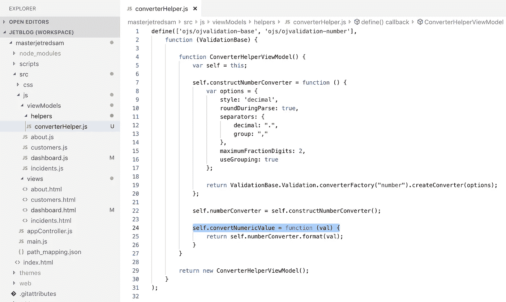

# Oracle JET —如何在 HTML 中引用 JavaScript 模块

> 原文：<https://medium.com/oracledevs/oracle-jet-how-to-reference-javascript-module-in-html-c2f333af1c0f?source=collection_archive---------0----------------------->

我将解释如何在 Oracle JET HTML 中引用 JavaScript 模块函数。在以前的 Oracle JET 版本中，我们使用$root 来访问父 appController 模块。语法$root 看起来有点像魔术，最好是通过预定义的变量来引用模块。我会告诉你怎么做。

示例应用程序带有数字转换器，有助于格式化数值。为了方便和更好的重用，数字格式化功能被移到一个单独的模块中。我们的目标是从模块 HTML 内的转换器模块调用函数 *self.convertNumericValue* :

将转换器模块导入到目标模块中。确保为导入定义一个变量。然后定义局部变量，并赋予它指向导入模块的值。这将允许从导入的模块中调用函数，在我们的目标模块中的任何地方:

为了演示它是如何工作的，我将包含一个对表格列的 format number 的调用。为此，我定义了一个表列模板:

在模板中，我调用转换器(通过引用局部变量调用函数)来格式化数字:

它工作得很好，带有薪水值的列是由导入模块中的函数格式化的:

我的 [GiHub](https://github.com/abaranovskis-redsamurai/masterjetredsam) repo 上有一个示例应用程序。

【http://andrejusb.blogspot.com】最初发表于**。**