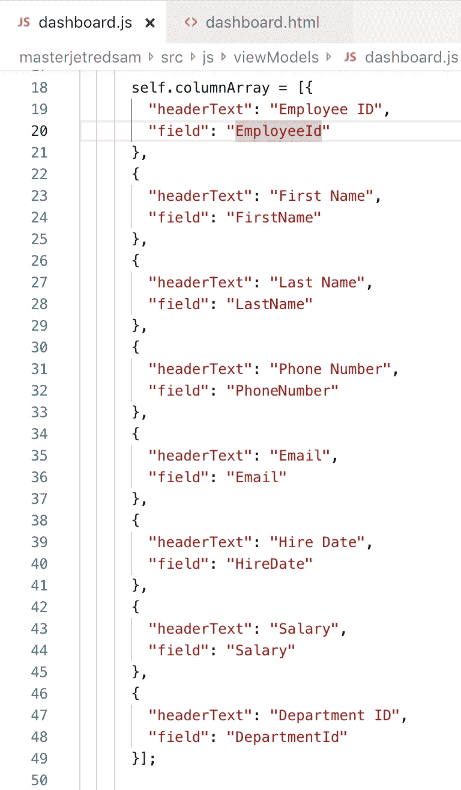
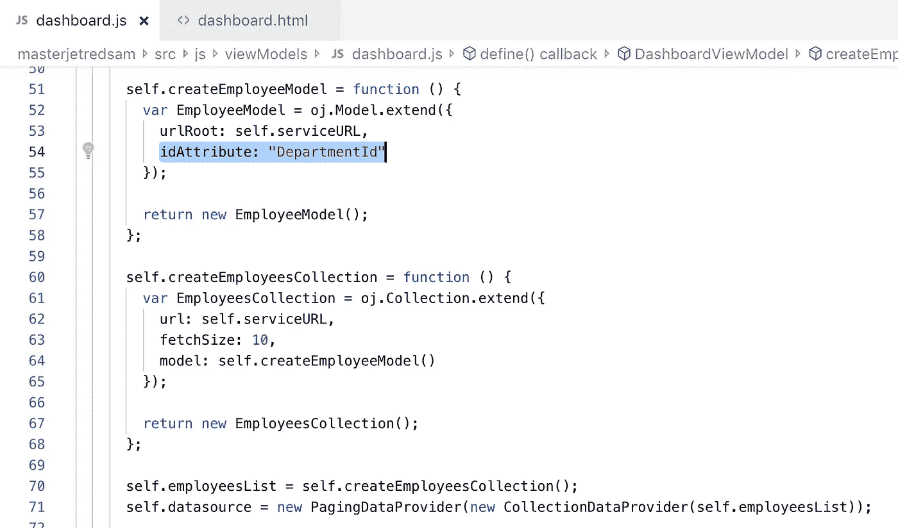
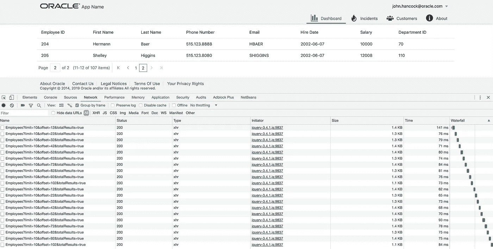
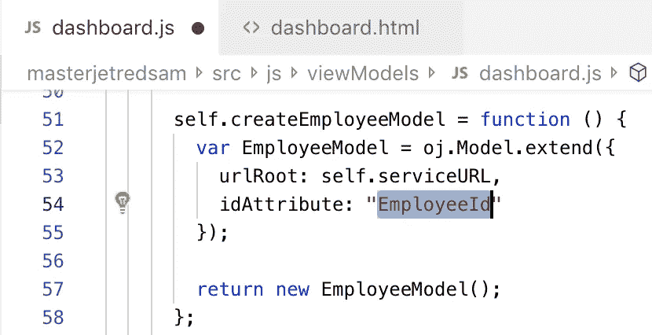
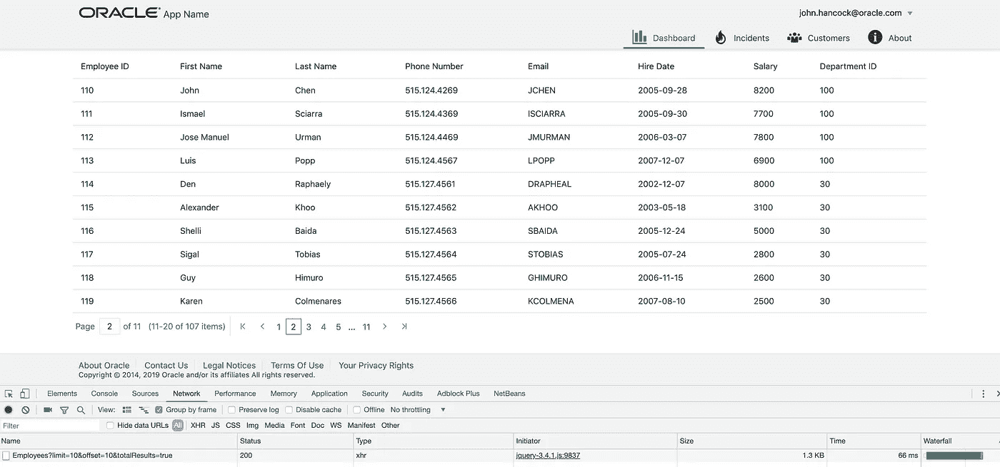

# Oracle JET 模型 ID 属性

> 原文：<https://medium.com/oracledevs/oracle-jet-model-id-attribute-987c4ed45eb1?source=collection_archive---------1----------------------->

当构建 Oracle JET 模型/集合结构来呈现表时，应该小心定义 ID 属性。此属性必须只有唯一的值，如果 ID 中有重复项，则表行将会不正确地呈现。

以下面的员工休息端点结构为例。 *EmployeId* 属性提供了唯一的值，它应该被定义为 JET 模型的 Id:

让我们试着看看在 JET 模型中为一个键设置非唯一的 *DepartmentId* 属性时会发生什么:

在这种情况下，在数据获取和 UI 表呈现期间(特别是导航到表的下一页时)，表的 JET 运行时将会混淆，并将从后端获取所有记录(肯定不是我们想要的):

好的，换成合适的——在 JET 模型中使用 *EmployeeId* 作为 Id:

该表按预期工作:

经验教训-确保使用具有唯一值的属性作为 JET 型号 ID。如果没有具有唯一值的单个属性，则在后端连接多个属性以构造具有唯一值的单个属性。

源代码可以从我的 GitHub [repo](https://github.com/abaranovskis-redsamurai/masterjetredsam) 获得。

*最初发表于*[*http://andrejusb.blogspot.com*](https://andrejusb.blogspot.com/2019/08/oracle-jet-model-id-attribute.html)*。*