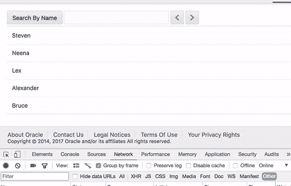
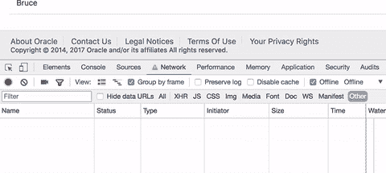
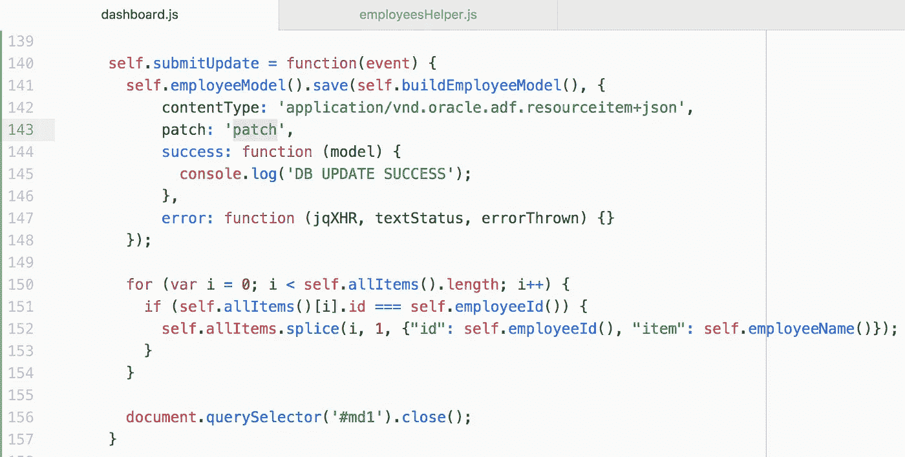
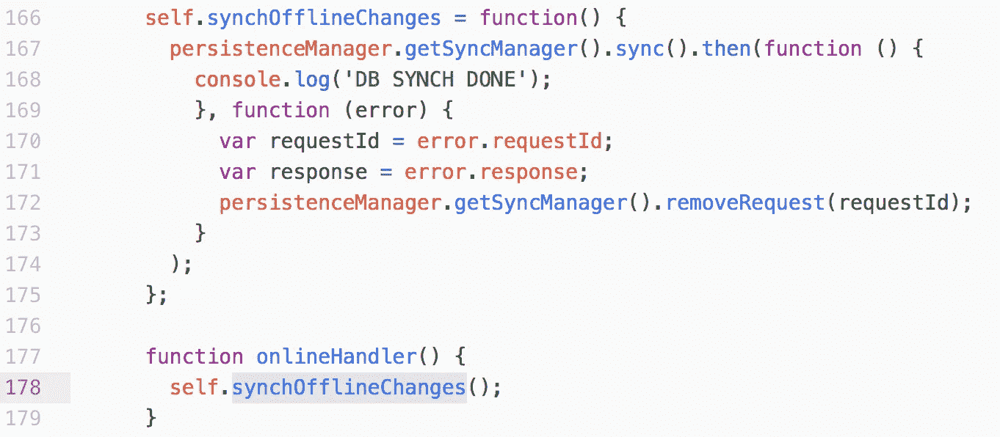
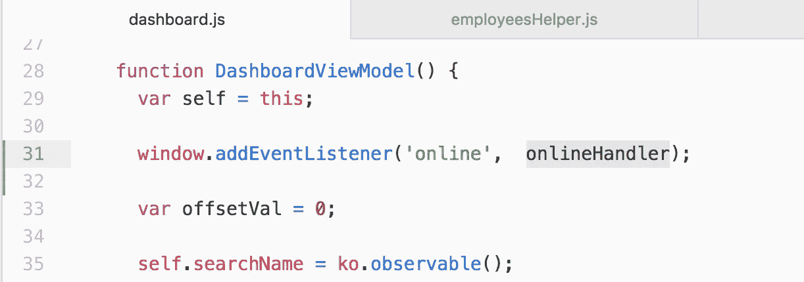
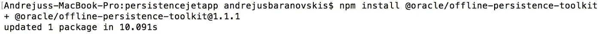
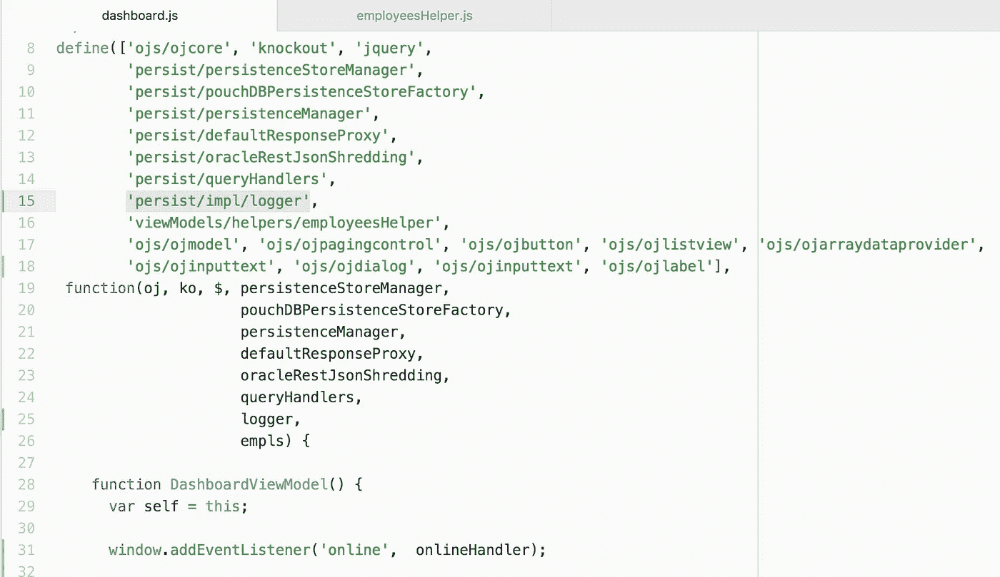
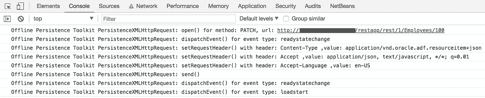

# Oracle JET 离线持久性工具包—离线更新处理

> 原文：<https://medium.com/oracledevs/oracle-jet-offline-persistence-toolkit-offline-update-handling-4289b9da97e4?source=collection_archive---------0----------------------->

[Oracle JET 离线持久性工具包](https://github.com/oracle/offline-persistence-toolkit/blob/master/USAGE.md)支持离线更新、创建和删除操作。在这篇文章中，我将描述更新用例。阅读以前与离线工具包相关的帖子，在那里我解释了如何处理 REST 分页、查询和分解 JET 中的 Oracle 离线持久性对 [REST 分页的支持](http://andrejusb.blogspot.lt/2018/03/rest-paging-support-by-oracle-offline.html)。

这个 gif 展示了一个场景，我们进入脱机模式，然后在多行中更改数据。数据更新离线进行，每个补丁请求由离线持久性工具包跟踪:

一旦我们上线(*离线*复选框值在 Chrome 开发者工具中被更改)——离线时执行的请求会自动在后端服务器上重放:

我们应该看到，在这种特殊情况下，更新流是如何在 JET 中实现的。一旦数据发生变化，我们调用 *submitUpdate* 函数。这个函数又调用 JET 模型 API 函数*保存*。这将触发对后端的补丁调用以更新数据。如果我们离线，JET 离线持久性工具包会透明地记录补丁请求，以便能够在稍后在线时重放它。在 REST 调用期间，开发人员不需要修改特定的代码来支持离线逻辑:

一旦我们上线，监听器被调用，它调用我们的函数 *synchOfflineChanges* 。这个函数触发后端的请求重放。这意味着我们可以控制请求何时被重放。除此之外，我们可以控制每个未能重放的请求——这一点很重要，当后端更新期间发生数据冲突时:

在线处理程序使用同一个模块中的*window . addevent listener*注册，其中定义了持久性管理器:

离线持久性工具包 1.1.1 支持广泛的日志记录。可以通过运行*NPM install @ Oracle/offline-persistence-toolkit 命令*更新到 1.1.1 版本:

要启用 persistence toolkit logger，请将 persist/impl/logger 模块添加到您的目标模块，并调用 *logger.option('level '，logger)。*级别 _ 日志):

记录器打印关于离线更新的有用信息，这有助于调试离线功能:

从 [GitHub](https://github.com/abaranovskis-redsamurai/persistencejetapp) 资源库下载示例应用程序。

*原载于 2018 年 3 月 27 日 andrejusb.blogspot.com**的* [*。*](https://andrejusb.blogspot.lt/2018/03/oracle-jet-offline-persistence-toolkit.html)