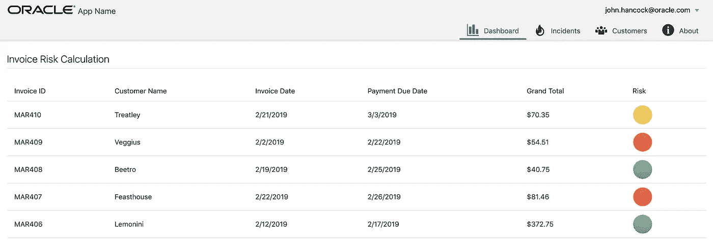
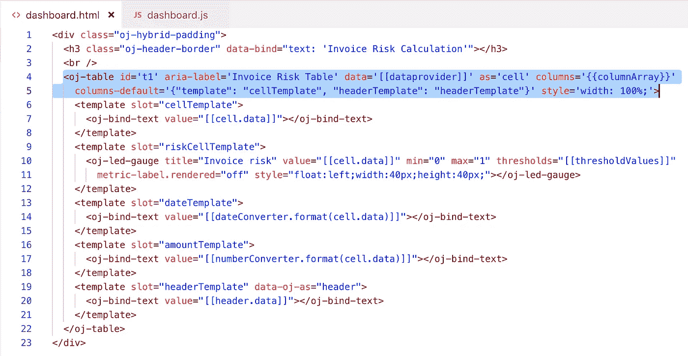
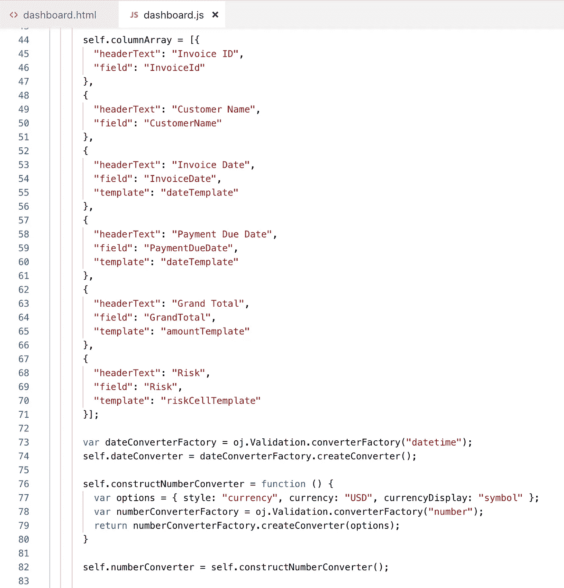
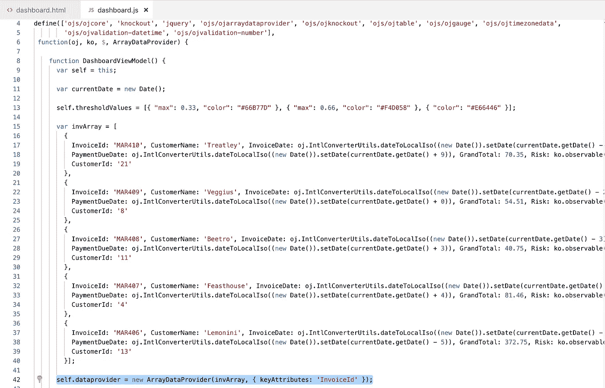

# 具有用于定制单元的模板槽的 Oracle JET 表

> 原文：<https://medium.com/oracledevs/oracle-jet-table-with-template-slots-for-custom-cells-a6af7d4cedfd?source=collection_archive---------0----------------------->

Oracle JET 表附带模板槽[选项](https://www.oracle.com/webfolder/technetwork/jet/jetCookbook.html?component=table&demo=templateSlotTable)。这有助于构建通用功能来呈现表格中的自定义单元格。

在此示例中，自定义单元格用于呈现日期、金额和风险指标:

在实现 Oracle JET table 时，最佳实践是从变量中读取表列结构，而不是在 HTML 本身中定义整个结构。属性*列*引用变量。名为 *cellTemplate* 的模板是呈现单元格内容的默认模板:

JS 中定义了表列结构。要应用特定的单元模板，请在列定义中指定:

在本例中，表数据是静态的，通过基于 JET 数组数据提供者的 JSON 数组获得:

示例代码可在 [GitHub](https://github.com/abaranovskis-redsamurai/jettabletemplateapp) 上获得。

*原载于 2019 年 2 月 23 日*[*andrejusb.blogspot.com*](https://andrejusb.blogspot.com/2019/02/oracle-jet-table-with-template-slots.html)*。*