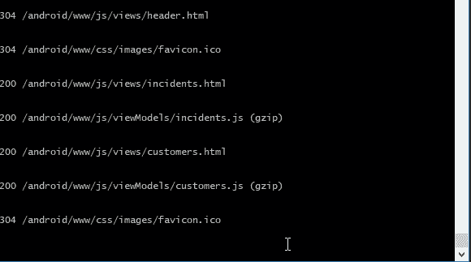
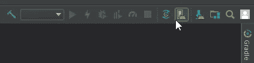

# 基于 Android 和 Windows 的 Oracle JET v5

> 原文：<https://medium.com/oracledevs/oracle-jet-v5-on-android-with-windows-2b02ece36454?source=collection_archive---------0----------------------->

从 3.2 版开始，我就开始涉足 Oracle JET，并对混合版本(即 iOS 目标)做了一些零星的工作。

对于那些不熟悉 Oracle JET 的人来说，它提供了一个单一的源集(CSS、JS 和 HTML 的集合)，您可以将它用于多个设备(Android、iOS 和 Windows phones)。

我对了解 Android 很感兴趣，这将是我第一次尝试 Android 模拟器。因此，我使用最新版本(Oracle JET 版本 5)是有意义的，因为该框架随着每个版本的发布而变得更加丰富。

我尽最大努力遵循 Oracle JET 的说明(作为参考，[https://docs . Oracle . com/en/middleware/JET/5/develop/getting-started-Oracle-JET-hybrid-mobile-application-development . html # GUID-c 75 CD 8 DC-5084-4831-BE1A-FFE E4 ea 8600 c](https://docs.oracle.com/en/middleware/jet/5/develop/getting-started-oracle-jet-hybrid-mobile-application-development.html#GUID-C75CD8DC-5084-4831-BE1A-FFEE4EA8600C))，但我在几个方面感到困惑或出错。因此，这篇文章对我来说是一个提醒，但应该可以帮助其他陷入困境的人。

# 科尔多瓦版本

让我感到困惑的一件事是你实际安装的第一批项目之一；科尔多瓦。我不知道哪里出了问题，也不知道为什么我的改变没有发生，但我会提前告诉你，当文件告诉你:

```
[sudo] npm install -g cordova
```

我们实际需要做的是安装 Cordova v7。因此，我的命令更像这样:

```
[sudo] npm install -g cordova@7
```

一些配置文件已经更改，我最终得到的是在保存文件时出现“platforms.json not found”错误，或者在构建时出现“hybrid \ platforms \ Android \ RES \ XML \ config . XML”错误。

我在 v7 中注意到的是，当我运行`ojet serve android`命令时，我可以看到控制台显示了已经传输到仿真器的文件列表:



Where we want the “ojet serve android” command to finish with

以前，当使用 v8 时，发球在步骤:


NOT where we want the “ojet serve android” to finish at

# 资源饥渴型发展

我知道这不是一个真正的问题，但只是提醒一下，我的机器只有微不足道的 6 Gb 内存。用 Android 开发，涉及到 Gradle 和 Java。这一点，加上模拟器本身的内存利用率，可以很快看到你的系统突突。我从 6 Gb 升级到 12 Gb，模拟器能够正常运行。

# AVD 混淆

这让我想到了当你刚刚安装了 Android Studio 时，创建 AVD (Android 虚拟设备)的首要任务。说明书上说:

> 在 Android Studio 中，通过选择**工具**>**Android**>**AVD 管理器**启动 Android 虚拟设备管理器。

现在，当我第一次运行 Android Studio 时，我看到了这个窗口:


该屏幕没有工具窗口。我猜工作室更新了，甲骨文的说明有点落后。

我所做的是创建一个空白项目，所以我进入了工作室的主要部分。

然后，我可以点击这个小按钮进入 AVD 菜单:



我可以在那里创建我的设备:


# 项目后脚手架问题

我在运行我的初始 ojet scaffold 命令后发现了这个:

```
ojet create MediumExample --hybrid --appname=”MediumExample” --template=navbar --platform=android
```

这很好地构建了项目。然而，当按照 cd 上的说明进入 MediumExample 并运行`ojet build`时，我发现自己得到了一个 json 文件丢失的错误。下面的 GIF 显示了在改变目录后搭建和运行`ojet build android`后的问题。GIF 继续运行`npm update`,然后再次运行 `ojet build android`,然后正确运行:


# 设置路径

Oracle 指令很好地说明了路径上需要设置的内容。不过，我对 Windows 的注意如下:

**JAVA_HOME** 指向一个 JAVA 安装目录，但是**没有**指向/bin。比如说:

```
C:\Program Files\Java\jdk1.8.0_171
```

**ANDROID_HOME** 指向 sdk 文件夹。下载 Android Studio 安装程序后，该目录可用。例如:

```
C:\Users\Jason\AppData\Local\Android\Sdk
```

**应该扩展路径**以打开 SDK 工具。主要是因为 JET build tools 会检查`adb.exe`是否在您的路径上。因此，添加此目录(或类似目录):

```
C:\Users\Jason\AppData\Local\Android\Sdk\platform-tools
```

# 摘要

Oracle JET 框架在让您使用模拟器方面非常出色。只需跨越几个障碍，您就可以立即在模拟器中进行开发:


JET 编码快乐！

*原载于 2018 年 6 月 3 日*[*medium.com*](/@jasonscarfe/oracle-jet-v5-on-android-with-windows-54d7ef9c12e5)*。*