# Oracle JET Web 应用程序—使用 Docker 容器自动构建、打包和部署(到应用程序容器云)

> 原文：<https://medium.com/oracledevs/oracle-jet-web-applications-automating-build-package-and-deploy-to-application-container-cloud-9293989794ca?source=collection_archive---------0----------------------->

本文的核心信息是 Oracle JET 应用程序从源代码提交到 Oracle Application Container Cloud 上正在运行的应用程序的流程自动化，如下图所示:

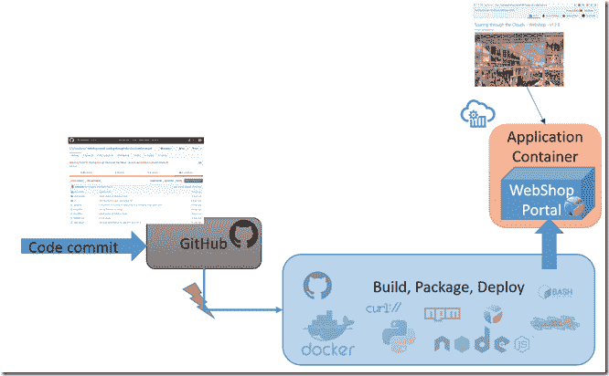

我将描述“黑盒”的内部(图中实际上是浅蓝色)，在这里为 Oracle JET 应用程序进行构建、打包和部署。

方法概述:响应代码提交，启动 Docker 容器。该容器包含执行必要操作所需的所有工具，包括实际运行这些操作的脚本。当应用程序被部署后(或者结果包被存储在工件存储库中)，容器可以被停止。这种方法非常干净——在构建过程中创建的中间产品会随着容器一起消失。为下一次迭代启动一个新容器。

注意:在我的环境中，端到端的构建和部署流程大约需要 2 到 3 分钟。对于简单的开发人员往返来说，这显然是可怕的，但是对于共享云环境的这种“正式”发布来说，这实际上是完全可以接受的。这种方法和本文在很大程度上受到 Abhishek Gupta(他撰写了许多非常有价值的文章，主要围绕微服务和 Oracle PaaS 服务，如应用程序容器云)在 Medium 上发表的文章[的启发。](/oracledevs/quick-start-docker-ized-paas-service-manager-cli-f54eaf4ebcc7)

注意:本文主要关注 JET 应用程序到应用程序容器云的最终部署。然而，修改(实际上是简化)构建容器，不将最终的 ZIP 文件部署到应用程序容器云，而是将文件推送到工件存储库或部署到其他类型的运行时平台，这是非常简单的。获取 ZIP 文件并使用该文件创建一个新的 Docker 容器并不难，该容器可以部署在 Kubernetes 集群或任何 Docker 运行时(如 Oracle Container Cloud)上。

源代码——包括一个示例 JET 应用程序——在这个 GitHub repo 中:[https://GitHub . com/lucasjellema/webshop-portal-through-the-cloud-native-sequel](https://github.com/lucasjellema/webshop-portal-soaring-through-the-cloud-native-sequel)。

我在本文中描述的步骤是:

*   准备将执行构建-打包-部署操作的 Docker 容器
*   准备 Oracle JET 应用程序——从本地运行的、仅供开发人员使用的客户端 web 应用程序转变为具有服务器端平台的独立可运行企业 web 应用程序(带 Express 的节点)
*   创建构建脚本，该脚本将在容器内运行，并通过可用的工具编排动作，将源一直带到云
*   把所有的放在一起

# 1.准备将执行构建-打包-部署操作的 Docker 容器

第一步是 Docker 容器的组成。对于这一步，我很好地利用了 Abhishek 的文章和他在那篇文章中提出的 dockerfile。我用构建 Oracle JET 应用程序所需的工具补充了 Abhishek 的 docker 文件。

Docker 容器将包含的内容以及将它放在一起的步骤的可视化演示如下所示:

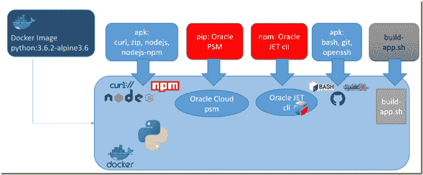

> *注意:通过一个 Docker 文件完全烘焙 Docker 容器映像是很有趣的——而且以 Docker 文件的形式分享创建 Docker 容器映像的指令当然也很方便。然而，当通过 Docker 文件实现自动化的步骤很复杂时，有一个简单的替代方法:通过 Docker 文件构建尽可能多的容器。然后运行容器，并通过手动步骤完成它。最后，当容器完成您需要它做的事情时，您可以将容器的状态提交为您的可重用容器映像。也许在这一点上，如果您觉得维护映像将是一项频繁重复的任务，您可以尝试用一些手动步骤来扩展 Docker 文件。*

下面是我最后整理的 Docker 构建文件。关键步骤:

*   容器基于“python:3.6.2-alpine3.6”镜像；这样做主要是因为 PSM (Oracle PaaS 服务管理器命令行工具需要 Python 运行时环境)
*   Alpine Linux 的 apk 包管理器被多次用于向映像添加所需的包；它增加了 curl、zip、nodejs、nodejs-npm、bash、git 和 openssh
*   下载并安装 Oracle PSM 命令行工具(一个 Python 应用程序)
*   为目标身份域和用户设置 PSM
*   安装将用于构建 JET web 应用程序的 Oracle JET 命令行工具
*   复制将要执行的脚本 build-app.sh，以运行端到端的构建-打包-部署流程

```
# extended from [https://medium.com/oracledevs/quick-start-docker-ized-paas-service-manager-cli-f54eaf4ebcc7](/oracledevs/quick-start-docker-ized-paas-service-manager-cli-f54eaf4ebcc7) 
# added npm, ojet-cli and git FROM python:3.6.2-alpine3.6 
ARG USERNAME 
ARG PASSWORD 
ARG IDENTITY_DOMAIN 
ARG PSM_USERNAME 
ARG PSM_PASSWORD 
ARG PSM_REGION 
ARG PSM_OUTPUT WORKDIR "/oracle-cloud-psm-cli/" RUN apk add --update curl && 
\ rm -rf /var/cache/apk/* RUN curl -X GET -u $USERNAME:$PASSWORD -H X-ID-TENANT-NAME:$IDENTITY_DOMAIN [https://psm.us.oraclecloud.com/paas/core/api/v1.1/cli/$IDENTITY_DOMAIN/client](https://psm.us.oraclecloud.com/paas/core/api/v1.1/cli/$IDENTITY_DOMAIN/client) -o psmcli.zip && 
\ pip3 install -U psmcli.zip 
COPY psm-setup-payload.json RUN psm setup -c psm-setup-payload.json 
RUN apk add --update nodejs nodejs-npm 
RUN apk add --update zip 
RUN npm install -g @oracle/ojet-cli 
RUN apk update && apk upgrade && apk add --no-cache bash git openssh 
COPY build-app.sh . CMD ["/bin/sh"]
```

使用以下命令构建容器:

> *docker build–build-arg USERNAME = "您的 ACC cloud USERNAME "-build-arg PASSWORD = " ACC cloud PASSWORD "-build-arg IDENTITY _ DOMAIN = "您的身份域"-build-arg PSM _ REGION = " us "-build-arg PSM _ OUTPUT = " JSON "-t PSM-CLI。*

假设这个命令在 docker 文件所在的目录中运行。

这将创建一个容器并将其标记为 image *psm-cli* 。当这个命令完成时，您可以通过运行“docker images”找到容器映像。随后，您可以运行基于映像的容器:“docker run–RM-it PSM-CLI”

# 2.准备 Oracle JET 应用程序

在开发 JET (4.x)应用程序时，我们通常使用 Oracle JET CLI——这是一个命令行工具，可以帮助我们快速启动新的应用程序、创建复合组件、在本地提供应用程序，因为我们正在将应用程序开发到一个浏览器，它可以即时更新任何文件更改。JET CLI 还用于构建要发布的应用程序。这一步的结果是在浏览器中运行 JET 应用程序所需的完整文件集。为了真正向最终用户提供 JET 应用程序，它必须由“web 服务”平台组件提供服务，例如 nginx 或 Python、Java 或 Node 中的后端。通常，JET 应用程序需要一些服务器端设施，服务于静态 JET 应用程序资源的后端也可以提供这些设施。出于这个原因，我选择了一个 JET 服务后端，我可以很容易地利用这些服务器端设施；对我来说，这是当前节点。

为了为本文讨论的管道中构建的 JET 应用程序创建一个自运行的 JET 应用程序，我添加了一个简单的节点& Express 后端。

我已经使用 npm 创建了一个新的节点应用程序(npm init jet-on-node)。接下来我创建了目录 bin 和文件 www 。该文件是服务于 JET 应用程序的节点应用程序的主入口点；它将大部分工作委托给从这个节点应用程序的根路径/jet-on-node 中的文件 app.js 加载的模块 app。

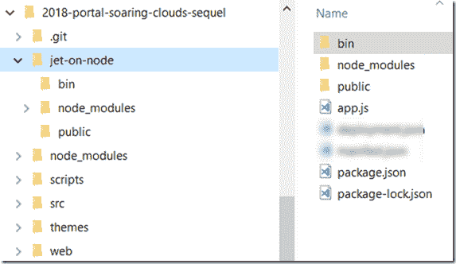

浏览器可以访问的所有静态资源(包括 JET 应用程序)都放在文件夹/jet-on-node/public 中。[模块 app](https://github.com/lucasjellema/webshop-portal-soaring-through-the-cloud-native-sequel/blob/master/jet-on-node/app.js) 通过 Express 定义了对公共资源的请求(不是由 URL 路径处理程序之一处理的请求)通过服务来自目录/public 的资源来处理。Module app 可以处理其他 HTTP 请求——例如来自 JET 应用程序的请求——它还可以实现服务器发送事件或 WebSockets 的后端。当前 is 处理对路径“/about”的 REST GET 请求，该请求返回应用程序的一些关键数据:

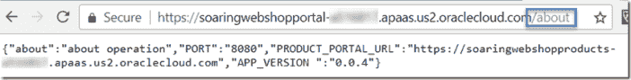

在最终应用程序的构建过程中，我们将使用“npm install”来添加服务器端所需的节点模块。

至此，我们已经用一个简单的 JET 应用程序登陆平台扩展了我们的代码库，该平台可以在运行时为应用程序提供服务。剩下的工作就是将/web 目录下的所有内容复制到 jet-on-node/public 文件夹中。然后，我们可以使用目录 jet-on-node 中的“npm start”来运行应用程序。这将执行 package.json 文件中的启动脚本，该文件被定义为“node”。/bin/www”。

# 3.创建将在容器内部运行并编排操作的构建脚本

JET 构建容器可用。JET 应用程序可以从 Git 存储库中获得(在我的例子中是在 GitHub 中)。现在，要在应用程序容器云上运行应用程序，需要执行许多步骤。第一步如下所示:

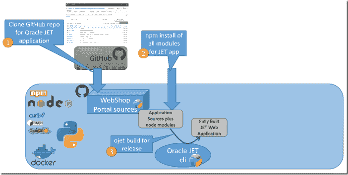

1.克隆包含 JET 应用程序的 Git repo(或者获取最新的源代码或特定的标记)

2.通过运行 npm install，安装 JET 应用程序所需的所有模块

3.使用 Oracle JET 命令行实用程序来构建要发布的应用程序:ojet build–release

在这一步之后，所有运行时工件——包括 JET 库——都在/web 目录中。接下来的这些步骤将这些工件转化为一个运行的应用程序:

4.将/web 的内容复制到/jet-on-node/public

5.通过在 jet-on-node 目录中运行 npm install，安装服务器端节点应用程序所需的模块

6.为/jet-node 目录中的所有工件创建一个 zip 文件——包括 jet 应用程序及其服务器端后端节点应用程序。这个 zip 文件是 JET 应用程序的发布工件。因此，它可以被推送到工件存储库或部署到其他平台。

7.使用 psm 命令行界面(Oracle PaaS Service Manager CLI)将 zip 文件部署到应用程序容器云，psm 已经在创建构建容器期间为其进行了配置。

注意:jet-on-node 根目录中的 manifest.json 和 deployment.json 文件为 PSM 和应用程序容器云提供了有关该应用程序运行时设置的说明，包括节点的运行时版本、启动应用程序的命令、每个实例的运行时内存、实例数量以及要传递给应用程序的环境变量的值。

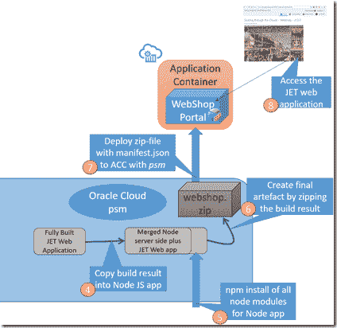

shell-script build-app.sh(您可能必须使用“chmod u+x build-app.sh”显式地使该脚本可执行)执行上述步骤(尽管可能不是以最佳方式——请随意微调和改进，并让我知道它)。

```
#git clone [https://github.com/lucasjellema/webshop-portal-soaring-through-the-cloud-native-sequel](https://github.com/lucasjellema/webshop-portal-soaring-through-the-cloud-native-sequel) 
cd webshop-portal-soaring-through-the-cloud-native-sequel 
git pull 
wait 
npm install 
wait 
ojet build --release 
wait 
cp -a ./web/. ./jet-on-node/public 
wait 
cd jet-on-node 
wait 
npm install 
wait 
zip -r webshop.zip . 
wait 
cd /oracle-cloud-psm-cli/webshop-portal-soaring-through-the-cloud-native-sequel/jet-on-node 
psm accs push -n SoaringWebshopPortal -r node -s hourly -d deployment.json -p webshop.zip
```

在 JET 应用程序最新版本发布期间，构建容器中的端到端流程现在可以描述如下:

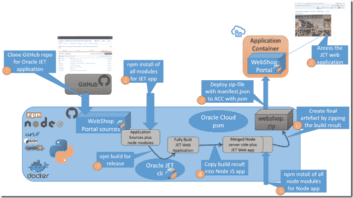

# 4.把所有的放在一起

我现在将尝试演示这一切是如何一起工作的。为了做到这一点，我将详细介绍这些步骤，并用屏幕截图来说明:

*   在 JET 应用程序中进行更改
*   提交并推送更改(到 GitHub)
*   运行 Docker 构建容器 psm-cli
*   运行脚本 build-app.sh
*   等待大约三分钟(检查构建容器中的输出和 ACC 控制台中的应用程序状态)
*   访问更新的 Web 应用程序

应用程序的起点:

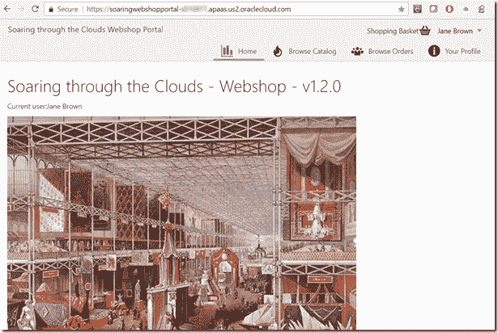

1.做出改变

图标旁边的词“购物篮”似乎是多余的，我将删除它。而且我会增加版本号，从 1.2.0 版到 1.2.1 版。

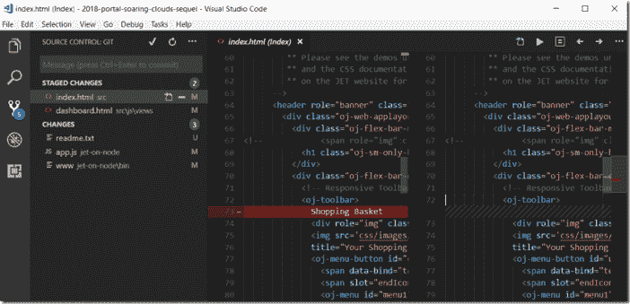

2.提交并推送更改(到 GitHub)

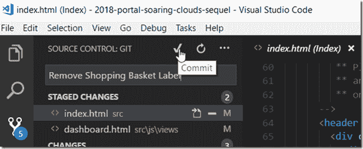

GitHub 接受了更改:

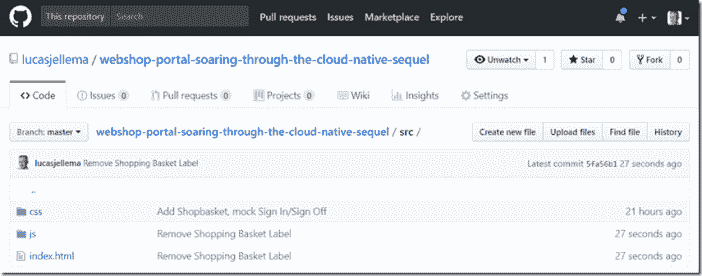

3.运行 Docker 构建容器 psm-cli

运行 Docker Quickstart 终端(我在 Windows 上)并执行:“Docker run–RM-it PSM-CLI”

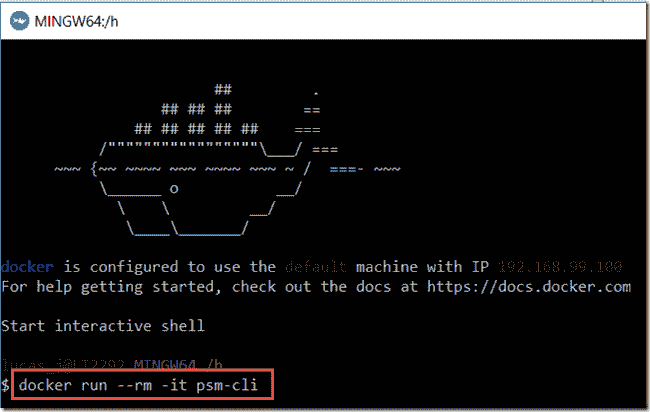

在这一点上，我缺少一点自动化。我需要采取的手动步骤(只是第一次)是克隆 JET 应用程序的 Git 存储库:

> *git 克隆*[*https://github . com/lucasjellema/webshop-portal-through-the-cloud-native-sequel cloning*](https://github.com/lucasjellema/webshop-portal-soaring-through-the-cloud-native-sequelCloning)

并移动到创建的目录

> *cd 网店-门户网站-穿越云端-原生-续集/*

并使文件 build-app.sh 可执行:

> *chmod u+x build-app.sh*

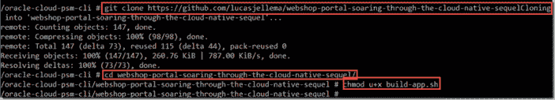

注意:只要容器保持运行，我只需要运行“git pull”和”。/build-app.sh ",用于 JET 应用程序的每次更新。下一步是在 GitHub 存储库中配置一个由相关提交触发的 web 钩子。

4.运行脚本 build-app.sh

。/build-app.sh

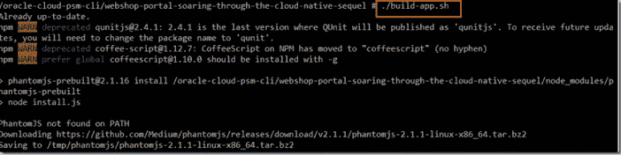

等待大约三分钟(检查构建容器中的输出

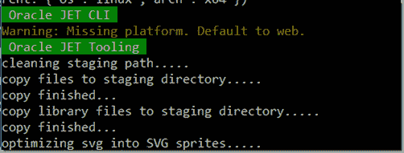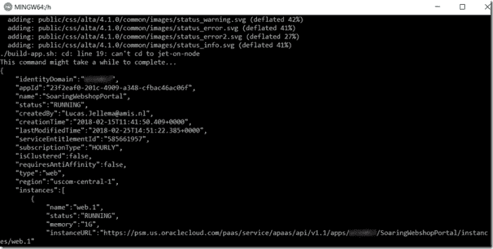

和 ACC 控制台中的应用状态)

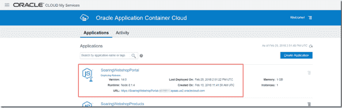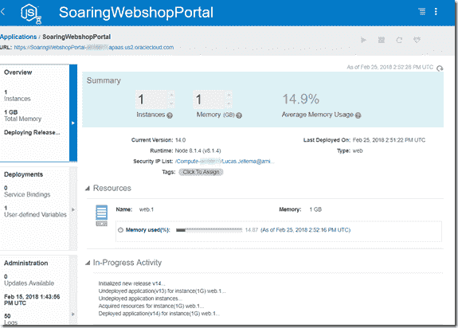

5.访问更新的 Web 应用程序

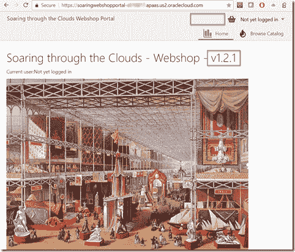

正如您所看到的，在提交和推送更改之后，我只需运行一个简单的命令行命令就可以完全重建和重新部署应用程序。停止 Docker 容器后，构建过程不会留下任何痕迹。我可以轻松地与我的团队成员共享容器映像，以构建相同的应用程序或更新构建其他或附加的 JET 应用程序。

# 资源

Abhishek Gupta 的励志文章:[https://medium . com/Oracle devs/quick-start-docker-ized-PAAs-service-manager-CLI-f 54 EAF 4 ebcc 7](/oracledevs/quick-start-docker-ized-paas-service-manager-cli-f54eaf4ebcc7)

源代码——包括一个示例 JET 应用程序——在这个 GitHub repo 中:[https://GitHub . com/lucasjellema/webshop-portal-through-the-cloud-native-sequel](https://github.com/lucasjellema/webshop-portal-soaring-through-the-cloud-native-sequel)。

Oracle JET 命令行界面:[https://github.com/oracle/ojet-cli](https://github.com/oracle/ojet-cli)

Oracle PSM (PaaS 服务管理器)CLI 上的文档:[https://docs . Oracle . com/en/cloud/PaaS/Java-cloud/PS CLI/abouit-PaaS-Service-Manager-command-line-interface . html](https://docs.oracle.com/en/cloud/paas/java-cloud/pscli/abouit-paas-service-manager-command-line-interface.html)

Node & Express 教程第二部分:创建骨架网站:[https://developer . Mozilla . org/en-US/docs/Learn/Server-side/Express _ Nodejs/skeleton _ website](https://developer.mozilla.org/en-US/docs/Learn/Server-side/Express_Nodejs/skeleton_website)

使用快递服务公共文件—【https://expressjs.com/en/starter/static-files.html 

Oracle 应用容器云的文档:[https://docs . Oracle . com/en/Cloud/PAAs/app-Container-Cloud/dvcjv/getting-started-Oracle-Application-Container-Cloud-service . html](https://docs.oracle.com/en/cloud/paas/app-container-cloud/dvcjv/getting-started-oracle-application-container-cloud-service.html)

*原载于 2018 年 2 月 26 日*[*technology . amis . nl*](https://technology.amis.nl/2018/02/26/oracle-jet-web-applications-automating-build-package-and-deploy-to-application-container-cloud-using-a-docker-container/)*。*