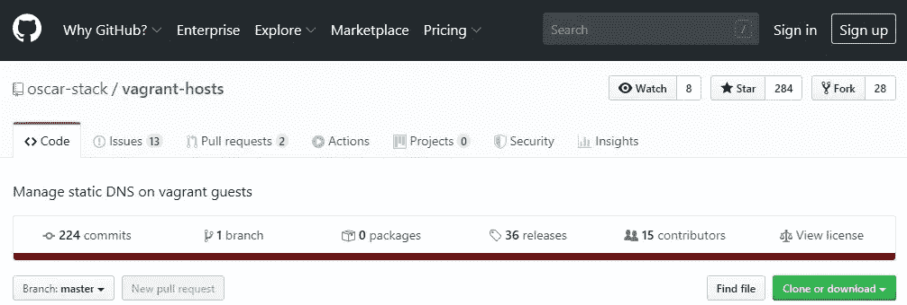
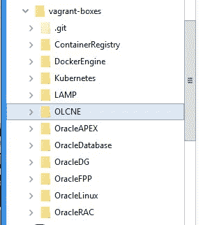

# Oracle Linux Cloud Native —开箱即用

> 原文：<https://medium.com/oracledevs/oracle-linux-cloud-native-straight-out-of-the-box-f5f58277ce07?source=collection_archive---------4----------------------->


Oracle Linux Cloud Native Environment(ol CNE)提供给来自“流浪者之家/OLCNE”的客户。

实际上是流浪的库伯内特。

因此，让我们用默认配置来设置这个开箱即用的流浪者 OLCNE，看看它为开发人员提供了什么。

## 先决条件

OLCNE 将使用 VirtualBox 主机专用以太网适配器#2 创建一个主机专用网络。

快速检查以确定是否存在其它仅含主机的网络:

```
> VBoxManage list hostonlyifs
```

不允许其他网络使用 VirtualBox 主机专用以太网适配器#2。

使用以下命令删除现有的纯主机网络:

```
> VBoxManage hostonlyif remove "VirtualBox Host-Only Ethernet Adapter #2"
```

OLCNE 构建过程现在能够使用 VirtualBox 主机专用以太网适配器#2 自动创建它自己的主机专用网络。

## 安装

首先是安装 Oracle VirtualBox，和流浪者。

有许多外部资源告诉你如何做到这一点。

下一步是安装流浪盒基础设施。

```
> git clone https://github.com/oracle/vagrant-boxes
```

此外，作为一个选项，安装稍后将用于显示所有虚拟机主机的浮动插件。



```
> vagrant plugin install vagrant-hosts
```

流浪者主机插件将为虚拟机维护/etc/hosts。

## 建设

默认情况下，OLCNE 的 vagger 文件将按以下顺序设置虚拟机:

*   工人 1: 192.168.99.111
*   工人 2: 192.168.99.112
*   主人 1: 192.168.99.101

*注意—由于默认的流浪者文件被配置为构建 3 个虚拟机，您的主机需要有 8GB 以上的内存。只有 8GB 内存的主机可能不够用。*

转到 OLCNE 的工作目录:



```
> cd vagrant-boxes\OLCNE
```

现在开始构建过程:

```
> vagrant up
```

当您看到以下内容时，将显示构建日志，并且 worker1 虚拟机已完成:

```
..
worker1: ===== Configure private network =====
worker1: ===== Configure YUM repos for Oracle Linux Cloud Native Environment =====
worker1: ===== Fulfil requirements =====
worker1: ===== Installing the Oracle Linux Cloud Native Environment Platform Agent =====
worker1: ===== Allow passwordless ssh between VMs =====
worker1: ===== Oracle Linux base software installation complete. =====
..
```

接下来，将构建 worker2 虚拟机，当您看到以下内容时，它已经完成:

```
..
worker2: ===== Configure private network =====
worker2: ===== Configure YUM repos for Oracle Linux Cloud Native Environment =====
worker2: ===== Fulfil requirements =====
worker2: ===== Installing the Oracle Linux Cloud Native Environment Platform Agent =====
worker2: ===== Allow passwordless ssh between VMs =====
worker2: ===== Oracle Linux base software installation complete. =====
..
```

最后一个要构建的虚拟机是为主服务器构建的。

由于默认情况下没有操作员节点，因此平台 API 服务器和平台代理组件的安装将在主虚拟机上进行。

```
..
master1: ===== Configure private network =====
master1: ===== Configure YUM repos for Oracle Linux Cloud Native Environment =====
master1: ===== Fulfil requirements =====
master1: ===== Installing the Oracle Linux Cloud Native Environment Platform API Server and Platform CLI tool to the operator node. =====
master1: ===== Installing the Oracle Linux Cloud Native Environment Platform Agent =====
master1: ===== Allow passwordless ssh between VMs =====
master1: ===== Oracle Linux base software installation complete. =====
master1: ===== Generate and deploy X.509 Certificates =====
master1: ===== Bootstrap the Oracle Linux Cloud Native Environment Platform Agent on all nodes =====
master1: ===== Create the Oracle Linux Cloud Native Environment: olcne-env =====
master1: ===== Create the Kubernetes module for olcne-env  =====
master1: ===== Validate all required prerequisites are met for the Kubernetes module =====
master1: ===== Deploy the Kubernetes module into olcne-env (Be patient!) =====
master1: ===== Copying admin.conf for vagrant user on master node(s) =====
master1: ===== Updating Flannel DaemonSet for Vagrant =====
master1: ===== Starting kubectl proxy service on master nodes =====
master1: ===== Your Oracle Linux Cloud Native Environment is operational. =====
..
```

然后，在 3 个节点的构建结束时，群集的状态返回如下:

```
..
master1: NAME
master1:                  STATUS   ROLES    AGE     VERSION
master1:
master1: master1.vagrant.vm   Ready    master
master1:    10m
master1: v1.14.8+1.0.2.el7
master1: worker1.vagrant.vm   Ready    <none>   9m39s
master1:    v1.14.8+1.0.2.el7
master1:
master1: worker2.vagrant.vm   Ready    <none>   10m     v1.14.8+1.0.2.el7
```

## 连接并检查集群

因此，在 OLCNE 安装完成后，可以像这样检查集群的 VirtualBox 主机专用以太网适配器#2 网络:

```
> VBoxManage list hostonlyifsName:            VirtualBox Host-Only Ethernet Adapter #2
GUID:            8f2edd27-c6e5-4a3e-896f-a8b3728ec36a
DHCP:            Disabled
IPAddress:       192.168.99.1
NetworkMask:     255.255.255.0
IPV6Address:     fe80::e901:5a5f:f664:1037
IPV6NetworkMaskPrefixLength: 64
HardwareAddress: 0a:00:27:00:00:11
MediumType:      Ethernet
Wireless:        No
Status:          Up
VBoxNetworkName: HostInterfaceNetworking-VirtualBox Host-Only Ethernet Adapter #2
```

通过之前安装的流浪者主机插件列出正在运行的主机。

```
> vagrant hosts list192.168.99.101 master1.vagrant.vm master1
192.168.99.111 worker1.vagrant.vm worker1
192.168.99.112 worker2.vagrant.vm worker2
```

您也可以按如下方式查询流浪汉:

```
> vagrant global-statusid      name    provider   state   directory
--------------------------------------------------------------------
8e9aaba worker1 virtualbox running C:/Users/vagrant-boxes/OLCNE
46e8627 worker2 virtualbox running C:/Users/vagrant-boxes/OLCNE
5456dcf master1 virtualbox running C:/Users/vagrant-boxes/OLCNE
```

登录到主虚拟机继续检查构建。

```
> vagrant ssh master1
```

从主虚拟机中，您可以显示与 OLCNE 相关的组件:

```
[vagrant@master1 ~]$ yum list installed *olcne*Installed Packages
olcne-agent.x86_64                 1.0.2-1.el7           @ol7_olcne
olcne-api-server.x86_64            1.0.2-1.el7           @ol7_olcne
olcne-utils.x86_64                 1.0.2-1.el7           @ol7_olcne
olcnectl.x86_64                    1.0.2-1.el7           @ol7_olcne
oracle-olcne-release-el7.x86_64    1.0-3.el7             @ol7_latest[vagrant@master1 ~]$
```

另外，从主虚拟机检查集群的状态:

```
[vagrant@master1 ~]$ kubectl cluster-infoKubernetes master is running at https://192.168.99.101:6443KubeDNS is running at https://192.168.99.101:6443/api/v1/namespaces/kube-system/services/kube-dns:dns/proxyTo further debug and diagnose cluster problems, use 'kubectl cluster-info dump'.[vagrant@master1 ~]$
```

使用 kubectl 命令检查虚拟机的状态:

```
[vagrant@master1 ~]$ kubectl get nodesNAME                 STATUS   ROLES    AGE     VERSION
master1.vagrant.vm   Ready    master   3d18h   v1.14.8+1.0.2.el7
worker1.vagrant.vm   Ready    <none>   3d18h   v1.14.8+1.0.2.el7
worker2.vagrant.vm   Ready    <none>   3d18h   v1.14.8+1.0.2.el7[vagrant@master1 ~]$
```

使用 kubectl 命令检查 pod 的状态:

```
[vagrant@master1 ~]$ kubectl get pods --namespace=kube-systemNAME                                      READY STATUS  RESTARTS AGE
coredns-7c9fbb89f9-z52md                    1/1 Running   2    3d18h
coredns-7c9fbb89f9-z5q9n                    1/1 Running   2    3d18h
etcd-master1.vagrant.vm                     1/1 Running   2    3d18h
kube-apiserver-master1.vagrant.vm           1/1 Running   2    3d18h
kube-controller-manager-master1.vagrant.vm  1/1 Running   2    3d18h
kube-flannel-ds-2lhnd                       1/1 Running   2    3d18h
kube-flannel-ds-8v2hw                       1/1 Running   2    3d18h
kube-flannel-ds-bdvlb                       1/1 Running   2    3d18h
kube-proxy-fh8dl                            1/1 Running   2    3d18h
kube-proxy-j4b2d                            1/1 Running   2    3d18h
kube-proxy-wdr7j                            1/1 Running   2    3d18h
kube-scheduler-master1.vagrant.vm           1/1 Running   2    3d18h
kubernetes-dashboard-7cb9b69d7b-8r6b5       1/1 Running   2    3d18h[vagrant@master1 ~]$
```

现在，您已经知道了——avanger 上的 Oracle Linux Cloud Native Environment 注定会成为您开发下一个项目的首选工具！

Paul Guerin 是一名专注于 Oracle 数据库的国际顾问。Paul 在东南亚的全球交付中心工作，但他的客户来自澳大利亚、欧洲、亚洲和北美。此外，他还出席了一些世界领先的甲骨文会议，包括甲骨文 2013 年世界开放大会。自 2015 年以来，他的工作一直是 IOUG 最佳实践技巧小册子以及 AUSOUG、Oracle Technology Network 和 Oracle Developers (Medium)出版物的主题。2019 年，他被授予 My Oracle 支持社区最有价值贡献者。他是一名 DBA OCP，并将继续参与 Oracle ACE 计划。